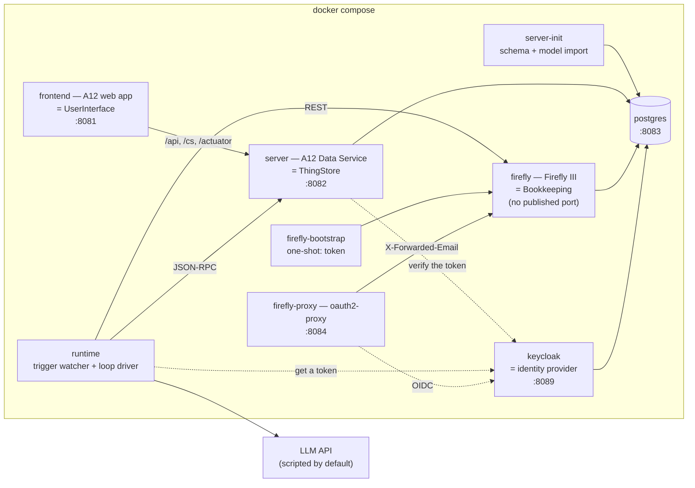
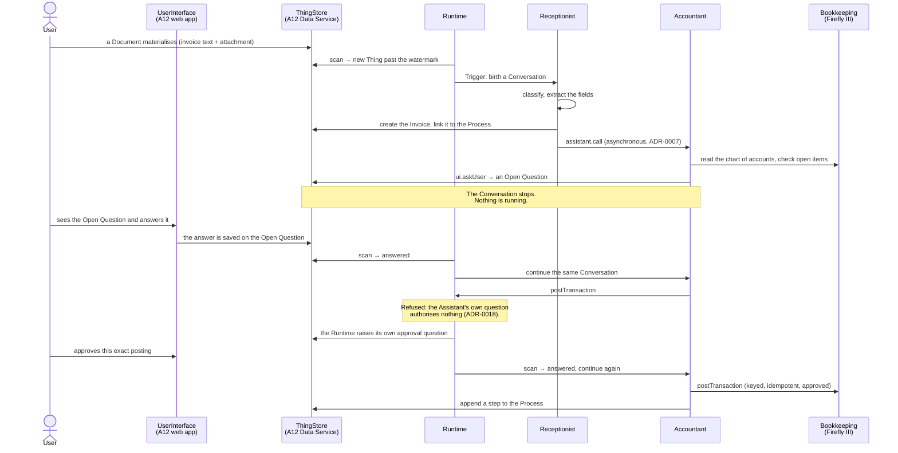

<p align="center">
  <picture>
    <source media="(prefers-color-scheme: dark)" srcset="assets/logo/lockup-dark.svg">
    
  </picture>
</p>

# Assistants

Assistants is a personal system of LLM-driven **Assistants** that do real administrative work
for one household — invoices, insurance claims, a house renovation — under the **User's**
supervision. An Assistant is not a chat window. It wakes on a **Trigger**, does a piece of work
against **Things** in the **ThingStore**, asks the User when it needs a decision, and stops. The
question it asked is the whole of its state, so nothing is running while it waits, and a restart
in the middle changes nothing.

What runs today is one vertical slice, end to end. A doctor's invoice arrives as a **Document**.
The **Receptionist** classifies it, extracts the fields and creates an **Invoice** Thing, then
calls the **Accountant**. The Accountant reads the chart of accounts out of **Bookkeeping**,
proposes a posting, and raises an **Open Question**: *book €96.50 to Expenses:Health?* The
**Conversation** stops there. The User answers it in the web application — hours or days later,
across as many restarts as you like — and only then does the transaction land in the real books.
Nothing is booked without an answer, and that is structural rather than aspirational: the Runtime
refuses `bookkeeping.postTransaction` outright unless it has itself asked the User about that exact
posting and been told yes ([ADR-0018](docs/adr/0018-an-operation-may-require-an-approval.md)). It
costs a round trip on every first booking, which is the price of the sentence being true.

The system is built on [A12](docs/adr/0001-a12-as-the-platform.md): Things are A12 documents
governed by A12 models, the ThingStore is an A12 Data Service, and the **UserInterface** is an A12
web application. The vocabulary the code, the models and the documents all share is fixed in
[CONTEXT.md](CONTEXT.md); read that first if a word here looks like it might mean something loose.
Spelling throughout the project is British English.

**Companion documents**: [CONTEXT.md](CONTEXT.md) (the glossary) ·
[DECISIONS.md](DECISIONS.md) (decisions taken while building, with their alternatives and
reversal costs) · [BUGS.md](BUGS.md) (43 reproduced defects from the 2026-08-09 hunt; each entry
records whether it still stands) ·
[docs/adr/](docs/adr/) (twenty-one architecture decisions) ·
[RESEARCH_INDEX.md](RESEARCH_INDEX.md) (the four research papers in
[specs/research/](specs/research/), each with what it settled and what it left open: what
Bookkeeping must provide and why Firefly III, how the agentic loop should work and why no workflow
engine, what is still undecided about markdown fields, and what OpenClaw does that we do not) ·
and [specs/system/](specs/system/) (the system as it stands: its
[domain](specs/system/domain.md), its [architecture](specs/system/architecture.md) and what it
[does](specs/system/functional.md)).

## How it works

Everything runs in one `docker compose` file: seven long-running services and two one-shot init
containers. No second database engine, no message broker, no workflow engine.



One Postgres container, four databases: `assistants-ds` (the Things), `assistants-cs` (binary
content), `assistants-firefly` (the books) and `assistants-keycloak` (the users). The first two are
A12's own split — each carries its own Liquibase changelog — and Firefly and Keycloak own one
outright each ([D-004](DECISIONS.md)).

The dotted edges are the whole of authentication. **Nobody in this system checks a password
except Keycloak** ([D-022](DECISIONS.md)):

- the **web application** has no login form. Opening it redirects to Keycloak and comes back with
  a token; the ThingStore runs A12's UAA with `authentication.types=OAUTH2`, which means it only
  verifies tokens and has no login endpoint of its own. Realm roles in the token map to A12 access
  rights through `import/auth/roles.yaml` — the one part of authorization that is still ours.
  `ASSISTANT_WRITE` in that file is not an A12 built-in but ours, and it is the whole of what
  keeps an Assistant out of the Runtime's reach ([D-007a](DECISIONS.md)).
- the **Runtime** has no browser to redirect, so it uses Keycloak's direct access grant against a
  client that is the only one in the realm permitting it.
- **Firefly III has no OIDC support at all** — `remote_user_guard`, which trusts an HTTP header, is
  the whole of its support for an external identity provider. So `firefly-proxy` (oauth2-proxy)
  owns port 8084, runs the OIDC flow, and forwards the request with `X-Forwarded-Email` set.
  Firefly publishes no port of its own, because anything that could reach it directly could set
  that header itself.

The Runtime is a client of the ThingStore with no privileged access, exactly like the
UserInterface. It polls; it exposes no API and receives no webhooks. That is the whole
integration surface ([D-005](DECISIONS.md)).

The doctor's-invoice slice, as it actually executes:



## Quick start

### Prerequisites

| Tool | Version | Pinned by |
|---|---|---|
| Docker | ≥ 20 | — |
| Docker Compose | ≥ 2.20.3 | needed for `service_completed_successfully` |
| JDK | ≥ 21, ≤ 25 | `.sdkmanrc` (21.0.6-tem) |
| Gradle | ≥ 9 | `.sdkmanrc` (9.5.0) |
| Node | 24.x | `.nvmrc` |
| npm | ≥ 11 | ships with Node 24 |
| [`just`](https://just.systems) | any recent | — |

`.nvmrc` and `.sdkmanrc` pin the exact versions this repository was built against; `nvm use` and
`sdk env` will pick them up. The A12 artefacts resolve from the **public** community registries
pinned in `.npmrc` and `settings.gradle`, so no VPN and no credentials are needed
([D-006](DECISIONS.md)).

### Run it

```
just setup
just dev
just demo-data
```

`just setup` writes the two files that are yours rather than the repository's: `.env` from the
committed `.env.example`, generating every machine credential in it, and `llm.json` from
`llm.json.example`, which says which language model to use. Run it once per clone; it refuses to
overwrite an existing `.env`, because the database passwords are baked into the Postgres volume the
first time it starts ([D-023](DECISIONS.md)), and it leaves an existing `llm.json` alone for the
same kind of reason — it is your choice of model, not a default to be reapplied.

`just dev` builds the models, the server jars, the client bundle and every image, brings the
stack up, waits until the ThingStore, Firefly, Keycloak and the frontend all answer, and loads the
two Assistants and the Runtime state. It is idempotent — run it again after any change. `just demo-data` then loads a household:
parties, a renovation Process, documents and invoices in several states, and matching Firefly
accounts, budgets and transactions. It pauses the Runtime while loading, so the demo set lands as
history rather than as a work queue.

Then:

- **<http://localhost:8081>** — the A12 web application. It redirects to Keycloak; log in as
  `human` / `human`. The navigation has eight entries: Documents, Invoices, Processes, Parties,
  Assistants, Operations, Conversations, Runtime. Start at **Conversations** — the rows marked 🛑 are
  waiting for you. **Assistants** is where you read and edit a prompt, in the markdown editor;
  **Operations** is the catalogue of what any Assistant can be granted.
- **<http://localhost:8084>** — Firefly III, the books, behind oauth2-proxy. The same
  `human` / `human` through the same Keycloak, and if you are already signed in at 8081 it lets you
  straight through. `just firefly-token` prints the personal access token the bootstrap container
  minted, if you want to talk to its API yourself — `/api/` bypasses the proxy, because Firefly
  checks that token on a guard of its own.
- **<http://localhost:8089>** — the Keycloak admin console, `admin` / `admin`. Realm `A12Realm`
  holds every user: `human`, the service account `runtime`, and `admin` / `user1` / `user2`, which
  the end-to-end tier uses.
- **<http://localhost:8082>** — the ThingStore's A12 JSON-RPC and REST interface;
  `/actuator/health` is the liveness endpoint `just wait` polls.

To watch an Assistant work, `just logs runtime`. A Conversation's transcript is also stored on the
Conversation Thing and reads as a thread in the UI, under a header that says which Assistant, about
what, where it stands and what it has cost — and it carries the pending question, if there is one.

### The language model

Every model this stack knows how to talk to is named in `llm.json`, and one line there says which
of them it is using ([D-057](DECISIONS.md)). `just setup` writes that file from the committed
[`llm.json.example`](llm.json.example); `llm.json` itself is gitignored, so which model your machine
uses is your business and not a change to the repository. Here is the sample it starts from:

```jsonc
{
  "active": "scripted",

  "profiles": {
    "scripted":   { "provider": "scripted", "scriptFile": "/run/fixtures/llm-script.json" },
    "openai":     { "provider": "openai",    "baseUrl": "https://api.openai.com/v1", "model": "gpt-4o-mini" },
    "anthropic":  { "provider": "anthropic", "baseUrl": "https://api.anthropic.com",  "model": "claude-sonnet-4-5" },
    "azure_gpt":  { "provider": "openai",    "baseUrl": "https://YOUR-RESOURCE.openai.azure.com/openai/v1", "model": "gpt-4o" },
    "local_qwen": { "provider": "openai",    "baseUrl": "http://host.docker.internal:8000/v1",
                    "model": "Qwen3-Coder-30B-A3B-Instruct-4bit", "temperature": 0, "requiresKey": false }
  }
}
```

Switching model is editing `active` and `just restart runtime`. Nothing else moves — no exports,
no second copy of an endpoint, no variable that means one thing this week and another the next.

The profile shipped active is **`scripted`**, which replays `runtime/fixtures/llm-script.json` —
the full doctor's-invoice scenario across both Assistants. It costs nothing, needs no key, and
behaves the same every time, which is what lets the end-to-end tier drive the *real* Runtime,
ThingStore, Firefly and UI deterministically.

#### Adapting it

**To use one of the profiles that is already there** — say OpenAI:

1. Put the key in `.env`, on a line named after the profile:
   ```
   OPENAI_KEY='sk-...'
   ```
2. Set `"active": "openai"` in `llm.json`.
3. `just restart runtime`, and check it took: `just logs runtime` prints
   `llm profile selected {"profile":"openai","provider":"openai","model":"gpt-4o-mini",…}` as its
   second line.

**To add one of your own** — a colleague's gateway, a second Azure deployment, another local
server — add an entry under `profiles` and give it a name you would recognise in a log:

```jsonc
"work_gateway": {
  "provider": "openai",                          // openai | anthropic | scripted
  "baseUrl": "https://gateway.example.com/v1",   // no trailing slash needed
  "model": "gpt-4o",                             // what the Turn asks for
  "temperature": 0,                              // optional; omitted means the provider's default
  "requiresKey": true                            // optional; false for a server that wants no key
}
```

Then `WORK_GATEWAY_KEY='...'` in `.env`, `"active": "work_gateway"`, and restart. **The name is
the only thing that has to agree between the two files** — the key's variable is the profile name
uppercased with `_KEY` on the end. Nothing in compose, the justfile or the code has to learn the
name, which is the point of the convention.

Rules worth knowing before you write one:

| | |
|---|---|
| `provider` | Only `openai`, `anthropic` and `scripted` have implementations. `openai` means the chat-completions API, so it fits any OpenAI-compatible gateway, not just OpenAI |
| `model` | Required for `openai` and `anthropic`. It is the *default*: an Assistant with its own `LlmModel` overrides it, and both seeded ones leave that empty so they follow the profile |
| `baseUrl` | Defaults to the provider's own (`https://api.openai.com/v1`, `https://api.anthropic.com`) if you leave it out |
| `temperature` | Sent only when present. Set it to `0` for a local quantized model — see below |
| `requiresKey` | Set `false` only for a server that genuinely wants no key. Otherwise the startup check below is what you want |
| the name | Letters, digits and underscores, starting with a letter — because it becomes the name of an environment variable |

**The keys live in `.env`, one per profile.** That is why adding a profile touches two files and no
code: each profile keeps its own key, so switching `active` never means pasting one key over
another, and nothing in compose has to enumerate a name nobody has invented yet (which is why the
Runtime service takes `.env` whole rather than a list of variables).

**If a key is missing, the Runtime says so at startup** rather than at the first Turn, and says
everything needed to fix it — which profile, chosen where, talking to what, and the exact line to
add to which file:

```
The LLM profile "azure_gpt" has no API key.

  profile     azure_gpt
  selected    by "active" in /app/llm.json
  provider    openai
  endpoint    https://YOUR-RESOURCE.openai.azure.com/openai/v1
  model       gpt-4o

Add its key to .env in the project root — the gitignored file `just setup` writes, which
is where every secret in this stack lives:

  AZURE_GPT_KEY='<the key for azure_gpt>'

Then `just restart runtime`. …
```

**`Assistant.LlmModel` overrides the profile's `model`,** for that one Assistant. Both seeded
Assistants leave it empty, so they follow whatever profile is active; set it in the UI when one
Assistant should use a different model from the rest.

#### Against a local model

Any OpenAI-compatible server works — the endpoint is the only thing that has to be true. Two
settings on the profile are not optional in that case, and both were learned the hard way
([D-054](DECISIONS.md)), which is what the `local_qwen` profile above is showing:

- `"baseUrl": "http://host.docker.internal:8000/v1"` — **not** `127.0.0.1`: the Runtime is in a
  container, and `127.0.0.1` there is the container.
- `"temperature": 0` — sent only when the profile sets it, so the provider's own default stands
  otherwise. A quantized model needs `0` to emit **structured** tool calls: at its default it
  writes the call as prose instead, which the Runtime now catches and retries rather than
  mistaking for an answer.

`"requiresKey": false` is the third thing worth knowing: a local server usually wants no key, and
without it the startup check above would refuse to run.

Completions are bounded at 4096 tokens, as the Anthropic provider has always bounded them. Without a
bound a local server's own default applies — 32768 is common, which at a quantized model's speed is
several minutes inside a single Turn, long enough to stall the scan that owns it.

### Schedules and the timezone they are read in

`SCHEDULE_TIMEZONE` in `.env` (default `Europe/Berlin`) is the timezone every Assistant's `cron` is
read in, because a household means local time by "every Monday at nine". One setting for the whole
system: a household lives in one place.

It earns its keep twice a year. A `30 2 * * *` slot happens **twice** on the October morning the
clocks go back and **not at all** on the March morning they go forward, so the Runtime resolves the
cron to a UTC instant *before* that instant becomes the schedule's identity — the doubled hour
collapses to one firing, and the missing hour to none
([ADR-0016](docs/adr/0016-a-schedule-fires-on-its-due-instant.md)). Setting it to `UTC` is legal and
makes both of those cases unreachable.

## Commands

`just` is the single entry point. `just` on its own lists everything.

### The stack

| Recipe | What it does | When you want it |
|---|---|---|
| `just` | Lists every recipe, unsorted | To remember what exists |
| `just setup` | Writes `.env` from `.env.example`, generating every machine credential, and `llm.json` from `llm.json.example`, then renders the Keycloak files. Refuses to overwrite either | Once, on a fresh clone, before anything else |
| `just dev` | `build` → `up` → `wait` → `bootstrap`, then prints the URLs. Idempotent | The one command to get from a set-up clone to a running system |
| `just build` | Converts the models, builds the server jars and images, builds the runtime image | After changing a model, the client, the server or the Runtime |
| `just up` | Renders the Keycloak secrets, then starts the stack in the background, including the `server-init` profile | When the images are already built |
| `just render-secrets` | Regenerates `compose/keycloak/*` from the templates and `.env` | Called by `setup` and `up`. On its own after editing a password in `.env` |
| `just wait` | Polls the ThingStore, Firefly, Keycloak and the frontend for up to four minutes | Called by `dev`; useful on its own in scripts |
| `just down` | Stops the stack and keeps the data | End of the day |
| `just restart [service]` | Restarts one service, or all of them | The ADR-0004 restart test: suspend on a question, restart, confirm it survived |
| `just ps` | Shows what is running | First thing to check when something is wrong |
| `just logs [service]` | Follows the logs, last 200 lines | `just logs runtime` is the debugging surface for the agentic loop |

### Data

| Recipe | What it does | When you want it |
|---|---|---|
| `just bootstrap` | Loads what the system **is**: the Receptionist, the Accountant, the catalogue of seventeen Operations and the `RuntimeState` singleton. Runs as the **User** (`BOOTSTRAP_USER`, default `human`), not as the Runtime, because an Assistant is the User's to write and so is an Operation ([D-007a](DECISIONS.md)). Idempotent, and it *reconciles* three different ways: the Assistant seeds are re-applied on every run, so a prompt edited in the web application is overwritten; `RuntimeState` is left alone, because it is live state; and an Operation gets only its code-owned fields back, so a description, an approval requirement or a kill switch you set stays set | Called by `dev`. Re-run after editing the seeded Assistant definitions, or after adding an Operation |
| `just demo-data` | Loads what the household **has**: parties, processes, documents, invoices, and the Firefly books. Pauses the Runtime while loading | A realistic system to look at, without spending anything |
| `just demo-reset` | `clean` → `build` → `up` → `wait` → `bootstrap` → `demo-data`. Takes the books with it | When the demo state has drifted. Firefly has no bulk delete and its data lives in a named volume, so a full teardown is the only reset symmetric across both Authorities |
| `just firefly-token` | Prints the Firefly personal access token from the shared volume | Talking to the Firefly API by hand |
| `just pause` | Sets `RuntimeState.paused` — the global kill switch | An Assistant is doing something you did not expect |
| `just resume` | Clears it | After you have looked |

### Migrations

`import/migrations/` holds SQL for the changes a model rename cannot make on its own. There is no
recipe: each is a one-off, applied by hand against the Data Service's database, and each says in its
own header when to run it and what happens if you do not.

**There is one, and it is not optional if you are pulling onto an existing volume.**
`2026-08-13-assistant-tools-to-grants.sql` renames the stored `Assistant.Tools` group to `Grants`.
A12 does not treat a stored group its model no longer declares as absent — it fails the document's
validation inside the query re-index the server runs at startup, and that aborts startup, so the
**server never comes up**. It presents as a restart loop with no obvious cause. Run it after
`just build && just up` has imported the new models, then restart the server:

```bash
docker exec -i assistants_postgres psql -U "$DATASERVICES_USERNAME" -d "$DATASERVICES_DB" \
    < import/migrations/2026-08-13-assistant-tools-to-grants.sql
docker restart assistants_server
```

It is idempotent — its `WHERE` clause matches only documents that still carry the old group — so
running it on a fresh stack, or twice, does nothing.

### Tests

| Recipe | What it does | When you want it |
|---|---|---|
| `just test` | `test-models` + `test-runtime` + `test-integration` + `test-client` + `test-e2e`, in that order | Before claiming anything is done. The last three need the stack up |
| `just test-models` | `import/validate-models.mjs` in both directions, then the Gradle model conversion | After touching any model under `import/models/` |
| `just test-runtime` | The loop driver's branching under vitest: one Turn, grant resolution and the gating it produces, suspension, continuation, lease recovery, the runaway guards, Assistant-to-Assistant calls | After touching `runtime/src/` |
| `just test-integration` | The A12 client, the Thing repository, the watcher's queries and the Firefly connector against the **live** stack, one file at a time. Skipped rather than failed when the stack is down | After touching `runtime/src/a12/`, the watcher's queries or the Firefly connector — the tier that catches what the unit fakes cannot see. Requires the stack to be up |
| `just test-client` | The markdown editor's unit tests and the client's own | After touching `client/src/` |
| `just test-e2e` | Playwright against the running stack with the scripted model | Before a commit that touches the UI. Requires the stack to be up |
| `just test-live` | The same end-to-end specs against whatever model the stack is running. Refuses to run while `llm.json` is on `scripted` | Rarely, and deliberately — it costs money and is non-deterministic |

### Housekeeping

| Recipe | What it does | When you want it |
|---|---|---|
| `just check` | Typechecks the Runtime; typechecks, lints and format-checks the client and `e2e`; validates the models and the documentation claims `scripts/check-docs.mjs` can verify | The fast feedback loop; no Docker needed. Needs `just install` once, for `e2e/node_modules` |
| `just clean` | Removes containers, volumes and every build output. **Takes the books with it** | When the state is wrong rather than the code |
| `just clean-all` | `clean`, plus every `node_modules` | When a dependency tree has gone wrong |
| `just install` | `npm install` in `runtime`, `client` and `e2e` | Usually unnecessary — the builds do it |

## The parts

| Service | Host port | Is |
|---|---|---|
| `frontend` | 8081 | UserInterface — the A12 web application |
| `server` | 8082 | ThingStore — the A12 Data Service |
| `postgres` | 8083 | The stack's database (data service + content store + the books + the users) |
| `firefly-proxy` | 8084 | oauth2-proxy — the only way into Firefly from outside |
| `keycloak` | 8089 | The identity provider; realm `A12Realm`, console `admin` / `admin` |
| `firefly` | — | Bookkeeping — Firefly III 6.6.6 on Postgres. No published port, on purpose |
| `runtime` | — | The Runtime; no port, it only makes outbound calls |
| `server-init`, `firefly-bootstrap` | — | One-shot init containers |

Every host port is published on `127.0.0.1` only, and every credential in the stack lives in one
gitignored file, `.env` at the root ([D-023](DECISIONS.md)). `just setup` writes it from the
committed `.env.example`, generating the machine credentials — the four database passwords,
Firefly's app key and cron token, and oauth2-proxy's client and cookie secrets — so no two clones
share one. The four login passwords are *not* generated: they are the development defaults this
README quotes, and they are safe only because of that `127.0.0.1`.

Nothing else holds a credential. The files Keycloak imports would, so they are generated too:
`compose/keycloak/*.template` is committed and `just render-secrets` renders the real ones from
`.env` on every `just up`. `.gitguardian.yaml` scopes the two files that hold the published login
passwords — `.env.example` and `e2e/fixtures/users.json` — out of secret scanning, and nothing else.

**ThingStore** (`server/`, `import/models/`) — an A12 Data Service holding every Thing and
exposing A12's JSON-RPC interface. It is the only integration surface in the system: the
UserInterface reads it, the Runtime polls it, and nothing else talks to anything directly. Nine
Models, each with a document model, a form model and an overview model, plus one application model
for navigation.

**UserInterface** (`client/`) — the A12 web application, generated from those models, with one
addition: the **markdown editor lifted from `w12-on-a12`** (`client/src/components/markdown-editor/`,
Lexical-based, with the collaborative-editing subsystem dropped). A field becomes a markdown field
by three coordinated facts — `lineBreaksPermitted` on the `StringType`, `"exposition": "AREA"` in
the form model, and a `widget: markdown-editor` annotation on the Control — which is what makes an
Assistant's prompts editable in the ordinary UI, as [ADR-0003](docs/adr/0003-assistants-are-things.md)
requires. See [MARKDOWN_FIELDS.md](specs/research/MARKDOWN_FIELDS.md).

**Runtime** (`runtime/`) — TypeScript on Node 24, in two halves. The **Trigger Watcher** scans the
ThingStore every two seconds, in seven passes: things that materialised, questions that were
answered, `wakeAt` deadlines that passed, leases that expired, child results not yet delivered,
Conversations with a Turn owing, and schedules whose due instant has come round. The **Loop Driver**
is one function, `advance(conversationId)`,
that takes one Conversation exactly one Turn forward and returns holding nothing. Seventeen
**Implementations** are registered — ThingStore reads and writes, `ui.askUser`, `assistant.call`,
seven `bookkeeping.*` operations against Firefly, and four Manual Connectors — and each Turn joins
them by key to the catalogue of Operation Things it reads from the store, so what an Assistant is
offered is the Implementation's code and the Operation's prose, flags and kill switch together
([ADR-0019](docs/adr/0019-an-operation-is-a-thing.md)). It authenticates as a dedicated
`runtime` user with no `DOCUMENT_DELETE`, no `MODEL_MANAGE` ([D-007](DECISIONS.md)) and no
`ASSISTANT_WRITE` ([D-007a](DECISIONS.md)) — a Keycloak
user like any other, reached through the direct access grant because a headless process has no
browser to redirect; its health check is "did the last scan finish", not "is the process alive",
because silence is the one failure the User cannot otherwise detect.

**Bookkeeping** (`compose/firefly/`) — Firefly III on the stack's Postgres, in its own database
(`assistants-firefly`) under its own role, created by `compose/postgres/db-init.sh` alongside the
ThingStore's two databases. In the same compose file, brought up
with zero manual steps: a one-shot container mints a personal access token into a volume the
Runtime reads ([D-004](DECISIONS.md)). The connector never passes account
*names* to Firefly, because Firefly silently creates an account it does not recognise; it resolves
names to IDs and returns an error the model can correct itself against.

Its identity comes from Keycloak, but not by Firefly's own doing ([D-022](DECISIONS.md)): Firefly
III has no OIDC client, only `remote_user_guard`, which takes the user from an HTTP header and
validates nothing. So `firefly-proxy` authenticates the browser against Keycloak and sets
`X-Forwarded-Email`, and `FIREFLY_EMAIL` in `.env` must stay equal to the `email` of the
Keycloak user who browses the books — otherwise the bootstrap container mints its token for one
Firefly account and the human reads another.

**Identity** (`compose/keycloak/`) — Keycloak 26 with the A12 Project Template's own realm:
`A12Realm`, the public SPA client `a12-spa-client`, and the realm roles `admin`, `user`,
`systemAdmin` and `runtime`. Two clients are ours rather than the template's —
`assistants-runtime-client` (the only one with the direct access grant, for the Runtime and the
test tiers) and `firefly-oauth2-proxy` (confidential, for the proxy). `KC_HOSTNAME` pins the issuer
to `http://localhost:8089` so a token minted over the internal `keycloak:8080` address still
validates; without it the proxy, which redeems its authorization code internally, would get tokens
the ThingStore rejects. Realm import is create-only — editing these files changes nothing until
`just clean` drops the volume.

## The Things

Nine Models. The **Authority** column is the one system that owns that fact
([ADR-0006](docs/adr/0006-one-authority-per-fact.md)); the **Written by** column matters because
A12 has no optimistic locking, so every document has exactly one writer at any instant.

| Model | Authority | What it is | Written by |
|---|---|---|---|
| `Party` | ThingStore *(provisional)* | Anyone the household deals with — a person or an organisation, with a kind and a role | User and Runtime |
| `Document` | ThingStore | An item that has arrived but has not yet been understood, plus whatever text was extracted from it | User and Runtime |
| `Invoice` | ThingStore *(document facts only)* | The extracted invoice: issuer, number, dates, amounts, subject. **No `paid` field and no `bookkeepingRef`** | User and Runtime |
| `Process` | ThingStore | The routing slip — a title, a status and an append-only list of steps. Passive; nothing executes it | User and Runtime |
| `Assistant` | ThingStore | An Assistant's definition: key, system prompt, skills, triggers and the Operations it is granted | **User only** — the Runtime reads it, and the ThingStore refuses it write access ([D-007a](DECISIONS.md)) |
| `Operation` | ThingStore | One capability of one System: its key, what it does, its parameters, whether it needs your approval and whether it is switched on. The code that performs it is not in here — that is its **Implementation**, joined by the key | **User only** — the same right and the same refusal ([ADR-0019](docs/adr/0019-an-operation-is-a-thing.md)) |
| `Conversation` | ThingStore | One run of one Assistant: status, what it is waiting for, turn count, and an append-only list of entries. Either a subject Thing or a `scheduledFor` instant gave birth to it — exactly one of the two | **Runtime only** — the form is read-only |
| `OpenQuestion` | ThingStore | A question put to the User — `free-text`, `confirm`, `choice` or `perform` — and the User's answer to it | Runtime writes it once at creation, then **the User only** |
| `RuntimeState` | ThingStore | A singleton: the watcher's watermark, the pause flag, the births-per-hour counter, the heartbeat | **Runtime only** |

Every Model also carries `idempotencyKey`, `createdByConversationId`, `createdAt` and `updatedAt`.
The first is what makes creation retry-safe — the ThingStore assigns the identifier, so
`thingstore.create` is defined as *search-then-create*. The last two are ours rather than A12's
`__meta` because `__meta.createdAt` has second granularity with inclusive range bounds, which
double-counts the watermark boundary. Note that `updatedAt` therefore records the last **Runtime**
write: a UI save moves only `__meta.modifiedAt`, because the four machine fields are on no form and
A12's form engine offers no save hook that could reach one.

*"What can my Assistants actually do?"* is answered by the **Operations** module, and it used to be
answered by reading TypeScript. The catalogue holds one Thing per Operation, so opening it tells you
what each one does, which System it touches, whether it needs your approval and whether it is
switched on — and the last two are yours to change, in a form, without a deploy. Unticking `Enabled`
on `bank.sendMoney` withdraws it from every Assistant on their next Turn and survives a restart,
which is the switch that used to be missing between `just pause` (stop everything) and an
Assistant's `enabled` flag (stop one Assistant). What the catalogue cannot do is invent a capability:
the code that performs an Operation is registered under the Operation's key, and an Operation with no
Implementation behind it is not offered to anybody and says so. Descriptions, approval requirements,
kill switches and notes are yours and `just bootstrap` will not undo them; the key, System, kind,
parameter schema and `mutating` flag are the code's, shown read-only, and re-applied on every
bootstrap.

## Adding a Thing

Read [`import/models/CONVENTIONS.md`](import/models/CONVENTIONS.md) first — most of its rules exist
because the A12 query API is narrower than it looks, and breaking one produces a watcher that
silently returns nothing.

1. Create `import/models/<thing>/<Thing>_DM.json`. Lower-case singular folder; the model id matches
   the filename; `{"name": "roles", "value": "user,runtime"}` on the header; every label in both `en`
   and `de`.
2. Add the fields from the type cookbook. A12 has no integer, money or reference type: a reference
   to another Thing is an indexed `StringType` named `<what>ThingId`
   ([ADR-0002](docs/adr/0002-thingid-identifies-only.md)), money is a `NumberType` with
   `trait: "amount"`, and anything the Runtime filters on is a `StringType` carrying an ASCII code —
   never an `EnumerationType`, which A12 indexes by localised display text.
3. Annotate every filtered field `{"name": "indexed", "value": "true"}`, as a *sibling* of the
   `"Field"` key, not inside it.
4. End the root group with the four machine fields, in order.
5. Write `<Thing>_FM.json` binding directly to the document model
   (`purpose: "data binding"`), and `<Thing>_OM.json` over scalars only
   ([ADR-0008](docs/adr/0008-every-data-model-has-a-form-model.md)).
6. Add a module to `import/models/AssistantsAppModel_AM.json` so the Thing is navigable.
7. Name the Model's **Authority** ([ADR-0006](docs/adr/0006-one-authority-per-fact.md)). An unnamed
   Authority is a future disagreement.
8. If Assistants should be born from it, add it to the trigger-eligible allow-list in
   `runtime/src/watcher/watcher.ts`, and to `WRITABLE_MODELS` in
   `runtime/src/operations/implementations.ts` if they should be able to create one.
9. `just test-models`, then `just build`.

## Design notes worth knowing

- **Waiting is never a running process.** An Assistant's entire state is its Conversation Thing, so
  a question that waits three weeks costs nothing and survives every restart
  ([ADR-0004](docs/adr/0004-assistants-suspend-and-resume.md)).
- **The ThingStore is the only integration surface.** The Runtime polls it and exposes no API; the
  UserInterface writes to it and calls nothing else. There is no second authority for pending work
  ([D-005](DECISIONS.md)).
- **The Conversation is an intent log, not a result log.** A tool call and its idempotency key are
  written *before* the operation executes, so recovery after a crash asks the connector whether the
  key landed rather than re-running it — which is the difference between a bug and booking €96.50
  twice.
- **One Authority per fact**, which is why an Invoice has no `paid` field and no reference to its
  booking: "is this paid?" and "how was this booked?" are both searches against Firefly, where the
  ThingID travels as `external_id` ([ADR-0006](docs/adr/0006-one-authority-per-fact.md)).
- **An Assistant declares the Operations it is granted**, one row per Operation, and a call to
  another Assistant is declared per callee as `assistant.call:<key>`; the registry filters the
  schemas offered to the model, so an ungranted Operation is not refused, it is invisible
  ([ADR-0010](docs/adr/0010-assistants-declare-their-tools.md)). Since the catalogue moved into the
  store the rule is a conjunction: an Operation is offered when it is granted **and** switched on
  **and** implemented, and the two new conditions can only ever take a capability away
  ([ADR-0019](docs/adr/0019-an-operation-is-a-thing.md)). *Tool* is the LLM provider's word for the
  schema we send it, and it now appears only at that boundary
  ([ADR-0020](docs/adr/0020-tool-is-the-providers-word.md)).
- **Assistants are Things you edit in the UI**, not code you deploy. Changing the Receptionist's
  prompt is editing a document in a markdown field
  ([ADR-0003](docs/adr/0003-assistants-are-things.md)).
- **Triggers give birth, responses continue.** The User answering, a Manual Connector reporting
  back and an Assistant calling another are one mechanism, not three
  ([ADR-0005](docs/adr/0005-triggers-give-birth-responses-continue.md)).
- **Exactly one Runtime replica**, and that is a constraint rather than a deployment convenience.
  A12 has no version, ETag or compare-and-swap anywhere, so `leaseUntil` on a Conversation is crash
  *recovery*, not mutual exclusion — two replicas would both claim an expired lease.
- **Nothing ends silently.** A terminal failure sets `waiting` and raises an Open Question carrying
  the error, capped at three per Conversation. `failed` therefore means only "the User abandoned
  it" — a state a human chose rather than one the system fell into.
- **A Manual Connector is not a special mechanism.** It returns pending and writes an Open
  Question, exactly as `ui.askUser` does. The Assistant cannot tell whether a machine or a human
  answered, which is what makes automating one later a connector-only change.

## Status and limitations

This is one running vertical slice, not a finished system. What is honestly missing:

- **Authentication is real, its configuration is development-grade.** The mechanism is the one A12
  intends — Keycloak as the identity provider, OIDC, no password checked anywhere else. No
  credential is committed any more ([D-023](DECISIONS.md)), but what is *generated* still is not
  production-ready: Keycloak runs `start-dev` over plain HTTP, its console is `admin` / `admin`,
  and the realm's password policy is relaxed far enough to allow `human` / `human` — the four
  login passwords in `.env.example` are development defaults, not generated secrets. Every one of
  those is deliberate for a stack published on `127.0.0.1`. Do not expose it beyond localhost
  without replacing all of them.
- **Firefly III trusts a header.** `remote_user_guard` performs no validation of `X-Forwarded-Email`
  whatsoever, so Firefly is only as protected as the network path to it. Inside the compose network
  it is wide open, which is what lets the Runtime and `firefly-bootstrap` use it; the security
  argument is entirely that it publishes no host port. Give it one and authentication is gone.
- **The read guard covers exactly one Model.** `READABLE_MODELS` used to be a constant nothing
  consulted; it is real now, and it withholds `Operation_DM` from `thingstore.get` and `.search`,
  because the catalogue is the one Model whose entire content is the configuration that constrains
  the reader. Everything else an Assistant could read before, it can still read —
  `Assistant_DM`, `Conversation_DM`, `OpenQuestion_DM`, `RuntimeState_DM`. Narrowing that further
  would change what existing Assistants can see with no test saying which prompts relied on it, so it
  is a separate change with its own blast radius. Writes are guarded independently: `WRITABLE_MODELS`
  in `thingstore.create` and `.update`, and the store refusing the `runtime` identity any write to
  `Assistant_DM` or `Operation_DM` ([D-007a](DECISIONS.md)).
- **Email and Bank are Manual Connectors.** `email.send`, `email.fetch` and `bank.sendMoney` do not
  talk to anything; they raise an Open Question and the User does the work by hand and reports
  back. This is deliberate — ADR-0004 says the system must run end to end with every External
  System manual, and this is where that is proved — but it means no mail is fetched and no money
  moves.
- **The catalogue does not say where an Operation's code lives.** An Operation Thing describes what
  an Operation does; the function that performs it is registered under the same key in
  `runtime/src/operations/implementations.ts`, and nothing in the form points at it. There is
  deliberately no `implementation` field — `key` is code-owned and read-only precisely because a
  renamed Operation is a set of grants pointing at nothing, so a second name would always equal the
  first. The consequence is that *"where is this actually done?"* is still a grep, and an Operation
  whose Implementation has been deleted survives in the catalogue as *unimplemented* until the User
  removes it.
- **Operations cannot be added dynamically.** The catalogue can describe, reword, guard, weaken and
  switch off an Operation; it cannot make one exist, because there is no Implementation to bind. So
  adding a capability is still a code change and a deploy. Making one addable from the UI would need
  a generic Implementation the model can be pointed at, which is `exec` with extra steps — learning
  17 in [ASSISTANTS_VS_OPENCLAW.md](specs/research/ASSISTANTS_VS_OPENCLAW.md) rejects it and
  [ADR-0010](docs/adr/0010-assistants-declare-their-tools.md)'s granularity is the reason. Wanting it
  later is not the same as designing for it now.
- **A description improved in code does not reach a running system.** `just bootstrap` re-applies
  what the code knows and never re-applies a decision, and the prose a model reads is on the decision
  side of that line. So a reworded description in `implementations.ts` reaches fresh installs only;
  bootstrap names the Operations whose stored description has diverged from their seed and changes
  nothing.
- **Text extraction is not implemented.** A Document's `extractedText` is supplied by whoever
  creates the Document: the demo loader, or the User pasting text into the create form.
  `document.requestText` is a Manual Connector. OCR and PDF parsing are a later change.
- **No compaction, forking or steering** of Conversations. `maxTurns` (default 20) is the only
  bound on a long one, and reaching it raises an Open Question.
- **The transcript does not update while a Conversation runs.** It renders the document the form
  loaded, so a Conversation the Runtime is driving is stale on screen until you reload.
  `just logs runtime` is still the better surface for watching one live.
- **The end-to-end suite covers the slice, and writes to whatever stack it is pointed at.**
  `cd e2e && npx playwright test --list` is the authority on what it runs. Today: login as all four
  users, every module opened from the menu, Party CRUD, the Receptionist's prompt round-tripped
  through the markdown editor, localisation, the favicon, a row opened in each of the eight modules,
  the Operations catalogue and its kill switch, a Conversation's transcript and the 🛑 that marks a
  blocked one, the whole invoice slice (an arriving Document → an Open Question answered through its
  Conversation → the booking checked in Firefly) and surviving a restart of the Runtime and the
  store. Because it creates and deletes
  Things, point it at a development stack only.
- **Parties have no proper Authority.** CONTEXT.md assigns people to an address book. There is no
  address book External System, so the ThingStore holds them provisionally — a small, recorded
  violation of ADR-0006's spirit, to be reversed the day a connector exists.
- **A schedule stalls until its question is answered.** A slot is skipped entirely while the previous
  one is unfinished ([ADR-0016](docs/adr/0016-a-schedule-fires-on-its-due-instant.md)), so one
  unanswered question holds every later firing. Deliberate — two live Conversations for one recurring
  errand would be two questions you cannot tell apart — and warned about in the log rather than
  answered with a second question. It also means a scheduled Skill has to gather everything and ask
  once; the Accountant's does.
- **A schedule added now fires now.** A cron expression has no start date, so the latest due instant
  is always in the past: adding one this afternoon runs it for this morning's slot on the next scan.
- **Nothing adds up what a Conversation cost.** Each Turn records what the model charged for it, on
  the first Entry that Turn wrote, and that is all — no dashboard and no second store. A Turn that
  errored records nothing, so the Turns of a Conversation sum to a *lower bound* on its cost.

## Repository layout

```
/
├── justfile                  the command surface — every recipe is documented above
├── client/                   the A12 web application = UserInterface
│   └── src/components/markdown-editor/   lifted from w12-on-a12
├── server/                   the A12 Data Service = ThingStore (app/ and init/)
├── runtime/                  the Runtime: trigger watcher + loop driver (TypeScript)
│   ├── src/a12/              JSON-RPC client for the ThingStore
│   ├── src/llm/              provider interface + openai / anthropic / scripted
│   ├── src/loop/             advance() — one Conversation, one Turn
│   ├── src/watcher/          the seven scans
│   ├── src/operations/       the registry and the seventeen Implementations
│   ├── src/connectors/       firefly
│   ├── src/bootstrap/        seeds the two Assistants, the catalogue and the RuntimeState singleton
│   ├── src/demo/             the demo household loader
│   └── fixtures/             the scripted LLM transcript
├── import/
│   ├── models/               the nine Things (DM/FM/OM) + the application model
│   ├── auth/                 roles.yaml — realm role → A12 access rights
│   └── validate-models.mjs   the model validator just test-models runs
├── .env.example              every credential the stack needs; just setup turns it into .env
├── llm.json.example          the LLM profiles; just setup turns it into llm.json
├── compose/                  docker-compose.yml, the Firefly and postgres bootstrap scripts
│   └── keycloak/             the A12Realm import, as *.template + the renderer
├── scripts/setup-env.mjs     writes .env and generates the machine credentials
├── scripts/setup-llm.mjs     writes llm.json from its sample, once
├── e2e/                      Playwright
├── RESEARCH_INDEX.md         what each research paper settled, and what it left open
├── specs/
│   ├── system/               the system as it stands: domain, architecture, functional
│   ├── research/             the research papers, and the sources they were read from
│   └── changes/              proposal, domain, architecture and plan, per change in flight
├── docs/                     adr/ — twenty-one architecture decision records; logo/ — design explorations
├── assets/                   the logo and its derived files
├── buildSrc/, quality/       Gradle build logic and the Checkstyle configuration
└── licenses/                 licence texts for the third-party notices
```

## Licence

[EUPL-1.2](https://eupl.eu/), © 2026 Till Gartner — see [LICENSE](LICENSE), [NOTICE](NOTICE) and
[THIRD_PARTY_NOTICES](THIRD_PARTY_NOTICES).

Parts of the scaffolding derive from the mgm A12 project template (© mgm technology partners GmbH),
which mgm licenses as EUPL-1.2 or commercial; Assistants takes the EUPL-1.2 option, and those files
keep mgm's copyright notice alongside mine. A12 itself is an unmodified dependency under the same
option. Assistants is an independent personal project, not affiliated with or endorsed by mgm.
