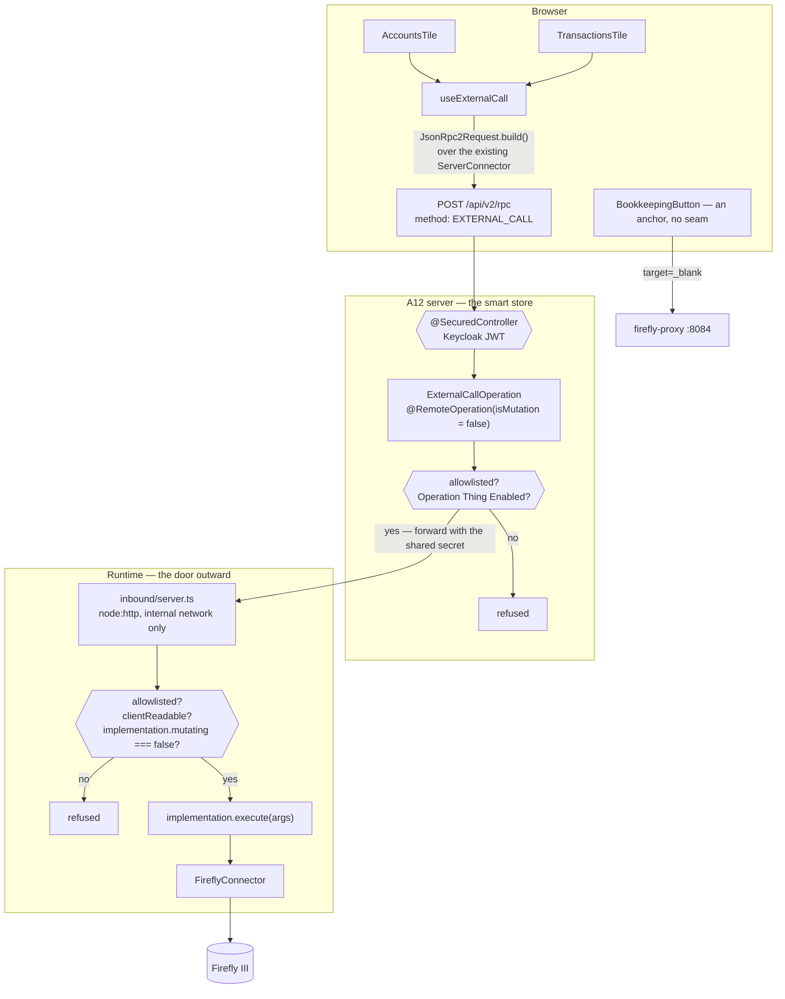

# Architecture — how the books reach the Dashboard

Read [proposal.md](proposal.md) first, and [domain.md](domain.md) for the vocabulary. The Dashboard
this extends is [dashboard/architecture.md](../dashboard/architecture.md); its rules are
[ADR-0022](../../../docs/adr/0022-a-dashboard-counts-it-does-not-keep.md).

## Shape



Nothing on that path stores an answer.

## Two constraints found in the code, which shape the gate

Both were discovered by reading rather than assumed, and both change what the gate can be built from.

### 1. `Mutating` on the Thing is **not** trustworthy for safety

`registry.ts:88` is explicit:

```ts
/** Whether `execute` changes state. Authoritative here, and NOT read from the Thing. */
mutating: boolean;
```

and `resolve()` says why:

> *Never from the Thing: `reconcile()` treats a non-mutating Operation as safe to consider repeated,
> so a `mutating: false` on a booking would make crash recovery report it as harmless — ADR-0012's
> failure, supplied by the safety mechanism.*

So the system has already decided that a `Mutating` flag on an editable Thing must never carry a
safety decision, for exactly the reason that matters here: someone — a User, a bug, a bad import —
could mark a booking non-mutating.

**Therefore the authoritative `mutating` check lives in the Runtime**, where `implementation.mutating`
is code. The server may read the Thing's `Mutating` as a cheap early filter, and it may read `Enabled`,
which *is* legitimately the User's decision — but the server's real control is the allowlist, and the
refusal that counts happens on the Runtime.

This inverts the elegant story the proposal told. It is the safer arrangement and the honest one.

### 2. `execute()` is below the approval layer

`OperationContext` requires a `conversation` and an `assistant`, both `Stored<>` Things, and
`requiresApproval` is honoured by the loop — not by `execute()`. So **calling `execute()` directly
bypasses approval entirely.** That is fine for a read and catastrophic for a write, and it is the
single reason the mutating check has to be airtight rather than merely present.

It also means a client call has no context to pass: there is no Conversation and no Assistant behind
it, and inventing one would put a fake conversation id into an idempotency key.

**The fix is structural.** `OperationImplementation` gains one optional flag:

```ts
/**
 * May the client call this directly, with no Conversation behind it?
 *
 * Only meaningful with `mutating: false`. An Operation that sets this may not read
 * `OperationContext` — there is no Conversation, no Assistant and no idempotency key when the
 * caller is a browser.
 */
clientReadable?: true;
```

`clientReadable` is a **code-level allowlist**: an Operation is client-callable only where its own
implementation says so, next to the code that knows whether that is true. The config allowlist is the
**deployment-level** one. Both are checked; neither is sufficient alone.

The three Operations this change marks — `bookkeeping.listAccounts`, `bookkeeping.listTransactions`,
`bookkeeping.getBalance` — already ignore the context parameter entirely (`async execute(): Promise<OperationOutcome>`
for the first), so the constraint costs nothing today and prevents a whole class of mistake tomorrow.

## The gate, stated once

Four checks, `and`ed, across two processes:

| # | Check | Where | Source of truth |
|---|---|---|---|
| 1 | the Operation key is in `assistants.external-call.allowed` | server | deployment config |
| 2 | the Operation Thing has `Enabled = true` | server | Thing — the User's decision |
| 3 | the Operation key is in the Runtime's own allowlist | Runtime | deployment config |
| 4 | `implementation.clientReadable === true` **and** `implementation.mutating === false` **and** `implementation.seed.requiresApproval !== true` | Runtime | **code** |

Check 4 is the one that makes the property true. Checks 1–3 are what stop a mistake in 4 from being
the only thing standing between a browser and the books.

The third clause of check 4 is belt-and-braces with the second and is kept because `requiresApproval`
is **not** a field on `OperationImplementation` — it lives only on `.seed.requiresApproval`
(`registry.ts:106`), and the resolved value the loop uses comes from the Thing. Since the inbox does
not resolve against the catalogue, reading the seed is the only way it can see that an Operation
shipped wanting an approval, and refusing on it costs nothing.

**What the inbox deliberately skips, and why that is safe only for reads.** Executing
`implementation.execute()` directly bypasses `grantedTo()` (the ADR-0010 grant filter *and* the
catalogue's `enabled` check), `LoopDriver.gateOnApproval()` (`advance.ts:760`), the intent log, and
the idempotency-key convention. Every one of those exists to make *writes* safe. The server's check 2
restores the `Enabled` half; the rest are meaningless for a call that changes nothing — and check 4 is
what guarantees the call changes nothing.

> **Opening a read route does not open a write one.** Two processes, two configs, and a code-level
> flag that a Thing cannot override.

## Seam 1 — the Runtime's inbox

The Runtime has no HTTP server today, and `index.ts:4` says so in its own words:

> *There is nothing else. No HTTP server, no queue, no scheduler — the ThingStore is the only
> Authority for pending work, so scanning it is all there is to do (D-005).*

That sentence is amended, not deleted: the ThingStore stays the only Authority for **pending work**,
and the inbox carries none of it.

```
runtime/src/inbound/server.ts     ~90 lines, node:http, no framework
    POST /operations/:key   { args }   → { ok: true, outcome } | { ok: false, reason }
    GET  /healthz                      → 200
```

Decisions:

- **`node:http`, no dependency.** One route and a JSON body. Adding Express to a process whose job is
  a scan loop would be a dependency, a lockfile change and a supply-chain surface for something the
  standard library does in twenty lines. It also sidesteps the offline-registry problem entirely.
- **No published host port, and no compose change needed to reach it.** The `runtime` service has no
  `ports:` today and gains none. Container-to-container traffic on the compose network needs neither
  `ports` nor `expose` — `expose` is documentation — so the server reaches `http://runtime:8090` with
  nothing published to the host. The boundary that faces the world stays Keycloak, at the server.
- **The listener must be closed on SIGTERM.** `index.ts:38-41` only sets a `stopping` flag; the scan
  loop then exits on its own. An open listener keeps the event loop alive, so without an explicit
  `close()` in that handler the container would stop responding to SIGTERM and be killed after the
  timeout. This is the one change to the Runtime's lifecycle, and it is easy to miss.
- **A shared secret, minted like every other machine credential** by `scripts/setup-env.mjs`, compared
  with `timingSafeEqual`. It is not the User's authentication — that already happened at the server —
  it is what stops any other container calling the door outward.
- **It does not touch the scan loop.** The handler is `async`, does no CPU work, and awaits a
  Connector call. It shares the process and the event loop with the loop, and the health check that
  already watches the heartbeat is what would surface contention.
- **A refusal names its reason and never the Operation's existence.** `not-allowed` covers unknown,
  disallowed, disabled and mutating alike: a browser probing the route learns nothing about the
  catalogue.
- **The outcome is passed through as-is.** `{ kind: "value", value }` is what a read returns.
  `pending` and `error` are returned verbatim rather than translated — a client-callable read should
  never produce `pending`, and if one does, the tile shows its error line rather than the server
  inventing a meaning.

## Seam 2 — the server's `EXTERNAL_CALL`

```java
@Component
@RemoteOperation(name = "EXTERNAL_CALL", group = "EXTERNAL_OPERATIONS", isMutation = false)
public class ExternalCallOperation {
    public Object rpc(@JsonRpcParam("operation") String key,
                      @JsonRpcParam("args") Map<String, Object> args) { … }
}
```

- **`@RemoteOperation`, not `@RestController`.** It puts the call on the endpoint the client already
  speaks, batched with the other tiles' queries, sharing `Request-Id` and the transaction context.
  `isMutation = false` also routes it to a read replica where one exists. The method must literally be
  named `rpc`, and `EXTERNAL_OPERATIONS` must be added to
  `mgmtp.a12.dataservices.jsonRpc.allowedOperations`.
- **The fallback is a `@RestController`**, which is proven working here: phase A observed `401`
  unauthenticated and `200 {"principal":"admin"}` with a token. It is a surface swap — same component,
  same policy, same ADR — so the undocumented-SPI risk costs a day, not a redesign.
- **Authentication is A12's**, at the controller (`@SecuredController`). This change writes none.
- **Timeout: 10s** to the Runtime, under the connector's own 20s, because a human is waiting.
- **The server holds no Firefly credential** and has no code path that could reach Firefly.

Configuration, in `application-shared.properties`:

```properties
assistants.runtime.url=http://runtime:8090
assistants.runtime.shared-secret=
assistants.external-call.allowed=bookkeeping.listAccounts,bookkeeping.listTransactions
```

## Seam 3 — `useExternalCall`

`Dispatcher.rpc` is typed to A12's built-in requests and its own d.ts warns that anything else
*"will lead to compile and runtime errors"* — so this uses the untyped escape hatch,
`JsonRpc2Request.build()` over the configured `ServerConnector`, which is what mgm's own Workflows
client does. Auth, batching and the base URL still come from the connector; only the typing is ours.

```ts
export function useExternalCall<T>(operation: string, args?: Record<string, unknown>): ExternalCall<T>;
```

`useThingCounts`' four invariants, plus a fifth:

1. **Read only.** There is no method parameter and no write path.
2. **Fails soft.** A refusal, a timeout, an unreachable Runtime, a malformed body: all `error`, none
   throws, the other four tiles stand.
3. **No polling.** Read on mount, `readAt` stamped from the response, `asOf()` in the footer.
4. **Nothing kept.** No module cache, no redux slice, no `sessionStorage`. Leaving and returning
   re-asks Firefly.
5. **Not the Authority.** No arithmetic on what comes back except the per-currency total, which is
   computed for display and discarded with the component.

`args` is fingerprinted by `JSON.stringify` for the effect dependency, exactly as `useThingCounts`
does with its query list.

## Seam 4 — the tiles

**`DashboardTile` gained `variant` and `BookkeepingButton` replaced `BookkeepingTile` — already done**,
tested and green.

**`AccountsTile`** — `useExternalCall("bookkeeping.listAccounts", { type: "asset" })`. The Operation
returns `{name, type, balance}` today and gains `currency` **and an optional `type` filter**; one row
per account, then a rule and one total per currency. **No headline**: the obvious candidate is the
sum, which is exactly the number that cannot be honestly produced across two currencies, and a
headline that appears and disappears with the household's account list is worse than none.

The filter is on the Operation rather than in the tile, and that is the point of it. Measured against
the live stack, `listAccounts` returns **every** account type — `expense`, `revenue`, `asset`,
`liabilities` — so something has to narrow it. Doing that in React would put Firefly's own vocabulary
(the literal `"asset"`) inside a component, and translation between a foreign representation and ours
is defined to live in the Connector's half of the system. The tile asks for *bank accounts*; the
Runtime knows that means `asset`.

It also filters case-insensitively and treats `liability` and `liabilities` as one kind, because
Firefly's read API answers the plural and its write API accepts the singular — the exact mismatch
behind BUG-02, where a type vocabulary that had never heard `liabilities` hid the payables account and
the Accountant then reported that nothing was outstanding. The Assistants get the filter too, which is
worth more to them than to the tile: *"list the asset accounts"* stops being a reasoning step.

**`TransactionsTile`** — `useExternalCall("bookkeeping.listTransactions", { start, end, limit: 10 })`.
`projectTransactionGroup` already returns `{date, description, amount, currency, from, to}` with
splits flattened and the date trimmed to `yyyy-mm-dd`, so **the tile consumes the Operation's existing
output unchanged** and this change writes no Firefly mapping at all.

The Operation requires `start` and `end`, so the tile asks for a **ninety-day window** and says so.
*"The last ten bookings in the last ninety days"* is honest; *"the last ten"* is not what the
Operation offers.

**`money.ts`** — one module, because there is one way this application renders an amount.
`Intl.NumberFormat("de-DE", { style: "currency", currency })`, locale fixed because the books are
kept in Germany. Measured against the live stack: Firefly returns `"96.500000000000"`, twelve decimal
places, so the fixtures use that shape rather than a tidy one. `totals` groups by currency and never
sums across.

## The App Model change

Second row in the `Dashboard` layout settings, two `VIEW_ADD`s appended:

```jsonc
{ "columns": [ {"width":{"sm":12,"md":12,"lg":8}}, {"width":{"sm":12,"md":12,"lg":4}} ] }
```

```jsonc
…, { "type": "VIEW_ADD", "name": "TransactionsTile" }, { "type": "VIEW_ADD", "name": "AccountsTile" }
```

Slot pairing is positional across rows as well as within one, so `DashboardPage.TILES` grows to six in
the same order and the e2e order assertion is what catches a silent reordering. `md: 12` on row two:
ten transaction rows in a half-width tablet column are unreadable.

## What could go wrong, and where it is caught

| Failure | Caught by |
|---|---|
| **A browser reaches a mutating Operation** | Runtime unit test per check; and an e2e case that *attempts* `bookkeeping.postTransaction` and asserts the refusal |
| A non-mutating but non-allowlisted Operation is called | Runtime unit test; e2e case |
| `clientReadable` set on something that reads context | TypeScript cannot enforce it; a Runtime unit test asserts every `clientReadable` implementation executes with no context |
| The shared secret is wrong or absent | Runtime unit test → refused; the tile shows its error line |
| Firefly 500s or times out | The Connector's existing behaviour, surfaced as `{kind:"error"}`; tile unit test for the `error` state |
| The Runtime is down | e2e with the Runtime stopped: two tiles error, four render |
| An amount rendered wrong | `money.ts` unit tests over the real twelve-decimal shape, a negative, a thousands separator, and a two-currency total |
| Ordering or flattening regresses | Runtime unit tier with hand-built fixtures — **not** e2e: measured, 21 of the household's 24 transactions share one date and no group has more than one split, so an e2e ordering assertion would pass on shuffled data |
| Six tiles unreadable on a phone | Phase E screenshot at narrow width |

## Testing

| Tier | What it covers | Command |
|---|---|---|
| Runtime unit | the inbox's four checks, the secret, the outcome pass-through, `clientReadable` implementations ignoring context, and the transaction projection over hand-built multi-split fixtures. Built on `buildHarness([])` and the direct-execute pattern `test/operations.test.ts:51` already uses | `just test-runtime` |
| Client unit | `useExternalCall`'s five invariants against a faked connector; `money.ts`; both tiles' three states | `just test-client` |
| Models | the App Model validates, twenty-nine models | `just test-models` |
| Integration | the inbox against the **live** Runtime and Firefly | `just test-integration` |
| e2e | six tiles in order, the button's shape, both tiles `ready`, the row cap, **the two refusals**, and the Runtime-down case | `just test-e2e` |

**No new test tier.** The Runtime's vitest tier and the client's already exist — which is the practical
dividend of putting the work where the Connector already lives, and it sidesteps the blocker that
stopped the previous design: `artifacts.mgm-tp.com` is NXDOMAIN off-VPN and `server/app/gradle.lockfile`
forbids new dependencies, so a Java test tier could not be created at all.

## Files

**New**

```
runtime/src/inbound/server.ts          the inbox
runtime/src/inbound/gate.ts            the four checks, pure and separately testable
runtime/test/inbound/gate.test.ts
runtime/test/inbound/server.test.ts
server/app/src/main/java/com/grtnr/assistants/server/bookkeeping/ExternalCallOperation.java
server/app/src/main/java/com/grtnr/assistants/server/bookkeeping/RuntimeCaller.java
client/src/components/dashboard/useExternalCall.ts
client/src/components/dashboard/money.ts
client/src/components/dashboard/AccountsTile.tsx
client/src/components/dashboard/TransactionsTile.tsx
client/src/test/components/dashboard/{useExternalCall,money,AccountsTile,TransactionsTile}.test.*
docs/adr/0023-the-runtime-is-the-door-outward.md
```

**Changed**

```
runtime/src/index.ts                   start the inbox; amend the "no HTTP server" comment
runtime/src/config.ts                  inboundPort, inboundSecret, clientCallable allowlist
runtime/src/operations/registry.ts     clientReadable on OperationImplementation
runtime/src/operations/implementations.ts   three ops marked; listAccounts gains currency
client/src/components/dashboard/dashboardViewMap.tsx   six entries
client/src/components/{icons.ts,appsetup.ts}
import/models/AssistantsAppModel_AM.json               second row, two VIEW_ADDs
server/app/src/main/resources/config/application-shared.properties
compose/docker-compose.yml             runtime: expose + secret; server: url + secret
scripts/setup-env.mjs                  mint the shared secret
e2e/pages/DashboardPage.ts             six tiles  (variant accessor already added)
e2e/tests/base/10-dashboard.spec.ts
e2e/tests/flow/1-invoice-slice.spec.ts
docs/adr/0011-…                        a pointer to ADR-0023
README.md  DECISIONS.md
specs/system/architecture.md  specs/system/functional.md
```

**Already done** — `DashboardTile.tsx` (variant), `BookkeepingButton.tsx` + test,
`BookkeepingTile.tsx` deleted, `DashboardPage.variant()`, two e2e cases.

## Rejected alternatives

- **A `BookkeepingSnapshot` Thing, refreshed by the Runtime.** Keeps every boundary and needs no new
  call path — and copies the household's bank balances and transaction history into the ThingStore's
  Postgres, its backups, its exports and its WAL, where nothing reads them. Refused on
  data-minimisation, not on Authority. See domain.md.
- **The server holds the Firefly credential.** Makes the smart store the first component that is both
  a store and an integration, and needs repeating per external system. It also required a Java test
  tier that cannot currently be created.
- **The browser calls `firefly-proxy` directly.** Tested, not assumed: `GET firefly:8080/api/v1/accounts`
  with `X-Forwarded-Email` and no token answers `401 {"message":"Unauthenticated."}`. `remote_user_guard`
  guards Firefly's web UI; its API wants the personal access token. Dead end.
- **A generic "call any Operation" route.** Four checks exist precisely so this is not that.
- **Passing a synthetic `OperationContext`.** A fabricated conversation id would reach an idempotency
  key. `clientReadable` makes "this Operation needs no context" a property of the implementation.
- **Server-side aggregation of the total.** The currency-grouping rule lives in `money.ts`; a server
  sending a derived number would be the server having an opinion about the books.
