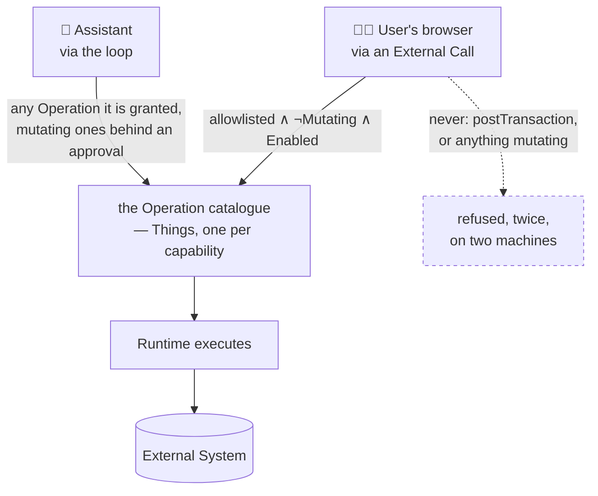

# Domain — what this change adds and changes

New and changed concepts only. The system's standing domain is
[specs/system/domain.md](../../system/domain.md); the glossary is
[CONTEXT.md](../../../CONTEXT.md); the Dashboard's own vocabulary is
[dashboard/domain.md](../dashboard/domain.md). Spelling is British English.

This change adds **no Thing, no Model, no field and no index** — and here that sentence is the whole
point rather than a boast. The change exists precisely because the alternative was to add one.

What it does add is a **direction of travel**: for the first time, a fact whose Authority is not the
ThingStore reaches a screen. So most of the vocabulary below is about the route, not the numbers.

## Vocabulary

| Term | Status | Gloss |
|---|---|---|
| **The door outward** | **new** | The Runtime, named as what it already is: the one component that talks to External Systems. Every Connector and every foreign credential lives behind it. This change makes the door usable by the client — in one direction, for reading — rather than adding a second door |
| **External Call** | **new** | A client asking, through the server, for an Operation to be executed against an External System, and getting its result back. Synchronous, read-only, and **stateless in the strict sense**: no Thing is created, nothing is cached, and when it is over the system holds nothing it did not hold before |
| **Routed, not copied** | **new** | The rule this change is about. A foreign fact may pass through this system on its way to a screen; it may not stop here. The route may hold a credential; it may not hold an answer |
| **The gate** | **new** | What the server checks before forwarding an External Call, and what the Runtime checks again before executing one: the named Operation must be **allowlisted**, **`Mutating = false`** and **`Enabled = true`**. All three, `and`ed. Checked against the Operation Thing, so the catalogue that governs Assistants governs the client too |
| **The allowlist** | **new** | The Operations an External Call may name. A *separate* control from `Mutating`, and not redundant with it: `Mutating = false` says *changes nothing*, which is not the same as *safe for a browser to invoke at will* — an LLM-touching Operation is non-mutating and costs money every time it is called. Ships holding exactly the two the Dashboard needs |
| **Bank Account** | **new** | An account the household's own money sits in — Firefly's `asset` type. Distinguished because Firefly calls many things an account: the expense and revenue accounts that give double entry its other side, the payables and receivables that carry Open Items, and its own internal books. Only the first kind has a balance a human reads as *what we have* |
| **Balance** | **new** | What Bookkeeping says a Bank Account currently holds, in that account's own currency. Never computed here, never converted, never summed across currencies |
| **Booking** | **new** | One split of one transaction: a date, a description, an amount, and the two accounts it moved between. Named *booking* rather than *transaction* because a transaction *group* can hold several, and "the last ten transactions" means ten lines a reader would recognise. `projectTransactionGroup` already produces exactly this |
| **Bookkeeping Button** | **replaces Bookkeeping Tile** | The door to Firefly III, drawn as a control instead of a summary. It has no headline, body or footer — it never did — and now no tile chrome either |
| **Transactions Tile** · **Accounts Tile** | **new** | The Dashboard's first Tiles whose Authority is not the ThingStore |
| **Tile** | **changed** | Gains a **variant**: a *tile* is a summary with a frame and three optional slots; a *button* is a control with a label and a destination. Both are one view, so both keep their own error boundary |
| **Operation** | **unchanged, newly reachable** | Still a Thing, still the unit of what the system can do, still declared with `Mutating`, `RequiresApproval` and `Enabled`. What changes is *who may cause one to execute*: until now only an Assistant, through the loop; now also the client, for the narrow set the gate admits |
| **Icon vocabulary** | **extended** | Place labels gain 💳 transactions and 🏦 accounts |

## Who may cause an Operation to run

The heart of the change, because it is the only real widening of anything.

| Caller | May run | Approval | Refused |
|---|---|---|---|
| **Assistant** | any Operation granted to it | mutating ones require one ([ADR-0018](../../../docs/adr/0018-an-operation-may-require-an-approval.md)) | anything not granted |
| **User's browser** | allowlisted ∧ `Mutating = false` ∧ `Enabled = true` | not applicable — it changes nothing | everything else, and the refusal is not a courtesy |

The property the whole change hangs on, stated once:

> **Opening a read route does not open a write one.** `Mutating = true` is refused by the server
> before forwarding and by the Runtime before executing. Two checks, two processes, both reading the
> same Thing.

## Why the answer is not kept

The rejected design was a `BookkeepingSnapshot` Thing: the Runtime refreshes it, the client reads it
like any other Thing, every boundary intact and no new call path anywhere. It is the obvious answer
and it is refused, for a reason that is not about Authority:

- **Bank statements do not belong in the document store.** A snapshot copies the household's balances
  and transaction history into the ThingStore's Postgres — and therefore into its backups, its
  exports, its overviews and its write-ahead log. The document store needs none of it. Holding the
  most sensitive data in the system where nothing reads it is a cost with no matching benefit.
- **A dated snapshot is honest and still stale.** It would have carried its read instant and been
  decided from by nothing. That answers ADR-0006 and does not answer the sentence above.
- **The Authority argument is the weaker one here, and it still holds.** Bookkeeping remains the
  Authority for accounts, balances and transactions; nothing in this system holds a second copy,
  down to the Invoice having no `paid` field. Routing keeps that true by construction rather than by
  discipline: there is nowhere for a stale copy to live.

## Where each fact lives

| Fact | Authority | Before | After |
|---|---|---|---|
| Conversations, Documents, Assistants | ThingStore | counted per visit | unchanged |
| **Bank Accounts and their Balances** | **Bookkeeping** | reachable only by an Assistant | **read per visit by the client, through the Runtime, kept nowhere** |
| **Bookings** | **Bookkeeping** | reachable only by an Assistant | **last ten read per visit, kept nowhere** |
| Whether an Invoice is paid | Bookkeeping | derived from the books, never stored | unchanged — the Transactions Tile is a ledger tail, not a `paid` flag |
| What the system can do | ThingStore, as Operation Things | governs Assistants | **also governs the client**, through the gate |
| Every foreign credential | Runtime | one holder | **still one holder** — this is the design's main claim |

## Actors

| Actor | This change |
|---|---|
| **User** | sees the household's money on arriving, for the first time. Still edits nothing here; every Tile is read-only and every Tile is a door |
| **Runtime** | **changed, and it is the only real change.** It accepts one kind of inbound call for the first time. It still polls for every piece of pending work, still holds every Connector, and still does not know the Dashboard exists — it answers a question without being told who asked |
| **Server** | unchanged in kind: still a smart store. It gains a *policy* to enforce, read from Things it already holds, and a shared secret. It learns nothing about Firefly and holds no credential that could reach it |
| **Bookkeeping** | still the Authority, still exactly one writer, now with one more reader on this side of the fence |
| **Assistant** | untouched. It calls the same Operations the same way and is unaware any of this happened |
