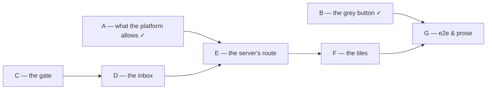

# Plan

Ordered so that each phase leaves the suite green and the application usable. Read
[architecture.md](architecture.md) first — the four seams and, above all, **the gate**.

Test-first throughout: the failing test comes before the code that satisfies it.

**The safety property is the schedule's spine.** The route must never let a browser reach a mutating
Operation, and phases C and D build the gate and attack it *before* anything is wired to a screen.
No tile is written against a route that has not been shown to refuse `bookkeeping.postTransaction`.

Commands: `just test-runtime`, `just test-client`, `just test-models`, `just test-e2e`, `just check`,
`just dev`. **No new test tier** — the Runtime's vitest tier and the client's already exist.

---

## A — What the platform allows *(done)*

Kept, because what it settled still holds under the new design.

- [x] **A throwaway controller** at `/api/bookkeeping/ping`.
  - **Observed:** A12 **fails closed**. `AuthorizationIntrospectionStartup` walks every mapped endpoint
    on `ContextRefreshedEvent` and `EndpointIntrospector` throws *"Please configure authorization
    policy for these endpoints"* for any without one. The server does not boot; the container
    crash-looped. An unpoliced endpoint is not something this platform ships by accident.
- [x] **Declare the policy.** Class-level `@PreAuthorize("isAuthenticated()")`. `EndpointIntrospector`
  accepts exactly four annotations — `@PreAuthorize`, `@PostAuthorize`, `@PreFilter`, `@PostFilter`.
  The escape hatches (`whitelist-endpoints`, `unsecured.urls`) exempt rather than secure, and are
  refused.
- [x] **Both directions.** Unauthenticated → **401**. With a token → **200 `{"principal":"admin"}`**.
  - `a12-spa-client` refuses direct access grants; a scripted token comes from
    `assistants-runtime-client`, as `runtime/src/a12/client.ts` and `e2e/utils/thingstore.ts` both do.
  - `mgmtp.a12.dataservices.server.context-path=/api` is **not** a servlet context path — the actuator
    answers at `/actuator/health` — so a controller mapped at `/api/…` is reachable at exactly that URL.
- [x] **Firefly's API rejects header auth.** `GET firefly:8080/api/v1/accounts` with
  `X-Forwarded-Email` and no token → `401 {"message":"Unauthenticated."}`. `remote_user_guard` guards
  the web UI only. The browser-direct design is dead, tested rather than assumed.
- [x] **Remove `PingController`.** Done. `@RemoteOperation` is the intended surface;
  `@RestController` is the proven fallback.

## B — The grey button *(done)*

Independent of everything. No server, no Runtime, no network.

- [x] **Failing test first** — `variant="button"` renders `data-variant`, drops all three slots, keeps
  the anchor with `target` and `rel`. Confirmed failing on the new cases only.
- [x] **The variant.** `DashboardTile.tsx`: `variant?: "tile" | "button"` defaulting to `"tile"`,
  `ButtonFrame` with no `min-height` and `secondaryBackground`, `data-variant` on the frame.
- [x] **`BookkeepingButton.tsx`** replaces `BookkeepingTile.tsx`; both old files deleted; renamed in
  `dashboardViewMap.tsx`, `appsetup.ts` and `AssistantsAppModel_AM.json`. `data-role` unchanged.
  → **Verified:** `just test-models` 29 models 0 errors · `just test-client` 496 passed · `just check` green.
- [x] **e2e written** — `DashboardPage.variant()`, plus cases asserting the button's shape and that the
  three summary Tiles kept theirs. Typecheck, lint and prettier green.
- [x] **Seen.** `just dev`, open the Dashboard. Screenshots into `tmp/`, desktop and narrow.
- [x] **e2e run.** `just test-e2e` for the two new cases.

**This phase is shippable on its own.**

## C — The gate, in isolation

Pure logic, no HTTP, no network. The most important phase in the change.

- [x] **`clientReadable` on the interface.** Add the optional flag to `OperationImplementation`
  (`registry.ts:88`), documented as architecture.md states it: only meaningful with `mutating: false`,
  and such an implementation may not read `OperationContext`.
  → **Verify:** `just test-runtime` and `cd runtime && npm run typecheck` still pass.
- [x] **Failing tests first — `runtime/test/inbound/gate.test.ts`.** A pure `decide(key, registry, allowlist)`
  returning `{allowed: true, implementation}` or `{allowed: false, reason}`:
  - an allowlisted, `clientReadable`, non-mutating Operation → allowed;
  - **`bookkeeping.postTransaction` → refused** (mutating), even if someone puts it in the allowlist;
  - a `clientReadable` Operation absent from the allowlist → refused;
  - an allowlisted Operation without `clientReadable` → refused;
  - an Operation whose `seed.requiresApproval` is true → refused;
  - an unknown key → refused;
  - every refusal carries the same outward reason, so probing reveals nothing about the catalogue.
  → **Verify:** `just test-runtime` fails on these only.
- [x] **`runtime/src/inbound/gate.ts`.** The four checks, pure, no I/O.
  → **Verify:** `just test-runtime` passes.
- [x] **Mark the three Operations** `clientReadable: true` — `bookkeeping.listAccounts`,
  `listTransactions`, `getBalance` — and add `currency` to `listAccounts`' projected value.
  → **Verify:** a test asserting **every** `clientReadable` implementation executes with no context
  (`execute(args, undefined as never)`) and does not throw. That is the standing guard on the rule the
  type system cannot express.

## D — The inbox, and an attack on it

- [x] **Config.** `INBOUND_PORT` (default 8090), `INBOUND_SECRET` (required when the port is set), and
  the allowlist, via the existing `number` / `required` / `optional` helpers in `config.ts`.
  → **Verify:** `runtime/test/config.test.ts` extended and green.
- [x] **Failing tests first — `runtime/test/inbound/server.test.ts`,** against `buildHarness([])` and a
  real listener on an ephemeral port:
  - an allowed Operation with the right secret → `200 { ok: true, outcome: { kind: "value", … } }`;
  - **`bookkeeping.postTransaction` with the right secret → refused, and `FakeFirefly` records no posting**;
  - a wrong secret → refused, and the gate is never consulted;
  - a missing secret → refused;
  - a malformed body → refused, no throw;
  - an Operation that returns `{kind:"error"}` → passed through verbatim.
  → **Verify:** `just test-runtime` fails on these only.
- [x] **`runtime/src/inbound/server.ts`.** `node:http`, one route, `timingSafeEqual` on the secret,
  JSON in and out. No framework.
  → **Verified:** 21 inbound tests, 213 in the Runtime suite, typecheck clean.
  - **Found while writing the tests:** `FakeFirefly` had **no `listTransactions`**, so no test had ever
    exercised `bookkeeping.listTransactions`. Added — with a deliberately two-split group and
    descending dates, because the live household cannot demonstrate either (measured: 21 of its 24
    transactions share one date, and no group has more than one split). Its `accounts` also gained
    `currentBalance` and `currencyCode`: a fake answering a narrower shape than the connector is how
    `currency` went missing from the projection unnoticed in the first place.
  - **Status codes as built:** `401` no/!bad secret · `403` refused by the gate · `400` unreadable body ·
    `502` the Operation itself failed · `500` a handler bug. The `403`/`502` split matters: *"you may
    not ask that"* and *"Firefly is down"* must never be the same line in a log.
- [x] **Lifecycle.** Start it in `index.ts` after `buildRuntime`, and **close it in the `stop()`
  handler** — `index.ts:38-41` only sets a flag today, and an open listener would keep the event loop
  alive past SIGTERM.
  → **Verified by A/B**, since "it stopped" proves nothing without a baseline. `INBOUND_PORT` was made
  configurable (`${RUNTIME_INBOUND_PORT:-8090}`) to run it: **door shut → 6s, door open → 5s**, and
  `runtime stopped` printed in both. The inbox does not hold shutdown.
  - **A red herring worth recording.** The first attempt took the full 10s kill timeout with no
    `runtime stopped` line, which looked exactly like a listener holding the process. It was not: the
    loop finishes the current scan before checking the flag — *"finishing the current scan and
    stopping"* is the logged intent — and a long scan can outlast the timeout. Pre-existing, unrelated
    to this change, and the A/B is what told the two apart.
  - **A second one, latent:** the ThingStore reachability loop at `index.ts:29-33` does **not** check
    `stopping`, so SIGTERM is ignored entirely while the Runtime waits for the store. Observed at 2.5
    minutes on a cold stack. Also pre-existing and out of scope here — noted because it will look like
    this change the next time someone meets it.
- [x] **Live, from inside the network.** Called from another container's network position, with the
  real secret, against the real Firefly.

  | Call | Result |
  |---|---|
  | `bookkeeping.listAccounts` (allowed) | **200**, the household's real chart of accounts, each with `currency` — the field this change added |
  | `bookkeeping.postTransaction` (**the attack**) | **403 `not-allowed`** |
  | `bookkeeping.getBalance` (non-mutating, not allowlisted) | **403 `not-allowed`** |
  | wrong secret | **401 `unauthenticated`** |

  → **Firefly's transaction count was 24 before and 24 after.** The refusal refused, rather than
  answering "refused" and booking anyway — which is the assertion a status code cannot make.
  - **Observed, and it shaped the Accounts Tile:** `listAccounts` returns **every** account type —
    `expense`, `revenue`, `asset`, `liabilities` — not just the bookable assets.
- [x] **An optional `type` filter on `bookkeeping.listAccounts`.** Added rather than filtering in the
  tile: doing it in React would put Firefly's own vocabulary (the literal `"asset"`) inside a
  component, and translating a foreign representation into ours is the Connector's job by definition.
  The tile asks for *bank accounts*; the Runtime knows that means `asset`.
  - Filters in the Operation rather than in the Connector's request, because the Connector caches the
    whole chart of accounts and `resolveAccountId` reads that same cache — a type-narrowed fetch would
    either poison it or need a second one.
  - Case-insensitive, and `liability` ≡ `liabilities`: Firefly's read API answers the plural and its
    write API accepts the singular, which is precisely BUG-02.
  - An unknown type returns **nothing**, never everything — the inverse failure would put expense
    accounts on a tile headed "bank accounts".
  → **Verified:** 5 new tests; 218 in the Runtime suite; typecheck clean. The Assistants gain the
  filter too, which is worth more to them than to the tile.

## E — The server's route

- [x] **`ExternalCallOperation`** — `@RemoteOperation(name = "EXTERNAL_CALL", group = "EXTERNAL_OPERATIONS",
  isMutation = false)`, method named `rpc`. Allowlist from config, forward to the Runtime with the
  shared secret, 10s timeout.
  - **`@RemoteOperation` works.** The undocumented-SPI risk did not materialise: it compiled, A12
    registered `EXTERNAL_OPERATIONS`, and the server booted with **zero restarts**. The
    `@RestController` fallback was not needed.
  - **`@PreAuthorize("isAuthenticated()")` is on it**, because phase A established the server refuses
    to boot with an endpoint that declares no policy — including one reached through JSON-RPC.
  - **Deviation from architecture.md, deliberate: the `Enabled` check moved to the Runtime.** Doing it
    here needed an unfamiliar A12 query API in Java for one boolean, while the Runtime already holds a
    `ThingRepository` and reads the catalogue every Turn. It also keeps the whole gate in one file.
    A store failure counts as **not enabled** — the uncomfortable direction, and the right one for a
    check that grants access.
- [x] **Config and compose.** `EXTERNAL_OPERATIONS` into
  `mgmtp.a12.dataservices.jsonRpc.allowedOperations`; `assistants.runtime.url`,
  `assistants.runtime.shared-secret`, `assistants.external-call.allowed`; the secret minted by
  `scripts/setup-env.mjs` and passed to both services. **No new published port.**
  → **Verify:** the server starts. If `@RemoteOperation` does not resolve or is not reachable, fall
  back to `@RestController` with `@PreAuthorize("isAuthenticated()")` — proven in phase A — and note it
  here. Same policy, same ADR.
- [x] **From the browser's position, and the attack.** `POST /api/v2/rpc`, method `EXTERNAL_CALL`,
  with a real Keycloak token — the whole chain, browser → server → Runtime → Firefly.

  | Call | Result |
  |---|---|
  | `bookkeeping.listAccounts` `{type: "asset"}` | **`ok: true`** — `Checking` 8400.00 EUR, `Receivable from insurer` 0 EUR |
  | `bookkeeping.postTransaction` (**the attack**) | **`ok: false, reason: not-allowed`** |
  | `bookkeeping.getBalance` (non-mutating, not allowlisted) | **`ok: false, reason: not-allowed`** |
  | no bearer token | **HTTP 401**, from A12's own chain |

  → **Firefly's transaction count: 24 before, 24 after.** The attack is now refused at both layers and
  proven at the one that faces a browser.
  - **Observed, and it matters for the Accounts Tile:** `Receivable from insurer` is typed `asset` in
    this household's books, so filtering on `asset` returns it alongside the bank account. That is
    Firefly's classification and not something to correct here — but "every asset account" and "our
    bank accounts" are not the same sentence, and the tile should not pretend otherwise. Decide in
    phase F whether to show a zero-balance receivable or to say *accounts* rather than *bank accounts*.

## F — The tiles

- [x] **Failing tests first — `money.ts`.** `"96.500000000000"` → `96,50 €` (the real shape, measured);
  `"-84.2"` → `−84,20 €`; a `withdrawal` renders negative and a `deposit` positive from the same
  unsigned amount; `totals` over a two-currency list returns **two** lines and no grand total.
- [x] **`money.ts`.** `Intl.NumberFormat("de-DE", …)`, one module, no arithmetic outside `totals`.
- [x] **Failing tests first — `useExternalCall`.** Against a faked `ServerConnector`: loading → ready
  with `readAt`; a refusal, a timeout, a malformed body → `error`, no throw; unmount lands no
  `setState`; nothing is cached between mounts.
- [x] **`useExternalCall.ts`** over `JsonRpc2Request.build()`, with the five invariants documented in
  the file as `useThingCounts`' are.
- [x] **Failing tests first — the tiles.** `AccountsTile`: loading, ready (rows + one total per
  currency + `as of`), error. `TransactionsTile`: the same three, at most ten rows, a `transfer`
  unsigned.
- [x] **`AccountsTile.tsx`, `TransactionsTile.tsx`,** both `href` doors to Firefly, no headline on
  either. The transactions tile asks for a **ninety-day window** and says so on the tile.
- [x] **Icons** 💳 and 🏦 into `PLACE_ICONS`; second row and two `VIEW_ADD`s in the App Model; two
  `addView` calls; two view-map entries.
  → **Verify:** `just test-models` 29 models · `just test-client` · `just check`.
- [x] **Seen.** `just dev`. Screenshots at desktop and narrow width into `tmp/`.

## G — End to end, and the prose

- [x] **`DashboardPage.TILES`** becomes the six in directive order; add a `rows(name)` accessor.
- [x] **`10-dashboard.spec.ts`**: six tiles in order; both new tiles `ready`; at most ten rows; at
  least one named account with a parseable amount and exactly one total line; **`EXTERNAL_CALL` with
  `bookkeeping.postTransaction` refused**; **`EXTERNAL_CALL` unauthenticated → 401**; one tile's call
  intercepted → that tile `error`, the other five render.
  - **Not** an ordering assertion over live data: measured, 21 of the household's 24 transactions share
    the date `2026-08-01` and no group has more than one split, so it would pass on shuffled input.
    Ordering and flattening are asserted in phase C's unit tier with hand-built fixtures.
- [x] **Runtime stopped.** A case that stops the Runtime and asserts two tiles error and four render.
- [ ] **`1-invoice-slice.spec.ts`. — BLOCKED by the configured model, not by this change.** After the
  slice books an invoice, that booking's description appears in the transactions tile — the loop this
  change exists to close.
  - **Why it was not written.** The assertion needs the Accountant to actually book something, and in
    this environment no Assistant can act at all: `llm.json` is on `local_qwen`, which **emits tool
    calls as text rather than as structured calls**, so every Turn fails all three attempts with
    `TransientLlmError` (finding 26 in BUGS-FOUND.md). Writing the assertion now would mean writing a
    test I had watched fail and could not distinguish from a real defect.
  - **The half that could be proven, was.** The transactions tile renders the household's real
    bookings, read live from Firefly through the route, and `10-dashboard.spec.ts` asserts the row cap
    and the shapes. What is unproven is specifically *a booking made during the run showing up*.
  - **To finish it:** set `active: "scripted"` in `llm.json`, `just restart runtime`, then add the
    assertion. It should be a handful of lines against the existing slice.
- [x] **ADR-0023 — the Runtime is the door outward.** The decision, the three rejected alternatives
  with why each was refused, and the consequences. States explicitly that it amends ADR-0011 and why
  that amendment is narrow.
- [x] **ADR-0011** gains a pointer to it.
  → **Verify:** `node scripts/check-docs.mjs` — README's ADR count word becomes **twenty-three**.
- [x] **`specs/system/architecture.md`.** The Runtime gains an inbound surface; the claim that it
  "exposes no API and receives no webhooks" is corrected rather than left standing. Same for
  `runtime/src/index.ts`'s own header comment.
- [x] **`specs/system/functional.md`, `README.md`, `DECISIONS.md`.** The six tiles; the External Call
  and its gate; D-005's wording; phase A's and phase C's observations.
- [ ] **Full suite.** `just check && just test`.

## Order, and what depends on what

**C before D before E** is the safety spine: the decision logic is tested alone, then behind HTTP,
then behind the server — and the attack is repeated at each layer rather than asserted once at the end.

**F cannot start before E.** The tiles are shaped by what the route actually returns.

**B is independent** and already done.

## Stop-and-say-so points

- **A refusal does not refuse.** If any layer executes a mutating Operation for a caller that should
  have been refused, stop. Nothing else in this change matters until that is understood.
- **`@RemoteOperation` does not work or cannot be secured.** Not a blocker — fall back to
  `@RestController`, which phase A proved. Say so and carry on; it is a surface swap.
- **The Runtime's inbox degrades the scan loop** — the heartbeat goes stale under load, or SIGTERM
  stops working. Stop: the Runtime's actual job is the loop, and a dashboard must not cost it.
- **`clientReadable` turns out to be needed on an Operation that reads context.** Stop and reconsider:
  it means the flag is being used to mean "convenient" rather than "safe without a Conversation",
  which is how the guard becomes decorative.
- **`bookkeeping.listTransactions` cannot answer without a date range** — confirmed, it requires
  `start` and `end`. Not a blocker: the tile asks for ninety days and says so on its face.
