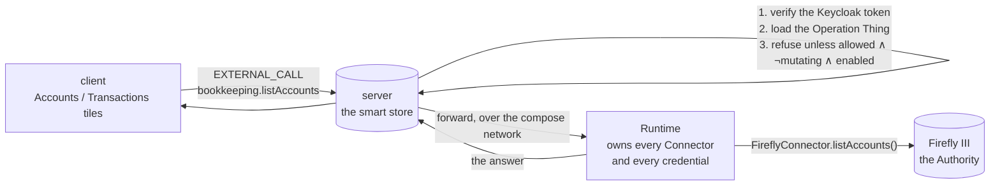

# Proposal — the books on the Dashboard, through the door that already exists

## What

Two things, and the second is the reusable one.

**1. The Dashboard gains a second row, and the tile that was only a door stops pretending to be a tile.**

| | What it becomes | Where clicking it goes |
|---|---|---|
| 💰 **Bookkeeping** | a **grey button**, not a tile: no body paragraph, no eleven-rem frame, no empty space where a number would go | Firefly III, in a new tab (unchanged) |
| 💳 **Transactions** | **new**, wide: the last ten **Bookings**, newest first — date, description, the two accounts, the amount | Firefly III, in a new tab |
| 🏦 **Accounts** | **new**: every **Bank Account** by name with its balance, and a total per currency | Firefly III, in a new tab |

**2. The client gains a way to ask for what only the Runtime can fetch — the External Call.**

One new JSON-RPC method on the server. The client names an Operation and its arguments; the server
authenticates the User, checks the Operation Thing it already stores, refuses anything that could
change the world, and forwards the call to the Runtime. The Runtime executes it through the Connector
it already has and returns the answer. **Nothing is stored anywhere on the way.**

Each component does only what it is already good at:

| Component | Contributes | Learns nothing about |
|---|---|---|
| **server** | authentication, being the single front door, and the **policy** — read out of the Operation Things it already holds | Firefly. No credential, no REST shape, no domain knowledge |
| **Runtime** | the Connector, the credential, the execution | the Dashboard. It answers a question; it does not know who asked |
| **client** | the tiles | any system but the server |

## Why

**The client asks the server; only the Runtime can reach outside.** That is the whole problem, and
this change is mostly about not solving it in one of the two tempting wrong ways.

*Not by teaching the server about Firefly.* The A12 server is a **smart store**: three hand-written
Java classes today, none of them domain-aware, everything else generated from the models. Giving it
Firefly's REST shape and Firefly's credential would make it the first component that is both a store
and an integration, and would need doing again for the bank, and again for email.

*Not by storing the answer as a Thing.* A `BookkeepingSnapshot` refreshed by the Runtime keeps every
boundary intact and was the obvious design — until you say out loud what it does: it copies the
household's bank balances and transaction history into the ThingStore's Postgres, and therefore into
its backups, its exports, its overviews and its write-ahead log. A dated snapshot is defensible on
Authority grounds and is still a duplicate of the most sensitive data in the system, held where
nothing needs it. **Bank statements do not belong in the document store.**

**So the answer is a route, not a copy.** The Runtime is already the door outward — every Connector
lives there, every external credential lives there, and translation between Things and foreign
representations is [defined to happen there and nowhere else](../../../README.md). What was missing
was not the ability to call Firefly; it was a way for the *browser* to ask the Runtime a question. So
that is what this adds, once, generically.

**The functions being called already exist and are already correct.** `bookkeeping.listAccounts`,
`bookkeeping.listTransactions` and `bookkeeping.getBalance` are Operations today, marked
`mutating: false`, projecting Firefly's answer into a shape a reader can use —
`projectTransactionGroup` already flattens splits and already trims a date to `yyyy-mm-dd`. The
Transactions tile consumes that projection **unchanged**. This change writes no new mapping code
against Firefly at all.

**And the gate is already data.** `Operation_DM` declares `Key`, `System`, `Kind`, `Mutating`,
`RequiresApproval` and `Enabled` as fields on a Thing ([ADR-0019](../../../docs/adr/0019-an-operation-is-a-thing.md)).
The server can therefore police the route by querying its own store — no Firefly knowledge, no
hard-coded list of what is safe, and the same catalogue the Assistants are governed by. That is what
makes this a small change rather than a large one.

**It is also the shape the system is growing into.** If Operations become user-authored — declared
by configuration, with real code in them — then a new read Operation becomes callable from the UI on
the day it is written, with no server change, no model and no endpoint. The two rejected designs
would each need repeating per external system; this one is built once.

## Scope

**In scope**

| Area | What changes |
|---|---|
| **Runtime — the inbox** | `runtime/src/inbound/` : a minimal `node:http` listener, one route, shared-secret authenticated, that executes an allowed Operation by name and returns its `OperationOutcome`. No framework. Bound to the compose network only, and it publishes no host port |
| **Runtime — the gate, again** | the inbox re-checks `mutating` and the allowlist itself. The server's check is the one that matters for a browser; this one is what makes the endpoint safe on its own terms, so a mistake on the server is not the only thing standing between a browser and `postTransaction` |
| **Runtime — one projection** | `bookkeeping.listAccounts` gains `currency` alongside `name`, `type` and `balance`. It is the one field the Accounts tile needs and the connector already reads; the Assistants benefit equally |
| **Server — the route** | a custom `@RemoteOperation(name: "EXTERNAL_CALL", group: "EXTERNAL_OPERATIONS", isMutation: false)` bean: verify (A12 does this at the controller), load the Operation Thing by `Key`, refuse unless **allowlisted ∧ `Mutating = false` ∧ `Enabled = true`**, forward to the Runtime, return the result. `EXTERNAL_OPERATIONS` added to `mgmtp.a12.dataservices.jsonRpc.allowedOperations` |
| **Server — config** | `assistants.runtime.url`, `assistants.runtime.shared-secret`, and `assistants.external-call.allowed` — the allowlist, which ships holding exactly the two Operations the Dashboard calls |
| **Compose** | the `runtime` service gains the shared secret and the inbox port on the internal network; the `server` service gains the URL and the same secret. No new published port anywhere |
| **Client — data** | `useExternalCall.ts` — one read-only hook over the new method, built on `JsonRpc2Request.build()` and the existing `ServerConnector`, with `useThingCounts`' four invariants plus a fifth |
| **Client — tiles** | `BookkeepingButton.tsx` replaces `BookkeepingTile.tsx` **(done)**; new `TransactionsTile.tsx` and `AccountsTile.tsx`; `DashboardTile.tsx` gains `variant` **(done)**; `money.ts` |
| **Models / App Model** | **no Document Model change.** `AssistantsAppModel_AM` gains a second row and two `VIEW_ADD`s |
| **Tests** | Runtime: the inbox's gate — allowlisted read passes, a mutating Operation is refused, an unknown name is refused, a bad secret is refused — in the existing vitest tier. Client: the hook and both tiles. e2e: six tiles, the button's shape, both tiles `ready`, and **a browser attempting `bookkeeping.postTransaction` and being refused** |
| **ADRs** | **ADR-0023 — the Runtime is the door outward**, amending [ADR-0011](../../../docs/adr/0011-the-runtime-polls-the-thingstore.md) rather than contradicting it |
| **Prose** | `specs/system/architecture.md` (the Runtime gains an inbound surface; the integration-surface sentence is corrected), `functional.md`, `README.md`, `DECISIONS.md` |

**Out of scope, deliberately**

- **No write path, at any layer.** The route refuses `Mutating = true` twice, on two machines. Money
  moves through an Operation, in a Conversation, behind an approval
  ([ADR-0018](../../../docs/adr/0018-an-operation-may-require-an-approval.md)) — and the single most
  important property of this change is that opening a read route does not open a write one.
- **No open route.** `Mutating = false` is necessary and not sufficient: it means *does not change the
  world*, which is not the same as *safe for a browser to invoke at will*. An LLM-touching Operation
  is non-mutating and costs money to call. So the allowlist is a real, separate control, it ships with
  exactly two entries, and widening it is a decision each time.
- **No credential on the server.** It holds a shared secret for the Runtime and nothing else. It
  cannot reach Firefly if it tries.
- **No Thing, no Model, no field, no cache.** Not a `BookkeepingSnapshot`, not an `Account_DM`, not a
  balance on an Invoice. Nothing about the household's money is written to Postgres by this change.
- **No polling.** Read on mount; each tile states its read instant; leaving and returning re-reads.
- **No general proxy of arbitrary Operations to arbitrary callers.** One method, one shape, and the
  catalogue decides what it may name.
- **No cross-currency total.** One line per currency, no grand total — the same refusal the connector
  already makes on the write side, where converting would silently store the wrong number.
- **No liabilities or open items on the Accounts tile.** "Our bank accounts" is Firefly's `asset` type.
  Open items are a different question and a different tile that this change does not invent.
- **No localisation.** English literals, as everywhere else on the Dashboard.

## Expected outcome

The User opens the application and sees six tiles. The top row is unchanged except at its right-hand
end, which is now a short grey **💰 Bookkeeping ↗** — plainly a control. Underneath, the last ten
bookings and the accounts with their balances, each footed with the instant it was read.

Nothing about those numbers exists anywhere but Firefly. Stop the Runtime and the two tiles grey out,
which is the honest answer to *"what do the books say?"* when the only component that can ask is down.

Acceptance, as the tiers will put it:

- Six tiles, in the order `conversations`, `documents`, `assistants`, `bookkeeping`, `transactions`,
  `accounts`.
- The bookkeeping control carries `data-variant="button"` and has no headline, body or footer.
- Both new tiles reach `data-state="ready"` against the live stack.
- The accounts tile lists the demo household's asset accounts with parseable amounts and exactly one
  total line per currency.
- The transactions tile shows at most ten rows.
- After the invoice slice books an invoice, that booking's description appears in the transactions tile.
- **A browser calling `EXTERNAL_CALL` with `bookkeeping.postTransaction` is refused** — asserted in
  e2e, and again in the Runtime's own unit tier.
- **A browser calling `EXTERNAL_CALL` with a non-mutating Operation that is not allowlisted is refused.**
- `EXTERNAL_CALL` without a bearer token is a 401.
- With the Runtime stopped, both tiles show their error line and the other four still render.

## Risks

| Risk | Why it might bite | What we do about it |
|---|---|---|
| **The route becomes a tunnel to the write path** | This is the one that matters. A browser reaching `bookkeeping.postTransaction` would route money around the approval machinery that the whole system's safety claim rests on | Refused **twice, on two machines**, against Thing data rather than a constant: the server checks allowlist ∧ `¬Mutating` ∧ `Enabled` before forwarding, and the Runtime's inbox checks the same before executing. Both refusals are tested, and the e2e tier attempts the attack rather than asserting the guard exists |
| `Mutating = false` read as "safe" | It means *changes nothing*, not *cheap* or *non-leaking*. `assistant.call` and the LLM-touching Operations are non-mutating and cost money per call | The allowlist is a separate control and ships with two entries. Widening it is a deliberate act, and the two checks are `and`ed, never `or`ed |
| The Runtime gains an inbox, against ADR-0011 | ADR-0011 says the Runtime offers no API and receives no calls, and it is load-bearing | ADR-0023 amends it explicitly. The argument ADR-0011 actually makes is about **pending work** — "is there anything to do?" is the store's question — and about durable live state. A synchronous read holds neither. The Runtime still receives nothing about pending work, and still polls for all of it |
| The Dashboard now depends on the Runtime being up | One replica ([ADR-0014](../../../docs/adr/0014-exactly-one-runtime-replica.md)), running a two-second scan loop. A wedged Runtime takes two tiles with it | Timeouts on both hops, well under the connector's own twenty seconds, and tiles that fail soft — which they already do. Two grey tiles is the correct rendering of "the door outward is shut" |
| The inbox blocks the scan loop | Node is single-threaded; a slow handler competes with the loop that is the Runtime's actual job | The handler is `async` and does no CPU work — it awaits a Connector call. Bounded concurrency and a short timeout, and the scan loop's own health check is what would surface it |
| A shared secret is weak authentication | It is a bearer token in an environment variable | It is generated by `scripts/setup-env.mjs` like every other machine credential, the inbox publishes no host port, and the Runtime is reachable only from inside the compose network. The browser's own authentication is Keycloak, at the server, which is the boundary that faces the world |
| `@RemoteOperation` is undocumented | It is public API by package placement and mgm ship Workflows on it, but the customer docs do not describe it | A `@RestController` is the fallback and is proven working here — phase A got 401 unauthenticated and 200 with a token. It is a surface swap, not a redesign: same component, same policy, same ADR. Worth a word with mgm before committing |
| The transactions tile's promise weakens | `bookkeeping.listTransactions` requires `start` and `end`; there is no "just the last ten" | The tile asks for a window — ninety days — and says so. *"The last ten bookings in the last ninety days"* is an honest sentence; *"the last ten"* over an unbounded past is not what the Operation offers |
| The demo data cannot prove ordering | Measured: 21 of the household's 24 transactions share the date `2026-08-01`, and every group has exactly one split | The ordering and flattening assertions move to the Runtime's unit tier with hand-built fixtures. e2e asserts what e2e can honestly assert — the row cap, the shapes, and the refusals |

## The decision worth recording

> **ADR-0023 — the Runtime is the door outward.** Every external system this application talks to is
> reached through a Connector in the Runtime, and that stays true when the *client* is the one who
> wants the answer. The Runtime therefore accepts one kind of inbound call: execute a named Operation
> that the Operation catalogue marks non-mutating and that an explicit allowlist permits, and return
> its result. The answer is not stored — not as a Thing, not in a cache, not in the server.
>
> This amends [ADR-0011](../../../docs/adr/0011-the-runtime-polls-the-thingstore.md), which refused
> the Runtime an API. That refusal was about **pending work**: the ThingStore is the Authority for
> what is waiting, so "is there anything to do?" may only be asked of the store, and an API would
> hold the live state [ADR-0004](../../../docs/adr/0004-assistants-suspend-and-resume.md) removes. A
> synchronous read of a foreign system is neither. Everything about pending work still goes through
> the store, and the Runtime still polls for all of it.
>
> The alternative that looks cheaper and is not: storing the answer as a Thing. It keeps every
> boundary and puts the household's bank balances and transaction history into the document store's
> backups and exports, where nothing needs them. Foreign data is routed, not copied.
