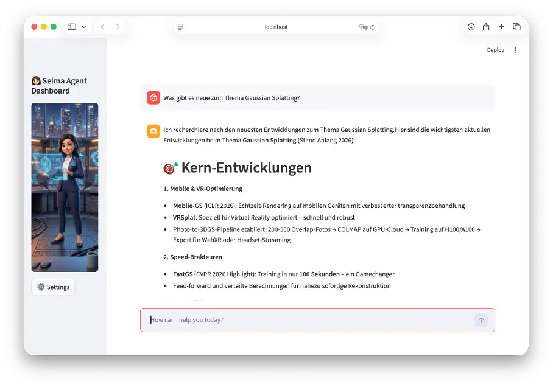
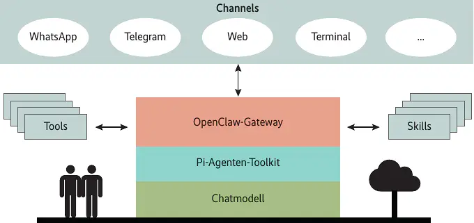
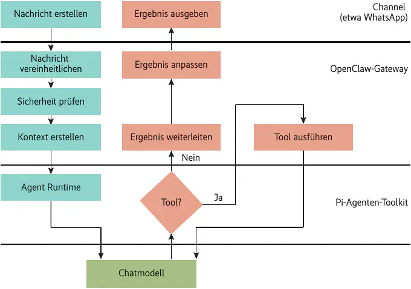
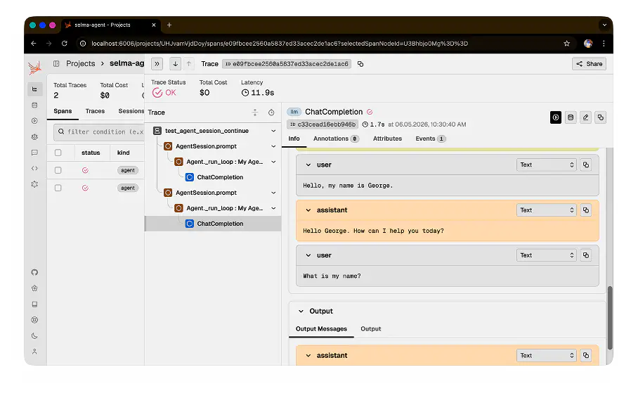
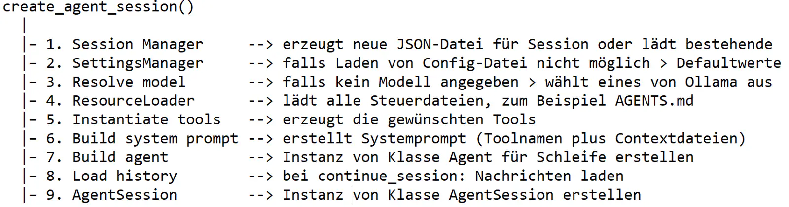

# KI-Agenten verstehen: OpenClaw selbst gebaut

Der KI-Assistent OpenClaw zeigt schnell, was er kann. Ein Weg, die ausgefeilte Architektur zu begreifen, ist die Nachbildung der Kernkonzepte in Python.

OpenClaw ist ein freier, lokal laufender persönlicher KI-Agent mit unterschiedlichen Inputkanälen, proaktivem Vorgehen und einer Hubarchitektur als Knotenpunkt. Um die Architektur zu begreifen, lohnt ein Nachbau von OpenClaw in Python.

Hierzu erstellt der Artikel in Python einen einfachen KI-Agenten namens Selma, der einige der OpenClaw-Kernkonzepte verwendet. Schritt für Schritt entsteht eine ähnliche Architektur mit den Bausteinen, die auch in OpenClaw stecken: eine Kommunikation mit einem Chatmodell, ein Messaginginterface, Tools und ein autonomer Heartbeat-Loop.

Das Besondere: Selma läuft vollständig lokal – ohne Cloud-Abo, API-Key-Zwang oder Daten auf fremden Servern. In Kombination mit Ollama und gängigen Python-Modulen erhält man einen Agenten, der proaktiv sucht, liest, filtert und vieles mehr. Und wer dabei das Design der Softwarearchitektur verfolgt, versteht am Ende nicht nur Selma, sondern auch die Prinzipien, die hinter OpenClaw stecken.



OpenClaw von Peter Steinberger ist ein gut gemachtes Stück Software nach den Prinzipien des modernen Softwareengineerings. Ein zentraler Baustein, das Gateway, steuert alle Abläufe des Agenten. Diese Idee vereinfacht vieles und umgeht die meisten Probleme, die durch das gleichzeitige Ausführen mehrerer Prozesse entstehen könnten.

## Die Funktionen im Überblick

OpenClaw kombiniert die verschiedenen Inputquellen, die Werkzeuge, die der Agent nutzen kann, und das selbstständige, proaktive Vorgehen des Agenten:

Gatewayarchitektur (Single Control Plane): Das Gateway vereinheitlicht alle Kanäle. Ein zentraler Prozess übernimmt Routing, Authentifizierung und Sessionmanagement. Dadurch wird der Agent nie direkt dem User-Input ausgesetzt.
Multi-Channel-Inbox (Channel Abstraction): WhatsApp, Telegram, Slack und andere Messenger kommen in unterschiedlichen Formaten an, der Channel Manager normalisiert alles in eine einheitliche interne Struktur.
Heartbeat und proaktiver Scheduler: Ein Heartbeat-Daemon weckt den Agenten in konfigurierbaren Intervallen, sodass er handeln kann, ohne angesprochen zu werden. Das ist das entscheidende Feature, damit der Agent nicht nur auf Fragen des Anwenders reagiert, sondern selbst aktiv handelt.
Skill-System: Zusätzliche Fähigkeiten sind in Markdown-Dateien definiert, nicht in kompiliertem Code; der Agent liest sie zur Laufzeit. Sie lassen sich im laufenden Betrieb installieren und es gibt über hundert Community-Skills.
Runs on your Machine heißt: lokaler Prozess, unabhängig vom Chatmodell.
Persistent Memory: Der Agent erinnert sich an ältere Gesprächsinhalte. Dadurch kann er gezielter auf die Interessen des Anwenders eingehen.
Werkzeuge und Browser Control: Dem Agenten stehen verschiedene Werkzeuge zur Verfügung, mit denen er unter anderem im Web browsen, Formulare ausfüllen oder Daten extrahieren kann.
Full System Access: Falls gewünscht, kann man OpenClaw vollständigen Zugriff auf den eigenen Rechner gewähren. Dadurch liest und schreibt es Dateien oder führt Betriebssystemkommandos und Skripte aus.

## Die Kernkomponenten der Architektur

Wenn man die Architektur von OpenClaw mit einem Gebäude vergleicht, befindet sich im Erdgeschoss das Chatmodell. Dabei spielt es keine Rolle, ob das ChatGPT, Gemini, Claude oder ein anderes ist. Es ist lediglich der KI-Baustein, der die Prompts von OpenClaw erhält und das Ergebnis zurückgibt.



Gleich darüber, im ersten Stock, befindet sich das KI-Agenten-Toolkit Pi. Es wandelt die Anfrage des Anwenders so um, dass sie zur API des verwendeten Chatmodells passt. Des Weiteren merkt es sich den Inhalt des bisherigen Gesprächsverlaufs (Session). OpenClaw verwendet Pi von Mario Zechner, da es klar strukturierte Bausteine liefert, aus denen man seinen eigenen Agenten bauen kann.

Im zweiten Stockwerk residiert das Gateway. Es kümmert sich um die Infrastruktur, führt Programme aus, sorgt für Sicherheit und wickelt die Kommunikation mit dem Anwender ab. Nutzer und Gateway tauschen sich über verschiedene Kanäle (Channels) aus: via Web, Terminal oder Messengerdienste wie WhatsApp und Telegram. Sie liefern Anfragen an und bringen die Ergebnisse zurück.

## Stationen einer Nachricht

Wie sieht die Verarbeitung eines Prompts aus, den der Anwender beispielsweise über WhatsApp stellt? Als Erstes kommt die Nachricht beim OpenClaw-Gateway an, das alle Kanäle ständig liest und möglichst schnell darauf antwortet.



Da jeder Kanal und jeder Hersteller sein eigenes Format für Nachrichten hat, vereinheitlicht das Gateway sie, um die weiteren Schritte einfach zu gestalten. Danach prüft es, was ein Kanal darf, und sucht den Kontext zur Kommunikation. Der enthält den Inhalt der letzten Unterhaltung und weitere Informationen.

Das Paket geht weiter zur Pi Agent Runtime. Sie bringt das Paket in die passende Form für die API des gewählten Chatmodells und ruft das Modell auf. Das Chatmodell gibt die Antwort zurück oder alternativ eine Anfrage, ob es ein bestimmtes Tool nutzen darf, beispielsweise um etwas im Internet nachzusehen oder eine Datei auf der Platte zu verändern. Das Gateway führt die Toolanfrage aus, falls die Sicherheitsrichtlinien des Anwenders es zulassen.

Das Ergebnis der Ausführung bekommt wieder das Chatmodell. Liefert das Chatmodell eine endgültige Antwort, wandelt das Gateway sie in die Form um, die der Kanal (etwa WhatsApp) versteht. Er gibt das Ergebnis an den Anwender aus.

## Im Erdgeschoss das Chatmodell

Eine der Besonderheiten von OpenClaw ist, dass alles auf dem eigenen Rechner läuft. Eine Ausnahme bilden die Chatmodelle, mit denen es zusammenarbeitet. Der derzeitige Favorit dürfte Claude von Anthropic sein, was einige Kosten verursacht. Man kann aber auch mit lokalen Modellen arbeiten.

Um den Beispielagenten Selma einfach und kostenfrei zu gestalten, lässt man ihn mit kostenlosen Chatmodellen und Ollama arbeiten. Hierzu installiert man Ollama auf dem eigenen Rechner. Es läuft auf Windows, Linux und macOS. Die Ollama-Webseite zeigt die derzeit verfügbaren Chatmodelle. Gemma 4 und Qwen3.5 haben sich als verlässliche Chatmodelle für Selma herausgestellt. Welches Modell man auswählt, hängt von der Leistung des Rechners ab. Wenn eines der großen Modelle nicht performant auf der eigenen Hardware läuft, probiert man ein anderes aus. Der Befehl

```bash
ollama pull gemma4
```
lädt Gemma 4 auf den eigenen Rechner.

Als Schnittstelle zwischen Python und Ollama hat sich die API von OpenAI bewährt, sie ist einfach und ausgereift. Ollama verhält sich dabei wie ein OpenAI-Server. Die Kommunikation mit dem Chatmodell besteht aus drei Schritten. Zunächst wird der asynchrone Client erzeugt.

```python
from openai import AsyncOpenAI

client = AsyncOpenAI(
    base_url="http://localhost:11434/v1"
    api_key="ollama",
)
```

Ein Großteil der Kommunikation in Agent Selma läuft asynchron, was die beste Art ist, um die beim Austausch von Nachrichten über das Web entstehenden Wartezeiten produktiv zu nutzen. Die base_url verweist auf den lokalen Ollama-Server und nicht auf den Rechner von OpenAI.

Die Methode create schickt die Anfrage des Anwenders zum Chatmodell. Das Argument messages ist eine Liste der bisher stattgefundenen Unterhaltung, an deren Ende der aktuelle Prompt steht. Mit dem Parameter tools bekommt das Chatmodell eine Liste der Werkzeuge, die es verwenden kann.

```python
stream = await client.chat.completions.create(
    model="gemma4",
    messages=openai_messages,
    tools=openai_tools,
    stream=True,
)
```

Da der Agent nicht warten möchte, bis die Antwort fertig ist (stream=True), erzeugt die Methode create einen Stream, der die fertigen Teile häppchenweise (chunk) zurückliefert:

```python
async for chunk in stream:
    delta = chunk.choices[0].delta
```

Im Vergleich zu OpenClaw mit circa 350.000 Programmzeilen ist Selma mit etwa 2.500 Zeilen klein, aber trotzdem zu groß, um den Quelltext komplett im Artikel unterzubringen. Das komplette Programm findet sich auf [https://github.com/gkvoelkl/python-selma](GitHub).

## Erster Stock: Pi-Agenten-Toolkit

OpenClaw verwendet von Pi zwei zentrale Klassen: Agent für die direkte Kommunikation mit dem Chatmodell und AgentSession, die zusätzlich das Management der bisherigen Unterhaltung (Session) übernimmt. Im Modul my_mono findet sich der Nachbau von Pi für Selma.

Der wesentliche Kern der Klasse Agent ist eine einfache Schleife (_run_loop), die den aktuellen Prompt übermittelt. Liefert das Chatmodell eine Antwort für den Anwender, endet die Schleife. Wenn das Chatmodell ein Tool ausführt, bleibt es in der Schleife.

```python
class Agent:
...

    def prompt(self, message: UserMessage) -> asyncio.Task:
        if self._state.is_streaming:
            raise RuntimeError("Agent is already running")
        self._state.messages.append(message)
        self._emit("prompt", message)
        return asyncio.create_task(self._run_loop())

    def subscribe(self, listener: Callable[[AgentEvent], None]) -> Callable:
        self._subscribers.append(listener)
        return lambda: self._subscribers.remove(listener)

    async def _run_loop(self) -> None:

        self._state.is_streaming = True
        self._emit("agent_start")
        turn = 0

        openai_tools = self._to_openai_tools()

        try:
            while True:
                openai_messages = self._to_openai_messages(messages)
                self._emit("turn_start")
                stream = await self._client.chat.completions.create( …)
                async for chunk in stream:
                    delta = chunk.choices[0].delta

                    if delta.content:
                        text_parts.append(delta.content)

                    if delta.tool_calls:
                        #Infos in tool_call_accumulators zusammenfassen

                if not tool_call_accumulators: # Textanwort
                    assistant_msg = AssistantMessage(content=final_text or None)
                    self._state.messages.append(assistant_msg)
                    self._emit("message_end", assistant_msg)
                    break

                # Alle Tools ausführen
                for tc in tool_calls:
                    result_content = await self._execute_tool(tc)

                    self._state.messages.append(ToolResultMessage(
                        tool_call_id=tc.id,
                        content=result_content,
                    ))

                turn += 1
``` 

Jede API für das Chatmodell verwendet einen unterschiedlichen Aufbau für übertragene Nachrichten oder für die Beschreibung der Tools. Die Methode convertToLLM beispielsweise konvertiert die interne Datenstruktur in die vom Chatmodell verwendete. Das Prinzip, allgemeingültige interne Datenstrukturen in herstellerabhängige zu konvertieren und umgekehrt, zieht sich durch die gesamte Architektur. OpenClaw ist dadurch unabhängig und einfach erweiterbar.

Neben der Schleife besitzt die Klasse Agent als zweite wesentliche Eigenschaft ein einfach zu verwendendes Eventsystem:

```python
agent.subscribe(on_event)
```

Mit der Methode subscribe kann sich jede andere Methode oder Funktion (hier die Funktion on_event) Informationen in Echtzeit von der Klasse Agent holen, ohne sie verändern zu müssen. Das Event message_end erscheint, wenn das Streaming vom Chatmodell abgeschlossen und die endgültige Antwort vorhanden ist:

```python
def on_event(event):
    if event.type == "message_end":
        print(f"Antwort: {event.payload}")
``` 

In einem Agenten können mehrere Programmstränge gleichzeitig stattfinden, was zu Problemen führen kann. Die Fehler sind schwer nachzuvollziehen. Daher ist es sinnvoll, dass bestimmte Abläufe – etwa die Kommunikation mit dem Chatmodell (Methode prompt) – nicht parallel stattfinden. Die Methode prompt steuert das über das Flag is_streaming, das sie zu Beginn der Ausführung setzt. Ist es bereits aktiviert, führt ein erneuter Aufruf zu einem Laufzeitfehler.

Im Vergleich zur Selma-Version my_mono besitzt das Original Pi zwei weitere Methoden, mit denen man den Ablauf der zentralen Schleife steuern kann:

steer() unterbricht nach dem aktuellen Tool und überspringt die restlichen Schritte. Anwender nutzen die Methode, wenn ihnen die Wartezeit zu lang ist.
followUp() wartet, bis der Agent alles andere erledigt hat.
Das Testprogramm test_agent.py erzeugt ein Objekt der Klasse Agent und fragt, welche Dateien sich im aktuellen Verzeichnis befinden.

```python
from my_mono.tracing import setup; setup() # OTel activated

import asyncio
import logging
import colorama
from colorama import Fore, Style
from my_mono.agent import Agent, AgentOptions, UserMessage
from my_mono.tools import create_read_only_tools
from my_mono.test_helper import setup_logger
from my_mono.tracing import tracer

colorama.init()

logging.basicConfig(level=logging.WARNING)
setup_logger("my_mono.agent")

MODEL_NAME = "gemma4"

tools = create_read_only_tools(cwd=".")

agent = Agent(AgentOptions(
    model=MODEL_NAME,
    system_prompt="You are a helpful assistant.",
    tools=tools,
))

def on_event(event):
    match event.type:
        case "message_end":
            print(Fore.BLUE + (event.payload.content or "") + Style.RESET_ALL,
                end="", flush=True)
        case "agent_end":
            print()

agent.subscribe(on_event)

@tracer.agent(name="test_agent")
async def main():
    print("Test: List and read a file")
    await agent.prompt(UserMessage(content="List the current directory and read the README.md if it exists."))

if __name__ == "__main__":
    asyncio.run(main())
```

Um zu sehen, wie die Programme ablaufen, sendet Selma während der Laufzeit aktuelle Informationen an einen lokalen Server (OpenTelemetry).

## Agentenkommunikation mit OpenTelemetry

Bei komplexeren Systemen wie Agent Selma ist es notwendig, den Programmablauf verfolgen zu können. OpenTelemetry (OTel) ist ein offener Standard der Cloud Native Computing Foundation (CNCF), um Loginformationen an einen Server zu schicken. Er vereinheitlicht, wie Anwendungen Telemetriedaten erzeugen, sammeln und exportieren – unabhängig von der Programmiersprache. OpenTelemetry stützt sich auf folgende Telemetriedaten:

Span ist die kleinste Einheit eines Trace. Jeder Funktionsaufruf und jeder LLM-Call wird als Span dargestellt.
Trace ist eine Sammlung von Spans, die zusammen den Ablauf einer Anfrage beschreiben.
Tracer Provider konfiguriert, wie sich Spans sammeln und exportieren lassen.
Da OpenTelemetry für alle möglichen Programme einsetzbar ist, hat Arize Phoenix aufgebaut, eine Open-Source-Plattform speziell für LLM-Anwendungen. Sie läuft lokal, benötigt keine Cloud-Anbindung und startet mit einem einzigen Befehl. Mit dem Werkzeug pip ist sie schnell installiert:

```bash
pip install arize-phoenix
```

Phoenix lässt sich direkt aus dem Programm starten:

```python
import phoenix as px; px.launch_app()
```

oder separat im Terminal:

```bash
python -m phoenix.server.mainserve
```

Die Oberfläche erreicht man im Browser unter http://localhost:6006. Phoenix speichert alle Traces in einer lokalen SQLite-Datenbank. Sie bleiben auch nach einem Neustart erhalten.



Der offene Standard OpenInference von Arize erweitert OpenTelemetry um KI-spezifische Konventionen. Er definiert, welche Attribute ein LLM-Span haben soll, welche Span-Typen es gibt und wie sich Prompts und Antworten strukturieren lassen.

OpenInference-Decorators und ihre Span-Typen
Decorator	Typ	Verwendung
@trace_agent	Agent	Einstiegspunkt, steuert den Gesamtablauf
@trace_chain	Chain	Orchestrierung, Schleifen, Verbindungslogik
@trace_tool	Tool	einzelne Aktionen, API-Calls, Datenbankabfragen
automatisch	LLM	LLM-Calls via OpenAI Instrumentor
automatisch	Retriever	Vektordatenbankabfragen

OpenInference integriert automatisch APIs, etwa die von OpenAI und Ollama (OpenAI-kompatibel), über Instrumentierungsbibliotheken wie openinference-instrumentation-openai. Die Pakete sind per pip install installierbar.

Python-Paket	Beschreibung
arize-phoenix	lokale Observability-Plattform für LLM-Agenten
opentelemetry-sdk	Basisimplementierung des OpenTelemetry-Standards; stellt Tracer, Spans und Weiteres bereit und bildet das Fundament für alle Tracing-Funktionen
openinference-instrumentation	stellt die KI-spezifischen Decorators @trace_agent, @trace_chain und @trace_tool sowie die semantischen Konventionen für LLM-Spans bereit
openinference-instrumentation-openai	Autoinstrumentierung speziell für OpenAI; fängt automatisch alle client.chat.completions.create()-Aufrufe ab und erzeugt daraus vollständige LLM-Spans mit Prompt, Antwort und Tokenanzahl

```python
import phoenix as px
from phoenix.otel import register
from openinference.instrumentation import trace_agent, trace_chain, trace_tool
from openinference.instrumentation.openai import OpenAIInstrumentor

# Tracer registrieren
register(project_name='mein-agent')

# OpenAI automatisch instrumentieren
OpenAIInstrumentor().instrument()
```

Der einfachste Weg, das Tracing in eigenen Python-Code zu integrieren, sind die Decorators von OpenInference. Sie fügen automatisch einen Span hinzu, ohne dass man die Funktion ändern muss.

```python
@trace_agent
def main():
    ergebnisse = ebene_a('Erkläre das Wetter')
    ...

@trace_chain
def ebene_a(benutzereingabe: str) -> list[str]:
    return [ebene_b(i, benutzereingabe) for i in range(1, 5)]

@trace_chain
def ebene_b(iteration: int, eingabe: str) -> str:
    antwort = ollama_client.chat.completions.create(...)
    return antwort.choices[0].message.content
```

Man kann auch zusätzliche Informationen ergänzen:

```python
span = trace.get_current_span()
span.set_attribute("Zusätzlich", iteration)
```

## Das Sessionmanagement von Pi

Die Klasse AgentSession kapselt die Klasse Agent, um sie mit Sessionpersistenz, Compaction und einigen anderen für diesen Artikel nicht relevanten Eigenschaften zu erweitern. Die Sessionpersistenz speichert die Unterhaltung mit einem Chatmodell. AgentSession gibt den Dialog bei jeder Anfrage mit, damit das Chatmodell weiß, was bisher besprochen wurde. Bei jeder Anfrage kommt diese selbst und die Antwort zur Aufzeichnung der Session hinzu. Dadurch wird die Sessioninformation immer größer, bis die maximale Größe einer Anfrage erreicht ist.

Damit die Informationen zur bisherigen Unterhaltung weiter beim Chatmodell präsent sind, fasst die Klasse AgentSession sie zu einer kurzen Inhaltsangabe (Compaction) zusammen. Das geschieht durch eine Anfrage an ein Chatmodell „Fasse diesen Dialog zusammen: …“. Danach überträgt AgentSession immer die Zusammenfassung und die ab diesem Zeitpunkt erfolgte Unterhaltung.

Die Instanz von AgentSession enthält im Kern nur zwei Dinge: einen Schreiber (jede Nachricht sofort auf Disk speichern) und einen Leser (bei jeder Anfrage die Unterhaltung – Kontext – aus den Dateien lesen). Die Funktion create_agent_session erzeugt eine neue Instanz von AgentSession:

```python
session = await create_agent_session(CreateSessionOptions(
    model=MODEL_NAME,
    tools=create_read_only_tools(cwd="."),
))
```

Sie ist eine Factory Function, die in einer festgelegten Reihenfolge alle Einzelteile zu einem passenden Objekt vom Typ AgentSession verdrahtet. Der Vorteil: Jeder Bestandteil lässt sich durch eine eigene, veränderte Version ersetzen.



Ein zentrales Objekt ist SessionManager, das die Gesprächsverläufe in JSONL-Dateien (JSON Lines) speichert. Jede Zeile ist ein JSON-Objekt mit einem Feld type. Abhängig vom Typ kommen weitere Felder hinzu. Jeder Eintrag hat eine Spalte id und eine Spalte parent_id, die zusammen eine Baumstruktur bilden. Der aktive Gesprächsstrang ist der Pfad vom aktuellen Blatt bis zur Wurzel.

Einträge in einer Session-Datei
Typ	zusätzliche Felder	Zweck
session	model, system_prompt	erster Eintrag, Metadaten der Session
message	role (user/assistant/tool), content, tool_calls, tool_call_id	jede Nachricht im Chat
compaction	summary, tokens_before	ersetzt ältere Nachrichten, indem es sie zusammenfasst
model_change	model	protokolliert Modellwechsel


Bei einer JSON-Datei ist die gesamte Datei ein Objekt, bei einer JSONL-Datei hingegen jede Zeile.

Listing: Vereinfachtes Beispiel einer JSONL-Session-Datei aus (.my_mono/sessions/<id>.jsonl)

```python
{"type":"session","id":"a1b2","parent_id":null,"timestamp":"...","model":"Llama3.2","system_prompt":"..."}
{"type":"message","id":"c3d4","parent_id":"a1b2","timestamp":"...","role":"user","content":"Hallo"}
{"type":"message","id":"e5f6","parent_id":"c3d4","timestamp":"...","role":"assistant","content":"Hi!","tool_calls":null}
{"type":"compaction","id":"g7h8","parent_id":"e5f6","timestamp":"...","summary":"User sagte Hallo...","tokens_before":1200}
```

Eine neue Zeile anzuhängen, ist trivial: Die Datei muss nicht eingelesen, geparst und neu geschrieben werden. Außerdem kann man eine JSONL-Datei zeilenweise lesen, ohne sie komplett im Speicher zu halten, was wichtig bei langen Sessions ist. Möglich ist auch, dass mehrere Prozesse gleichzeitig lesen, da jede Zeile ein eigenes Element ist (atomar). Daher setzt sich JSONL immer mehr bei Logs, Eventstreams und wachsenden Gesprächshistorien durch. Im hier gezeigten SessionManager ist die Spalte parent_id immer die id des unmittelbar zuvor geschriebenen Eintrags, also strikt sequenziell.

Ein echter Baum würde entstehen, wenn man die aktuelle Zeile mit einer älteren verknüpft und danach weiterschreibt, dann gabelt sich die JSONL-Datei. Das Original Pi nutzt das aktiv (branch(id)); bei my-mono und Agent Selma ist es nicht implementiert.

Das folgende Listing stellt unter Verwendung eines AgentSession-Objekts die Anfrage „What files are in the current directory?“; es ist die gleiche wie in dem Listing „Agent erstellen und nach Dateien fragen“, nur mit dem Agent-Objekt. In OpenTelemetry lässt sich der Unterschied in der Verarbeitung erkennen.

```python
import asyncio
from my_mono.agent_session import create_agent_session, CreateSessionOptions
from my_mono.test_helper import setup_logger
from my_mono.tools import create_read_only_tools

MODEL_NAME = "gemma4"

async def main():
    session = await create_agent_session(CreateSessionOptions(
        model=MODEL_NAME,
        tools=create_read_only_tools(cwd="."),
    ))

    def on_event(event):
        if event.type == "message_update":
            print(event.payload, end="", flush=True)
        elif event.type == "agent_end":
            print()

    session.subscribe(on_event)

    await session.prompt("What files are in the current directory?")

    print()
    for msg in session.state.messages:
        print(msg.model_dump())
    print()

if __name__ == "__main__":
    asyncio.run(main())
```

Nun sind die ersten beiden Stockwerke des Agenten Selma fertig und das Zusammenwirken von Pi und Chatmodell erläutert.

