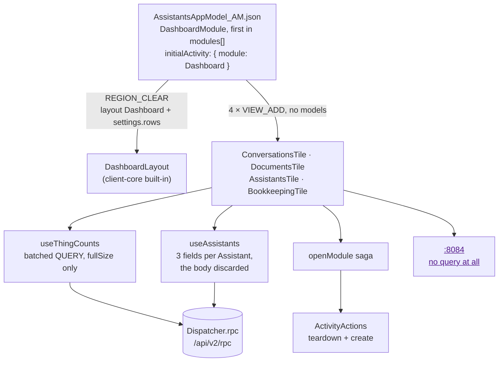
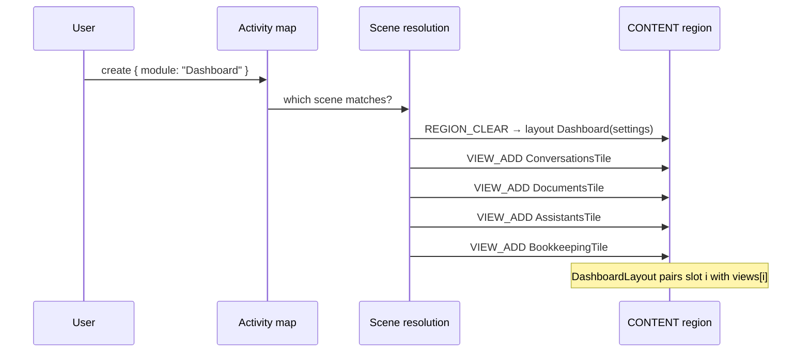
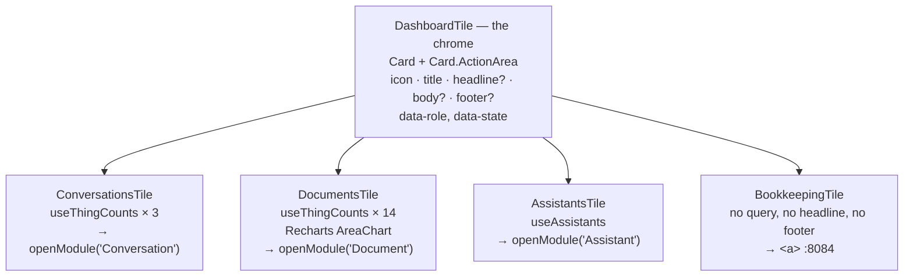

# Architecture — how the Dashboard is built

The what and why are in [proposal.md](proposal.md); the new vocabulary is in [domain.md](domain.md).
The system's standing architecture is [specs/system/architecture.md](../../system/architecture.md).
Spelling is British English.

## Shape

Everything is in `client/` and in one App Model file. **No Document Model changes, no server change,
no Runtime change.** The Runtime does not know the UI exists and this change does not teach it.



## The three seams

The previous change named three client seams and said *"There is no custom client code beyond these
two."* This change adds two more and reuses the third, and it is worth saying which is which, because
all of them are platform seams — nothing is forked and no engine is replaced.

| Seam | What it is | Where |
|---|---|---|
| **A region layout, chosen by name** | `REGION_CLEAR` with `layout: { name: "Dashboard", settings: { rows: […] } }`. `DefaultLayoutProvider` in client-core resolves `"Dashboard"` with no registration — it is a built-in beside `MasterDetail`, `Stack` and `Null`. `DashboardLayout` renders `settings.rows` as a widget grid and fills each leaf column with `views[i++]`, each inside its own error boundary | `import/models/AssistantsAppModel_AM.json` |
| **A view with no model** | `Directive.Add.models` is optional and `View.modelDescriptors` is optional, so a `VIEW_ADD` may name a component and load nothing. Four of them, registered with `addView` exactly as the four engines are. Each Tile is a plain React component that gets `View` props and fetches its own numbers | `client/src/components/dashboard/dashboardViewMap.tsx`, `client/src/appsetup.ts` |
| **A count by query** | `QueryJsonRpc2Request` — `method: "QUERY"` — through the same `Dispatcher.rpc` promise API `useThingById` already uses. The only field read from the response is `fullSize`; `entries` is discarded | `client/src/components/dashboard/useThingCounts.ts` |
| **Cross-module navigation** *(reused, generalised)* | `openForeignForm`'s teardown-and-open recipe, minus the detail push, since a Tile opens a module and not a form | `client/src/sagas/openModule.ts` |

### One activity, four views

Worth stating because the obvious reading is wrong. The scene matched by `{ module: "Dashboard" }`
belongs to **one** activity; its four `VIEW_ADD` directives give that one activity four views. So:

- the menu's *active* highlight works — it compares `topLevelActivities`' descriptors against
  `menu.initialActivity.descriptor`, and there is exactly one to compare;
- `openModule`'s teardown cancels **one** activity, not four;
- there is one dirty-handling veto point, and a Dashboard has nothing dirty, so it always completes.



**Slot pairing is positional.** `DashboardLayout` walks the settings' rows and columns and consumes
`views[currentView++]` at each leaf. The order of the `VIEW_ADD` directives *is* the layout. There is
no naming mechanism on offer; the dashboard e2e spec asserts which Tile is first so that a reordering
is caught rather than merely noticed.

## The App Model change

```jsonc
// content.modules[0] — first, so it is the first menu entry (MainMenu maps modules in order)
{
  "name": "DashboardModule",
  "menu": {
    "name": "Dashboard",
    "label": [ { "locale": "en", "text": "Dashboard" }, { "locale": "de", "text": "Dashboard" } ],
    "initialActivity": { "descriptor": { "module": "Dashboard" } }
  },
  "flows": [ { "name": "DashboardFlow", "scenes": [ {
    "name": "DashboardOverview",
    "matchConditions": [ { "key": "module", "mustEqual": "Dashboard" } ],
    "sceneChange": { "onEnter": [
      { "type": "REGION_CLEAR", "layout": { "name": "Dashboard", "settings": { "rows": [
          { "columns": [ { "width": { "sm": 12, "md": 6, "lg": 3 } },
                         { "width": { "sm": 12, "md": 6, "lg": 3 } },
                         { "width": { "sm": 12, "md": 6, "lg": 3 } },
                         { "width": { "sm": 12, "md": 6, "lg": 3 } } ] }
      ] } } },
      { "type": "VIEW_ADD", "name": "ConversationsTile" },
      { "type": "VIEW_ADD", "name": "DocumentsTile" },
      { "type": "VIEW_ADD", "name": "AssistantsTile" },
      { "type": "VIEW_ADD", "name": "BookkeepingTile" }
    ] }
  } ] } ]
}
```

and `content.initialActivity.descriptor.module` changes from `"Conversation"` to `"Dashboard"`.

Three details are deliberate:

- **No `instance` match condition.** Every other module has two scenes because it has an overview and
  a form. The Dashboard has one screen and no instance, so one scene with one condition.
- **No `models`, no `loadData`.** Nothing the platform should load; each Tile loads its own.
- **The menu label is localised, the Tiles' prose is not.** The App Model still carries `locales: [en,
  de]` and every menu label is an array, so this one is too. Component prose is English literals, as
  the Transcript's is, and for the reason recorded there.

The model count is unchanged: nine `_DM`/`_FM` pairs, nine `_OM`s, one `_AM`, one `_QeM` — the
twenty-nine `import/validate-models.mjs` reports. This change edits the `_AM` and adds nothing.

## Counting

### Why not the obvious things

| Alternative | Why not |
|---|---|
| **A count field on a Thing** — `RuntimeState.documentCount`, incremented by the watcher | A second Authority for a fact the ThingStore owns (ADR-0006), drifting the first time anything is deleted outside a scan, and a write on the Runtime's critical path for a number that exists only to be looked at |
| **Server-side aggregation** — one grouped `count` query per Tile | `dataservices-access`' `Query.AggregationProjector`, `ProjectionField` and `AggregationFunction` each carry `@important This feature is not supported yet`. It would be a query the server rejects. When the platform ships it, the createdOn curve is the one place worth spending it |
| **A Query Model per count** (`_QeM`, as `OpenQuestionPending_QeM` is) | A Query Model is a *stored, named* query — right for something the Runtime and the UI both need. These are four screens' worth of ad-hoc counts, one of which is thirteen date windows computed from today's date, so a model per count would be thirteen models that change meaning every month |
| **`useThingById` for each row and count in the client** | Fetches every document to count them. The store already knows |
| **A saga and a redux slice** | Same argument `useThingById` made: `Dispatcher.rpc` is a promise API over the `ServerConnector` singleton, no reducer wants this state, and a saga would buy a channel, an action and a slice for a read that nothing else consumes |

### `useThingCounts`

One hook, and the four invariants are `useThingById`'s three plus one:

1. **Read only.** There is no write path, and there is no Model this hook could write.
2. **Fails soft.** A rejected request, an unreachable store, a malformed response: all of them are
   *nothing to show*, and none of them throws. The Tile renders its error line and the Dashboard
   stands.
3. **No polling.** It reads on mount and when its query set changes. Each Tile shows the instant it
   read.
4. **Counts only.** It reads `fullSize` and discards `entries`, so nothing on the Dashboard can become
   a second copy of a Thing. This is the invariant that makes the hook safe to point at any Model.

```ts
export interface CountQuery {
    /** The caller's own name for this count. Keys the result. */
    readonly key: string;
    /** A Document Model id, e.g. "Conversation_DM". */
    readonly model: string;
    /** Omitted counts every document of that Model. */
    readonly constraint?: object;
}

export type ThingCounts =
    | { readonly state: "loading" }
    | { readonly state: "ready"; readonly counts: Readonly<Record<string, number>>; readonly readAt: Date }
    | { readonly state: "error" };

export function useThingCounts(queries: readonly CountQuery[]): ThingCounts;
```

**All of a Tile's counts go in one `Dispatcher.rpc` call.** `Dispatcher.rpc(language, requests[])`
takes an array and returns an array — `useThingById` passes one and destructures one. So the
conversations Tile is three counts in one round trip and the documents Tile is fourteen, and a Tile is
never in a half-loaded state where two numbers are in and one is not.

```ts
const request = (q: CountQuery, index: number): QueryJsonRpc2Request => ({
    jsonrpc: "2.0",
    id: `count-${index}`,
    method: "QUERY",
    params: { query: {
        targetDocumentModel: q.model,
        projectionName: "document",
        paging: { pageNumber: 0, pageSize: PAGE_SIZE },
        ...(q.constraint ? { constraint: q.constraint } : {})
    } }
});
```

`PAGE_SIZE` is **0 if the store accepts it, 1 otherwise**, and which it is gets settled against the
live stack in phase B rather than guessed: `fullSize` is computed independently of the page, so a page
of nothing is exactly what this hook wants, but nothing in the types says the server permits it. At 1,
each count also drags back one document — and a `Document` carries `extractedText`, so the documents
Tile's fourteen counts return fourteen document bodies. At a household's sizes that is kilobytes; the
number is measured, recorded in the plan, and the constant carries a comment saying which branch we
are on and why.

Results are matched to queries **by response `id`**, not by array position. The dispatcher batches, and
a batch response is a JSON-RPC array whose order is not guaranteed by the protocol.

### The constraints, per Tile

Field paths are `/<root>/<Field>`, the same convention `runtime/src/a12/things.ts` builds with `path()`.
Every field below already carries the `indexed` annotation, because the Trigger Watcher needs it —
which is why these counts are cheap and why no model change is required.

**Conversations** — three counts, headline is their sum:

| Key | Constraint |
|---|---|
| `running` | `exact_match(/Conversation/Status, "running")` |
| `waitingOnUser` | `and(exact_match(/Conversation/Status, "waiting"), exact_match(/Conversation/WaitingFor, "user"))` |
| `waitingOnOther` | `and(exact_match(/Conversation/Status, "waiting"), not(exact_match(/Conversation/WaitingFor, "user")))` |

Codes, not display text: `Status` and `WaitingFor` are `StringType`s carrying ASCII precisely so that
`exact_match` on `"waiting"` works in both locales. This is the fourth consumer of that rule and the
first outside the Runtime.

`waitingOnOther` is `not(exact_match(…))` rather than an enumeration of the other `waitingFor` values,
so a new one the Runtime learns to write is counted rather than silently dropped from the headline.

**Documents** — one total and thirteen windows:

| Key | Constraint |
|---|---|
| `total` | *(none)* |
| `before` | `date_range(/Document/CreatedAt, to: <end of the month before m0>)` |
| `m0` … `m11` | `date_range(/Document/CreatedAt, from: <month start>, to: <month end>)` |

The **createdOn curve** is `before`, then `before + m0`, then `+ m1` … — cumulated in the client, which
is where the arithmetic belongs because the store returns twelve independent numbers and the running sum
is presentation.

#### The boundary convention, stated once

`date_range` bounds are **inclusive at both ends**, so an instant that is one bucket's `to` and the
next bucket's `from` is counted **twice** and the whole cumulative curve is wrong from that point on.
Every bucket therefore ends **one second before** the next one starts, and `before` ends one second
before `m0` starts — which is what *"end of the month"* means throughout this document:

```
before:  …                    → 2026-07-31T23:59:59
m0:      2026-08-01T00:00:00  → 2026-08-31T23:59:59
m1:      2026-09-01T00:00:00  → 2026-09-30T23:59:59
```

Two things about that format, and both are load-bearing:

- **One second, not one millisecond.** A12's `DateTimeType` is modelled `yyyy-MM-dd'T'HH:mm:ss`, and
  `nowIso` in `runtime/src/a12/things.ts` strips milliseconds precisely because of it. A sub-second gap
  would be a gap the stored values cannot express, which is the same bug in the other direction.
- **No `Z`, and no offset.** `nowIso` strips the suffix too, so every `createdAt` in the store reads
  `2026-08-14T09:12:33`. The bucket bounds are formatted the same way — `buckets.ts` emits strings
  through the same shape `nowIso` produces, not `Date.prototype.toISOString()` — because a bound in a
  format the column does not use is the kind of comparison that returns a plausible wrong number rather
  than an error.

The instants are computed in UTC, matching what the Runtime writes. A household reading the curve near
midnight in `SCHEDULE_TIMEZONE` may therefore see a Document land in the neighbouring month; the curve
is monthly and the discrepancy is one day at one boundary, so it is accepted rather than fixed — and
noted here so it is not rediscovered as a bug.

`buckets.ts`' whole job is producing that ladder: a pure function of one instant, no `Date.now()`
inside it, and its test is the invariant rather than the arithmetic — **no instant falls in two
buckets, and no instant in the window falls in none.**

**Assistants** — not a count. One query, reading each Assistant's `Name`, `Key` and `Enabled` off the
returned documents; the headline is `fullSize`. It is the one Tile that reads documents, because a name
is not a count, and there are two of them.

```ts
/** One Assistant, in the terms the Tile renders it. Read by name off the document, as `entries.ts` does. */
export interface AssistantSummary {
    readonly key: string;
    readonly name: string;
    readonly enabled: boolean;
}

export type Assistants =
    | { readonly state: "loading" }
    | {
          readonly state: "ready";
          /** At most `PAGE_SIZE` of them, in `Name` ascending. */
          readonly assistants: readonly AssistantSummary[];
          /** `fullSize` — may exceed `assistants.length`, and the Tile says so when it does. */
          readonly total: number;
          readonly readAt: Date;
      }
    | { readonly state: "error" };

export function useAssistants(): Assistants;
```

Four things this pins that the Files table's one-line gloss did not:

- **The same invariants as `useThingCounts`, all four**, with the fourth read across rather than
  dropped: read-only, fails soft, no polling, and **fields only** — `key`, `name` and `enabled` are
  lifted off each document and the rest of it, including `SystemPrompt` and every Skill's markdown, is
  discarded rather than held in React state. It is the one hook here that touches a document body, so
  it is the one that has to say what it keeps.
- **`readAt`**, so the shared footer has an instant on this Tile exactly as on the other two.
- **`PAGE_SIZE` is 25** and is this hook's own constant — unrelated to `useThingCounts`' 0-or-1, which
  is a count optimisation and would be wrong here.
- **Sorted by `Name` ascending**, with `nullHandling: "NULLS_LAST"` and `ignoreCase: true` — the
  server's own field names, and all three sort fields are required or the query is rejected. Without a
  sort the render order is whatever the store returns, which makes both the list and the *"and N
  more"* cut arbitrary between reads.

If `total` exceeds `assistants.length` the Tile appends *"and N more"* rather than showing a page as if
it were the set — no silent caps.

## Navigation

A Tile opens a **module**, not a form, so it needs the first two of `openForeignForm`'s three steps and
not the third:

```
openModule(module):
    tear down every top-level activity, and honour the veto        # step 1, verbatim
    create { module }                                              # step 2, without a detail
```

That teardown is not optional and the reasons are already documented in `openForeignForm.ts`: `create`
alone leaks the source module's activities, the master-detail layout then renders only the last two
views, and a leaked activity vetoes the module registry's REMOVE at logout. Leaving the Dashboard makes
it worse than average, because the Dashboard leaves **four views** behind.

So `sagas/openModule.ts` gets both the new saga and the shared teardown, and `openForeignForm.ts`
imports the teardown from it. That is the entire change to existing client code, and it exists because
the alternative is a second copy of a handshake whose failure mode is a layout that renders the wrong
panes.

```ts
/** Cancels every top-level activity and honours the veto. `false` means the User said no. */
export function* cancelTopLevelActivities(): SagaGenerator<boolean>;
```

Like `openForeignFormWorker`, `openModuleWorker` **swallows its own failures**. `takeEvery` forks it,
and an error escaping a fork tears down the parent — so one failed jump would end the saga for the
session and every later Tile click would become a click that does nothing, with nothing on screen to
say why.

**The bookkeeping Tile uses none of this.** It is an `<a href="http://localhost:8084" target="_blank"
rel="noopener noreferrer">` — a real anchor, so it is a link to the keyboard and to a screen reader,
and `rel` because `target="_blank"` without it hands the opened page a `window.opener` handle. The URL
is a module constant with a comment naming `compose/docker-compose.yml`, where the same value is
already pinned twice as Firefly's `APP_URL` and as oauth2-proxy's `OAUTH2_PROXY_REDIRECT_URL`. It is
not configurable, because it is not configurable in the compose file either, and inventing a third
place to state it would make two of the three wrong eventually.

*(Rejected: an nginx `location /bookkeeping` redirect in `client/nginx.conf.template`. It would put the
URL in a fourth place and route browser traffic for another service through the frontend for no gain —
the browser goes straight to 8084 today and the OIDC redirect is registered for 8084.)*

## The Tiles



`DashboardTile` is the only component that knows what a Tile looks like: the `Card` widget with a
`Card.ActionArea` for the click and its link role, the icon and title, and then three **optional**
slots — a headline, a body, and a footer. It renders the three states itself, so no Tile writes its own
spinner:

| `data-state` | What is on screen |
|---|---|
| `loading` | icon and title, and a placeholder where the headline goes |
| `ready` | icon and title, plus whichever of headline, body and footer the Tile supplied |
| `error` | icon and title, and one line: *could not read this* |

**Headline and footer are optional, and the BookkeepingTile has neither.** It issues no query, so it has
no `readAt` to render an `as of` line from, and domain.md is explicit that a Tile with no honest
headline shows none rather than inventing one. It is therefore always `data-state="ready"` — it has
nothing to load and nothing that can fail — and it supplies only an icon, a title and a body: one line
saying the books open in a new tab.

Making them optional rather than giving that Tile its own chrome is the smaller decision: three of four
Tiles share the click target, the link role, the theming and the three states, and only the *contents*
differ. A second chrome would be a second place for `data-state` and `data-role` to be got right.

| Tile | headline | body | footer |
|---|---|---|---|
| Conversations | the In flight sum | three breakdown lines | `as of 14:32` |
| Documents | `total` | the createdOn curve, and the createdOn lag when there is one | `as of 14:32` |
| Assistants | `total` | one line per Assistant, and *"and N more"* when the page is short | `as of 14:32` |
| Bookkeeping | — | *opens Firefly III in a new tab* | — |

`data-state` exists for Playwright. The Tiles fetch outside the activity machinery, so no progress
overlay appears and `BasePage.finishedLoading()` returns while the numbers are still in flight; an
attribute the spec can wait on is the alternative to an arbitrary sleep. The BookkeepingTile carries the
attribute too, permanently `ready`, so `waitForTiles()` needs no exception for it.

Styling is **styled-components against the theme**, as `TranscriptHeader` is — `theme.colors.text`,
`theme.colors.divider`, `theme.colors.variant.text.warning` — so both themes and the theme chooser keep
working with no per-Tile colour decisions.

### The chart

**Recharts directly.** widgets-core here is 39.0.2, and its own `LineChart` is deprecated as of
38.1.1 with the note *"Use Recharts directly instead"* on the component and on every prop of it. So
this is the platform's instruction rather than a departure from it, and the deprecated wrapper would
be a dependency on something already scheduled to go.

`recharts` is declared in `client/package.json` at the same `^2.15.4` widgets-core asks for, so npm
resolves **one** copy. This matters for the same reason `lexical` did — a second instance of a library
whose components talk to each other through context breaks silently — and the same check applies:
`npm ls recharts` must report one.

An `AreaChart` with one `Area`, a `Tooltip`, an `XAxis` of month labels and no `YAxis`, inside a
`ResponsiveContainer`. Twelve points; the shape is the message and the axis is not.

### Where the glyphs live

The icon vocabulary is **no longer conversation-scoped.** `client/src/components/conversation/icons.ts`
opens by calling itself *"the four glyphs of domain.md's icon vocabulary, and the one place that knows
them"*, and that claim has to stay true or stop being made — so the file moves to
`client/src/components/icons.ts` and gains the three place labels:

```ts
/** Who, and stuck. Meant the same wherever they appear. */
export const ICONS = { human: "👦🏼", assistant: "🤖", tool: "🛠️", blocked: "🛑" } as const;

/** Where. Labels for the Dashboard's destinations — a different job, so a different constant. */
export const PLACE_ICONS = { conversations: "🗣", documents: "📄", bookkeeping: "💰" } as const;
```

Two constants and not one, because they are two vocabularies: `ICONS` says *who is speaking* or *this
is stuck* and means it identically in a Bubble, in the pinned header and on a Tile — which is why the
assistants Tile shows `ICONS.assistant` and not a fifth robot. `PLACE_ICONS` labels a destination and
means nothing outside the Dashboard.

The move is the reason `icons.ts` and its seven importers appear in the Files table below — five
transcript components (`Bubble`, `PendingQuestion`, `QuestionContext`, `Receipt`, `TranscriptHeader`) and
two of their tests. It is a one-line import rewrite per file with no behaviour change, and it is done
rather than skipped because
the alternative — leaving the shared vocabulary in a folder named after one of its two consumers, and
adding a *second* place that also knows glyphs — is how the single-source claim quietly becomes false.

## What could go wrong, and where it is caught

| Claim | How it is verified | If it is false |
|---|---|---|
| `"Dashboard"` resolves as a region layout with no registration | read from `DefaultLayoutProvider`'s switch in client-core; **seen in the browser in phase A** | `addLayout("Dashboard", …)` in `appsetup.ts`, wrapping `DashboardLayoutComponentNG`, which client-core also exports |
| A sub-region's declared layout can be overridden by `REGION_CLEAR` | phase A. `CONTENT` declares `MasterDetail` and no scene in this application has yet cleared to a *different* name | one `VIEW_ADD` and a CSS grid inside a single Dashboard view. Costs the model-driven placement and nothing else |
| A `VIEW_ADD` with no `models` renders | phase A | give the scene a model descriptor it ignores — ugly, and the reason phase A exists is to find out before four Tiles are written on the assumption |
| `QUERY` through `Dispatcher.rpc` returns `fullSize` for a constrained count | phase B, against the live stack, one Tile at a time | nothing else to fall back to; this is the load-bearing claim, and it is the one the Runtime already relies on through its own client |
| `paging.pageSize: 0` is accepted | phase B, measured | `1`, and a comment recording the payload cost |
| Recharts renders inside a Dashboard slot at the height the layout gives it | phase D, in the browser, at three widths | a fixed pixel height on the chart container |

## Testing

| Tier | What it proves |
|---|---|
| **Client unit** (vitest) | `buckets.ts` — the ladder's invariant (no instant in two buckets, none in the window in none), twelve months from a fixed instant, a year boundary, February in a leap year; `useThingCounts` against a faked `Dispatcher` — one batch for N queries, matching by response id and not position, `fullSize` read, `entries` ignored, a rejected request giving `error` and never throwing; `useAssistants` — the three fields lifted and the document body not retained, the sort sent with all three required fields, `total` beyond the page; each Tile's three states from a stubbed hook, and the BookkeepingTile's absent headline and footer; `openModule` — teardown before create, and a vetoed teardown creating nothing |
| **e2e** (Playwright, `LLM_PROVIDER=scripted`) | a new dashboard spec: nine menu entries with *Dashboard* first, `/` landing on four Tiles and no table, every Tile reaching `data-state="ready"`, the conversations headline against the Conversations overview's own rows, the *waiting on you* figure against the count of 🛑 rows, the documents headline against the Documents overview, both Assistants named, each of the first three Tiles opening its module, and the bookkeeping Tile's `href`/`target`/`rel` asserted **without following it** — Firefly's own login is not this spec's business |
| **e2e, isolation** | one Tile's `QUERY` failed by Playwright route interception: that Tile reaches `data-state="error"` and the other three still reach `ready`. The soft-failure path, which is a different mechanism from the render-throw the platform's per-view error boundary catches — phase A checks that one, this checks this one |
| **e2e, changed** | `2-navigation.spec.ts` gains the Dashboard entry, which is the one menu item that opens no table and so cannot use the shared column assertion. `5-localization.spec.ts` moves its language assertion off the welcome page — the Dashboard renders no ContentBox title to assert on — onto opening *Documents* / *Dokumente*, which is a stronger check of the same thing |
| **Model validation** | `import/validate-models.mjs` and Gradle `convertModels` still pass on the edited `_AM`, and still report twenty-nine models |
| **`just check`** | typecheck, lint and format-check the client, plus the documentation claims |

The end-to-end assertions deliberately compare a Tile's number against **the overview's own rows**
rather than against a fixture count. A hard-coded expected number would pass while both the Tile and
the store were wrong together; the overview is an independent reader of the same facts.

## Files

| File | Change |
|---|---|
| `import/models/AssistantsAppModel_AM.json` | `DashboardModule` first; `initialActivity` → Dashboard |
| `client/src/components/dashboard/DashboardTile.tsx` | **new** — the chrome and the three states |
| `client/src/components/dashboard/ConversationsTile.tsx` | **new** |
| `client/src/components/dashboard/DocumentsTile.tsx` | **new** — includes the Recharts area chart |
| `client/src/components/dashboard/AssistantsTile.tsx` | **new** |
| `client/src/components/dashboard/BookkeepingTile.tsx` | **new** — and the one place holding the 8084 URL |
| `client/src/components/dashboard/useThingCounts.ts` | **new** — the batched count hook |
| `client/src/components/dashboard/useAssistants.ts` | **new** — one sorted query, three fields lifted per Assistant, the rest discarded |
| `client/src/components/dashboard/buckets.ts` | **new** — the month ladder, one second between buckets |
| `client/src/components/dashboard/dashboardViewMap.tsx` | **new** — the four view components, named as the App Model names them |
| `client/src/components/icons.ts` | **moved** from `components/conversation/icons.ts`; gains `PLACE_ICONS` |
| `client/src/components/conversation/{Bubble,PendingQuestion,QuestionContext,Receipt,TranscriptHeader}.tsx` | the `icons` import path only |
| `client/src/test/components/conversation/{PendingQuestion,TranscriptHeader}.test.tsx` | the `icons` import path only |
| `client/src/sagas/openModule.ts` | **new** — the saga, and the shared teardown |
| `client/src/sagas/openForeignForm.ts` | takes its teardown from `openModule.ts` |
| `client/src/appsetup.ts` | four `addView`, `OpenModuleSaga` in `addCustomSagas` |
| `client/package.json` | `recharts` declared at `^2.15.4` |
| `client/src/test/components/dashboard/*` | **new** — the unit tier above |
| `client/src/test/sagas/openModule.test.ts` | **new** |
| `e2e/tests/base/10-dashboard.spec.ts` | **new** |
| `e2e/pages/DashboardPage.ts` | **new** — the Tile locators, so the spec reads like the others |
| `e2e/tests/base/2-navigation.spec.ts`, `5-localization.spec.ts` | as above |
| `specs/system/functional.md` | a *Dashboard* feature; the module count goes from eight to nine and the landing page changes |
| `specs/system/architecture.md` | the UserInterface section's seam table gains the layout and the count query |
| `README.md` | the Dashboard, and that it is where the application opens |
| `docs/adr/0022-a-dashboard-counts-it-does-not-keep.md` | **new** |

## Rejected alternatives

| Alternative | Why not |
|---|---|
| **A Content Model (`_CtM`) rendered by the Content Engine** | `withContentEngine` is already wired, so a static landing page is nearly free — and every number on this one is dynamic, so each Tile would still be a custom content element. That buys a second model type, an element library registration and a `_CtM` file, to place four components a `Dashboard` layout places in the model we already have |
| **A `CustomScreenElement` on a synthetic form** | The seam the Transcript uses, and it needs a document to hang off. There is no Dashboard Thing and inventing one to give a screen somewhere to live is a Model created for the UI's convenience |
| **One Dashboard view, tiles in React** | Fewer moving parts, and it puts *what is on the dashboard* in code. The request was explicit that this grows over time; the platform's own answer keeps growth in the model and gives each Tile an error boundary for free |
| **Polling, or a websocket** | Standing query load beside the Runtime's two-second scan, and the platform offers no subscription. Each Tile states its read instant instead, and returning to the Dashboard re-reads |
| **A balance on the bookkeeping Tile** | Requires the Runtime to grow an API (ADR-0011), or a Firefly credential in the browser (the proxy exists so there is not one), or a cached foreign fact (ADR-0006). See [domain.md](domain.md) |
| **An `Icon` field on `Assistant_DM`** | A Model change, a form change, a bootstrap reconciliation decision and a migration, for decoration. Every Assistant is the 🤖 the icon vocabulary already has |
| **A `_QeM` per count** | A Query Model is a stored, named query for something more than one client needs. Thirteen of these are date windows relative to today, and would change meaning every month |
