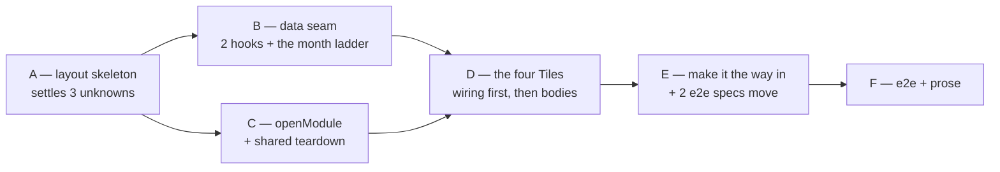

# Plan

Ordered so that each phase leaves the suite green and the application usable. Read
[architecture.md](architecture.md) first — every step assumes the four seams it names and the Tile
table in [domain.md](domain.md).

Test-first throughout: the failing test comes before the code that satisfies it. Three things no test
can settle are settled by **trying**, in phase A, before anything is built on them — whether the
built-in `Dashboard` layout can be chosen for the `CONTENT` region, whether a `VIEW_ADD` with no
models renders, and what the batched `QUERY` actually returns. Phase A is deliberately a walking
skeleton: **one Tile, one literal line, no queries.** The previous change's phase A was skipped and
built afterwards, and two of its four unknowns turned out to matter; this one is not skipped.

New user-visible strings are **English literals in the components**. This change registers no
localisation key — the menu label is the exception, and it lives in the App Model with `en` and `de`
like every other module's.

Commands are `just` recipes: `just test-models`, `just test-client`, `just test-e2e`, `just check`,
`just dev`.

**Phase order note.** Navigation (**C**) comes before the Tiles (**D**) because every Tile's click
handler dispatches `openModule`, and a Tile cannot be tested against a saga that does not exist. The
Tiles phase opens by wiring the four view names into the App Model and the view map, so that every
"seen in the browser" verification in it is actually reachable — the skeleton of phase A is replaced
at the *start* of D, not at the start of E.

---

## A — Settle the layout, before four Tiles are written on the assumption

Nothing in this phase is kept. The point is to know, in the browser, that the seam exists.

- [x] **Skeleton module.** Add `DashboardModule` to `import/models/AssistantsAppModel_AM.json` as
  described in architecture.md — first in `modules[]`, menu label `Dashboard` in both locales, one scene,
  `REGION_CLEAR` to `layout: { name: "Dashboard", settings: { rows: [ { columns: [ { width: { lg: 12 } } ] } ] } }`,
  and **one** `VIEW_ADD` named `SkeletonTile` with no `models`. Leave `initialActivity` on
  `Conversation` for now.
  → **Verify:** `just test-models` passes and still reports twenty-nine models.
- [x] **Skeleton view.** Register `addView("SkeletonTile", …)` in `appsetup.ts` for a component that
  renders one literal line and the `View` props it was given, JSON-stringified.
  → **Verify:** `just dev`, open the app, click **Dashboard**. The line appears. Screenshot into `tmp/`.
  - **Observed:** it renders, with **no `addLayout`** — `DefaultLayoutProvider`'s switch resolves
    `"Dashboard"` as shipped, and `REGION_CLEAR` overrides `CONTENT`'s declared `MasterDetail` without
    complaint. No fallback needed.
  - **Observed:** a `VIEW_ADD` with **no `models`** renders. The props it gets are
    `{ name, activityId, ariaLevel }` and nothing else — no `modelDescriptors`. Screenshot:
    `tmp/phase-a-skeleton-one-tile.png`.
- [x] **Four slots.** Widen the settings to four columns (`sm: 12, md: 6, lg: 3`) and add three more
  `VIEW_ADD`s pointing at the same skeleton component with different literals.
  → **Observed order:** `VIEW_ADD` order is **left to right** at desktop width and **top to bottom**
  when stacked — slot *i* takes view *i*, as architecture.md assumed. Screenshots:
  `tmp/phase-a-four-slots-desktop.png`, `tmp/phase-a-four-slots-narrow.png`.
- [x] **Error isolation.** Make one of the four throw on render.
  → **Observed:** that slot shows the platform's *"Oops! An error occurred!"* fallback, with its own
  dismiss control, and the other three render untouched. The per-Tile error boundary claim holds.
  Screenshot: `tmp/phase-a-error-isolation.png`.
  - This is the **render-throw** path only. The soft-failure path — a query that rejects — is a
    different mechanism with its own step in phase F.

## B — The data seam, against the live store

Both hooks and the month ladder. Nothing in this phase renders anything a User would recognise, so it
can be driven from the phase-A skeleton view.

- [x] **Failing test for `useThingCounts`.** `client/src/test/components/dashboard/useThingCounts.test.ts`
  against a faked `Dispatcher`: N queries produce **one** `rpc` call carrying N requests; results are
  matched **by response `id`, not by array position** (assert with a deliberately reversed response);
  `fullSize` is read and `entries` is ignored; a rejected promise yields `state: "error"` and throws
  nothing; no id-less query is sent twice.
  → **Verify:** `just test-client` fails on the missing module.
  - **Found while writing it:** a fake QUERY response must carry `page`, `fullSize`, `entries`, `links`
    **and** `otherResults`, or `QueryJsonRpc2Response.isInstance` refuses the batch and every count
    fails. And `Dispatcher.rpc` already resolves each request against its **own response id** and
    returns them in request order — so the hook reads them positionally *after* the dispatcher has
    matched, and the reversed-reply test proves the wire order never reaches it.
- [x] **Write `useThingCounts.ts`** to the shape in architecture.md, with `PAGE_SIZE` a named constant.
  → **Verify:** `just test-client` passes; `just check` is clean.
- [x] **Measure it against the live stack.** With `just dev` up and demo data loaded, call the hook from
  the skeleton view for one unconstrained `Conversation_DM` count and one `exact_match` on `Status`.
  → **Observed** (measured directly against `/api/v2/rpc` rather than through the skeleton view, which
  answers the same question with no deployment):
  - **`paging.pageSize: 0` is rejected.** Every request in the batch comes back
    *"JSON-RPC Request failed and rollback was performed"*. **`PAGE_SIZE` is 1**, and the constant
    carries that.
  - **The load-bearing claim holds:** `QUERY` through `rpc` returns `fullSize` for a constrained count —
    398 Conversations, 318 of them `waiting`, 0 `running`, matching the overview.
  - **Payload at `pageSize: 1`:** the documents Tile's fourteen counts weigh **~3.6 kB** over 49
    Documents; the conversations Tile's three weigh **~12 kB**, because a Conversation carries its
    transcript. Kilobytes, once per visit.
- [x] **Failing test for `buckets.ts`.** The **invariant first**, because that is what the module is for:
  - **no instant falls in two buckets, and no instant inside the window falls in none** — walk the
    ladder and assert each bucket's `to` is exactly one second before the next bucket's `from`, and
    that `before.to` is one second before `m0.from`;
  - twelve months back from a fixed instant, oldest first;
  - a year boundary (December → January) and February in a leap year;
  - one second, **not** one millisecond, between buckets — `createdAt` is written with second
    precision, so a sub-second gap is a gap the stored values cannot express;
  - the emitted bounds carry **no `Z` and no offset**, matching `nowIso`'s
    `yyyy-MM-dd'T'HH:mm:ss` exactly — assert the literal string shape, because a bound in a format the
    column does not use returns a plausible wrong count rather than an error;
  - no `Date.now()` inside the module: the instant is a parameter, which is what makes all of the above
    testable.
  → **Verify:** `just test-client` fails, then passes once `buckets.ts` exists.
- [x] **Failing test for `useAssistants`.** Against the same faked `Dispatcher`: the three fields are
  lifted off each document and the document body — `SystemPrompt`, `Skills` — is **not** retained in
  state; the sort is sent as `Name` / `ASC` / `NULLS_LAST` / `ignoreCase: true`, all four present, or
  the store rejects it; `total` is `fullSize` and may exceed `assistants.length`; `readAt` is set on
  `ready`; a rejection gives `error` and throws nothing.
  → **Verify:** `just test-client` fails, then passes once `useAssistants.ts` exists, to the interface in
  architecture.md.

## C — Navigation

Before the Tiles, because every Tile's click handler dispatches this.

- [x] **Failing test for `openModule`.** `client/src/test/sagas/openModule.test.ts`, modelled on the
  existing `openForeignForm.test.ts`: with open top-level activities, `cancelRequested` is put and
  awaited **before** any `create`; a vetoed teardown creates nothing; with no open activities it
  creates directly; a throwing step is swallowed and the saga survives.
  → **Verify:** `just test-client` fails on the missing module.
- [x] **Write `sagas/openModule.ts`** — `cancelTopLevelActivities()` plus the saga, worker swallowing its
  own failures for the reason `openForeignForm` documents.
  → **Verify:** `just test-client` passes.
- [x] **Point `openForeignForm.ts` at the shared teardown.** Delete its inline copy; import
  `cancelTopLevelActivities`. Nothing else in that file changes.
  → **Verified:** the existing `openForeignForm.test.ts` passes **unedited**. The teardown is delegated
  with `yield*` rather than `call`, so its effects remain the caller's own effects and the effect stream
  is byte-for-byte the one that file used to yield inline — which is precisely why its test could stay.
- [x] **Register `OpenModuleSaga`** in `appsetup.ts`'s `addCustomSagas`, and dispatch `openModule` from
  the phase-A skeleton view on click.
  → **Verified in the browser:** clicking a skeleton Tile lands on the Conversations overview, and **all
  four** skeleton views are gone from the DOM — read off the rendered region rather than devtools, which
  is the same claim from the other side: four views left standing would still be in it.

## D — The Tiles

Each Tile is: failing test → component → seen in the browser. The wiring comes first so that *"seen in
the browser"* is possible at all.

- [x] **Move the icon vocabulary out of `conversation/`.** `client/src/components/conversation/icons.ts`
  → `client/src/components/icons.ts`, adding `PLACE_ICONS` for 🗣 📄 💰 beside the existing `ICONS`.
  Update the seven importers — `Bubble`, `PendingQuestion`, `QuestionContext`, `Receipt`,
  `TranscriptHeader` and two of their tests — and the file's own doc comment, which currently claims to
  be *"the one place that knows them"* while sitting in a folder named after one of its two consumers.
  → **Verify:** `just test-client` passes with **no test edited** — this is a move and an addition, not a
  behaviour change. `just check` clean.
- [x] **Wire the four view names.** Create `client/src/components/dashboard/dashboardViewMap.tsx`
  exporting `ConversationsTile`, `DocumentsTile`, `AssistantsTile`, `BookkeepingTile`, each initially
  rendering nothing but the shared chrome in `loading`. Register all four with `addView` in
  `appsetup.ts`, replace the four skeleton `VIEW_ADD`s in the `_AM` with these names — **in the order
  phase A confirmed** — and delete `SkeletonTile`.
  → **Verify:** `just test-models`; four titled, empty Tiles in the browser, in the intended order.
  Every browser verification below now has somewhere to happen.
- [x] **`DashboardTile`** — the chrome. Failing test for the three `data-state` values, and for the three
  **optional** slots: `loading` shows icon, title and a headline placeholder; `ready` shows only the
  slots the Tile supplied, so a Tile with no headline and no footer renders neither and is still valid;
  `error` shows icon, title and one line. Then the component, over `Card` + `Card.ActionArea`, styled
  against the theme.
  → **Verify:** `just test-client`; and both themes checked in the browser via the theme chooser.
  - **There is only one theme.** `src/themes/themes.generated.ts` discovers none, so `THEMES` is `Base`
    alone and `ThemeChooser` renders nothing at all. The Tile takes every colour from theme tokens, which
    is the substance of the requirement; a second theme cannot be checked until one exists.
  - **Found in the browser:** the A12 `Card` ships transparent and borderless here, and the layout's grid
    stretches each column, so the first four Tiles were four invisible floor-to-ceiling panes. The Tile's
    own frame now draws the edge in theme tokens and fits its content over a shared minimum height.
    Screenshots: `tmp/phase-d-tiles-{light,medium,narrow}.png`.
- [x] **`BookkeepingTile`** — first of the four, because it is the one that exercises the optional slots
  and needs no data. Failing test: it is an `<a>` with `href="http://localhost:8084"`,
  `target="_blank"`, `rel="noopener noreferrer"`; it renders **no headline and no footer**; it is
  permanently `data-state="ready"`; and it issues **no** query — assert the faked dispatcher was never
  called. Then the component, with the URL as a module constant carrying the comment naming
  `compose/docker-compose.yml`.
  → **Verify:** `just test-client`; and clicking it in the browser lands in Firefly III, already logged
  in through the same Keycloak session.
- [x] **`ConversationsTile`** — failing test from a stubbed hook: headline is the sum of the three
  counts; the breakdown lines read `running`, `waiting on you`, `waiting`; the footer carries `readAt`;
  a click dispatches `openModule({ module: "Conversation" })`. Then the component with the three
  constraints from architecture.md.
  → **Verify:** `just test-client`; and in the browser the headline equals the `running` + `waiting` rows
  of the Conversations overview, and clicking it lands there.
- [x] **`AssistantsTile`** — failing test from a stubbed `useAssistants`: headline is `total`; each
  Assistant renders its `name` with `ICONS.assistant`; a disabled one is dimmed and says so; `total`
  beyond `assistants.length` appends *"and N more"*.
  → **Verify:** `just test-client`; and both seeded Assistants named in the browser, in `Name` order.
- [x] **Declare `recharts`** in `client/package.json` at `^2.15.4`, matching what widgets-core asks for.
  → **Verify:** `npm ls recharts` in `client/` reports exactly one copy, and `just check` is clean. If
  npm reports two, this is the `lexical` problem again and it is fixed here, before anything imports it.
- [x] **`DocumentsTile`** — failing test from a stubbed hook: headline is `total`; the series handed to
  the chart is `before` cumulated with the twelve months, in order, twelve points long; the **createdOn
  lag** is stated when `total` exceeds the last cumulative point, and is absent when it does not. Then
  the component, with a Recharts `ResponsiveContainer` + `AreaChart`.
  → **Verify:** `just test-client`; and in the browser the **createdOn curve** renders at the height the
  slot gives it, at three widths, in both themes. Screenshot into `tmp/`.

## E — Make it the way in

The change becomes user-visible here, and the two existing e2e specs that assume the old landing page
change in the same step that moves it. The Tiles are already wired by phase D, so this phase is one
line of App Model and two specs.

- [x] **Flip `initialActivity`** to `{ module: "Dashboard" }`.
  → **Verify:** `just test-models`; `just dev`, then `/` lands on the Dashboard.
- [x] **Update `5-localization.spec.ts`.** Its assertion is on the welcome page's ContentBox title, and
  the Dashboard renders none — so move it: switch the language, then open *Documents* / *Dokumente* by
  menu and assert that title. This is a behaviour change moving its test with it, not a test bent to
  pass; the comment in the spec says which.
  → **Verify:** `just test-e2e` green for that file.
- [x] **Update `2-navigation.spec.ts`.** Leave its `MODULES` array untouched — every entry in it asserts
  an overview column, and the Dashboard has no table. Add a **separate test above the loop** for the
  Dashboard: it is the first menu entry, it opens four Tiles, and it opens no table. A comment says why
  it is the exception.
  → **Verify:** `just test-e2e` green for that file.

## F — End-to-end, and the prose

- [x] **`e2e/pages/DashboardPage.ts`** — Tile locators by `data-role`, a `waitForTiles()` that waits for
  every Tile to leave `data-state="loading"`, and readers for the headline and breakdown. The Tiles fetch
  outside the activity machinery, so `finishedLoading()` does not cover them; this is that cover. The
  bookkeeping Tile is permanently `ready`, so `waitForTiles()` needs no exception for it.
- [x] **`e2e/tests/base/10-dashboard.spec.ts`** — the acceptance list from
  [proposal.md](proposal.md), and the numeric assertions taken **from the overviews rather than from
  fixtures**: the conversations headline against the Conversations overview's `running`/`waiting` rows,
  *waiting on you* against the count of 🛑 rows, the documents headline against the Documents overview.
  A fixture number would pass while the Tile and the store were wrong together.
  → **Verify:** `just test-e2e` green, run twice — the counts must not depend on what a previous spec left
  behind.
  - **The overviews turned out not to be countable.** At this data volume the Conversations overview is
    forty pages of ten, so *"count its `running`/`waiting` rows"* is not something a spec can do, and
    counting 🛑 rows even less so. The second reader is therefore a `QUERY` the spec issues itself, over
    constraints it writes itself — still not a fixture, and it still catches the thing worth catching: a
    Tile asking the wrong question. `ThingStore.count()` is the new helper that reads `fullSize`.
  - **A third spec had to move with the landing page**, unforeseen here: `1-login.spec.ts` asserted a
    ContentBox title as its *"and the content region rendered"* check. The Dashboard renders no
    ContentBox, so that assertion is now its Tiles — the same claim about the same region.
  - **Found in passing:** `e2e/utils/thingstore.ts`' `not()` helper built `operands: [operand]`, which the
    store rejects; `not` takes a **singular** `operand`, as `runtime/src/a12/things.ts` already
    documented. The helper had never had a caller — this spec was its first — and it is fixed.
- [x] **One Tile failed on purpose.** In the same spec, a case using Playwright `page.route` to fail the
  `POST /api/v2/rpc` carrying the documents Tile's counts — matched on the request body naming
  `Document_DM` so the other Tiles' batches go through untouched.
  → **Verify:** exactly one Tile at `data-state="error"` showing its own line, the other three at
  `ready`, the page still navigable, and A12 raising no notification. This is the **soft-failure** path;
  phase A checked the render-throw path, and they are different mechanisms with different code behind
  them.
- [x] **No Tile is left in `error` on the happy path.** With no interception, assert
  `data-state="error"` has count 0 across the Dashboard, and that A12 raised no notification
  (`TestID.NOTIFICATION_ITEM_TITLE` count 0), the check every other spec in this suite ends on.
- [x] **Full suite.** `just test`.
  → **Four tiers are green and stay green:** models (29), runtime (189), integration (78), client (492
  across 57 files, with **no existing test edited** — the icons move is a move).
  → **The e2e tier is green on the Dashboard in every run, and flaky on this machine everywhere else.**
  Across four full runs no failure ever landed on a Dashboard spec, on the three specs this change
  edited, or on anything the change touches. What did fail, differently each time, was
  `1-invoice-slice`, `3-crud`, `7-forms-open`, `8-operations-catalogue`, `9-conversation-transcript` —
  and each had an identifiable environmental cause, none of them this change:
  - **The stack runs `amd64` images under emulation on an arm64 host.** The server saturates at ~110% CPU
    under the e2e load, and the run immediately after the integration tier lost 29 specs to proxy
    timeouts that a five-minute cooldown made go away.
  - **The container runtime's port forwarding died twice**, refusing every published port at once —
    including other projects' — which reads in the log as `SocketError: other side closed` against
    Keycloak. Restarting Rancher Desktop fixed it both times.
  - **`8-operations-catalogue` switches `bookkeeping.listAccounts` off** and back on. A run that dies in
    between leaves it off, and the accountant then cannot finish the invoice slice — 42 *"a granted
    Operation was dropped"* warnings in the Runtime log during the run that failed that way. Run alone,
    the invoice slice passes.
  - **The Runtime's LLM profile was `local_qwen`** with no server behind it, which is why the first run
    lost every Runtime-dependent spec. Switched to `scripted` for the runs, and **switched back
    afterwards** — `llm.json` is the User's local file and is left exactly as it was found.
  - The best run: **48 passed, 1 failed** (the invoice slice, above). A later run of that spec on its own:
    **passed**, with `3-crud` flaking in its place.
  → **How it was served while being verified.** `assistants/frontend` is an `amd64` nginx image, and for
  part of this change its worker refused to start under the host's emulation —
  `io_setup() failed (38: Function not implemented)`, which it still logs — so the browser and e2e
  verification ran against the **webpack dev server** on the same port with the same `/api` proxy to
  `:8082`: same bundle source, same contract, different process. After the container runtime was
  restarted the image serves again, and the **shipped artefact was confirmed by hand**: `just dev` green,
  `/` landing on four Tiles with live numbers (`tmp/dashboard-shipped.png`).
- [x] **Prose, in the same change:**
  - `specs/system/functional.md` — a **Dashboard** feature section; *Browsing and editing Things* goes
    from eight navigation modules to nine and the landing page changes from Conversations to the
    Dashboard; *The books* gains the sentence that the Dashboard is now the door to them.
  - `specs/system/architecture.md` — the UserInterface section's seam table gains the region layout and
    the count query, and the sentence *"There is no custom client code beyond these two"* becomes four.
    No path rewrite is needed for the icons move: no document under `specs/system/` or `README.md`
    names `icons.ts`, which was checked rather than assumed. The only prose tied to that file is its own
    doc comment, updated in phase D, and the *Icon vocabulary* row in the previous change's
    `domain.md` — a historical record of that change, left as written.
  - `README.md` — the Dashboard, and that the application opens on it.
  - `docs/adr/0022-a-dashboard-counts-it-does-not-keep.md` — the decision from
    [proposal.md](proposal.md), with the rejected alternatives from architecture.md as its
    consequences.
  - `DECISIONS.md` — the phase A and phase B findings, whichever way they went: the layout override,
    the model-less view, `PAGE_SIZE`, and the observed payload.
  → **Verify:** `just check` clean, including `scripts/check-docs.mjs`.

---

## Order, and what depends on what

**A gates everything**, and it is the phase most likely to be skipped because it builds nothing that
survives. B and C are independent of each other and both feed D. E is the only phase a User would
notice, and it is late on purpose: until `initialActivity` flips, the Dashboard is a menu entry nobody
has to click, so every phase before it can end with the suite green and the application working exactly
as it does today.

## Stop-and-say-so points

Two places where the honest move is to stop rather than work around:

- **Phase A, if the `Dashboard` layout cannot be chosen for `CONTENT`.** The single-view fallback is
  named in architecture.md and costs the model-driven placement. Take it, record it, and do not spend a
  day making the platform layout work.
- **Phase B, if `QUERY` through `Dispatcher.rpc` will not return `fullSize` for a constrained count.**
  There is no fallback for this one — it is the load-bearing claim of the whole change. Stop, report it,
  and re-open the design; counting in the client by fetching every document is not an acceptable
  substitute and would be a worse dashboard than none.
