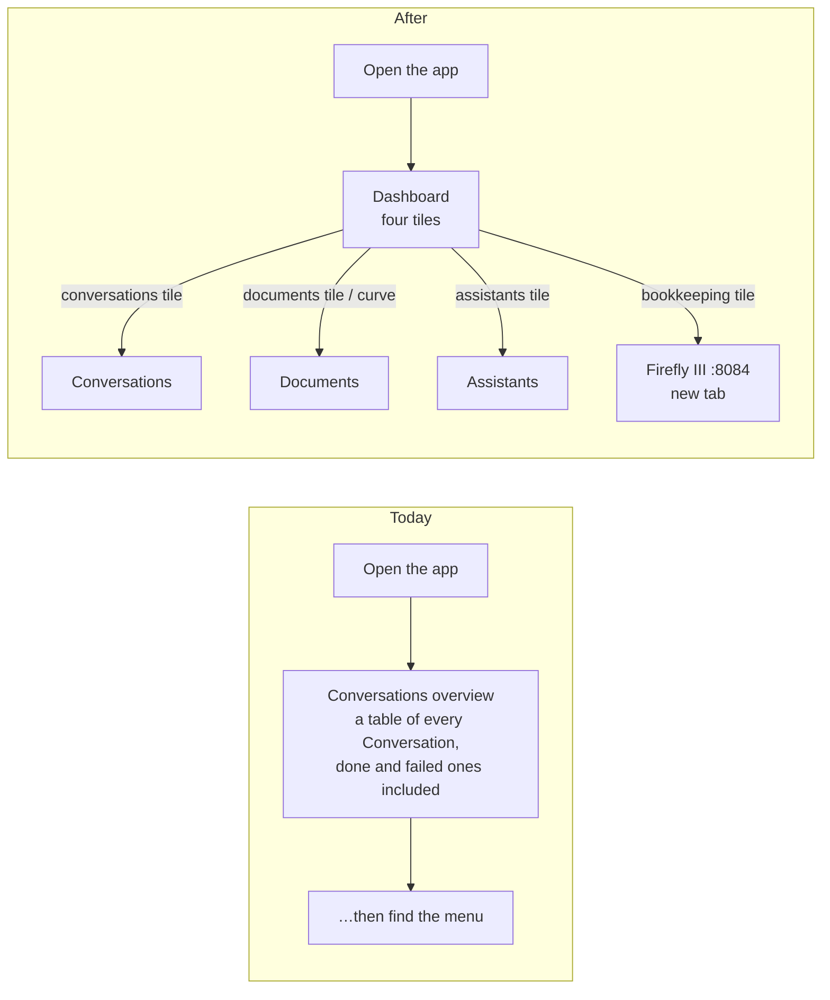
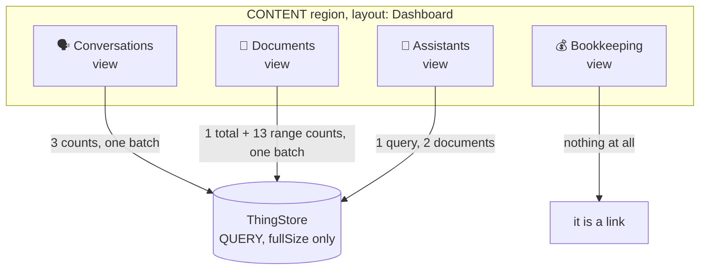

# Proposal — a dashboard is the way in

## What

The application gets a **Dashboard**: the first menu entry, and the page the User lands on.

It shows four tiles. Each one answers a question the User has on arriving, and each one is a door to
the module that answers it properly.

| Tile | What it says | Where clicking it goes |
|---|---|---|
| 🗣 **Conversations** | how much work is in flight: `running` + `waiting`, split into *running*, *waiting on you*, *waiting on something else* | Conversations |
| 📄 **Documents** | how many Documents there are, and how that number grew — the **createdOn curve**, over the last twelve months | Documents |
| 🤖 **Assistants** | how many Assistants there are, each by name with the 🤖 of the icon vocabulary, dimmed when disabled | Assistants |
| 💰 **Bookkeeping** | that the books are elsewhere, and opens them | Firefly III, in a new tab |

Four tiles is a starting point and the design says so: the tiles' placement is **App Model
configuration**, not code. A12 client-core ships a `Dashboard` region layout — rows of columns with
per-breakpoint widths, filled by views in order — and this change uses it. A fifth tile later is a
component plus four lines of `AssistantsAppModel_AM.json`.

The numbers are **counted by the store, never held anywhere**. Each tile issues indexed count
queries whose only result it reads is `fullSize`; the documents behind them are thrown away. No new
Model, no new field, no cache, no aggregate Thing. ADR-0006 is why: a count of Conversations is a
fact the ThingStore owns, and a second place holding it would be a second Authority for it.

## Why

**The landing page is currently a list of finished work.** `initialActivity` is Conversations, and
that overview holds every Conversation there has ever been — `done` and `failed` alongside the three
that need something. The previous change ([ui-for-conversation-and-question](../ui-for-conversation-and-question/proposal.md))
made that list readable and put a 🛑 on the blocked rows, which was the right fix for *that* screen.
It is still a list, and a list is what you read second. What the User wants on arriving is the shape
of the household's admin in one look: is anything stuck, is anything arriving, is anything running.

**Three of the four questions are already indexed facts nobody asks.** `Conversation.Status`,
`Conversation.WaitingFor` and `Document.CreatedAt` all carry the `indexed` annotation, because the
Trigger Watcher needs them. Asking the store *how many* over the same indexes costs one round trip
and reads no document body at all. The information exists; nothing shows it.

**Growth over time is the one fact no overview can show.** A table shows what is there now. "Six
Documents arrived last month and one this month" is the sentence that tells a User whether the system
is being fed, and it is not derivable by looking at a page of rows.

**Bookkeeping is one click away and nobody would guess it.** functional.md says *"Firefly III at
`http://localhost:8084`, behind oauth2-proxy, through the same Keycloak login"* — a URL in a
specification is not a door in an application. The books are where half of this system's value
lands, and the way in is currently prose.

**And the assistants are the household's staff.** Two of them, named, with 🤖 beside each. It is the
smallest tile and the one that makes the application feel like it has people in it.

## Scope

**In scope**

| Area | What changes |
|---|---|
| `AssistantsAppModel_AM` | a new `DashboardModule`, **first** in `modules[]` so it is the first menu entry; one flow, one scene, `REGION_CLEAR` to the built-in `Dashboard` layout with its row/column settings, and four `VIEW_ADD`s; `initialActivity` becomes `{ module: "Dashboard" }` |
| Client — tiles | `components/dashboard/`: shared tile chrome over the `Card` widget's `ActionArea` — headline and footer optional, because the bookkeeping tile has neither — the four tiles, and the view map that names them for `addView` |
| Client — data | `useThingCounts`, a read-only hook that batches N count queries into one `Dispatcher.rpc` call and returns their `fullSize`s; `useAssistants`, the one hook that reads documents, lifting three fields off each and discarding the rest; `buckets.ts`, the month ladder behind the **createdOn curve** |
| Client — navigation | `sagas/openModule.ts` — the teardown-and-open half of `openForeignForm` without the detail push, since a tile opens a module and not a form. `openForeignForm.ts` takes its teardown from there rather than keeping a second copy |
| Client — setup | four `addView` calls and one saga in `appsetup.ts`; `recharts` declared in `client/package.json`; `icons.ts` moves out of `components/conversation/` and gains the three place labels, because the icon vocabulary is no longer conversation-scoped |
| e2e | `5-localization.spec.ts` (the welcome page moved, and the dashboard has no ContentBox title to assert on); a new dashboard spec, including one tile's query failed by route interception; `2-navigation.spec.ts` gains the Dashboard entry, which is the one menu item that opens no table |
| Client tests | both hooks against a faked `Dispatcher`, the month ladder's non-overlap invariant, each tile's three states, the bookkeeping tile's absent headline and footer, and the new saga |
| Prose | `specs/system/functional.md` (a Dashboard feature, and the module count), `specs/system/architecture.md` (the UserInterface's seams — this adds two), `README.md` |

**Out of scope, deliberately**

- **No Document Model change, anywhere.** Not one new field. Every number this dashboard shows is
  counted over an index that already exists, and the assistants' symbol is the 🤖 the icon
  vocabulary already has. In particular there is **no `Icon` field on `Assistant_DM`**: giving each
  Assistant its own emoji is a nicer tile and a Model change, a form change, a bootstrap
  reconciliation decision and a migration, for decoration. Every Assistant is a 🤖 until someone
  wants otherwise on purpose.
- **No aggregate Thing, no counter, no materialised view.** ADR-0006. A count is the store's answer
  to a question, not a fact anyone else may hold. This is also why there is no `RuntimeState.documentCount`,
  which would have been the tempting shortcut and a second Authority.
- **No server-side aggregation.** `dataservices-access` types an `aggregation` projector on a query
  root and marks it *"this feature is not supported yet"* on every member of it. The curve is
  therefore built from thirteen cheap range counts rather than one grouped query. If the platform
  ships aggregation, the createdOn curve is where to spend it; today it would be a query the server rejects.
- **No polling.** `useThingById` established the rule for this application — read on mount, no
  polling, a reload is the User's existing answer — and a dashboard polling every few seconds would
  put a standing query load on the store beside the Runtime's own two-second scan. Each tile instead
  states the instant it read, so a stale number is never mistaken for a live one, and leaving the
  dashboard and coming back re-reads everything.
- **No number from Bookkeeping.** No balance, no budget, no "€184.30 unbooked". It is architecturally
  unavailable to this tile and that is worth stating rather than treating as an omission: the browser
  holds no Firefly credential (oauth2-proxy runs its own OIDC flow and forwards a header), the only
  component holding a Firefly token is the Runtime, and the Runtime offers no API by design
  (ADR-0011). A tile showing a balance would need one of those three facts to change. It is a door.
- **No per-Assistant jump, no per-tile drill-down beyond its module.** A tile opens the module. The
  request was *"he gets to the corresponding screen"*, and the corresponding screen is the overview.
- **No new charting dependency.** `recharts` is already resolved in `client/node_modules` as
  widgets-core's own dependency; this change declares it so the version is pinned by us rather than
  inherited. A12's own `LineChart` widget is deprecated as of widgets-core 38.1.1 with the note *"Use
  Recharts directly instead"*, and widgets-core here is 39.0.2 — so using Recharts directly is the
  platform's instruction, not a departure from it.
- **No localisation of tile prose.** New strings are English literals in the components, exactly as
  the transcript's are, and for the same reason recorded there: the application's localisation is
  being removed in a separate change. The **menu label** is in the App Model and therefore carries
  `en` and `de` like every other module's — both reading `Dashboard`, as `Runtime` and `Assistants`
  already do.

## Expected outcome

The User opens the application and sees four tiles. The first says **7 in flight**, and under it *1
running · 4 waiting on you · 2 waiting*. The second says **23 documents** over a curve that climbs
in three steps and has been flat for a fortnight. The third says **2 assistants** — 🤖 receptionist,
🤖 accountant. The fourth says **Bookkeeping**, and opening it lands them in Firefly III already
logged in.

Clicking the first tile puts them on the Conversations overview, where four rows carry 🛑 — the same
four the tile counted.

Acceptance, as the e2e tier will put it:

- The menu's **first** entry is *Dashboard*, and there are nine entries where there were eight.
- Opening `/` lands on the Dashboard: four tiles, and no table.
- Each tile reaches `data-state="ready"`; none reaches `data-state="error"`.
- The conversations tile's headline equals the number of Conversation rows whose status is `running`
  or `waiting`, and its *waiting on you* figure equals the number of 🛑 rows in the Conversations
  overview.
- The documents tile's headline equals the row count of the Documents overview.
- The assistants tile names both seeded Assistants and shows 🤖 for each.
- Clicking each of the first three tiles opens that module's overview, identified by a column only
  that overview declares — the assertion `2-navigation.spec.ts` already uses.
- The bookkeeping tile is an anchor to `http://localhost:8084` with `target="_blank"` and
  `rel="noopener noreferrer"`, and it issues no query.
- A tile whose query fails renders its own error line and the other three still render — one failing
  view must not take the page down.
- The invoice slice still books an invoice end to end. Nothing in the flow tier goes near the
  dashboard, and that is the point of listing it.

## Risks

| Risk | Why it might bite | What we do about it |
|---|---|---|
| The `Dashboard` region layout is unproven here | It is a built-in — `DefaultLayoutProvider` resolves the name with no registration, and `DashboardLayout` fills its slots from `props.views` in order — but nothing in this application has yet overridden a sub-region's declared layout (`CONTENT` declares `MasterDetail`, and every scene so far re-clears to the same name) | Phase A is a walking skeleton: one tile rendering one literal line, in a Dashboard layout, seen in the browser, before a single query is written. The same shape phase A took for the transcript |
| A view with no models may not be a shape the platform expects | Every existing `VIEW_ADD` in this App Model names an overview or a form model. `Directive.Add.models` is optional and `View.modelDescriptors` is optional, so the types permit it — but "permitted by the types" is not "observed working" | Phase A again. If a model turns out to be mandatory in practice, the fallback is one `VIEW_ADD` and a React grid inside it, which costs the model-driven placement and nothing else |
| Slot-to-view pairing is positional | `DashboardLayout` walks the settings' columns and pulls `views[i++]` — so the order of the `VIEW_ADD` directives *is* the layout, and a reordering silently moves a tile | It is one file and four adjacent lines, and the dashboard e2e spec asserts which tile is first. Named slots are not on offer; positional is what the platform gives |
| Fourteen queries in one batch for one tile | The documents curve is a total plus thirteen range counts. It is one round trip, and every constraint is on an indexed field — but `pageSize` cannot be 0 without checking, so each of the fourteen also returns one document, and a `Document` carries `extractedText` | Try `pageSize: 0` first and use it if the store accepts it; otherwise `pageSize: 1` and fourteen document bodies, which at a household's document sizes is measured in kilobytes. Measured in phase B against the live stack, not assumed |
| The createdOn curve can lag the headline | `Document.CreatedAt` is the **Runtime's** field, backfilled at the start of every scan, because A12's form engine offers no save hook that could stamp one. A Document the User creates while the Runtime is paused has no `CreatedAt`, so it counts in the unconstrained headline and in no bucket | Stated on the tile rather than hidden as the **createdOn lag**: the curve is what has been stamped, the headline is what exists, and the two agree within one scan interval of the Runtime running. The alternative — dropping the headline and using the curve's last point — would replace a visible discrepancy with a quiet undercount |
| Two navigation sagas where there was one | `openModule` is `openForeignForm` minus the detail push, and two copies of the veto-honouring teardown would drift | The teardown moves into `openModule.ts` and `openForeignForm.ts` imports it. That is the whole of the change to existing client code |
| `finishedLoading()` will not wait for the tiles | The tiles fetch through `Dispatcher.rpc` directly, outside the activity machinery, so no progress overlay appears and the e2e helper returns while the numbers are still loading | Every tile carries `data-state="loading" \| "ready" \| "error"`, which is what the spec waits on. Deliberate: the alternative is an arbitrary sleep |

## The decision worth recording

An ADR, because it settles a question that will be re-litigated the first time a tile is slow:

> **ADR-0022 — a dashboard counts, it does not keep.** Every number on the Dashboard is a `fullSize`
> from a query against the Authority that owns the fact, read on mount and never cached, polled or
> aggregated into a Thing. Where a fact's Authority cannot be reached from the browser — the books —
> the tile is a link and shows no number rather than showing one somebody else computed.

