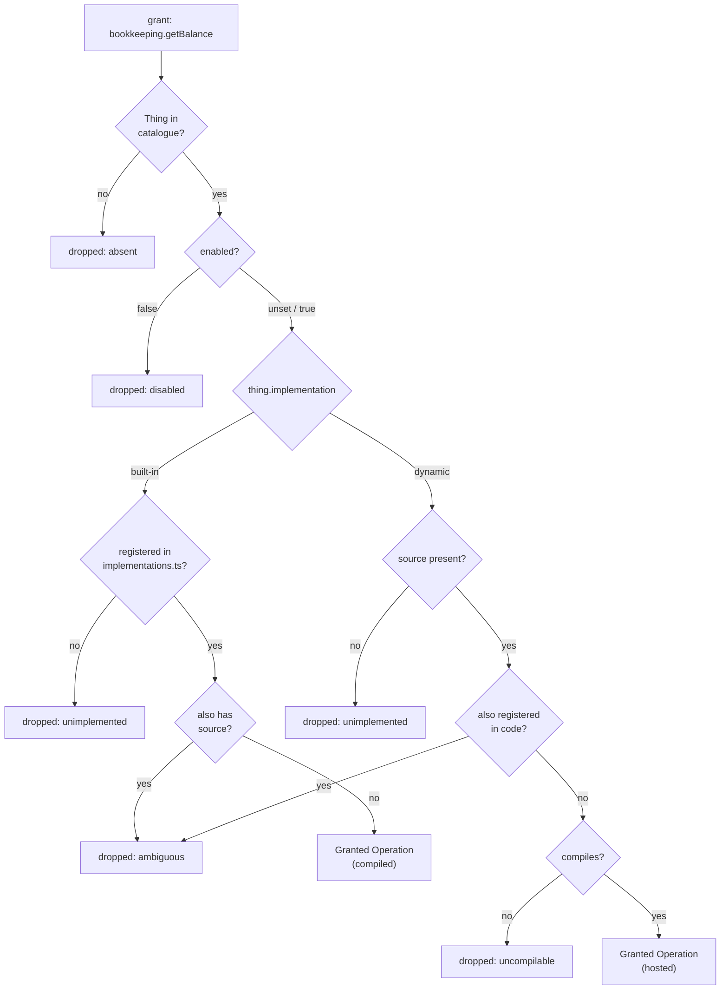
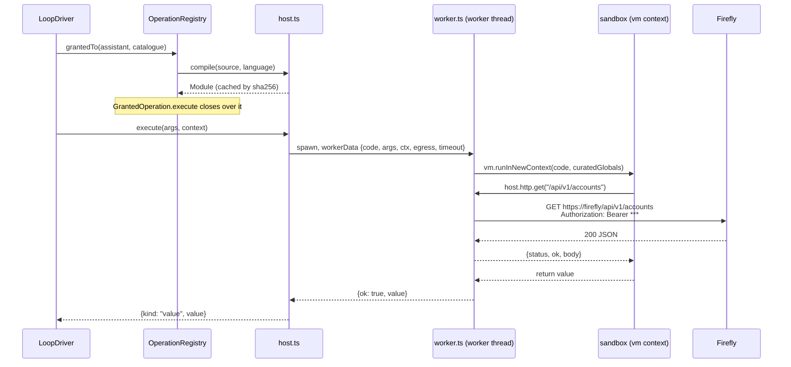

# Architecture — the Operation Host

Three decisions were taken before this was written, and everything below follows from them: the
Source lives **on the Operation Thing**; it runs in a **worker thread with a curated global object**;
and built-in versus dynamic is **per Operation key**, with a collision refused rather than ranked.

Everything in this document happens **inside the Runtime container**. There is no second process,
no sidecar, no code sent anywhere. The browser's one inbound route
([ADR-0023](../../../docs/adr/0023-the-runtime-is-the-door-outward.md)) is unchanged: it names an
Operation and receives a value, and it cannot observe which kind of Implementation produced it.

## The join, as it becomes

`OperationRegistry.grantedTo()` today walks an Assistant's grants, finds each Operation Thing in the
catalogue, finds a registered `OperationImplementation` by the same key, and joins them. Four
conditions already remove a capability — not granted, absent, disabled, unimplemented — and the join
is where they are enforced. The change adds one source of Implementations and one reason to drop.

`DroppedGrant["reason"]` gains `"ambiguous"` and `"uncompilable"`. Both are reported to the model as
well as to the log, for the reason ADR-0019 gives: *"X is not one of your tools"* is a false premise
a model will re-plan around, and *"that Operation's stored code does not compile"* is one the User can
act on.

**Ambiguity is fatal to the grant, not resolved by precedence.** Ranking — code wins, or the Thing
wins — is one line shorter and is the wrong shape: a `bookkeeping.postTransaction` that exists in
both places means somebody is mid-migration and does not know which one just moved money.
ADR-0006's *one authority per fact* applies to *"what does this Operation do"* with more force than
to anything else in the catalogue.

## `Operation_DM` gains six fields

| Field | Type | Written by | Read by |
|---|---|---|---|
| `implementation` | `built-in \| dynamic`, unset reads as `built-in` | bootstrap mirror | the registry's join |
| `source` | text, up to 64 KB | the User; created from a seed | the Operation Host |
| `language` | `typescript \| javascript`, unset reads as `typescript` | the User | the compiler |
| `egress` | text, up to 40 chars — an egress name | the User | the Operation Host |
| `timeoutMs` | number, unset reads as the configured default | the User | the Operation Host |
| `clientReadable` | `boolean`, unset reads as `false` — not client-readable | the User; created from a seed | the inbound gate (dynamic only) |

`clientReadable` is the sixth because it must be **read off the Thing** for a dynamic Operation, and
there is no field to read it from today — `mutating` already has one (`f_mutating`), `clientReadable`
does not. It is the peer of `mutating`: for a built-in both come from code and the Thing's copies are
ignored; for a dynamic one both come from the Thing, and the two Dashboard reads
(`bookkeeping.listAccounts`, `bookkeeping.listTransactions`) only keep working because their seed —
and the migration for an installed stack — sets `clientReadable: true` on them. A dynamic Operation
whose `clientReadable` is unset is not client-readable, which is the safe default.

`implementation` is on the **mirror** side of bootstrap's line — it is a fact about how the Operation
is built, the code knows it, and a Thing that has drifted from it is broken rather than customised.
`source`, `language`, `egress`, `timeoutMs` and `clientReadable` are on the **decision** side:
created once from the seed and never re-applied, with divergence reported by name at the end of
`just bootstrap`, exactly as `description` already is. A developer who improves shipped Source therefore reaches fresh installs
only, and the report is where they find out. That is the existing rule applied rather than a new
one, and the alternative — bootstrap overwriting Source — would make `just dev` silently revert the
User's own Operation.

The form model gets `source` as a multi-line text area, sized for reading. It is the first field in
this system whose *content* is code, and it is presented as text: no editor, no syntax highlighting,
no validation as you type. Compilation failure is reported where every other broken-Operation state
is reported — as a dropped grant, by name, with the compiler's message.

## The Operation Host

Four files under `runtime/src/operations/dynamic/`:

**`compile.ts`** — Source in, an evaluable body out. TypeScript is stripped with
`module.stripTypeScriptTypes(source, { mode: "transform" })`, a Node built-in: no new dependency, no
second toolchain, and the same language the rest of the runtime is written in. It strips types and
does not check them, which is the honest position — a stored Implementation is checked by running it,
the same way a stored system prompt is. Source containing `import`, `export` or `require` is refused
at compile time with a message naming the token, because the sandbox has no module system and a
`SyntaxError` from `new Function` would be a worse way to learn that. Results are cached by
`sha256(source)`, so a Turn that calls one Operation four times compiles once, and an edited
Operation recompiles on the Turn after the edit with no restart.

**`worker.ts`** — the worker entry point. Receives the compiled body, the arguments, the resolved
egress and the timeout through `workerData`, builds the sandbox, runs it, and posts back one of
`{ok: true, value}`, `{ok: false, message}` or `{pending: {...}}`. It imports `node:vm` and the host's
HTTP client and nothing else.

**`sandbox.ts`** — the curated global object. `vm.runInNewContext(body, globals, { timeout })` where
`globals` holds `host`, `console` (routed to the Runtime's structured logger with the Operation's key
attached), `JSON`, `Math`, `Date`, `URL`, `URLSearchParams`, `TextEncoder`/`Decoder` and the standard
intrinsics — and does **not** hold `process`, `require`, `import`, `fetch`, `Buffer`, `setTimeout`,
`WebAssembly` or `globalThis` under any name that reaches back into the host realm.

**`http.ts`** — the injected client, and the only outward capability. `host.http.request({method,
path, query, body, headers})` where `path` is joined onto the egress base URL and re-encoded, `query`
is built with `URLSearchParams`, and an absolute URL is refused. The credential is read from
configuration by the host and attached as a header the sandbox never sees. It **never throws on an
HTTP status**: it answers `{status, ok, body}` and the Source decides what a 404 means. Response
bodies are capped, so a foreign system cannot be used to exhaust the process that runs the scan loop.

Also on `host`: `host.pending({waitingFor, wakeAt, note})`, returning the sentinel that becomes a
`pending` outcome; `host.error(message)`, throwing the `OperationError` the model will read;
`host.cache` — a **host-side**, per-egress, key/value store with a TTL
(`DYNAMIC_OPERATION_CACHE_TTL_MS`, default 300000 — five minutes), which is where the chart of
accounts lives now that `FireflyConnector`'s instance field is gone. Two things the old instance
field did have to survive the move, or the cache is a regression rather than a port: it was
process-lifetime with **no** staleness bound, so the TTL is new and is a deliberate ceiling on
staleness the old code lacked; and it was **invalidated on write** — `createAccount` set it to
`undefined` (firefly.ts) so the next `listAccounts` saw the account just made. `host.cache` exposes
`host.cache.delete(key)` for exactly that, and `createAccount`'s Source calls it, because a pure TTL
would let a freshly created account go unresolvable until the TTL expired. `host.context`, holding the
`idempotencyKey` and nothing else. The Conversation, the Assistant and the store are not on `host`,
in either direction: a Dynamic Operation reaches an External System and translates the answer, and
one that needs to write a Thing is a built-in that has not been recognised as one yet.

### Why a worker *and* a vm context

Neither alone is enough, and the reason is worth writing down because "vm is not a security boundary"
is true and is usually the end of the discussion.

| | `vm` alone | worker alone | both |
|---|---|---|---|
| curated globals | yes | no — the worker has the full Node surface | yes |
| hard timeout on a busy loop | `timeout` works, `await` escapes it | `terminate()` always works | yes |
| memory ceiling | no | `resourceLimits` | yes |
| a throw cannot take down the scan loop | mostly | yes | yes |
| stops an attacker who can write the store | **no** | **no** | **no** |

The last row is the one that matters and it is a `no` in every column. The boundary that keeps an
Assistant out of this is the store's write authority, and the sandbox's job is to keep an *honest
mistake* — an infinite loop, a runaway allocation, an accidental `fs` — from being a Runtime outage.
Claiming more than that would be the kind of sentence this repository's ADRs exist to prevent.

Cost: a worker spawn is roughly 15–30 ms. `bookkeeping.*` calls are already 50–300 ms of HTTP
round-trip, and a Turn makes a handful. A worker pool is the obvious optimisation and is deliberately
not built — a pool means residual state between two Operations' executions, and that is a much harder
thing to reason about than 30 ms.

## `mutating`, `clientReadable`, and the honest part

`registry.ts` reads `mutating` from code and refuses to read it from the Thing, and its reason is
exact: `reconcile()` treats a non-mutating Operation as safe to consider repeated, so a
`mutating: false` edited onto a booking would make crash recovery report a double posting as
harmless. For a **built-in** Operation nothing about that changes.

For a **dynamic** one there is no compiled author to ask. `mutating`, and `clientReadable` with it,
become fields on the Thing, and the trust anchor moves from *code review* to *store write authority*.
Three things keep that from being a shrug:

1. **The write authority is genuinely narrow.** `Operation_DM` is outside `WRITABLE_MODELS`,
   `READABLE_MODELS` and `TRIGGER_ELIGIBLE_MODELS`, and the `runtime` role has no `ASSISTANT_WRITE`.
   The set of actors who can lie about `mutating` is the set who can already replace an Assistant's
   system prompt.
2. **The inbound gate keeps a control that is not in the store.** `gate.ts`'s four checks become:
   the deployment allowlist (`config.clientCallable`, from the compose file — unchanged and now the
   strongest of the four), `clientReadable`, `mutating: false`, and no approval requirement. For a
   built-in the last three come from code as today; for a dynamic one they come from the Thing, and
   the allowlist is what stands between a mis-edited flag and a browser. This is why the Dashboard
   keeps working when `bookkeeping.listAccounts` and `bookkeeping.listTransactions` become dynamic —
   and it is also the one place in this change where a User's edit could open something a code review
   used to close. It is named here, and it will be named in the ADR.
3. **A dynamic Operation that is `mutating` and declares no `reconcile` is reported.** Not refused —
   the loop already escalates to the User rather than guessing, which is the safe answer — but named
   at bootstrap and at resolution, because `bookkeeping.postTransaction` without a `reconcile` is a
   double booking waiting for a crash.

## `bookkeeping.*` as Source

Seven Operations move. What has to survive the move is not the endpoints — those are the easy part —
but the six pieces of hard-won behaviour buried in `FireflyConnector`'s 707 lines:

| Behaviour | Where it goes |
|---|---|
| account **name → id** resolution | a shared prelude prepended to each Source, or repeated in the three that need it |
| the chart-of-accounts **cache** | `host.cache`, per egress, TTL'd, invalidated by `createAccount`'s `host.cache.delete` — the instance field is gone with the class |
| `external_id` **idempotency** and `findByExternalId` | `reconcile` in `postTransaction`'s Source, unchanged in substance |
| `postsInFlight` **single-flight** map | dropped, and covered by `external_id` plus the single Runtime replica; called out as a deliberate loss |
| the **`liabilities` / `liability`** spelling mismatch (BUG-02) | in `listAccounts`' Source, where a reader can now see it |
| **422 translation** into the model's own vocabulary | in `postTransaction`'s Source, using the same field-name table |

`FireflyConnector` keeps `isReachable()` for the health check and loses the rest. Its integration
tests (`runtime/test/integration/firefly.itest.ts`, 24 KB, the best evidence we have that any of this
works) are re-pointed at the dynamic Operations through the Operation Host rather than deleted: the
same assertions, one layer out, against the same live Firefly.

**Rejected: a compiled shim per External System.** Keep `FireflyConnector` and let Source call
`host.firefly.listAccounts()`. It would make the migration trivial and it would defeat the point —
the 707 lines would still be compiled in, the *n*th system would still need its own module, and the
User reading `bookkeeping.getBalance` would find a method call into code they cannot see. The whole
value of the change is that the Source shows the HTTP.

## Configuration

| Variable | Default | What it is |
|---|---|---|
| `DYNAMIC_OPERATION_TIMEOUT_MS` | `20000` | ceiling per execution; a Thing's `timeoutMs` may lower it, never raise it |
| `DYNAMIC_OPERATION_MAX_BODY_BYTES` | `4194304` | response cap in the injected client |
| `DYNAMIC_OPERATION_MEMORY_MB` | `128` | the worker's `resourceLimits` |
| `DYNAMIC_OPERATION_CACHE_TTL_MS` | `300000` | staleness ceiling for `host.cache`; the old chart-of-accounts field had none |
| `EGRESS_BOOKKEEPING_URL` | — | reuses `FIREFLY_URL` initially; the egress name is what Source sees |
| `EGRESS_BOOKKEEPING_TOKEN` / `_FILE` | — | reuses `FIREFLY_TOKEN` / `_FILE` |

The egress table is built in `config.ts` from `EGRESS_<NAME>_*` variables, so adding the bank later is
two environment variables and no code. A Thing naming an egress that configuration does not define is
a dropped grant with a message that names the egress — not a silent request to nowhere.

## What this does not touch

`advance.ts` gains nothing: it already calls `resolved.execute(...)` and `resolved.reconcile(...)`
against a `GrantedOperation` and has no idea what is behind them. The approval gate, the intent log,
the idempotency-key convention, the escalation path, `ui.askUser`, the watcher, the Dashboard's
Tiles, the authorization policy and every Assistant's grants are unchanged. The migration's whole
surface is `Operation_DM` and its form, `registry.ts`, the new `dynamic/` directory, `gate.ts`'s
source of three flags, `config.ts`, `implementations.ts` (seven deletions), `bootstrap.ts` and the
Firefly seeds.
