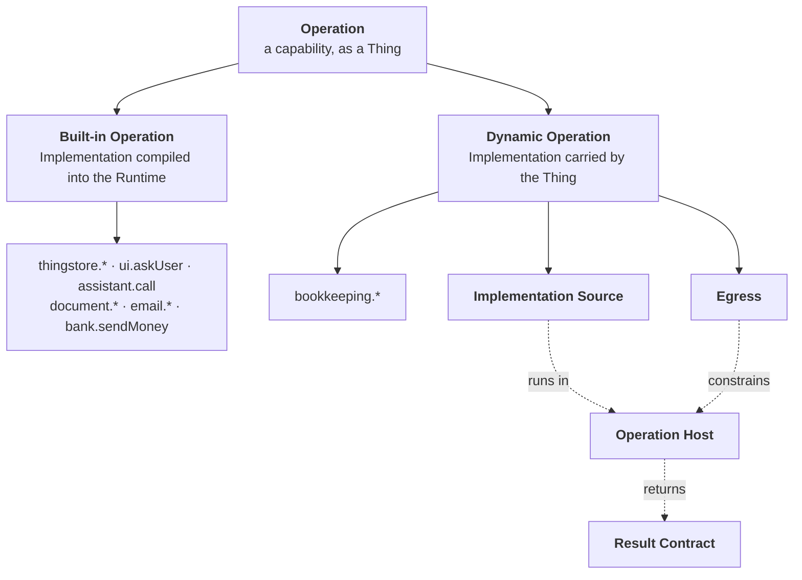

# Domain — what a Dynamic Operation adds to the language

[CONTEXT.md](../../../CONTEXT.md) defines an **Operation** as a capability a System offers, and an
**Implementation** as *"the code that performs one Operation. Not a Thing, because it is behaviour
and not data."* That second sentence stops being true for half the catalogue, and the vocabulary has
to say which half without anyone having to remember which.

## The split

**Built-in Operation**:
An Operation whose Implementation is code in the Runtime's own source, compiled and shipped with it.
It runs inside this system's scope, context and domain — it reads and writes Things, asks the User,
starts an Assistant, reads an attachment's bytes — and it knows the vocabulary of this codebase. It
is changed by changing this repository. Everything ADR-0019 says about an Implementation being
authoritative over the Thing continues to hold for it, without exception.
_Avoid_: native, core, compiled operation, hard-coded

**Dynamic Operation**:
An Operation whose Implementation is carried by its own Thing, as source the User may read and edit,
and executed by the Operation Host rather than called. It belongs to an External System, and what it
does is reach that system and translate the answer. It is configuration in the sense that matters:
changing it is an edit and a Turn, not a release. It is not a lesser Operation — it is granted,
approved, reconciled, logged and refused exactly like a built-in one, and an Assistant cannot tell
which kind it is holding.
_Avoid_: script, plugin, custom operation, user-defined operation

**Implementation Source**:
The text of a Dynamic Operation's Implementation: TypeScript declaring an `execute` function and,
where it matters, a `reconcile` one. Stored on the Operation Thing, so it is versioned by the store,
readable in the web application beside the prose that describes it, and writable only by an actor
holding `ASSISTANT_WRITE` — which the Runtime is not, and no Assistant is. It has no imports and no
module system: everything it may reach is handed to it.
_Avoid_: script, snippet, code (unqualified), handler body

**Operation Host**:
The half of the Runtime that turns Implementation Source into a running Implementation: it compiles
the source, evaluates it inside a sandbox, hands it the one capability it is allowed, bounds it in
time and memory, and translates what comes back into the same outcome a built-in returns. It is to a
Dynamic Operation what `implementations.ts` is to a built-in one, and it is the *only* component that
ever holds both a credential and someone else's source.
_Avoid_: interpreter, engine, executor, plugin loader, VM

**Egress**:
The single named outward capability a Dynamic Operation is granted — a base URL and the credential
for it, resolved from deployment configuration by the Operation Host. Source names the egress
(`bookkeeping`) and never the URL or the token: it cannot reach a host that is not the one bound, and
it cannot read the credential the host attaches on its behalf. An Operation with no egress can
compute and nothing else.
_Avoid_: endpoint, target, connection, scope

**Result Contract**:
How what the Source returns becomes an Operation's outcome. A returned value is a `value` outcome; a
thrown `OperationError` is an `error` outcome whose message the model reads; anything else thrown is
an `error` outcome with a message that says only that the Operation failed, with the detail going to
the log and never to the transcript; a returned `host.pending(...)` is a `pending` outcome, because
[an Operation may answer *not now*](../../../runtime/src/operations/implementations.ts) and a
Dynamic one is not excused from that. What it may *not* do is decide its own success by convention —
an HTTP 404 is a value, an error or neither depending on what was asked, and the Source is the only
thing that knows which.
_Avoid_: return mapping, error handling, response schema

## What changes in the existing language

- **Implementation** stops being *"not a Thing"* without qualification. It is behaviour in both
  cases; for a Dynamic Operation that behaviour is *carried* by a Thing, and the honest sentence is
  that an Implementation is never a Thing but may be **stored on** one.
- **Connector** loses ground it will not get back. `FireflyConnector` was a Connector in the
  glossary's sense — the translator between a foreign representation and Things — and after this
  change that translation lives in seven pieces of Source instead of one class. The word survives for
  Mail, for the Content Store and for the Manual Connectors; for Bookkeeping the Connector has become
  the Operation Host plus the Source it runs, and the glossary should say so rather than let the word
  quietly go unused.
- **Manual Connector** is unaffected and is worth naming as unaffected: `bank.sendMoney`,
  `email.send` and `document.requestText` raise an Open Question and suspend. That is Assistant-domain
  behaviour — it needs a Conversation, an idempotency key and the question-raising service — so it is
  built-in, and would be even if a bank API existed.
- **Approval** is unchanged in every respect. It is a property of the Operation Thing, the Turn loop
  enforces it before `execute` is reached, and it does not care which kind of Implementation is
  behind it. `bookkeeping.postTransaction` becoming dynamic does not move that check by one line.

## Who is involved

| Party | Built-in Operation | Dynamic Operation |
|---|---|---|
| **The User** | switches it off, reads its prose, adds or removes an approval | all of that, plus **writes what it does** |
| **A developer** | writes and reviews the Implementation | writes the seed a fresh install is created with, and never touches a running one |
| **The Runtime** | registers it, resolves it, executes it | compiles it, sandboxes it, executes it — and may not write it |
| **An Assistant** | is granted it, calls it | identical, and cannot tell the two apart |

The new sentence in the domain, and the one worth arguing about, is the User's cell in that table.
It is the first capability in this system that the household's owner can create rather than only
constrain — and the reason it is safe to say is that the actor who can write an Operation Thing is
already the actor who can rewrite an Assistant's system prompt, which was always the more dangerous
of the two.
