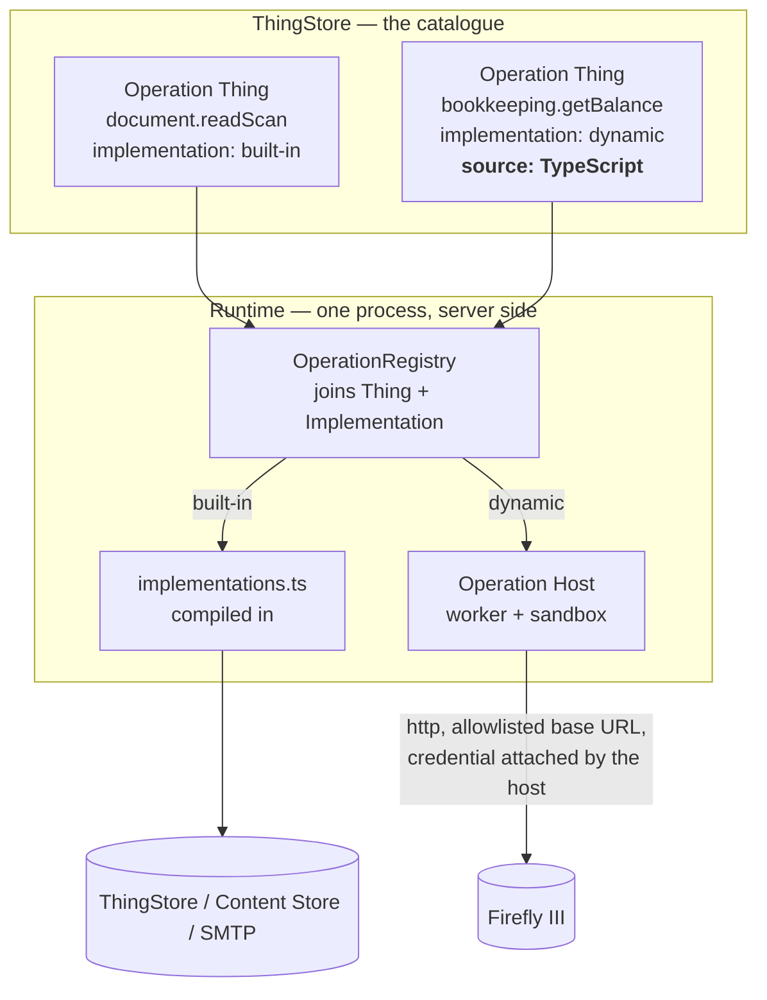

# Proposal — an Operation the User can write

## What

Today an Operation is half data and half code, and the code half is always ours: `Operation_DM`
holds the prose, the parameter schema, the approval checkbox and the kill switch, and
`runtime/src/operations/implementations.ts` holds the 1,679 lines that actually do the thing. That
split is [ADR-0019](../../../docs/adr/0019-an-operation-is-a-thing.md)'s, and its load-bearing
sentence is *"the Implementation cannot be data, and that is what makes this safe to do."*

This change splits the catalogue in two.

| | **Built-in Operation** | **Dynamic Operation** |
|---|---|---|
| Implementation lives in | `runtime/src` — compiled with the Runtime | the Operation Thing, as TypeScript source |
| Who writes it | whoever changes this repository | the User, in the web application |
| Reviewed by | git, a diff, a test suite | the User, and the store's write authority |
| Changing it needs | a release | an edit and the next Turn |
| Belongs to | the ThingStore, the UserInterface, the Runtime | an External System |
| Today's examples | `thingstore.*`, `ui.askUser`, `assistant.call`, `document.*`, `email.*` | — |
| After this change | those, unchanged | `bookkeeping.*` — all seven |

The line between them is not "internal versus external" by accident. A **built-in** Operation runs
inside this system's own scope, context and domain: it reads and writes Things, it asks the User a
question, it starts another Assistant, it reads bytes out of the Content Store. Those are things
this codebase *is*, and their Implementations are not configuration in any useful sense — they know
about `ThingRepository`, about idempotency keys, about the Conversation they are running inside. The
document store is integral to Assistants and so is the mailbox; neither is a foreign system we happen
to have a client for.

A **dynamic** Operation is the other case: a foreign HTTP API, reached with a credential, whose
response has to be turned into something a model can read. Firefly III is that, exactly and only
that. Nothing in `bookkeeping.getBalance` is about Assistants — it is a `GET /api/v1/accounts`, a
search through the answer for one name, and a projection down to three fields. That is a piece of
integration configuration wearing a compiled-language costume, and every time the household's books
move to a different system, or Firefly changes an endpoint, the costume has to be re-tailored by
someone with a checkout, a toolchain and a deploy.

**All of it runs server side.** The source is stored in the ThingStore, compiled in the Runtime
container and executed in a worker thread inside that same process. The browser never receives it,
never evaluates it, and never learns it exists; the one inbound call the Runtime accepts
([ADR-0023](../../../docs/adr/0023-the-runtime-is-the-door-outward.md)) still names an Operation and
gets a value back, and the fact that the value was produced by stored source rather than compiled
source is invisible from outside the container. The credential is never inside the sandbox either —
the host attaches it on the way out.

**Scope.** Four things, and nothing else:

1. `Operation_DM` gains an implementation half — `implementation`, `source`, `language`, `egress`,
   `timeoutMs`, and `clientReadable` (the peer of the existing `mutating`, now read off the Thing for
   a dynamic Operation) — with a form to edit it in.
2. The Runtime gains an **Operation Host**: compile, sandbox, execute, translate the result. Roughly
   400 lines and its own test file.
3. The registry's join becomes a two-source join, and a key that resolves to both a built-in and a
   dynamic Implementation is refused rather than ranked.
4. All seven `bookkeeping.*` Operations are rewritten as dynamic source against Firefly's HTTP API,
   and the compiled ones are deleted.

**Not in scope.** No new Operation, no new capability for any Assistant, no change to grants, to
approvals, to the Turn loop, to how the Dashboard calls in, or to what the User sees on a
Conversation. An Assistant cannot tell the difference, and that is the acceptance criterion.

## Why

**Because the catalogue currently answers a question it cannot back up.** ADR-0019 moved the
catalogue into the store so a User deciding what the Receptionist may reach would not have to read
TypeScript. It half-worked: they can read what an Operation *claims* to do and switch it off, and
if they want to know what it *does* they are back in `implementations.ts`. For `thingstore.create`
that is honest — the answer really is "it writes a Thing here, in this system's own terms". For
`bookkeeping.listOpenItems` the answer is "it calls `GET /api/v1/accounts` and keeps the non-zero
payables", which is four lines the User could read, and today cannot.

**Because integration churn should not be a release.** Firefly's read API answers `liabilities`
where its write API accepts `liability`; that mismatch made `listOpenItems` report nothing while
thousands were owed (BUG-02), and fixing it meant a code change, a rebuild and a redeploy of the
process that watches the mailbox. The blast radius of a spelling fix in a foreign API's vocabulary
should be that Operation and no more.

**Because the second External System is coming and the first one taught us nothing reusable.**
`FireflyConnector` is 707 lines, and the bank will be another 700, and the insurer another. Each is
a bespoke client compiled into a scan loop. A dynamic Operation makes the *n*th system's cost the
source of its Operations rather than a module, a wiring change in `services.ts`, a config block and
a release.

**Because it is where the system was already heading.** ADR-0003 made Assistants Things because they
are definitions the User edits. ADR-0019 made Operations Things for the same reason and stopped at
the code. The prompt an Assistant reasons with is already stored, already User-editable and already
far more dangerous than four lines of `GET`; the argument for keeping the smallest, dullest, most
foreign part of the system compiled is mostly that it was written first.

## The part that is deliberately uncomfortable

ADR-0019 says the Implementation cannot be data *and that is what makes this safe*. This proposal
makes it data. That is a real amendment and it deserves to be stated in the words of the thing it
weakens, not smuggled past.

What ADR-0019 was actually protecting against is named in the same paragraph: `exec` with extra
steps — an Assistant talking its way into arbitrary code execution, which is learning 17 of
ASSISTANTS_VS_OPENCLAW.md. **That protection survives intact, and it never came from the code being
compiled.** It came from write authority. An Assistant cannot write `Operation_DM`: the `runtime`
role holds no `ASSISTANT_WRITE`, the model is absent from `WRITABLE_MODELS`, absent from
`READABLE_MODELS` and absent from `TRIGGER_ELIGIBLE_MODELS`. An Assistant cannot read the source, can
not write the source, cannot cause the source to be written, and cannot be triggered by the source
changing. The only actor who can author a dynamic Operation is the human being who could already
`git push` to this repository.

What genuinely changes is narrower, and it is this: **for a dynamic Operation, `mutating` can no
longer be a claim about reviewed code.** The registry deliberately refuses to read `mutating` from
the Thing, because a `mutating: false` edited onto a booking would make crash recovery treat a
double posting as harmless. For a built-in that stays exactly as it is. For a dynamic one there is no
compiled author to ask, so the flag becomes the User's — with the consequence spelled out in
[architecture.md](architecture.md), and with the deployment allowlist, which lives in the compose
file and not in the store, carrying the weight at the one boundary where a browser is the caller.

Two mitigations do the rest of the work, and neither is a jail:

- **The sandbox is containment, not a security boundary.** A `node:vm` context with a curated global
  object, inside a worker thread with no module loader, a hard timeout and a memory ceiling. It stops
  a typo taking the scan loop down with an infinite loop, and it stops source reaching `fs` by
  accident. It is not claimed to stop a determined attacker who can already write to the store, and
  the artifacts say so in those words rather than implying otherwise.
- **Egress is allowlisted and the credential never enters the sandbox.** Source names an *egress*
  — `bookkeeping` — and the host resolves it to a base URL and a token from configuration. The
  injected client refuses any other host. Source cannot read `process.env`, cannot open a socket, and
  cannot exfiltrate a token it was never given.

## What "success" looks like

The vertical slice in the README runs end to end, unchanged, on a stack where every `bookkeeping.*`
Operation is stored source: a doctor's invoice arrives, the Receptionist classifies it, the
Accountant reads the chart of accounts, raises *book €96.50 to Expenses:Health?*, the User answers in
the web application, and the transaction lands in Firefly — with the approval still enforced, the
`external_id` idempotency still holding across a crash, and the Dashboard's Accounts and Transactions
Tiles still rendering. `FireflyConnector`'s operation-serving methods are gone. Nobody had to read
TypeScript to find out what `bookkeeping.getBalance` does, because it is on the page.
