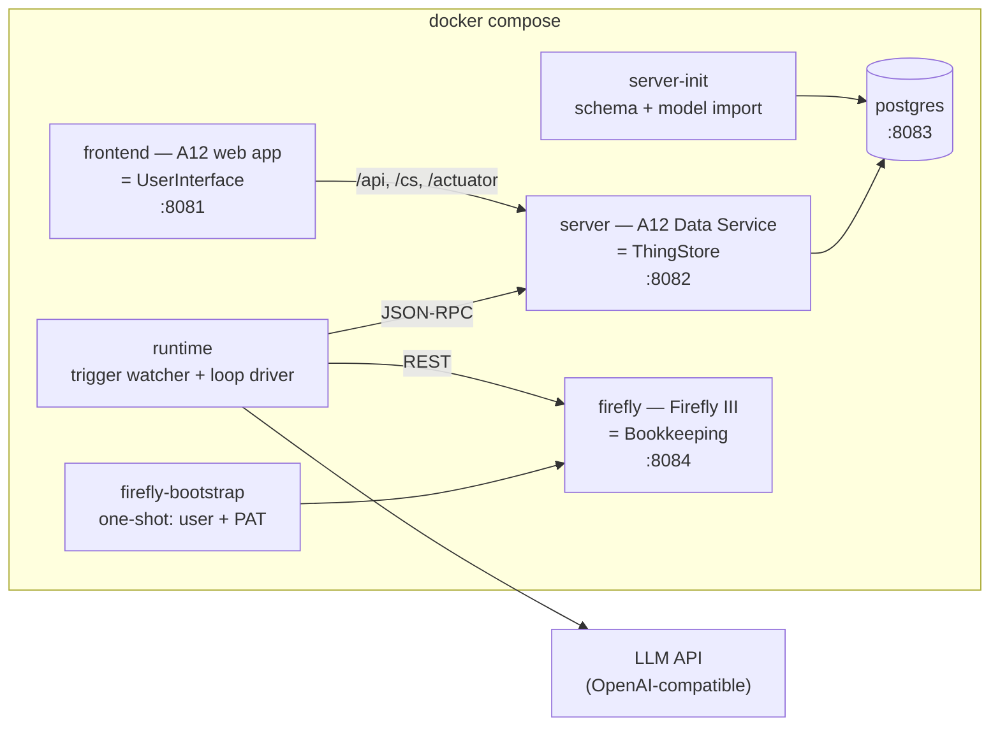

# Architecture — how the first running system is built

## The stack

Everything runs in **one** `docker compose` file, as the brief requires.



Five long-running services (frontend, server, postgres, firefly, runtime) plus two one-shot init containers (server-init, firefly-bootstrap). No Keycloak (the A12 **local-auth** variant
authenticates against YAML user files — D-003), no second database (Firefly runs on SQLite —
D-004), no message broker, no workflow engine (AGENTIC_LOOP.md Q5).

### Why the Runtime is a separate service and not A12 server code

The A12 Data Service is a platform component we configure, not an application we own — its jar
comes from the registry and the template adds only a handful of Java classes. Putting a
long-running agentic loop, an LLM client and an HTTP connector inside it would fuse our
application's lifecycle to the platform's and make every Runtime change a Spring Boot rebuild.

Keeping it outside also keeps the ADR-0006 boundary honest: the Runtime is a *client* of the
ThingStore with no privileged access, exactly like the UserInterface.

**TypeScript on Node 24**, because the LLM SDKs are first-class there, the repo already carries
a Node toolchain for the A12 client, and the loop is I/O-bound orchestration rather than
computation.

## Repository layout

The A12 project template's shape is kept at the repository root — deviating from it would fight
every Gradle task the template provides.

```
/
├── justfile                  ← the command surface (just dev / test / clean / demo-data)
├── settings.gradle           ← + pinned public A12 registries (D-006)
├── .npmrc                    ← + pinned public A12 npm registry (D-006)
├── client/                   ← A12 web application = UserInterface
│   └── src/components/markdown-editor/   ← lifted from w12-on-a12
├── server/                   ← A12 Data Service = ThingStore (app + init)
├── import/
│   ├── models/               ← our A12 models, one folder per Thing
│   ├── auth/                 ← roles.yaml + users/*.yaml (local auth)
│   └── validate-models.mjs   ← model validation, both directions
├── runtime/                  ← the Runtime (TypeScript)
│   ├── src/a12/              ← JSON-RPC client for the ThingStore
│   ├── src/llm/              ← provider interface + OpenAI/Anthropic/scripted
│   ├── src/loop/             ← advance(conversation) — the loop driver
│   ├── src/watcher/          ← the trigger watcher
│   ├── src/tools/            ← the Tool registry
│   ├── src/connectors/       ← firefly
│   ├── src/bootstrap/        ← the Assistants as seed data
│   └── src/demo/             ← the demo household loader
├── compose/docker-compose.yml
├── e2e/                      ← Playwright
└── specs/, docs/adr/, CONTEXT.md, DECISIONS.md
```

## Models

Eight Models, each with a document model (`_DM`), a form model (`_FM`) and, where users browse
them, an overview model (`_OM`), plus one application model (`_AM`) for navigation. Form models
bind **directly** to their document model (`purpose: "data binding"`) — no composed-document
layer, because references between Things are plain ThingID strings (domain.md).

| Model | Authority | Purpose |
|---|---|---|
| `Assistant_DM` | ThingStore | An Assistant's definition: prompts, Skills, Triggers, Tools (ADR-0003) |
| `Conversation_DM` | ThingStore | One run of one Assistant; Runtime-owned, never user-edited (ADR-0004) |
| `OpenQuestion_DM` | ThingStore | A question put to the User, and the User's answer to it |
| `Document_DM` | ThingStore | An arrived, not-yet-understood item |
| `Invoice_DM` | ThingStore *(document facts only)* | The extracted invoice; **no payment status** (ADR-0006) |
| `Process_DM` | ThingStore | The routing slip; passive (AGENTIC_LOOP.md Q4) |
| `Party_DM` | ThingStore *(provisional)* | People and organisations we deal with |
| `RuntimeState_DM` | ThingStore | Singleton: the watcher's watermark, the pause flag, the birth counter |

### Four modelling rules the query API forces on us

The A12 query API is narrower than it looks, and the watcher's scans are the system's hot path.
Four rules, applied at model-design time rather than discovered later:

1. **Every machine-filtered field is a `String` carrying a code, never an `Enum`.** A12 indexes
   enumeration fields by their *localised display text*, so `exact_match` on `"waiting"` returns
   nothing while `"Waiting"`/`"Wartend"` would — a locale-dependent core query. `status`,
   `waitingFor`, `finishReason`, `kind` are therefore Strings; the form model still renders a
   dropdown, but the index sees ASCII.
2. **Never filter on a path inside a repeating group.** No evidence exists that constraints can
   address inside one. Anything the watcher needs is a top-level scalar; the two Assistants are
   loaded whole and their `triggers[]` matched in the Runtime.
3. **Every watcher-filtered field carries the `indexed` annotation.** Only indexed fields are
   queryable at all.
4. **Every Model carries our own `createdAt` / `updatedAt` and an `idempotencyKey`.**
   `__meta.createdAt` has second granularity and inclusive range bounds, which double-counts the
   boundary; and the idempotency key is what makes creation safe to retry (below).

The one pattern worth naming, because it is used twice: "set but not yet processed" is
`and(not(undefined_match(x)), undefined_match(y))`.

### Assistant_DM

```
key                String   indexed, unique, stable — how Triggers and calls name it
name               String
description        String
systemPrompt       String   lineBreaksPermitted, widget=markdown-editor
llmModel           String
enabled            Boolean  false stops births AND continuations
maxTurns           Number   integer, default 20
skills[]           Group    name : String, instructions : String (markdown)
triggers[]         Group    kind : String (thing-materialised | assistant-call | schedule),
                            modelFilter : String, cron : String
tools[]            Group    operation : String   ← the declaration ADR-0010 requires
idempotencyKey, createdAt, updatedAt
```

Tools are declared as Operation names, and a call to another Assistant is declared as
`assistant.call:<assistantKey>` — one row per permitted callee. A bare `assistant.call` would let
an Assistant reach every Assistant including itself, which would empty ADR-0010's promise that
"reading an Assistant tells you what it can reach". Self-calls are rejected at registry level.

### Conversation_DM — Runtime-owned

```
assistantKey         String    indexed
subjectThingId       String    indexed   the Thing this run is about
subjectModel         String              the other half of the ThingRef
status               String    indexed   running | waiting | done | failed
waitingFor           String    indexed   user | tool | assistant
finishReason         String              answered | wants-tools | length | limit | error
turnCount            Number
wakeAt               DateTime  indexed
leaseUntil           DateTime  indexed
parentConversationId String    indexed
currentQuestionId    String    indexed   the OpenQuestion this run is waiting on
resultDeliveredAt    DateTime  indexed   guards scan #5 against re-delivery
escalationCount      Number              terminal escalations so far; capped at 3
createdByConversationId String indexed
entries[]            Group     seq, role, kind, text, toolName, toolArgs, toolResult,
                               idempotencyKey, at
idempotencyKey, createdAt, updatedAt
```

The User never writes this document. Its form is read-only, which is what keeps A12's
**last-write-wins** semantics harmless: A12 has no version, ETag or revision concept anywhere, so
any document written by two parties would silently lose one party's work. Every document in this
design has exactly one writer at any instant.

For the same reason `leaseUntil` is documented as **crash recovery, not mutual exclusion** — with
no compare-and-swap there is no lock to be had. Compose therefore declares exactly **one** Runtime
replica, and that is a constraint, not an implementation detail.

### OpenQuestion_DM — the one document with two writers, in sequence

```
conversationId   String   indexed
seq              Number   which entry of the Conversation raised it
kind             String   free-text | confirm | choice | perform
prompt           String   markdown, read-only to the User
options[]        Group    value : String        (for kind=choice)
idempotencyKey   String   indexed
--- the User fills these in ---
text             String
choice           String
confirmed        Boolean
answeredAt       DateTime indexed
createdAt, updatedAt
```

The **Runtime creates it** at the moment it suspends — that is the only moment when the
`conversationId` is known — writes it once, and never touches it again. The **User completes it**
through the ordinary A12 instance form. Two writers, never concurrent.

This is why there is no separate `Answer` Model. A12 navigation is scene-based, matched on
`module` + `instance`, with no way to open a create-form pre-filled from the row you came from; an
Answer Thing would have forced the User to copy a ThingID by hand, or forced us into the custom
client code D-005 exists to avoid.

The Open Questions view is then a plain overview over one Model filtered
`undefined_match(answeredAt)` — which is ADR-0004's demand that "awaiting the User must be a
queryable state", satisfied literally.

**Late answers**: `wakeAt` may fire while the User is typing. The rule is that an answer whose
`seq` is behind the Conversation's current position is appended as an entry and otherwise ignored
— the same rule as a late child result (below).

### Invoice_DM has neither a `paid` field nor a `bookkeepingRef`

No `paid`, because ADR-0006 makes Bookkeeping the Authority for whether an invoice is owed, paid,
claimed or reimbursed.

And no `bookkeepingRef` either, which is the less obvious half. A reference stored on the Thing
would be a **cached foreign fact**, and ADR-0006's consequences say plainly: "Assistants must not
cache foreign facts as Thing fields." The User works directly in Firefly and may re-split or
delete a transaction at any time, at which point our copy is a lie. The link therefore lives only
in the Authority: Firefly carries the Invoice's ThingID as a tag `thing:<thingId>` and a deep link
in `external_url`. "How was this Invoice booked?" is a search, exactly like "is it paid?".

### RuntimeState_DM

A singleton holding what the watcher needs between scans and what a human needs to stop it:
`watermark` (DateTime), `watermarkDocRefs[]` (the docRefs already seen at the boundary second),
`paused` (Boolean — the kill switch), `birthsThisHour`, `birthWindowStartedAt`, and
`heartbeatAt`, stamped at the end of every successful scan.

`heartbeatAt` is what makes silence visible. The terminal-failure tier below writes an Open
Question so nothing ends quietly — but that escalation *shares fate* with the failures it is
meant to report: if the ThingStore is unreachable, the token flow is broken or the scan loop has
thrown, the escalation is itself the operation that is failing, and the only symptom is that
nothing happens. For a system whose promise is "drop an invoice in and a question appears within
seconds", that is the one failure the User cannot detect. So the `runtime` service carries a
compose **healthcheck that fails when the last heartbeat is stale**, and a scan that throws
deliberately leaves the previous heartbeat untouched — silence must be *recorded* silence.

## The Runtime

### The loop driver

One function with no state of its own, exactly as AGENTIC_LOOP.md concludes:

```
advance(conversationId):
    conv = thingStore.get(conversationId)
    if conv.status not in (running, waiting) or not claimLease(conv): return
    if conv.turnCount >= assistant.maxTurns: raiseTerminal(conv, 'limit'); return
    context = buildContext(conv)              # system prompt + skills + entries
    response = llm.complete(context, toolsOf(conv.assistant))
    append(conv, response); conv.turnCount++
    if response.finishReason != 'wants-tools':
        finish(conv)                          # done, or deliver the result to the parent
        write(conv); return
    for call in response.toolCalls:
        key = conv.id + ':' + nextSeq(conv)
        append(conv, intent(call, key))
        write(conv)                           # ← INTENT IS WRITTEN BEFORE EXECUTION
        result = tools.execute(call, conv, key)
        if result.pending:
            conv.status = 'waiting'; conv.waitingFor = result.waitingFor
            conv.wakeAt = result.wakeAt
            write(conv); return               # the process now holds nothing
        append(conv, toolResult(call, result))
    write(conv)
```

Three properties are load-bearing:

1. **One call, one Turn.** `advance` never loops internally. Continuing is re-entry, through the
   same door birth uses — the claim ADR-0005 makes and all three surveyed systems confirm.
2. **The pending path is the normal path.** Every Tool may answer `pending`. That single
   generalisation is what turns a coding-agent loop into ours.
3. **The Conversation is an intent log, not a result log.** The intent — including its
   idempotency key — is written *before* the Operation runs. This is what makes lease recovery
   safe: see below.

### Idempotency, and why it is the difference between a bug and a lost €184.30

If the Runtime dies after `bookkeeping.postTransaction` returns 200 and before the Conversation is
written, a naive recovery re-runs the Turn against real books. The contract that prevents it:

> **Every Operation is either read-only or idempotent under a caller-supplied key. No Operation
> may be both mutating and unkeyed.** Where the Authority offers no unique constraint, keyed
> idempotency is achieved by **search-then-act**.

The key is `<conversationId>:<entrySeq>` — deterministic across a re-run of the same Turn.
Recovery finds an intent entry with no matching result and *asks* the Connector whether that key
landed; it never re-executes blind.

- **Firefly**: the key goes in `external_id`; recovery is an `external_id_is:` search, with
  `error_if_duplicate_hash` as a belt.
- **ThingStore**: `ADD_DOCUMENT` assigns the docRef, so the client cannot choose an identifier.
  Hence the `idempotencyKey` field on every Model, and `thingstore.create` is defined as
  *search-then-create*: `exact_match` on `idempotencyKey`, return the existing docRef if found,
  otherwise add. One extra query per create, which at this scale is free — and it is the same
  primitive that makes the demo loader re-runnable.
- **Manual Connectors**: the key is carried on the `OpenQuestion`, so a re-run finds the question
  already asked rather than asking twice.

### When things go wrong

`status = failed` must never be somewhere a Conversation *falls*. One policy, three tiers:

| Tier | Examples | Response |
|---|---|---|
| **Transient** | LLM timeout, 429, 5xx | Bounded retry with backoff inside the Turn; each attempt recorded as an entry |
| **Recoverable by the model** | Malformed tool-call JSON, undeclared Tool requested, 422 from a Connector, ThingStore validation error | Append the error **as a tool result** and let the next Turn see it — this is how the model self-corrects, and it costs nothing |
| **Terminal** | Retries exhausted, `maxTurns` reached, an Authority refusing repeatedly | **Never silent**: `status = waiting`, `waitingFor = user`, and an `OpenQuestion` of kind `perform` carrying the error. Capped at three escalations per Conversation, so a persistent outage answered with "retry" cannot produce a question per attempt |

So a stuck Conversation surfaces in the same view as everything else, and `failed` comes to mean
only "the User abandoned it" — a state a human chose rather than one the system fell into. Losing
work silently is exactly what ADR-0004 exists to forbid.

### The trigger watcher

A scan every two seconds. It does nothing at all while `RuntimeState.paused` is true.

| Scan | Query | Action |
|---|---|---|
| 1 | Things of a **trigger-eligible Model** created after the watermark, for which no Conversation exists with `(assistantKey, subjectThingId)` | birth |
| 2 | Conversations `waiting` on `user` whose `currentQuestionId` resolves to an `OpenQuestion` with `answeredAt` set | append the answer, continue |
| 3 | Conversations `waiting` with `wakeAt` in the past | append a timeout entry, continue |
| 4 | Conversations `running` with `leaseUntil` in the past | recover per the intent log, continue |
| 5 | Conversations `done` with a `parentConversationId` and no `resultDeliveredAt` | deliver to the parent, stamp, continue |
| 6 | Assistants with a due `schedule` Trigger | birth |

Scan 2 deserves a note, because it is where the single-writer invariant could have been lost. The
answer has to be *consumed* exactly once, and the obvious mechanism — stamping `consumedAt` on the
OpenQuestion — would give that document a second Runtime write, at the worst possible moment,
while the User may still be editing it. So consumption happens on the **Conversation**, which the
Runtime owns exclusively: continuing clears `waitingFor`, and the Conversation therefore stops
matching the scan. The OpenQuestion is never touched twice. This also disposes of the User
re-editing an answered question — the Conversation has moved on, so nothing happens. It is the
same rule as a late child result and a stale `seq`: three cases, one shape.

Scan 1's "no Conversation exists with `(assistantKey, subjectThingId)`" is two indexed
`exact_match`es, and it is what makes birth **exactly once** rather than *probably* once. It also
subsumes — but does not replace — the rule that nothing is birthed from a Thing whose creating
Conversation is still running.

### Guards against a runaway

An LLM loop with a two-second scan and a credit card needs bounds that the surveyed coding agents
do not, because they have a human watching every turn and we do not:

- **A trigger-eligible allow-list** — `Document`, `Invoice`, `Process`, `Party`. It structurally
  excludes `Conversation`, `Assistant`, `OpenQuestion` and `RuntimeState`, because an Assistant is
  a Thing and a Conversation is a Thing (ADR-0003), so without this the Runtime triggers on its
  own output.
- **`maxTurns`** (default 20) → `finishReason = limit` and an Open Question, not a silent stop.
- **`createdByConversationId`** on everything an Assistant creates, and no birth from a Thing whose
  creating Conversation is still running — this breaks the self-feeding loop without banning
  legitimate chains.
- **`RuntimeState.paused`** as a global kill switch, and a births-per-hour cap.
- **`Assistant.enabled = false`** stops continuations as well as births.

### Tools

An Assistant may call only the Operations its `tools[]` declares (ADR-0010); the registry filters
the schemas offered to the LLM by that list, so an undeclared Operation is not merely refused — it
is invisible. (There is a unit test for the refusal anyway, precisely because filtering should make
it unreachable.)

| Operation | System | Kind |
|---|---|---|
| `thingstore.create` / `.get` / `.update` / `.search` | ThingStore | internal; create is search-then-create |
| `ui.askUser` | UserInterface | internal, **pending** — writes an `OpenQuestion` |
| `assistant.call:<key>` | — | **pending** (ADR-0007), `awaitMode: wait \| chase \| detach` |
| `bookkeeping.postTransaction` / `.getBalance` / `.listOpenItems` / `.getBudgetReport` / `.createAccount` | Firefly III | Connector; posting is keyed |
| `document.requestText` | — | **Manual Connector** — asks the User to paste the text |
| `email.send` / `email.fetch`, `bank.sendMoney` | Email, Bank | **Manual Connector** |

A Manual Connector is not a special mechanism: it returns `pending` with `waitingFor: tool` and
writes an `OpenQuestion` of kind `perform`. The Assistant cannot tell the difference, which is what
CONTEXT.md asserts and what makes automating one later a Connector-only change.

**Late child results**: a result arriving for a Conversation that is already `done` is appended as
an entry and changes nothing. A log line, never a resurrection.

### The LLM provider

```ts
interface LlmProvider {
  complete(req: { system: string; entries: Entry[]; tools: ToolSchema[] }): Promise<LlmResponse>;
}
```

`OpenAiProvider` (default — D-002), `AnthropicProvider`, and `ScriptedProvider`, which replays
recorded responses. Crucially the choice is made by the **`LLM_PROVIDER` environment variable on
the compose service**, not only by a constructor argument: that is what lets the end-to-end tier
drive the *real* Runtime, ThingStore, Firefly and UI deterministically and for free.

## Lifting the markdown editor

From `w12-on-a12` (2026.06, same A12 line — D-003), copy:

- `client/src/components/markdown-editor/**` minus `editor/Collab*.tsx` and `plugins/collab/**`
- `client/src/components/ModelElementBridge.tsx`, `widgetAnnotation.ts`, `TextAreaStatelessWidget.tsx`
- the `markdownEditor` localisation subtree
- `components/color-picker/colors.ts`

and drop the entire collaborative-editing subsystem — it is gated behind a `collab-field`
annotation we simply never set, and without it `CollabEditorBoundary` falls straight through to
the single-user editor.

Wiring, in `client/src/appsetup.ts`:

```ts
viewConfig: {
  formModelMap: { ...DefaultFormModelMap, Control: { component: createModelElementBridge(...) } },
  widgetMap:    { ...DefaultFormEngineWidgetMap, TextAreaStateless: MarkdownTextArea },
}
```

A field becomes a markdown field by three coordinated facts: `lineBreaksPermitted: true` on the
`StringType` in the `_DM`, `"exposition": "AREA"` in the `_FM`'s `fieldConfiguration`, and
`{"name":"widget","value":"markdown-editor"}` on the `_FM` Control. This is the "String plus
annotation" mechanism MARKDOWN_FIELDS.md describes, using native A12 features only.

**Constraint**: `lexical` must resolve to a single instance shared with `widgets-core`, or
Lexical's `$`-functions break. Verified in the build with `npm ls lexical`.

## Who the Runtime is

The Runtime authenticates against UAA `LOCAL` like any other client:

```
POST /api/user/local/login   {"username": "...", "password": "..."}
→ 200, JWT in the **response headers**: access_token, access_token_expiration,
                                        token_renew_in_seconds
subsequent calls:  Authorization: UAABearer <token>     ← UAABearer, not Bearer
```

Tokens last 1800 s and there is no refresh token and no client-credentials grant. The Runtime
caches the token in memory and re-logs-in lazily on the first 401 — a process that talks to the
store every two seconds does not need PKCE renewal.

It logs in as a **dedicated `runtime` user with a dedicated `runtime` role**, never as `admin`.
Two reasons, both sharp:

- `import/auth/childAuthorizationDefinition.json` deliberately **bypasses every ownership policy
  for the `admin` role** (`"target": "!containsAnyRole('admin')"`). Handing the LLM-driven half of
  the system the one identity that can edit and delete anything regardless of ownership would
  contradict ADR-0010's whole argument that capability is declared, not assumed.
- `__meta.creator` is the only provenance the ThingStore records. If the Runtime were `admin`,
  its writes would be indistinguishable from the human's edits in the UI.

The `runtime` role gets exactly `DOCUMENT_CREATE`, `DOCUMENT_UPDATE`, `DOCUMENT_PARTIAL_UPDATE`
and `QUERY` — **not** `MODEL_MANAGE`, and **not** `DOCUMENT_DELETE`. An Assistant that hallucinates
a delete gets a 403 instead of losing an invoice.

## Bookkeeping connector

Firefly **auto-creates an expense or revenue account when it is given a name it does not know**.
The Accountant's job is precisely to decide which accounts an invoice hits, and it decides by
emitting a name — so `Expenses:Helth` would not fail, it would succeed, silently creating a second
account and quietly corrupting a balance no test would catch. ADR-0006 makes that worse rather
than better: Bookkeeping is the Authority and nothing else holds a copy, so there is no second
opinion to disagree.

Therefore the Connector **never passes `source_name`/`destination_name`**. It resolves names to
IDs against `GET /accounts` (cached per scan); an unresolvable name comes back as a tool error,
which under the middle failure tier is appended as a tool result so the next Turn self-corrects
against the real chart. The Accountant also declares the read-only `bookkeeping.listAccounts`, so
it can *see* the chart rather than guess at it — and `bookkeeping.createAccount` is a separately
declared Operation that **the Accountant is not granted in this change**. That is exactly the
granularity ADR-0010 argued for, and the chart of accounts is a structural decision the User
should be making.


Firefly III 6.6.6 on SQLite. A one-shot `firefly-bootstrap` container registers the first user
and mints a Personal Access Token over Firefly's own web endpoints (no artisan command can do
it), writing the token to a shared volume the Runtime reads.

ThingIDs travel into the books as `external_id` (exact-match searchable) and a deep link as
`external_url`, so "which Thing is this transaction about?" and "how was this Invoice booked?"
are both answerable without a join table.

## Testing

Four tiers, all reachable from `just test`:

| Tier | Runner | What it proves |
|---|---|---|
| **Model validation** | Gradle `convertModels` + a JSON schema check | Every `_DM`/`_FM`/`_OM` is well-formed and every `elementRef` resolves |
| **Runtime unit** | vitest | The loop driver against `ScriptedProvider`: suspension, continuation, lease expiry, tool gating, finish reasons |
| **Integration** | vitest against the live compose stack | The A12 JSON-RPC client, the Firefly connector, the watcher's queries |
| **End-to-end** | Playwright | Log in, browse Things, edit an Assistant prompt in the markdown editor, answer an Open Question, see the resulting transaction in Firefly |

The scripted LLM provider is not a mock of a collaborator we own — it is a *recorded* substitute
for a paid, non-deterministic third party, and it is the only way the loop's branching (pending
tool call → suspend → resume) can be asserted at all. A separate, opt-in tier runs the same
scenarios against a live LLM, and is skipped when no API key is present.

## The command surface

`just` is the single entry point, and the README documents every recipe.

| Recipe | Does |
|---|---|
| `just dev` | Build models, jars, images; `docker compose up -d`; wait for health |
| `just demo-data` | Load the demo Things and the Firefly books into a running stack |
| `just test` | Model validation + runtime unit + integration + e2e |
| `just clean` | Compose down with volumes, remove build output |
| `just logs [service]`, `just ps`, `just restart` | Operate the stack |

## Rejected alternatives

| Alternative | Why not |
|---|---|
| Temporal for durability | AGENTIC_LOOP.md Q5: three mature systems get durable, restartable, days-long conversations from an append-only transcript plus a re-entrant loop. Temporal adds a cluster and a second event history, which ADR-0006 forbids. |
| The Runtime exposing a REST API the UI calls | A second authority for pending work; custom client code; a live process holding state. D-005. |
| A12 relationship models for Thing references | Binds a reference to a target Model at the model layer — the typed-identifier design ADR-0002 rejects. |
| Keycloak (the base template) | An extra service, an extra database and a realm import, for auth that is dev-grade either way. |
| Skills as their own Things | Invites the sharing ADR-0009 forbids. |
