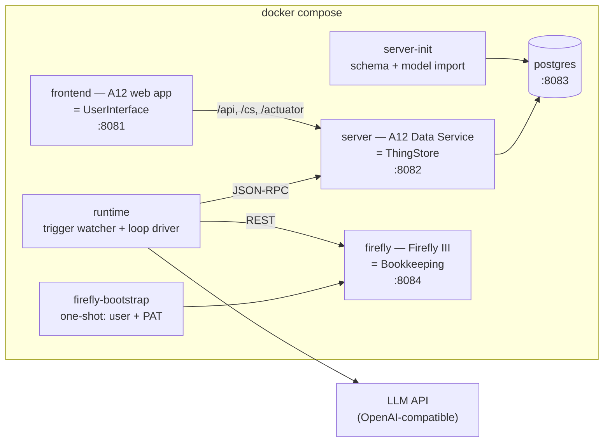

# Architecture — how the first running system is built

## The stack

Everything runs in **one** `docker compose` file, as the brief requires.



Six services plus two one-shot init containers. No Keycloak (the A12 **local-auth** variant
authenticates against YAML user files — D-003), no second database (Firefly runs on SQLite —
D-004), no message broker, no workflow engine (AGENTIC_LOOP.md Q5).

### Why the Runtime is a separate service and not A12 server code

The A12 Data Service is a platform component we configure, not an application we own — its jar
comes from the registry and the template adds only a handful of Java classes. Putting a
long-running agentic loop, an LLM client and an HTTP connector inside it would fuse our
application's lifecycle to the platform's and make every Runtime change a Spring Boot rebuild.

Keeping it outside also keeps the ADR-0006 boundary honest: the Runtime is a *client* of the
ThingStore with no privileged access, exactly like the UserInterface.

**TypeScript on Node 24**, because the LLM SDKs are first-class there, the repo already carries
a Node toolchain for the A12 client, and the loop is I/O-bound orchestration rather than
computation.

## Repository layout

The A12 project template's shape is kept at the repository root — deviating from it would fight
every Gradle task the template provides.

```
/
├── justfile                  ← the command surface (just dev / test / clean / demo-data)
├── settings.gradle           ← + pinned public A12 registries (D-006)
├── .npmrc                    ← + pinned public A12 npm registry (D-006)
├── client/                   ← A12 web application = UserInterface
│   └── src/components/markdown-editor/   ← lifted from w12-on-a12
├── server/                   ← A12 Data Service = ThingStore (app + init)
├── import/
│   ├── models/               ← our A12 models, one folder per Thing
│   ├── auth/                 ← roles.yaml + users/*.yaml (local auth)
│   └── data/demo/            ← demo data as JSON-RPC request files
├── runtime/                  ← the Runtime (TypeScript)
│   ├── src/a12/              ← JSON-RPC client for the ThingStore
│   ├── src/llm/              ← provider interface + OpenAI/Anthropic/scripted
│   ├── src/loop/             ← advance(conversation) — the loop driver
│   ├── src/watcher/          ← the trigger watcher
│   ├── src/tools/            ← the Tool registry
│   └── src/connectors/       ← firefly, manual
├── compose/docker-compose.yml
├── e2e/                      ← Playwright
└── specs/, docs/adr/, CONTEXT.md, DECISIONS.md
```

## Models

Six Models, each with a document model (`_DM`), a form model (`_FM`) and an overview model
(`_OM`), plus one application model (`_AM`) for navigation. The template's form models bind
**directly** to their document model (`purpose: "data binding"`) — no composed-document layer is
needed, because references between Things are plain ThingID strings (domain.md).

| Model | Authority | Purpose |
|---|---|---|
| `Assistant_DM` | ThingStore | An Assistant's definition: prompts, Skills, Triggers, Tools (ADR-0003) |
| `Conversation_DM` | ThingStore | One run of one Assistant; its own state (ADR-0004) |
| `Document_DM` | ThingStore | An arrived, not-yet-understood item |
| `Invoice_DM` | ThingStore *(document facts only)* | The extracted invoice; **no payment status** (ADR-0006) |
| `Process_DM` | ThingStore | The routing slip; passive (AGENTIC_LOOP.md Q4) |
| `Party_DM` | ThingStore *(provisional)* | People and organisations we deal with |

### Assistant_DM

```
key            String   unique, stable — how Triggers and calls name it
name           String
description    String
systemPrompt   String   lineBreaksPermitted, widget=markdown-editor
llmModel       String
enabled        Boolean
skills[]       Group    name : String, instructions : String (markdown)
triggers[]     Group    kind : Enum(thing-materialised | assistant-call | schedule | user-request),
                        modelFilter : String, cron : String
tools[]        Group    operation : String   ← the declaration ADR-0010 requires
```

Tools are declared as a repeating group of Operation names. Nothing outside that list is
reachable, and the list is visible by reading the Assistant — which is exactly the argument in
ADR-0010.

### Conversation_DM

```
assistantKey       String
title              String
subjectThingId     String        the Thing this run is about
subjectModel       String        the other half of the ThingRef
status             Enum          running | waiting | done | failed
waitingFor         Enum          user | tool | assistant          (never `llm` — domain.md)
finishReason       Enum          answered | wants-tools | length | error
wakeAt             DateTime
leaseUntil         DateTime      guards against two Runtimes advancing one Conversation
parentConversationId String      set when another Assistant called this one (ADR-0007)
openQuestionKind   Enum          free-text | confirm | choice | perform
openQuestion       String        markdown
openQuestionOptions[] Group      value : String
answer             String        ← the User edits this in the ordinary A12 form
answeredAt         DateTime
entries[]          Group         seq, role, kind, text, toolName, toolArgs, toolResult, at
```

The `answer` field is the whole integration between the UserInterface and the Runtime (D-005).
The User opens a waiting Conversation, types into `answer`, presses Save; the watcher notices.

### Invoice_DM has no `paid` field

Deliberately. ADR-0006 makes Bookkeeping the Authority for whether an invoice is owed, paid,
claimed or reimbursed. The Invoice Thing carries the document's facts (issuer, number, dates,
amount, subject) and a `bookkeepingRef` pointing at the Firefly transaction group. Anything about
money owed is a question asked of Firefly.

This is the one place the design will feel awkward in the UI, and that awkwardness is the ADR
working.

## The Runtime

### The loop driver

One function with no state of its own, exactly as AGENTIC_LOOP.md concludes:

```
advance(conversationId):
    conv = thingStore.get(conversationId)
    if not claimLease(conv): return          # someone else is advancing it
    context = buildContext(conv)             # system prompt + skills + entries
    response = llm.complete(context, toolsOf(conv.assistant))
    append(conv, response)
    if response.finishReason != 'wants-tools':
        conv.status = 'done'  (or return the result to the parent Conversation)
        write(conv); return
    for call in response.toolCalls:
        result = tools.execute(call, conv)
        if result.pending:
            append(conv, pendingCall(call))
            conv.status = 'waiting'; conv.waitingFor = result.waitingFor
            conv.wakeAt = result.wakeAt
            write(conv); return              # the process now holds nothing
        append(conv, toolResult(call, result))
    write(conv)
    # the next scan picks it up and runs the next Turn
```

Two properties are load-bearing:

1. **One call, one Turn.** `advance` never loops internally. Continuing is re-entry, and re-entry
   is the *same* door birth uses — which is the claim ADR-0005 makes and all three surveyed
   systems confirm.
2. **The pending path is the normal path.** Every Tool may answer `pending`. That single
   generalisation is what turns a coding-agent loop into ours.

### The trigger watcher

A scan every two seconds, in one transaction-free pass:

| Query | Action |
|---|---|
| Things created since the high-water mark, whose Model matches some Assistant's `thing-materialised` Trigger | birth a Conversation |
| Conversations `status=waiting, waitingFor=user`, `answer` non-empty, `answeredAt` unset | append the answer, continue |
| Conversations `status=waiting`, `wakeAt` in the past | append a timeout entry, continue |
| Conversations `status=running`, `leaseUntil` in the past | the Runtime died mid-Turn; continue |
| Conversations `status=done` with a `parentConversationId` not yet notified | deliver the result to the parent, continue it |
| Assistants with a `schedule` Trigger that is due | birth a Conversation |

Polling rather than webhooks because the ThingStore is the only authority for pending work
(D-005), and a two-second scan of a single household's data costs nothing. Restart is a
non-event: the high-water mark is itself stored.

### Tools

An Assistant may call only the Operations its `tools[]` declares (ADR-0010); the registry filters
the tool schemas offered to the LLM by that list, so an undeclared Operation is not merely
refused — it is invisible.

| Operation | System | Kind |
|---|---|---|
| `thingstore.create` / `.get` / `.update` / `.search` | ThingStore | internal, immediate |
| `ui.askUser` | UserInterface | internal, **pending** |
| `assistant.call` | — | **pending** (ADR-0007) |
| `bookkeeping.postTransaction` / `.getBalance` / `.listOpenItems` / `.getBudgetReport` / `.createAccount` | Firefly III | Connector, immediate |
| `email.send` / `email.fetch`, `bank.sendMoney` | Email, Bank | **Manual Connector** — raises a `perform` Open Question |

A Manual Connector is not a special mechanism: it returns `pending` with `waitingFor: tool` and
writes an Open Question of kind `perform`. The Assistant cannot tell the difference, which is
what CONTEXT.md asserts and what makes automating one later a Connector-only change.

### The LLM provider

```ts
interface LlmProvider {
  complete(req: { system: string; entries: Entry[]; tools: ToolSchema[] }): Promise<LlmResponse>;
}
```

Three implementations: `OpenAiProvider` (default — this machine has `OPENAI_API_KEY`, D-002),
`AnthropicProvider`, and `ScriptedProvider`, which replays a recorded list of responses. The
scripted one is what makes the loop testable at all; see Testing.

## Lifting the markdown editor

From `w12-on-a12` (2026.06, same A12 line — D-003), copy:

- `client/src/components/markdown-editor/**` minus `editor/Collab*.tsx` and `plugins/collab/**`
- `client/src/components/ModelElementBridge.tsx`, `widgetAnnotation.ts`, `TextAreaStatelessWidget.tsx`
- the `markdownEditor` localisation subtree
- `components/color-picker/colors.ts`

and drop the entire collaborative-editing subsystem — it is gated behind a `collab-field`
annotation we simply never set, and without it `CollabEditorBoundary` falls straight through to
the single-user editor.

Wiring, in `client/src/appsetup.ts`:

```ts
viewConfig: {
  formModelMap: { ...DefaultFormModelMap, Control: { component: createModelElementBridge(...) } },
  widgetMap:    { ...DefaultFormEngineWidgetMap, TextAreaStateless: MarkdownTextArea },
}
```

A field becomes a markdown field by three coordinated facts: `lineBreaksPermitted: true` on the
`StringType` in the `_DM`, `"exposition": "AREA"` in the `_FM`'s `fieldConfiguration`, and
`{"name":"widget","value":"markdown-editor"}` on the `_FM` Control. This is the "String plus
annotation" mechanism MARKDOWN_FIELDS.md describes, using native A12 features only.

**Constraint**: `lexical` must resolve to a single instance shared with `widgets-core`, or
Lexical's `$`-functions break. Verified in the build with `npm ls lexical`.

## Who the Runtime is

The Runtime authenticates against UAA `LOCAL` like any other client:

```
POST /api/user/local/login   {"username": "...", "password": "..."}
→ 200, JWT in the **response headers**: access_token, access_token_expiration,
                                        token_renew_in_seconds
subsequent calls:  Authorization: UAABearer <token>     ← UAABearer, not Bearer
```

Tokens last 1800 s and there is no refresh token and no client-credentials grant. The Runtime
caches the token in memory and re-logs-in lazily on the first 401 — a process that talks to the
store every two seconds does not need PKCE renewal.

It logs in as a **dedicated `runtime` user with a dedicated `runtime` role**, never as `admin`.
Two reasons, both sharp:

- `import/auth/childAuthorizationDefinition.json` deliberately **bypasses every ownership policy
  for the `admin` role** (`"target": "!containsAnyRole('admin')"`). Handing the LLM-driven half of
  the system the one identity that can edit and delete anything regardless of ownership would
  contradict ADR-0010's whole argument that capability is declared, not assumed.
- `__meta.creator` is the only provenance the ThingStore records. If the Runtime were `admin`,
  its writes would be indistinguishable from the human's edits in the UI.

The `runtime` role gets exactly `DOCUMENT_CREATE`, `DOCUMENT_UPDATE`, `DOCUMENT_PARTIAL_UPDATE`
and `QUERY` — **not** `MODEL_MANAGE`, and **not** `DOCUMENT_DELETE`. An Assistant that hallucinates
a delete gets a 403 instead of losing an invoice.

## Bookkeeping connector

Firefly III 6.6.6 on SQLite. A one-shot `firefly-bootstrap` container registers the first user
and mints a Personal Access Token over Firefly's own web endpoints (no artisan command can do
it), writing the token to a shared volume the Runtime reads.

ThingIDs travel into the books as `external_id` (exact-match searchable) and a deep link as
`external_url`, so "which Thing is this transaction about?" and "how was this Invoice booked?"
are both answerable without a join table.

## Testing

Four tiers, all reachable from `just test`:

| Tier | Runner | What it proves |
|---|---|---|
| **Model validation** | Gradle `convertModels` + a JSON schema check | Every `_DM`/`_FM`/`_OM` is well-formed and every `elementRef` resolves |
| **Runtime unit** | vitest | The loop driver against `ScriptedProvider`: suspension, continuation, lease expiry, tool gating, finish reasons |
| **Integration** | vitest against the live compose stack | The A12 JSON-RPC client, the Firefly connector, the watcher's queries |
| **End-to-end** | Playwright | Log in, browse Things, edit an Assistant prompt in the markdown editor, answer an Open Question, see the resulting transaction in Firefly |

The scripted LLM provider is not a mock of a collaborator we own — it is a *recorded* substitute
for a paid, non-deterministic third party, and it is the only way the loop's branching (pending
tool call → suspend → resume) can be asserted at all. A separate, opt-in tier runs the same
scenarios against a live LLM, and is skipped when no API key is present.

## The command surface

`just` is the single entry point, and the README documents every recipe.

| Recipe | Does |
|---|---|
| `just dev` | Build models, jars, images; `docker compose up -d`; wait for health |
| `just demo-data` | Load the demo Things and the Firefly books into a running stack |
| `just test` | Model validation + runtime unit + integration + e2e |
| `just clean` | Compose down with volumes, remove build output |
| `just logs [service]`, `just ps`, `just restart` | Operate the stack |

## Rejected alternatives

| Alternative | Why not |
|---|---|
| Temporal for durability | AGENTIC_LOOP.md Q5: three mature systems get durable, restartable, days-long conversations from an append-only transcript plus a re-entrant loop. Temporal adds a cluster and a second event history, which ADR-0006 forbids. |
| The Runtime exposing a REST API the UI calls | A second authority for pending work; custom client code; a live process holding state. D-005. |
| A12 relationship models for Thing references | Binds a reference to a target Model at the model layer — the typed-identifier design ADR-0002 rejects. |
| Keycloak (the base template) | An extra service, an extra database and a realm import, for auth that is dev-grade either way. |
| Skills as their own Things | Invites the sharing ADR-0009 forbids. |
