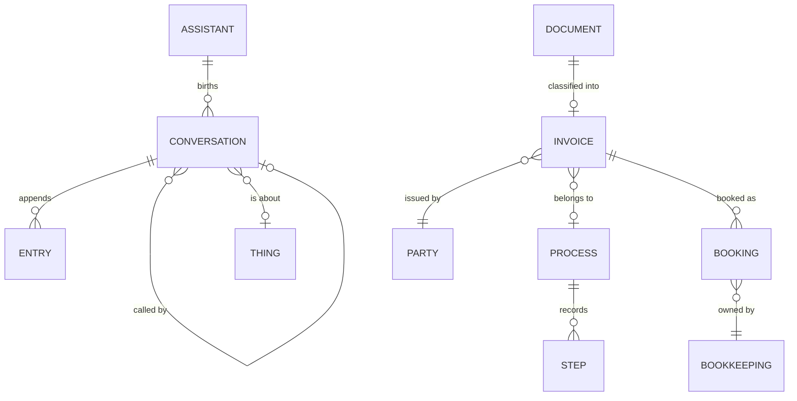

# Domain — what building it taught us

The glossary in [CONTEXT.md](../../../CONTEXT.md) survives contact with implementation almost
intact. This document records the terms that had to be **added**, **sharpened** or **corrected**
to make the concept executable, and the scenarios that forced each one.

## Added terms

### Runtime

**Runtime**:
The component that watches Triggers, gives birth to Conversations, drives the agentic loop and
continues Conversations whose awaited actor has responded. It is deliberately *not* an External
System: External Systems are what Assistants call, whereas the Runtime calls Assistants.
_Avoid_: engine, orchestrator, scheduler, worker

Proposed in [AGENTIC_LOOP.md Q1](../../../AGENTIC_LOOP.md) and confirmed by the survey. It
decomposes into exactly two parts, and naming both is what stops accidental complexity settling:

**Trigger Watcher**:
The half of the Runtime that scans the ThingStore for work — Things that have materialised,
Conversations that have been answered, Conversations whose `wakeAt` has passed — and hands each
to the Loop Driver. It is the genuinely novel component: none of the three surveyed agent
systems has one, because all three are born from a human typing.
_Avoid_: poller, scheduler, dispatcher

**Loop Driver**:
The half of the Runtime that takes one Conversation one Turn forward and then returns. It holds
no state of its own; everything it needs it reads from the Conversation, and everything it
learns it writes back before returning.
_Avoid_: executor, agent runner

### The unit of work

**Turn**:
One LLM response plus the execution of the tool calls it asked for. The unit of persistence and
of cost accounting. Imported from all three systems surveyed in AGENTIC_LOOP.md, which use the
word identically.
_Avoid_: step, iteration, cycle

**Entry**:
One appended item in a Conversation's history — a prompt, an LLM response, a tool call, a tool
result, an Open Question, an answer. Conversations are append-only lists of Entries.
_Avoid_: message, event, record

Opencode's finer-grained **Part** was considered and rejected for now: it earns its keep when
streaming deltas to a UI, and our UserInterface reads the stored Conversation rather than a
stream.

**Finish Reason**:
Why the LLM stopped: `answered`, `wants-tools`, `length`, `error`. The loop's control variable.
It is stored on the Conversation rather than living in code, per the survey's recommendation.
_Avoid_: stop reason, status

### Suspension

**Pending Tool Call**:
A tool call that could not complete inside the Turn, because the Operation is human-paced — a
Manual Connector, `askUser`, or a called Assistant. It is appended to the Conversation, the
Conversation records what it is waiting for, and the Runtime returns holding nothing.

This is **the** structural difference between our agentic loop and every coding agent's. Coding
agents assume tools return in seconds and block inside the Turn. Our Tools are human-paced by
design, so *every* tool call is potentially suspending and the pending path is the normal one.
_Avoid_: async call, deferred call, promise

**wakeAt**:
An instant stored on a waiting Conversation, after which the Runtime continues it even though no
answer arrived. This is what stops a Conversation waiting forever on an Assistant that died, and
it is what makes ADR-0007's "carry on without the result" implementable at all.
_Avoid_: deadline, TTL, retry-at

Distinct from a **Schedule**, which is a Trigger configured on an Assistant and births a
Conversation where none exists. Conflating the two is tempting and wrong: one is configuration on
a template, the other is state on an instance ([AGENTIC_LOOP.md Q3](../../../AGENTIC_LOOP.md)).

## Sharpened terms

### Party, not Person

[CONTEXT.md](../../../CONTEXT.md) and the README both say **Person**. The invoice scenario breaks
it immediately: a doctor's invoice is issued by a *practice*, an insurance claim goes to a
*company*, and the renovation involves a *building firm*. None is a person, and all three need
exactly the same fields and the same treatment.

**Party**:
Anyone the household deals with — a person or an organisation. Carries a `kind` that says which,
and a `role` that says what they are to us (doctor, insurer, craftsman, authority, other).
_Avoid_: Person, contact, counterparty, entity

A Person is a Party whose kind is `person`. Keeping two Models would duplicate every field to
express a distinction nothing in the system branches on.

**Authority note**: CONTEXT.md assigns Parties to the address book. We have no address book
External System, so for now the **ThingStore** is the Authority for Parties. This is a real, if
small, violation of the spirit of ADR-0006 — recorded rather than hidden, and reversed the day an
address book Connector exists.

### Document is the unclassified Thing

The README has the Receptionist "accept a PDF and make it a proper invoice thing". ADR-0002 says
identity must survive reclassification, which only means something if there is a state *before*
classification.

**Document**:
A Thing that has arrived but not yet been understood — the raw item plus whatever text was
extracted from it. Every incoming item becomes a Document first; classification then *creates the
Invoice and links it*, and never changes the Document's ThingID.
_Avoid_: inbox item, upload, raw thing, attachment

The alternative — reclassifying the Document itself into an Invoice — would require a Thing to
change its Model, which ADR-0002 exists to avoid.

### Open Question is a shape, not a free-text field

CONTEXT.md defines an Open Question as "a question or a request for confirmation, asked as free
text or through a form". Implementation forces the shape to be explicit, because the UserInterface
has to render an answer control and the Runtime has to validate what comes back.

An Open Question therefore carries a **kind**: `free-text`, `confirm` (yes/no), `choice` (one of a
declared list), or `perform` — the last being what a **Manual Connector** raises when it needs the
User to *do* something and report the result. `perform` is not a special mechanism; it is the same
Open Question with a different prompt, which is precisely what CONTEXT.md claims about Manual
Connectors: "whether a machine or a human answers is invisible to it".

## Corrected assumptions

### An Assistant's Skills are fields on the Assistant, not separate Things

ADR-0009 says a Skill belongs to exactly one Assistant and is never shared. If that is true, a
Skill has no independent identity, and making it a Thing with its own ThingID would invite exactly
the sharing the ADR forbids. Skills are therefore a repeating group *inside* the Assistant Model:
a name and a markdown body.

### "Waiting for X" is one state with a variant, as proposed — but the variant is not the whole story

[AGENTIC_LOOP.md Q2](../../../AGENTIC_LOOP.md) proposed `waitingFor: llm | user | tool | assistant`.
Building it shows that `llm` never appears in the store. Waiting on the LLM happens *inside* a live
Turn and is over in seconds; if the process dies there, the Conversation is simply un-advanced and
the next scan picks it up. Only waits that **outlive a Turn** are ever written down.

So the stored values are `user`, `tool`, `assistant` — plus `running` (a Turn is in flight, with a
lease so a crashed Runtime does not strand it) and the terminal `done` / `failed`.

## Model map

`BOOKING` is drawn deliberately outside the Things: it is a Firefly III transaction, and
Bookkeeping is its Authority (ADR-0006). The Invoice Thing holds only the **reference** to it, and
questions like "is this paid?" are answered by asking Firefly, never by reading a field.

## References between Things

Per ADR-0002 a ThingID identifies and nothing more, so a reference from one Thing to another is a
**plain string field holding a ThingID**, with the field name saying what the relationship is
(`issuedByPartyId`, `processId`, `documentId`). The A12 relationship engine is deliberately not
used for this: it would bind the reference to a target Model at the model layer, which is the
typed-identifier design ADR-0002 rejects.

Where a receiver needs the Model without a round trip, the pair travels as a **ThingRef**
(`{thingId, model}`) — convenience only, and the ThingStore stays the authority.
