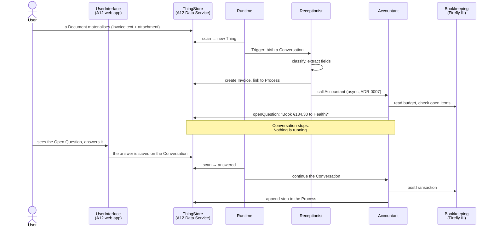

# Proposal — the first running system

## What

Turn the concept in [README](../../../README.md), [CONTEXT](../../../CONTEXT.md), the ten
[ADRs](../../../docs/adr/) and the two research documents into software that actually runs:
a single `docker compose` in which an **Assistant** wakes on a **Trigger**, drives an agentic
loop against a real LLM, asks the **User** a question through the A12 web application, waits
however long that takes, and — when answered — books a real transaction into a real
bookkeeping system.

The vertical slice is the one the README opens with: **a doctor's invoice arrives and gets
dealt with.**

## Why

Everything so far is prose. The prose is unusually well worked out — the ADRs settle real
trade-offs and the agentic-loop survey already tells us what to build — but nothing has been
executed, so nothing has been falsified. Specifically, four claims are load-bearing and
untested:

1. **Suspend-and-resume works** (ADR-0004): an Assistant that asks a question holds nothing in
   memory, and the system can be restarted mid-question without losing it.
2. **Triggers birth, responses continue** (ADR-0005): one mechanism covers the User answering,
   a Manual Connector reporting back, and an Assistant calling another.
3. **Assistants are Things** (ADR-0003): their prompts are editable in the ordinary A12 UI,
   which requires markdown fields to work end to end.
4. **One Authority per fact** (ADR-0006): "is this invoice paid?" is answered by Bookkeeping
   and by nothing else — there is no status field on the Invoice Thing.

A running slice tests all four at once. It is also the only way to find out what the concept
got wrong.

## Scope

### In

| Area | What |
|---|---|
| **ThingStore** | An A12 Data Service with our own models: `Assistant`, `Conversation`, `Process`, `Invoice`, `Document`, `Party`. Document + form + overview model for each. |
| **UserInterface** | The A12 web application: navigation, overviews and forms for every Thing, an **Open Questions** view, and the **markdown editor lifted from `w12-on-a12`** for prompt and note fields. |
| **Runtime** | Trigger watcher and loop driver, as a small TypeScript service. Real LLM calls. Tool dispatch. Suspension and continuation. |
| **Bookkeeping** | Firefly III in the same compose stack, bootstrapped headlessly, reached through a Connector. |
| **Assistants** | Two, as Things: **Receptionist** (classify, extract, route) and **Accountant** (check, book, chase). |
| **Connectors** | `Bookkeeping` (real, Firefly REST), `UserInterface` (internal), `Email` and `Bank` (**Manual Connectors** — they ask the User). |
| **Demo data** | A realistic household: parties, a renovation Process, several invoices in different states, Firefly accounts and budgets. Loaded by `just demo-data`. |
| **Scripts** | `just dev`, `just clean`, `just test`, `just demo-data` and friends, documented in the README. |
| **Tests** | Runtime unit + integration tests, model validation, and Playwright end-to-end tests through the real UI. |

### Out

- **Real Email and Bank integrations.** Both are Manual Connectors. ADR-0004 says the system
  must run end to end with every External System manual, and this is where we prove it.
- **Cross-document links inside markdown** ([MARKDOWN_FIELDS.md](../../../MARKDOWN_FIELDS.md) Q1).
  The editor we are lifting does not have them, and inventing a link syntax is its own change.
- **Compaction, forking, steering** of Conversations. The survey says we will want them; none
  is needed to run the slice.
- **Multi-user, production auth.** The A12 local-auth variant is development-grade by design.
- **Anything Temporal-shaped.** AGENTIC_LOOP.md Q5 already recommends against it.

## Expected outcome

After `just dev && just demo-data`:

- `http://localhost:8081` — the A12 application, logged in as `admin`, showing Things,
  Assistants (with editable markdown prompts) and pending Open Questions.
- `http://localhost:8084` — Firefly III, with the household's books, containing exactly the
  transactions the Accountant booked.
- Dropping a new invoice Document into the ThingStore causes an Open Question to appear in the
  UI within seconds, without anyone starting anything.
- `docker compose restart` in the middle of that leaves the Open Question exactly where it was.

## Risks

| Risk | Mitigation |
|---|---|
| A12 artefacts are VPN-only, making the repo unbuildable elsewhere | Pin the **public** community registries in-repo (D-006). Verified resolvable anonymously. |
| The lifted markdown editor is entangled with `w12` code | Survey says the seam is ~4 small files plus i18n; the collaborative half is cleanly droppable. |
| LLM non-determinism makes tests flaky | The loop driver takes its LLM provider by injection; tests drive it with a scripted provider. Live-LLM runs are a separate, opt-in test tier. |
| Scope is large for one change | The plan is ordered so that each step leaves the stack runnable. |
