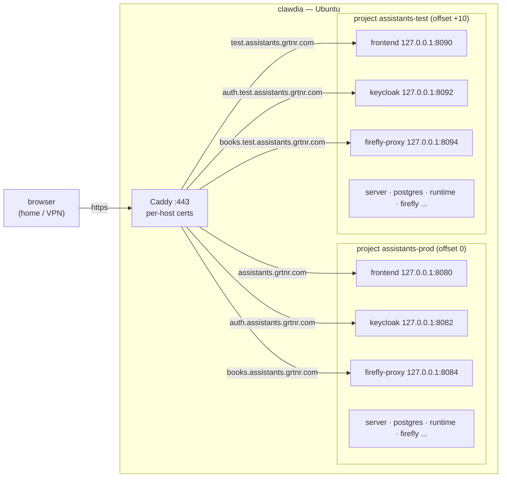

# Architecture — go-live

Read [proposal.md](proposal.md) first for what and why, and [domain.md](domain.md) for the vocabulary.
This document is the how: the technical decisions, the ones considered and rejected, and the specific
files each touches.

## The shape

One Deploy Host. Two Compose projects, isolated. One Caddy edge in front of both. Images built by a
GitHub Actions pipeline into ghcr and pulled by the box. Certificates by DNS-01 through GoDaddy.



## Decision 1 — two Compose projects, not one compose file with more services

The dev stack already namespaces everything `-p assistants` (the `justfile` alias
`docker compose -p assistants -f compose/docker-compose.yml --env-file .env`). The smallest true change
is to make that name and the `--env-file` path per-Environment variables:

```
docker compose -p assistants-prod -f compose/docker-compose.yml --env-file deploy/env/prod.env
docker compose -p assistants-test -f compose/docker-compose.yml --env-file deploy/env/test.env
```

The **same** `docker-compose.yml` serves both. Project name gives each its own default network and its
own volume namespace: the top-level `networks:` (`a12_compose`) and `volumes:`
(`postgres_data`, `firefly_upload`, `firefly_token`) carry no explicit `name:` / `external:`, so
Compose auto-prefixes them per project — `assistants-prod_postgres_data` and
`assistants-test_postgres_data` are different volumes with different passwords baked in. Nothing is
shared *there*.

- **`PROJECT_NAME` must move with `-p`.** One thing does **not** auto-prefix: every service sets an
  explicit `container_name: ${PROJECT_NAME}_<svc>` (compose lines 18–387). Explicit container names are
  not namespaced by `-p`, so two projects sharing a `PROJECT_NAME` collide on `docker compose up` — the
  second Environment's containers fail to create. `PROJECT_NAME` is therefore a **per-Environment
  variable in its own right**, set in each env file to match the `-p` project name
  (`assistants-prod` / `assistants-test`). `.env.example` also ships `COMPOSE_PROJECT_NAME='assistants'`;
  the deploy env files either drop it or set it equal to `-p`, so the two knobs never disagree.
  (`PROJECT_NAME` currently also names the runtime **image** — that second job is separated out in
  Decision 5, so repurposing it for isolation does not change which image is pulled.)

- **Considered:** one merged compose file with `*-test` and `*-prod` services. Rejected — it doubles the
  file, invites drift between the two halves, and abandons the one-file-serves-all-hosts property that
  keeps the laptop stack and the server stack identical.
- **Host port collision, and a human-friendly port scheme.** Both projects want the same loopback
  ports, so the five published bindings are read from variables (`FRONTEND_HOST_PORT`,
  `SERVER_HOST_PORT`, `KEYCLOAK_HOST_PORT`, `POSTGRES_HOST_PORT`, `FIREFLY_PROXY_HOST_PORT`) and each
  Environment gets its own values. The scheme is deliberately simple to read and to offset: **one
  contiguous block per Environment, starting on a round base and counting up by one per service**, so a
  second (or third) Environment is just the base plus `n × 10`:

  | Service | dev / PROD (offset 0) | TEST (offset +10) |
  |---|---|---|
  | frontend | `8080` | `8090` |
  | server (ThingStore) | `8081` | `8091` |
  | keycloak | `8082` | `8092` |
  | postgres | `8083` | `8093` |
  | firefly-proxy (books) | `8084` | `8094` |

  The offset is simpler and debuggable than same-port-different-namespace (`curl` still works on the
  box), and the round base makes "which Environment is this?" answerable at a glance. Caddy forwards to
  whichever ports the Environment uses; nothing off-box sees these numbers. The deploy env role renders
  the five values as `base + offset`; `just dev` runs offset 0, i.e. the `8080–8084` block. **This
  renumbers today's dev ports** (frontend `8081→8080`, server `8082→8081`, keycloak `8089→8082`;
  postgres `8083` and books `8084` unchanged) — a deliberate simplification, not a regression: the
  laptop stack still comes up with `just dev`, on the new contiguous block. The hardcoded references to
  the old numbers (`justfile`, `.env.example`, `README.md`, `client/webpack.dev.js`,
  `e2e/utils/config.ts` and its specs) move with it; see plan Phase 0.

## Decision 2 — Caddy as the edge, DNS-01 via GoDaddy

Caddy runs on the host (not in either Compose project — it must outlive and front both), listening on
`:443`. It reverse-proxies each Public Hostname to the right `127.0.0.1:PORT`. TLS certificates come
from Let's Encrypt via the **DNS-01** challenge, using the **GoDaddy** provider module, so no inbound
port 80/443 from the public internet is ever needed — which is the whole point on a VPN-only box.

Caddy obtains **one certificate per hostname** automatically: each site block in the Caddyfile drives
its own DNS-01 issuance and renewal, so the six names need no manual cert management and a future
subdomain is just another site block. A single `*.grtnr.com` wildcard is deliberately *not* used — a
wildcard matches only one label, so it would cover `assistants.grtnr.com` but none of the two-label
names (`auth.assistants.grtnr.com`, `books.…`) or three-label ones (`auth.test.assistants.grtnr.com`).
Per-name certs sidestep that entirely.

- Caddy needs the standard build **plus the GoDaddy DNS module** (the stock binary has no DNS
  providers). Provisioned as either the `caddy-dns/godaddy` custom build or the official image with the
  module baked in.
- The GoDaddy API token (key+secret) is read from the environment/vault; it is the one credential the
  edge holds. **This assumes the `grtnr.com` account can actually mint a working domains API key** —
  GoDaddy restricted API access in 2024 (roughly, accounts below a domain-count threshold no longer get
  functional keys), so this is verified by a spike before anything depends on it (plan Phase 2). If the
  key does not work, the fallback is to move `grtnr.com`'s DNS to a provider Caddy supports for DNS-01
  (e.g. Cloudflare); the rest of the edge design is unchanged, only the provider module and token swap.
- **Considered:** self-signed / internal CA (rejected — per-device trust friction, and DNS-01 gives us
  real certs for free); Let's Encrypt HTTP-01 (rejected — needs public inbound the network does not
  have); Traefik/nginx (rejected — Caddy's automatic-TLS + DNS-01 is the least configuration for exactly
  this shape).

A sketch of the edge config (final form in `deploy/`):

```
{
  acme_dns godaddy {env.GODADDY_API_TOKEN}
}
assistants.grtnr.com          { reverse_proxy 127.0.0.1:8080 }
auth.assistants.grtnr.com     { reverse_proxy 127.0.0.1:8082 }
books.assistants.grtnr.com    { reverse_proxy 127.0.0.1:8084 }
test.assistants.grtnr.com     { reverse_proxy 127.0.0.1:8090 }
auth.test.assistants.grtnr.com  { reverse_proxy 127.0.0.1:8092 }
books.test.assistants.grtnr.com { reverse_proxy 127.0.0.1:8094 }
```

## Decision 3 — de-hardcode the origins so one image serves both Environments

This is the part that is code, not ops, and it is the crux. Because the Pipeline builds **one** set of
images and both Environments pull the same tags, an image must not have an Environment's URL baked into
it. The Explore pass found five independent places that pin `localhost:PORT`:

| Where | What | Fix |
|---|---|---|
| `client/src/components/dashboard/BookkeepingButton.tsx:27` | `BOOKKEEPING_URL = "http://localhost:8084"` — **compiled into the SPA bundle** | Stop baking it. Serve it as runtime config: the frontend nginx writes a small `/config.js` (or an env-substituted placeholder) at container start from `BOOKKEEPING_URL`, and the client reads `window.__CONFIG__`. Tests that assert the constant move to asserting the runtime read. |
| compose `firefly` | `APP_URL: http://localhost:8084` | Variable `FIREFLY_APP_URL`, set per Environment to `https://books[.test].assistants.grtnr.com`. |
| compose `firefly-proxy` | `OAUTH2_PROXY_REDIRECT_URL: http://localhost:8084/oauth2/callback`, `COOKIE_SECURE:"false"` | Variables; redirect becomes the `https://books…` URL; cookie **Secure** true behind TLS. |
| compose `runtime` | `UI_BASE_URL: http://localhost:8081` | Variable `UI_BASE_URL`, per Environment (dev default follows the renumber to `http://localhost:8080`). |
| `KEYCLOAK_PUBLIC_URL` (`.env`) | already a variable | Set per Environment to `https://auth[.test].assistants.grtnr.com`. |

None of these is a new abstraction — each is turning a constant into the variable it should always have
been, keeping a localhost default so the laptop stack keeps working (on the renumbered base ports of
Decision 1).

A **sixth** `localhost` in the stack is deliberately left alone: the server's
`MGMTP_A12_DATASERVICES_CONTENTSTORE_BASE-URL: http://localhost:8082` (compose line 58), from which the
A12 platform mints attachment-download ticket URLs. It never needs an Environment's real origin because
the client discards its host before use — `client/src/components/document/useAttachmentSource.ts`
(`toSameOriginPath`) keeps only the ticket path and re-anchors it to `window.location.origin`, and the
frontend nginx proxies `/cs` to `http://server:8080/cs` (container DNS, per-project safe). It is listed
here only so the count of baked origins is exhaustive; it is not one of the five that change.

## Decision 4 — Keycloak in production mode, with parameterised realm URIs

Two coupled changes, because the realm import is **create-only** (editing the template does nothing once
`postgres_data` exists):

1. **Mode.** `start-dev --import-realm` → `start --import-realm` with `KC_HOSTNAME` set to the
   Environment's Auth URL, `KC_PROXY_HEADERS=xforwarded` (Caddy terminates TLS), `KC_HTTP_ENABLED=true`
   (HTTP *behind* the proxy on loopback, HTTPS *in front*). `KEYCLOAK_PUBLIC_URL` already flows into
   `KC_HOSTNAME`, the server's `issuer-uri`, and oauth2-proxy — so setting it per Environment carries
   most of the reconfiguration.
2. **Realm client redirect URIs.** `compose/keycloak/A12Realm-realm.json.template` pins
   `redirectUris: http://localhost:*` for `a12-spa-client` and `http://localhost:8084/oauth2/callback`
   for the Firefly proxy client. These are rendered from `.env` by `compose/keycloak/render.mjs`, so the
   template gains variables (`APP_ORIGIN`, `BOOKKEEPING_ORIGIN`) filled per Environment. Because import
   is create-only, the render must be correct **before an Environment's first start**. This change gets
   correctness at first start (render the right values, proven on TEST before PROD) and does **not**
   automate later edits: changing a realm setting once the volume already holds state — without dropping
   it (which on PROD would take the books) — needs the Keycloak admin API and is deferred to a future
   change (see proposal "Out"). Until then such a correction is a manual admin operation.

- **Considered:** path-routing `/auth` on the application hostname via `KC_HTTP_RELATIVE_PATH`. Workable
  and would save two subdomains, but complicates the SPA's OIDC config and the Firefly proxy's issuer;
  subdomains with per-name certs are cheaper and clearer.

## Decision 5 — Pipeline builds to ghcr; the box pulls

```mermaid
sequenceDiagram
    participant Dev as Developer
    participant GH as GitHub Actions
    participant GHCR as ghcr.io/tillg/assistants
    participant Box as clawdia (Ansible roll-out)
    Dev->>GH: git push (tag / main)
    GH->>GH: gradle convertModels + buildImages
    GH->>GH: build runtime image (runtime/Dockerfile)
    GH->>GHCR: push frontend, server, server-init, runtime<br/>tags: version + git SHA
    Dev->>Box: ansible-playbook deploy.yml -e env=prod -e tag=<sha>
    Box->>GHCR: docker login + pull the four tags
    Box->>Box: compose up -d --force-recreate (server-init profile)
    Box->>Box: bootstrap (Assistants + runtime state)
```

- The workflow reproduces `just build`'s steps (`gradle convertModels`, `gradle buildImages`,
  `compose build runtime`) on a GitHub-hosted runner, then pushes. Image names move from
  `assistants/frontend:0.1.0` to `ghcr.io/tillg/assistants/frontend:<tag>`; `gradle.properties` already
  carries the `dockerRegistryForPublish`/`dockerUseCredentials` knobs (today `docker.io` / `false`) and
  `group=com.grtnr.assistants`, so this repoints existing settings rather than inventing new ones.
- **The four image refs are made uniform, and the runtime ref is decoupled from `PROJECT_NAME`.** Today
  they are inconsistent: three read whole-string vars (`${FRONTEND_IMAGE}` = `assistants/frontend:0.1.0`,
  and likewise `SERVER_IMAGE`, `SERVER_INIT_IMAGE`), but `runtime` is composed —
  `image: ${PROJECT_NAME:-assistants}/runtime:${PROJECT_VERSION:-dev}` (compose line 386). That coupling
  is a trap: Decision 1 repurposes `PROJECT_NAME` as the per-Environment isolation namespace, which would
  silently rewrite the runtime image to `assistants-prod/runtime:…` and break the ghcr pull. So all four
  refs converge on one scheme — `${IMAGE_REGISTRY:-assistants}/<svc>:${IMAGE_TAG:-0.1.0}` — with the
  local names as defaults. After this, `PROJECT_NAME` names only containers (isolation) and
  `IMAGE_REGISTRY`/`IMAGE_TAG` name only images; the two never interfere. (`PROJECT_VERSION` folds into
  `IMAGE_TAG`.)
- **Auth to ghcr:** the runner uses the built-in `GITHUB_TOKEN` with `packages: write`. clawdia pulls
  with a read-only PAT (or the packages made internal/public) stored in the vault.
- The **Runtime** is the only build-from-source service (its Dockerfile); the other three come from
  `gradle buildImages`. All four are Environment-agnostic after Decision 3.
- **ghcr is not the box's only registry.** Only the four app images come from ghcr. The stack also pulls
  base images straight from public registries — `fireflyiii/core` and `postgres` (docker.io), Keycloak
  and `oauth2-proxy` (quay.io / configured registry), `alpine/curl` (docker.io). So the Deploy Host
  needs outbound reachability to **docker.io and quay.io** as well as ghcr, and is subject to Docker
  Hub's anonymous pull-rate limit. Provisioning accounts for this (plan Phase 4).
- **Not deployed by the Pipeline.** A GitHub-hosted runner cannot reach a LAN-only box; the roll-out is
  the Ansible step above, run from the home network. A self-hosted runner on clawdia is the future path
  to one-click deploy and is deliberately out of scope.

## Decision 6 — `deploy/` layout (Ansible)

```
deploy/
  ansible.cfg
  inventory.yml                # clawdia: ansible_host, ansible_user=tillg
  group_vars/
    all.yml                    # port base (8080), image registry, hostname scheme
    prod.yml                   # PROD hostnames, PROJECT_NAME=assistants-prod, port offset 0
    test.yml                   # TEST hostnames, PROJECT_NAME=assistants-test, port offset +10
  vault/
    prod.vault.yml             # LLM key, login passwords, ghcr PAT, GoDaddy token (ansible-vault)
    test.vault.yml
  playbooks/
    provision.yml              # docker, caddy(+godaddy module), dirs, caddy config
    wipe.yml                   # inspect + scoped removal of what's on the box now
    deploy.yml                 # render env + keycloak files, login ghcr, pull, up, bootstrap
  roles/
    docker/  caddy/  environment/  app/
  Caddyfile.j2
```

- **Idempotent**, like the `justfile` recipes. `deploy.yml` is the server-side analogue of
  `just build up wait bootstrap`, minus build (images are pulled).
- **Per-Environment `.env` generation** reuses `scripts/setup-env.mjs` semantics: generate once, then
  treat the DB passwords as frozen (D-023). The vault supplies the real secrets that must not be random
  or committed. The `environment` role also writes the per-Environment `PROJECT_NAME` (matching the `-p`
  project) and renders the five `*_HOST_PORT` values as `base + offset` (`8080 + 0` for PROD, `8080 + 10`
  for TEST) so the container names and host bindings never collide (Decision 1).
- **Keycloak render** reuses `compose/keycloak/render.mjs` with the per-Environment origins.

## Decision 7 — Wipe is inspected, not blind

clawdia "has old things on it". The `wipe.yml` playbook first *reports* what it finds (running
containers, compose projects, listening ports, existing web servers, relevant systemd units), and only
then removes what is clearly not ours — never a blanket `docker system prune -a` or a volume wipe of
data it did not create. This follows the project's standing rule: look at the target before deleting,
and surface anything that contradicts the description rather than proceeding.

## What is deliberately unchanged

- `just dev` and the whole localhost stack. Every variable introduced defaults to a localhost value, so
  a fresh clone still comes up with `just dev` and no `deploy/` involvement — now on the renumbered
  contiguous block (`frontend 8080`, …, `books 8084`). The port *numbers* change (Decision 1); the
  behaviour does not.
- [ADR-0014](../../../docs/adr/0014-exactly-one-runtime-replica.md) — one Runtime replica per
  Environment; the `scale: 1` constraint is untouched.
- [ADR-0006](../../../docs/adr/0006-one-authority-per-fact.md) — the books remain Firefly's; TEST simply
  has its own Firefly and its own volume.

## Risks

- **First-start correctness on PROD.** Because realm import and DB passwords are create-only, getting a
  hostname or password wrong on PROD's first boot means a volume drop. Mitigation: bring TEST up first
  and completely; PROD repeats a proven sequence.
- **GoDaddy public DNS → private IP.** Anyone resolving the names sees the LAN IP; harmless (unroutable
  off the network) but worth stating. If clawdia's LAN IP changes, the A records must follow — a case
  for a static lease.
- **GoDaddy API availability.** The whole cert story hinges on a working GoDaddy domains API key, which
  GoDaddy has restricted for smaller accounts since 2024. Unverified, this is an unknown, not a fact;
  the spike in Phase 2 confirms it before the edge is built, with a provider swap as the fallback (see
  Decision 2).
- **oauth2-proxy cookie + TLS.** `COOKIE_SECURE` must flip to true behind HTTPS; left false, login
  loops silently. Called out in Decision 3.
