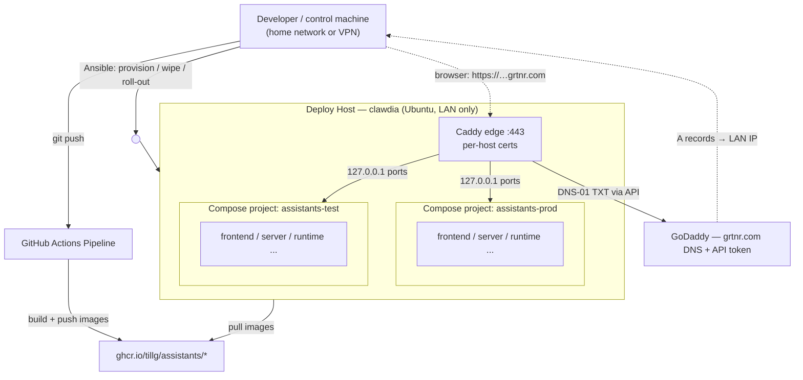

# Domain — go-live

This change adds an **operational** vocabulary. None of it touches the domain the Assistants reason
about (Things, Conversations, Operations, the books); it is the language of *where the system runs and
how it gets there*. The terms below are new or newly load-bearing. They belong to the same project
glossary as [CONTEXT.md](../../../CONTEXT.md) but describe the deployment, not the product.

## Concepts

**Environment.** A complete, self-contained running copy of the whole stack — its own databases, its
own volumes, its own secrets, its own Keycloak realm state, its own hostnames. This change defines two:
**PROD** (the household's real books and real work) and **TEST** (throwaway data, the place a change is
tried before it reaches PROD). An Environment is the unit of isolation: the promise of TEST is that
nothing done in it can reach PROD, and that promise is what makes PROD safe to change. Distinct from an
A12 *profile* (an LLM configuration in `llm.json`) — one Environment runs one active profile at a time.

**Deploy Host.** The single Ubuntu machine, **clawdia**, that runs both Environments as two Docker
Compose **projects** side by side. Reachable at `ssh tillg@clawdia`. It is on the home network and has
no public inbound; a browser reaches it only from home or over the VPN.

**Compose Project.** Docker Compose's namespace for a set of containers, networks and volumes, set by
`-p <name>`. The dev stack uses `-p assistants`; this change makes the name a per-Environment variable
(`assistants-test`, `assistants-prod`) so the two Environments coexist on one Deploy Host without
sharing a network or a volume. Networks and volumes auto-prefix from the project name, but the stack's
explicit `container_name`s do not — they read a companion `PROJECT_NAME` variable that must be set to
the same per-Environment value, or the two Environments' containers collide. The isolation between
Environments *is* the separation between projects.

**Edge / Reverse Proxy.** The one process that faces outward. All nine stack services keep binding to
`127.0.0.1`; **Caddy** listens on `:443`, terminates TLS, and forwards each **Public Hostname** to the
right loopback port of the right Environment. It is the only component reachable from off the box, and
the only holder of the certificates.

**Public Hostname.** A browser-reachable name for one browser-facing surface of one Environment. Three
per Environment, because three surfaces are browser-facing: the **Application** (`assistants.grtnr.com`),
**Auth** (Keycloak — its URL is the token `iss` claim, so it must be a real external name), and
**Bookkeeping** (Firefly, opened directly from the dashboard). See the table in the
[proposal](proposal.md).

**TLS Certificate.** Each Public Hostname gets its own certificate — six exact-name certs, no wildcard.
Caddy obtains and renews them itself, one per site block, on demand. Each is obtained by the **DNS-01
challenge**: Caddy proves control of the domain by writing a TXT record via the **GoDaddy API**, never
by answering an inbound HTTP request — which is why it works on a box with no public inbound. (A single
`*.grtnr.com` wildcard would not cover them anyway: a wildcard matches only one label, so it fits
`assistants.grtnr.com` but none of the two-label names like `auth.assistants.grtnr.com`.)

**GoDaddy API Token.** A key+secret pair, issued from the GoDaddy account that holds `grtnr.com`, that
lets Caddy create and delete the DNS TXT records the DNS-01 challenge needs. A real secret; it lives in
the vault, never in the repo.

**DNS Record (A).** For each Public Hostname, an address record at GoDaddy pointing to clawdia's **LAN
IP**. Public DNS pointing at a private address is deliberate: the name resolves everywhere, but the
address is only routable from home or the VPN, which is exactly the intended access model.

**Registry — ghcr.io.** GitHub Container Registry, under `ghcr.io/tillg/assistants/*`, is where the four
built app images live. The Deploy Host **pulls** and never builds; the toolchain (JDK, Node, Gradle)
stays off the box. It is not the only registry the box reaches: base images (Firefly, Postgres,
Keycloak, oauth2-proxy, alpine) still come from **docker.io** and **quay.io**, so the box needs outbound
to those too.

**Pipeline (GitHub Actions).** The workflow that turns a commit into published images: it runs
`gradle buildImages` and the Runtime image build, tags them by version and commit SHA, and pushes them
to the Registry. It **builds and publishes only** — it does not, and on a VPN-only Deploy Host cannot,
deploy.

**Roll-out.** The manual step, run from a machine on the home network, that brings an Environment to a
published version: pull the tags, recreate the containers with the current environment file, run the
one-shot init containers and the bootstrap. The counterpart to `just dev`, per Environment.

**Provisioning.** The one-time preparation of a bare clawdia: install Docker and Caddy, lay down the
two project directories, place the certificates' DNS credential. Distinct from Roll-out, which happens
on every release.

**Wipe.** The deliberate removal of what is on clawdia now (it has old, unrelated things on it). Scoped
and reviewed, not a blanket reset — the machine is inspected before anything is deleted (per the
project's standing rule not to destroy what it did not create).

**Environment File.** The per-Environment `.env`. Two exist, one per Environment, each generated once;
its database passwords are frozen into that Environment's Postgres volume on first start
([D-023](../../../DECISIONS.md)). The few *real* secrets inside it (LLM API key, login passwords, and —
new here — the GoDaddy token) come from an **ansible-vault** file rather than being generated or committed.

## How they relate

## Actors

- **Developer** — pushes commits (triggering the Pipeline) and runs Roll-outs from the control machine.
  The same person as the **User** of the product, wearing the operator's hat.
- **Pipeline** — builds and publishes images. No access to clawdia.
- **Deploy Host (clawdia)** — pulls images, runs both Environments, terminates TLS.
- **GoDaddy** — authoritative DNS for `grtnr.com`; issues the API token the Edge uses for certificates.
- **ghcr.io** — stores and serves the images.
