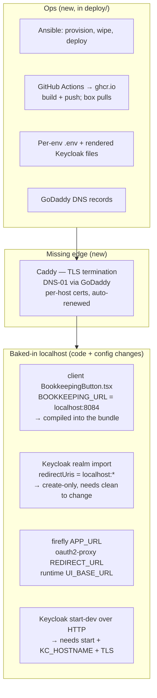

# Proposal — go-live: two environments on a real server

## What

Everything the system does today it does on one laptop, behind `127.0.0.1`. The nine services in
`compose/docker-compose.yml` each publish their host port to the loopback address and nowhere else
([D-013](../../../DECISIONS.md)); Keycloak runs `start-dev` over plain HTTP; the browser reaches
the application at `http://localhost:8081` and the books at `http://localhost:8084`; and a handful
of those `localhost:PORT` strings are not configuration at all but constants compiled into the
client bundle and written into the Keycloak realm on first import. The stack was built to run on
the machine of whoever is working on it, and it says so out loud.

This change puts it on **clawdia** — a Ubuntu box on the home network, reachable at
`ssh tillg@clawdia` — as **two independent environments, TEST and PROD**, each a full copy of the
stack, reachable over HTTPS at real hostnames:

| Environment | Application | (Auth) | (Bookkeeping) |
|---|---|---|---|
| **PROD** | `assistants.grtnr.com` | `auth.assistants.grtnr.com` | `books.assistants.grtnr.com` |
| **TEST** | `test.assistants.grtnr.com` | `auth.test.assistants.grtnr.com` | `books.test.assistants.grtnr.com` |

The two application hostnames are the ones asked for. The other four fall out of a fact the current
stack hides by putting everything on one origin: **Keycloak and Bookkeeping are browser-facing too.**
The browser is redirected to Keycloak to log in, so its URL is minted into every token's `iss` claim
and cannot be an internal address; and the dashboard's *Bookkeeping* button opens Firefly directly in
the browser. Each therefore needs a hostname a browser outside the box can reach. They are proposed as
subdomains because Firefly behind a URL
sub-path is a known source of grief; the edge obtains a certificate for each name automatically, so
extra subdomains cost nothing to secure. The alternative (path-routing `/auth` and `/books` on the one
hostname) is noted in the architecture but not chosen.

All the deployment logic — the Ansible that provisions the box, wipes what is on it, and rolls each
environment out — lives in a new top-level **`deploy/`** directory, the way the whole operational
surface lives in `justfile` today.

## Why

Two reasons, one per environment. **PROD** is the point of the project: the household's real invoices,
real books, real decisions, on a machine that stays up rather than a laptop that closes. **TEST** is
what makes changing PROD safe — a place to run the next release, the next Assistant, the next model
profile against throwaway data before any of it touches the real books, which
[ADR-0006](../../../docs/adr/0006-one-authority-per-fact.md) makes irreversible (Firefly has no bulk
delete; the only reset is dropping the volume).

They share a box because there is one box and the workload is a household's, not a datacentre's. They
must not share anything else: separate databases, separate volumes, separate secrets, separate Keycloak
realms-in-effect. On one host that means two `docker compose` **projects**, not one — which the stack
almost supports already, since every recipe is namespaced `-p assistants` and needs only that name to
become a variable.

## The gap, precisely

The Explore pass over the repo found the stack is a localhost dev stack in more places than the port
bindings. Each of these is a thing this change has to close, and several are **code**, not ops:

- **Nothing is reachable off-box.** All nine services bind to `127.0.0.1`. An edge that terminates
  TLS and forwards to those loopback ports is the one genuinely new runtime component.
- **`KEYCLOAK_PUBLIC_URL` is not the only external-URL knob.** It governs auth, but the client bundle
  (`BookkeepingButton.tsx:27`), Firefly's `APP_URL`, oauth2-proxy's `OAUTH2_PROXY_REDIRECT_URL`, the
  Runtime's `UI_BASE_URL`, and **both** Keycloak realm clients' `redirectUris`/`webOrigins` each pin
  `localhost:PORT` independently. Behind a real domain every one of them is wrong.
- **The realm import is create-only.** Editing a redirect URI in the template does nothing until the
  `postgres_data` volume is dropped — which on PROD takes the books with it. Per-environment realm
  configuration has to be right the first time, or applied through the Keycloak admin API rather than
  the import.
- **Secrets are one file, baked per volume.** `.env` is generated once per clone and its DB passwords
  are frozen into the Postgres volume on first start ([D-023](../../../DECISIONS.md)). Two environments
  need two generated `.env` files, two sets of rendered Keycloak files, and the real secrets (the LLM
  API key, the GoDaddy token, the login passwords that are weak dev defaults today) kept somewhere
  that is not the repo.

## Scope

**In:**
- A `deploy/` directory: Ansible inventory, roles and playbooks to **provision** clawdia (Docker,
  Caddy, the two project directories), **wipe** what is on it now, and **deploy/update** either
  environment independently.
- **Caddy** as the TLS edge, obtaining a certificate for each of the six hostnames automatically by the
  **Let's Encrypt DNS-01** challenge through a **GoDaddy API token** — no public inbound required,
  which suits a VPN-only box.
- **Two compose projects** (`assistants-test`, `assistants-prod`) on the one host, fully isolated —
  including a per-Environment `PROJECT_NAME`, since the stack's explicit `container_name`s are not
  namespaced by the `-p` flag alone.
- A **human-friendly host-port scheme**: one contiguous block per Environment, on a round base and
  counting up by one per service (`frontend 8080`, `server 8081`, `keycloak 8082`, `postgres 8083`,
  `books 8084`), so a second Environment is just the base plus `n × 10` (TEST = `8090–8094`). This
  renumbers today's dev ports; `just dev` still works, on the new block.
- Making the stack **origin-configurable**: the baked-in `localhost` URLs become runtime configuration
  so that **one image** built once serves both environments, differing only by environment file.
- Keycloak moved to production mode (`start`) with a per-environment public hostname; realm redirect
  URIs parameterised.
- A **GitHub Actions pipeline** that builds the four images and pushes them to **GitHub Container
  Registry (`ghcr.io/tillg/assistants/*`)**, tagged by version and commit. clawdia authenticates to
  ghcr and pulls; it never builds.
- The **GoDaddy DNS records** for the six hostnames, pointing at clawdia's LAN address.

**Out (named so they are not assumed):**
- The pipeline **builds and publishes**; it does not deploy. A GitHub-hosted runner cannot reach a
  VPN-only box, so the roll-out step (Ansible: pull the new tags, recreate, bootstrap) is run by hand
  from a machine on the home network, the way `just` is run by hand today. (A self-hosted runner on
  clawdia could later close that gap; not in this change.)
- No high availability, no second host, no clustering. [ADR-0014](../../../docs/adr/0014-exactly-one-runtime-replica.md)'s
  single Runtime replica is a design invariant, not a limitation to fix here.
- No public exposure of the box. Access stays home-or-VPN; DNS resolves the hostnames to a LAN IP.
- No backup/restore system beyond noting where the durable state lives. A first-class backup story is
  worth its own change once PROD holds real books.
- No live realm reconfiguration via the Keycloak admin API. At first go-live an Environment's Keycloak
  database does not yet exist, so the create-only realm import reads the rendered template as intended;
  getting it right is a matter of rendering correct values (proven on TEST first). Editing a realm
  setting *after* it already holds state — without dropping the volume — needs the Keycloak admin API,
  which is deferred to a future change. Until then, a post-first-start realm correction on PROD is a
  manual admin operation, not something this change automates.

## Success

- From the control machine: one command provisions a bare clawdia; one command wipes it; one command
  each brings TEST and PROD up to the current release.
- A browser on the home network or VPN reaches `https://assistants.grtnr.com` and
  `https://test.assistants.grtnr.com`, logs in through Keycloak over HTTPS with a trusted certificate,
  and opens the books — with no `localhost` anywhere and no certificate warning.
- TEST and PROD share nothing: dropping TEST's data, or pointing TEST at a live LLM profile, leaves
  PROD's books untouched.
- `just dev` on a laptop still works; the localhost stack is not sacrificed to make the server one
  exist. Its ports are renumbered to the clean `8080–8084` block (see architecture Decision 1), but the
  workflow is unchanged.
