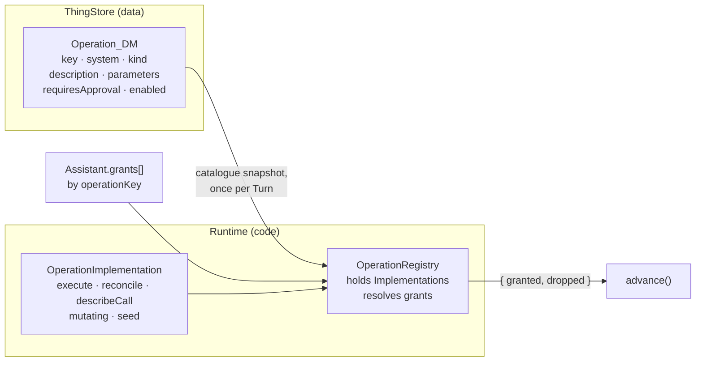
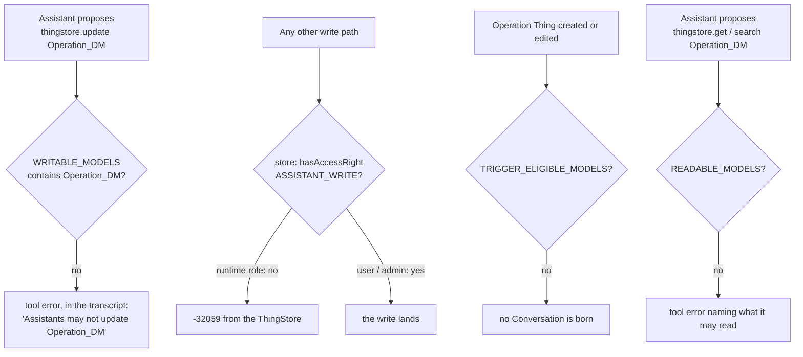
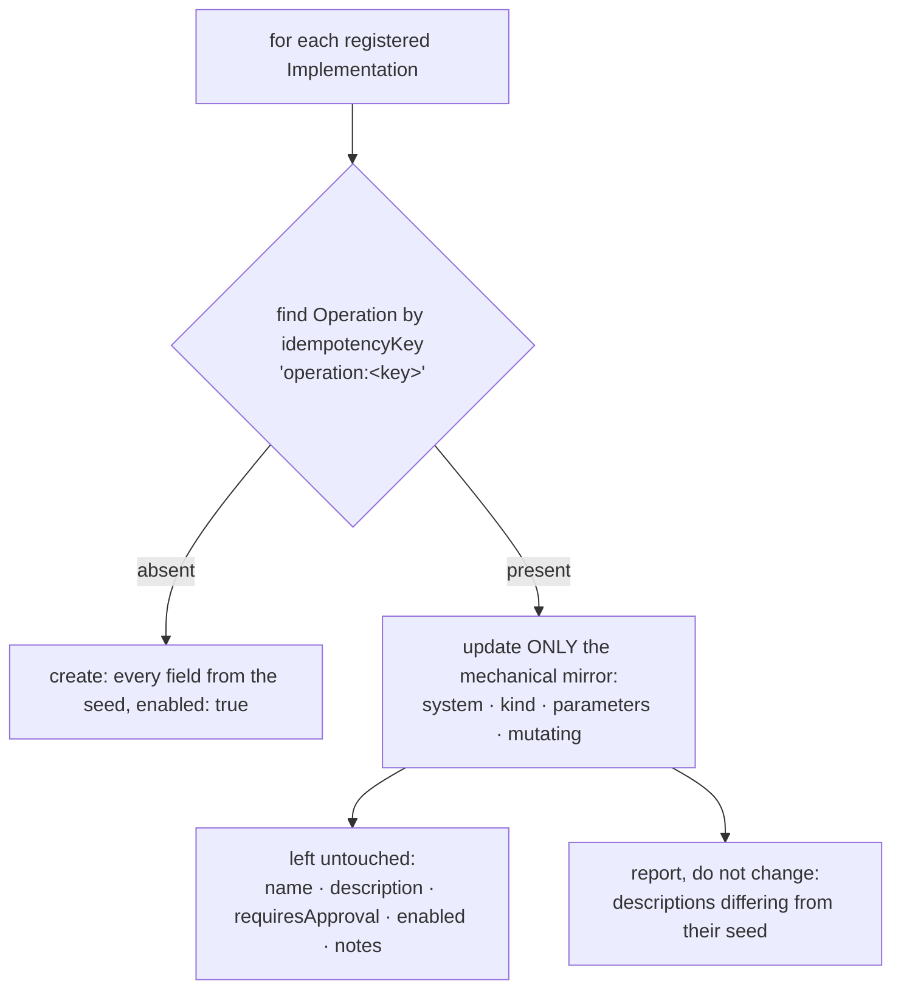

# Architecture — how Operations become Things

Read [proposal.md](proposal.md) for what and why, and [domain.md](domain.md) for the vocabulary. This
document is the technical approach: the split, the seams it touches, the decisions taken and what they
cost.

## Overview

One `ToolDefinition` becomes two halves and a join.



The join is what keeps this change small: the interface `advance()` consumes keeps its **shape** and
changes its **name**. `ToolDefinition` becomes `GrantedOperation` — which is what it always was, and
now says so — and it stops being something a developer writes: the registry produces it from an
Implementation and an Operation Thing. `advance()`'s tool-call loop, its approval gate and its
reconciliation path all read the same fields from the same shape, and need no edit beyond the rename,
receiving the snapshot, and one better error message.

### The rename, in one table

See [ADR-0020](../../../docs/adr/0020-tool-is-the-providers-word.md) for why.

| Today | After | Why |
|---|---|---|
`ToolDefinition` | `GrantedOperation` | It is an Operation resolved for one Assistant — the derived concept, now named as one |
`ToolImplementation` *(new here)* | `OperationImplementation` | The code half |
`ToolRegistry` | `OperationRegistry` | It holds Implementations of Operations and resolves grants |
`ToolContext` / `ToolOutcome` | `OperationContext` / `OperationOutcome` | The argument and result of `execute` |
`ToolDeps` | `OperationDeps` | Same |
`interface ToolGrant` | `interface Grant` | One row of `Assistant.grants[]` |
`runtime/src/tools/tools.ts` | `runtime/src/operations/implementations.ts` | `operations/operations.ts` would stutter |
`runtime/src/tools/registry.ts` | `runtime/src/operations/registry.ts` | |
`Assistant.tools[]` | `Assistant.grants[]` | A12 group `Tools`/`ToolOperation` → `Grants`/`OperationKey` |

The A12 field is **`OperationKey`**, not `GrantedOperation`. It holds a key string, and a Granted
Operation is the resolved triple — Operation Thing, grant and Implementation — that the registry
produces per Turn. Naming the cell after the resolved concept would re-create exactly the ambiguity
the rename exists to remove. The form's column label reads *Operation*, which is what a human wants to
see above a column of `bookkeeping.postTransaction`.

**Deliberately unchanged**, because each is the LLM API's own word or stored data, and usually both:

| Name | Why it stays |
|---|---|
`ToolSchema`, the `tools: [...]` request array | The provider's wire format |
`toolNameForLlm` / `operationFromLlm` | Their whole job is crossing that boundary; the pair reads correctly as it is |
`response.toolCalls`, `role: "tool"` | The provider's response |
Entry kinds `tool-intent` / `tool-result` | **Stored in every existing Conversation.** Renaming them would make old transcripts unreadable to `buildMessages` for no gain |
Entry fields `toolName` / `toolArgs` / `toolResult` | Same — stored data, in an A12 group |

## The three types

```ts
/** Code. What only code can hold. */
export interface OperationImplementation {
    /** The Operation key. The natural key on both sides of the join. */
    name: string;
    /** Whether `execute` changes state. Authoritative here and NOT read from the Thing. */
    mutating: boolean;
    execute(args: Record<string, unknown>, context: OperationContext): Promise<OperationOutcome>;
    reconcile?(args: Record<string, unknown>, context: OperationContext): Promise<OperationOutcome | undefined>;
    describeCall?(args: Record<string, unknown>): string;
    /** What the Operation Thing is created with. Only the mechanical half is ever re-applied. */
    seed: {
        name: string;
        system: string;                        // "ThingStore" | "Bookkeeping" | "Runtime" | …
        kind: "internal" | "connector" | "manual-connector";
        description: string;
        parameters: Record<string, unknown>;
        requiresApproval?: boolean;
    };
}

/** Data. One Thing per Operation. */
export interface Operation extends MachineFields {
    key?: string;
    name?: string;
    system?: string;
    kind?: string;
    description?: string;
    parameters?: string;          // JSON, as text
    mutating?: boolean;           // mirrored for display; never read back
    requiresApproval?: boolean;
    enabled?: boolean;
    notes?: string;
}

/** The product. Today's `ToolDefinition`, same shape, honest name. */
export interface GrantedOperation { name; description; parameters; mutating; requiresApproval?; describeCall?; execute; reconcile? }
```

There is **no `implementation` field**: the Implementation is registered under the Operation key and
found by it. See [domain.md](domain.md) for why the field an earlier draft carried does not earn its
place until Operations can be added dynamically.

## Resolution

`OperationRegistry` keeps its three public methods; two of them gain the snapshot, and `grantedTo`
gains a second half to its answer:

```ts
grantedTo(assistant: Assistant, catalogue: Operation[]): { granted: GrantedOperation[]; dropped: DroppedGrant[] }
calleesOf(assistant: Assistant): string[]                       // unchanged — pure string work
schemasFor(assistant: Assistant, catalogue: Operation[]): ToolSchema[]

interface DroppedGrant {
    key: string;
    reason: "absent" | "disabled" | "unimplemented" | "unparseable" | "self-call" | "bare-call";
}
```

`schemasFor` is where the two vocabularies meet, and its signature says so: Granted Operations in,
`ToolSchema[]` out, and past that point everything is the provider's.

For each grant, in the Assistant's declared order:

1. Split `assistant.call:<callee>` at the colon, as today.
2. Find the Operation whose `key` equals the base — from the snapshot.
3. Drop it, **recording the reason**, if: no such Operation; `enabled === false`; no Implementation
   registered under the key; or its `parameters` do not parse as JSON.
4. Build the `GrantedOperation`: `description` and `parameters` from the Thing, `requiresApproval` from
   the Thing, `mutating` and the three functions from the Implementation.
5. Bind the callee for `assistant.call`, as `withCalleeBound` already does.

Three properties of the current code survive unchanged and are worth naming, because each was a bug
once: a bare `assistant.call` is still not a wildcard; a self-call is still refused; and duplicates
are still collapsed.

### Why the drop reasons are returned and not merely logged

Today an undeclared call hits the belt at `advance.ts:575` and the model is told *"`X` is not one of
your tools. Available: …"*. After this change that sentence is **false** for the most likely case:
the User switched the Operation off, the grant is still in the Assistant's definition, and the User
can see it there. A model told it never had a capability re-plans around a premise that is not true —
and the four reasons this change makes sayable are of no use to the actor deciding what to do next if
they only ever reach the log. So `grantedTo` returns them, the belt consults them, and the message
becomes *"`bank.sendMoney` is switched off"* or *"…is no longer implemented"* or *"…is not granted to
you"*.

Returning both halves from one call, rather than adding a second `droppedFor()` method, is the same
argument the per-Turn snapshot makes one level down: resolve once, so what the model is offered and
what it is told about a miss cannot disagree.

### Where the snapshot comes from

```mermaid
sequenceDiagram
    participant W as Watcher
    participant D as LoopDriver.advance
    participant TS as ThingStore
    participant REG as OperationRegistry
    participant LLM as provider

    W->>D: advance(conversationDocRef)
    D->>TS: get the Conversation, find the Assistant
    D->>TS: search Operation_DM — one query, no constraint
    TS-->>D: catalogue
    Note over D: empty → throw before the LLM call.<br/>The Turn is not spent; the lease lapses; the scan retries.
    D->>REG: schemasFor(assistant, catalogue)
    D->>LLM: complete({ model, messages, tools })
    LLM-->>D: toolCalls
    D->>REG: grantedTo(assistant, catalogue)
    Note over D: the same snapshot serves the Turn's<br/>schemas, its calls and its reconciliation
```

One query per Turn, at the top of `advance()`, threaded to the three call sites that need it —
`callLlmWithRetries` (via `schemasFor`), the tool-call loop, and `reconcile()`. One snapshot per Turn
rather than per call site is not just cheaper: it means a User editing the catalogue mid-Turn cannot
produce a Turn whose offered schemas and executed Operations disagree.

**No cache and no TTL.** A Turn already makes several store round trips and this one is a single
unconstrained query over a table with seventeen rows. A cache would add a second answer to *"what can
this Assistant do"* and a window in which it is stale, to save a query nobody will notice.

**No fallback to the seeds when the catalogue is empty.** `advance()` throws. The Turn is not spent
against `maxTurns`, the lease lapses, the next scan retries, and if it is genuinely broken the
heartbeat goes stale and the healthcheck fails — the path ADR-0015 built for exactly this. A fallback
would let the system run, quietly, on a catalogue nobody configured, in the one place where the wrong
answer costs money.

### The startup check

The per-Turn refusal is necessary — it is what makes "no fallback" true under a live edit — but on
its own it produces a stack that boots into a guaranteed-failing loop and reports the fact one
identical error at a time. So the Runtime also checks at start, **before its first scan**:

- catalogue empty or unreadable → log at error with the remedy (`just bootstrap`), **do not scan**,
  and report unhealthy. The process stays up and inspectable; it does not exit, because `just up`
  before `just bootstrap` is a normal ordering rather than an error, and a container restarting every
  two seconds is harder to read than one that is up and saying why.
- the check **repeats on every scan**, so bootstrapping a running stack heals it without a restart,
  and the recovery is logged — *"catalogue found: 17 Operations; scanning resumed"* — so that "it
  seems to be working now" becomes evidence.

## The Model

`import/models/operation/Operation_DM.json`, root group `Operation`, following
[CONVENTIONS.md](../../../import/models/CONVENTIONS.md) throughout. Header annotation
`roles: "user,runtime"`, as `Assistant_DM` has — the Runtime must read it, and read access is not
what withholds writes.

| Field | Type | Indexed | Owner | Notes |
|---|---|---|---|---|
| `Key` | `StringType {maxLength: 80}` | ✓ | code | The Operation key. Searched by the registry's resolution and by bootstrap |
| `Name` | `StringType {maxLength: 120}` | | User | Human label for the overview |
| `System` | `StringType {maxLength: 40}` + `hintList` | ✓ | code | `ThingStore`, `UserInterface`, `Bookkeeping`, `Email`, `Bank`, `Runtime` |
| `Kind` | `StringType {maxLength: 40}` + `hintList` | ✓ | code | `internal`, `connector`, `manual-connector`. A code, not an Enum — rule 3 |
| `Description` | `StringType {lineBreaksPermitted, noValueValidation}` | | User | Markdown. What the model reads. `noValueValidation` because it is prose and may contain anything the BMP allows |
| `Mutating` | `BooleanType` | | code | Mirrored for display. Never read back |
| `RequiresApproval` | `BooleanType` | | **User** | Authoritative |
| `Enabled` | `BooleanType` | | **User** | The kill switch. **Not** indexed: `validate-models.mjs` refuses `indexed` on a `BooleanType`, because A12 can only filter `StringType` and `DateTimeType` — the annotation would be a lie. "What is switched off" is a client-side filter over a snapshot of seventeen rows, which is what the per-Turn read already loads |
| `Notes` | `StringType {lineBreaksPermitted, noValueValidation}` | | User | The User's own note |
| `Parameters` | `StringType {lineBreaksPermitted, noValueValidation}` | | code | The JSON Schema, as text. Read-only in the form, and last |
| the four machine fields | | | | `IdempotencyKey`, `CreatedByConversationId`, `CreatedAt`, `UpdatedAt`, in that order, last |

`Operation_FM` binds directly to it, with `Description` and `Notes` as `exposition: "AREA"` markdown
controls and the code-owned fields rendered read-only. `Mutating` sits beside `RequiresApproval`,
because "does this change something out there" is the input to "should it ask me first". `Parameters`
goes last and collapsed: raw JSON Schema is not what a form is for, and it is the first thing anyone
wants on the day they are working out why the model called something oddly. `Operation_OM`'s columns
are `Key`, `System`, `Kind`, `Enabled`, `RequiresApproval`, `Mutating` — which is the table
[architecture.md](../../system/architecture.md) currently maintains by hand, and can then stop
maintaining. Both go into `AssistantsAppModel_AM.json` beside the Assistant pair.

`Enabled` is a tri-state `BooleanType` (true / false / unset), so the Runtime must read *unset* as
enabled — the same reading `Assistant.enabled === false` already gets in the watcher. A Thing created
by a hand-written form with the box untouched must not be silently off.

## Security

Three guards in front of the store's refusal, then the store's refusal.



The auth change is one set, in three resource shapes, inside the existing SpEL rule:

```
{'Assistant_DM'}  →  {'Assistant_DM','Operation_DM'}
```

The policy and permission are renamed from *"…For An Assistant"* / *"Assistant Write Permission"* to
name what they now guard — the system's own definition — and their descriptions gain `Operation_DM`.
`roles.yaml` is untouched: the access right stays `ASSISTANT_WRITE`.

**Reusing `ASSISTANT_WRITE` rather than minting `OPERATION_WRITE`** is a deliberate call. A second
right would be more precise and would make a "may edit Assistants but not Operations" role possible —
which is a role this single-household system has no use for, and speculative granularity is what
CLAUDE.md's simplicity rule exists to refuse. The cost is a right whose name is narrower than its job,
and which therefore has to be documented as *"may write the system's own definition"* in `roles.yaml`,
the roles table and the permissions table. If a second human role ever appears, splitting it is a
rename and a policy copy.

### `READABLE_MODELS` becomes real, and excludes the catalogue

`READABLE_MODELS` is declared at `tools.ts:254` as `Object.keys(SPECS)` and **referenced nowhere** —
a constant shaped like a policy. `thingstore.get` and `thingstore.search` call `specFor(model)`, which
accepts anything in `SPECS`, so there is no read guard today at all.

This change implements it, narrowly: `READABLE_MODELS` becomes `Object.keys(SPECS)` minus
`Operation_DM`, enforced in `get` and `search` exactly as `WRITABLE_MODELS` is enforced in `create`
and `update`, with a refusal naming what may be read. The catalogue is the one Model whose entire
content is the safety configuration constraining the reader, and no Assistant has a task that needs
it — an Assistant learns what it may do from the schemas it is offered, which is ADR-0010's design.
With `requiresApproval` now a checkbox, a readable catalogue would also tell a model exactly which
Operations are guarded and what the User has written about them.

Excluding the *rest* of the machinery — `Assistant_DM`, `Conversation_DM`, `RuntimeState_DM`,
`OpenQuestion_DM` — is the right eventual answer and the wrong thing to bundle here: it would change
what existing Assistants can see, with no test saying which prompts relied on it. It goes in the
README's limitations instead.

### `requiresApproval` is the User's, and the Runtime says so

The Thing wins, in both directions. `grantedTo` reads `requiresApproval` from the Operation and the
Implementation's value is only ever a seed. Where the effective value is **weaker** than the seed —
the code shipped `true` and the Thing says `false` — the registry logs a warning naming the Operation,
**once per Operation per process**: the snapshot loads once per Turn, so warning per load would put
one line in the log for every Turn of every Conversation, which is how a warning becomes something
people filter. A restart re-announces it; a busy afternoon does not. It does not override, and it does
not raise an Open Question: this is the User's decision, taken deliberately, and a system that nags
about a setting is a system whose warnings get ignored.

`mutating` is not part of this. It is read only from the Implementation, because it is a claim about
what `execute` does rather than a preference: `reconcile()` treats a non-mutating Operation as safe to
consider repeated (`advance.ts:854`), so a `mutating: false` on `bookkeeping.postTransaction` would
make crash recovery report a booking as harmless — the exact failure ADR-0012 exists to prevent, with
the safety mechanism supplying the wrong answer.

## Bootstrap

`bootstrap()` gains a third loop with a third behaviour, ahead of the Assistant loop so a fresh stack
has a catalogue before it has an Assistant that grants from it.



The asymmetry is the rule from [domain.md](domain.md): *bootstrap re-applies what the code knows and
never re-applies a decision.* The prose is on the decision side of that line — rewording the sentence
a model reads in order to change how it behaves *is* a decision — so a developer who improves a
description does not reach a running system. That is a real cost, and it is paid with a report rather
than hidden: bootstrap names the Operations whose seed description differs from the stored one and
changes nothing, so the stickiness is visible instead of mysterious. A `--reseed-prose` flag was
considered and rejected as a switch nobody would remember exists.

`ThingRepository.update` merges onto the raw stored document, so passing only the mechanical fields is
exactly enough — the same property `setPaused` already relies on.

Bootstrap runs as `BOOTSTRAP_USER` (`human`), which holds `ASSISTANT_WRITE`, so no recipe changes.
Reporting gains created / updated / kept counts for Operations beside the ones for Assistants, plus
the prose-divergence list.

An Implementation that has been deleted leaves its Operation Thing behind. Bootstrap does not delete
it — the User may have notes on it, and a bootstrap that deletes is a bootstrap that can lose data —
and resolution reports it as *unimplemented* if any Assistant still grants it. Cleaning it up is one
click in the form, and only the User can do it (D-007: the Runtime holds no `DOCUMENT_DELETE`).

## What changes where

| File | Change |
|---|---|
`import/models/operation/Operation_{DM,FM,OM}.json` | New. Three files |
`import/models/AssistantsAppModel_AM.json` | The Operation pair joins the app |
`import/auth/childAuthorizationDefinition.json` | `Operation_DM` into the policy's model set, ×3 shapes; policy and permission renamed |
`import/models/assistant/Assistant_DM.json` | The rename: group `f_tools`/`Tools` → `f_grants`/`Grants`, field `f_tool_operation`/`ToolOperation` → `f_operation_key`/`OperationKey`. `repeatability: 60` unchanged |
`import/models/assistant/Assistant_FM.json` | `section_tools`/`SectionTools` → `section_grants`/`SectionGrants`, its title *Tools* / *Werkzeuge* → *Granted operations* / *Erteilte Operationen*, `inlinerepeat_tools` → `inlinerepeat_grants`, and the repeat column's `elementRef` follows the DM's new field id |
`runtime/src/domain/types.ts` | `ThingModel` gains `"Operation_DM"`; the `Operation` interface; `ToolGrant` → `Grant` with `operationKey`; `Assistant.tools` → `Assistant.grants`; `TRIGGER_ELIGIBLE_MODELS` deliberately unchanged |
`runtime/src/a12/things.ts` | `SPECS.Operation_DM`; `SPECS.Assistant_DM`'s `tools` group → `grants` |
`runtime/src/operations/registry.ts` | Moved from `tools/`. `OperationImplementation`, `GrantedOperation`, `OperationContext`, `OperationOutcome`, `DroppedGrant`; `grantedTo` returns both halves; `schemasFor` takes the snapshot; the drop reasons and the once-per-process weakening warning |
`runtime/src/operations/implementations.ts` | Moved from `tools/tools.ts`. Seventeen `ToolDefinition`s become seventeen `OperationImplementation`s — prose and schemas move into `seed`. `WRITABLE_MODELS` unchanged (and therefore excludes `Operation_DM`); `READABLE_MODELS` becomes real, excludes `Operation_DM`, and is enforced in `get` and `search` |
`runtime/src/loop/advance.ts` | Load the snapshot at the top of a Turn; thread it to three call sites; refuse an empty catalogue; the belt message consults `dropped`; the renamed imports |
`runtime/src/loop/watcher.ts` | The startup catalogue check, its per-scan repeat, and the recovery log line |
`runtime/src/services.ts` | The renamed registry and builder |
`runtime/src/bootstrap/bootstrap.ts` | The Operation loop, and the prose-divergence report |
`runtime/src/bootstrap/assistants.ts` | `AssistantSeed.tools` → `grants`, and the seeded field it writes |
`runtime/test/*` | `registry.schemasFor(a)` → `registry.schemasFor(a, catalogue)`; `grantedTo` destructured; a catalogue fixture in `test/support/harness.ts`; the renamed types throughout |
docs | `CONTEXT.md`, `specs/system/{domain,architecture,functional}.md`, `README.md`, `import/models/CONVENTIONS.md`'s who-writes-what table, ADR-0019 and ADR-0020, the amendment on ADR-0018, the note on ADR-0010 |

No new bootstrap file: an Implementation's `seed` lives beside the code it describes, in
`implementations.ts`, because a seed in a second file is a seed that drifts from its `execute`.

**`Assistant_DM` is in the list, and that is a migration — a load-bearing one.** A12 has no column
rename, and it does **not** quietly ignore a stored group the model no longer declares. It fails the
document's validation, inside the query re-index the server runs at startup:

```
Batch indexing failed (rolled back the batch, interrupting). model=Assistant_DM, batchSize=2
The validation of document with document reference 'Assistant_DM/75db…' failed.
For the entity instance 'Assistant/Tools', the corresponding entity was not found in the
corresponding document model.
```

The batch failure aborts startup, so **the server never comes up**. An earlier draft of this
document predicted that grants would merely "read as empty until bootstrap re-seeds them" and that
the cost here was zero; that was measured and is wrong — the blast radius is the whole stack, and it
presents as a crash loop rather than as a missing field. `fromDocument` never gets the chance to find
nothing.

So the change ships `import/migrations/2026-08-13-assistant-tools-to-grants.sql`, which renames the
group in place — `Assistant.Tools` → `Assistant.Grants`, `ToolOperation` → `OperationKey` — and is
idempotent. Run it after the new model is imported; if the server is already crash-looping, run it
and restart the server. Renaming rather than deleting the documents keeps `__meta.creator` and
`__meta.createdAt`, and is the migration a repo with hand-edited Assistants would actually need —
delete-and-re-bootstrap is lossless only under the assumption this paragraph used to make.

## Failure modes

| Situation | Behaviour | Why that one |
|---|---|---|
| Catalogue empty at Runtime start | Logged at error with the remedy; no scan; unhealthy; re-checked every scan | A stack that boots into a failing loop is worse than one that says what is missing and heals when it arrives |
| Catalogue query fails or returns nothing mid-life | `advance()` throws before the LLM call | The Turn is not spent, the lease lapses, the scan retries, the heartbeat goes stale if it persists |
| A grant names no Operation | Not offered; dropped as *absent*; the model is told it is not granted | Today it is silent |
| An Operation is `enabled: false` | Not offered; the model is told it is switched off | The kill switch, said out loud |
| No Implementation under the key | Not offered; dropped as *unimplemented* | Distinguishes drift from a decision |
| `Parameters` is not valid JSON | Not offered; logged with the parse error | The Thing is read-only in that field, so this means a hand-edited document or a bad seed |
| An Operation is switched off under a **suspended** Conversation | The Open Question is answered, the Conversation resumes, the model takes a fresh Turn and is told the Operation is switched off | **Not** the reconciliation path: a suspended call already has a `pending` tool-result written, so `unresolvedIntent` never finds it. `reconcile()` is the crash path |
| An Operation is switched off under a Conversation that **crashed** mid-call | `reconcile()` resolves no Granted Operation and settles the intent with *"no longer available"* | The existing revoked-grant path (`advance.ts:846`). Nothing is stranded |
| The effective `requiresApproval` is weaker than the seed | Permitted; warned once per Operation per process, naming it | The User is sovereign; the log is the record |
| Two Runtimes read different snapshots | Cannot happen | Exactly one replica (ADR-0014) |

## Rejected alternatives

**An async registry.** `grantedTo` and `schemasFor` become `async` and fetch the catalogue
themselves. Rejected: it makes four call sites `await`, spreads the query across a Turn so the
schemas offered and the Operations executed can come from different reads, and buys nothing that a
snapshot parameter does not.

**A separate `droppedFor()` method** instead of returning both halves. No call-site churn, at the cost
of resolving twice per Turn and of two answers that can disagree — the same failure the per-Turn
snapshot exists to prevent, one level down.

**An `implementation` field distinct from `key`.** It would let an Operation be renamed for the model
while the Runtime kept track of which function performs it — except `key` is code-owned and read-only
precisely because a renamed Operation is a set of grants pointing at nothing, so the rename it enables
cannot happen through any supported path. Every seeded Operation would set the two equal, and
*unimplemented* is detected identically by looking up `key`. The field returns with dynamic
Operations, which is the feature that would give it a second value.

**A `Granted to` column on the Operation.** The obvious way to answer *"who may book a transaction"*
from the catalogue, and the reason it cannot be done here: the only component positioned to compute it
is the Runtime, and this change's entire security argument is that the Runtime may not write
`Operation_DM`. A read-side join in the web application is the honest route, and it is a later change.

**The catalogue as the authority for `parameters`.** Tempting — it would make the Model complete —
and rejected because the schema is a contract with `execute`, which reads named arguments. An edited
schema produces a model calling `execute` with arguments it does not read, which surfaces as an
Operation that mysteriously does nothing. Nobody asked for editable schemas; the field is carried
read-only so the catalogue is complete for reading.

**Bootstrap re-applying the prose.** The symmetrical treatment `Assistant` gets, and rejected because
it would make an edit the User can perform in the web application silently disappear on the next
`just dev`. A dial that springs back is worse than a read-only field, because the field at least tells
the truth.

**A monotonic `requiresApproval`** — the code's `true` always wins, so the checkbox can only add
requirements. Strictly safer, and it would have kept ADR-0018 literally true. Rejected in favour of
the User's sovereignty over their own money, with the consequence recorded in an amendment on ADR-0018
rather than left for a reader to discover.

**A grant that references an Operation by ThingID.** Rejected on ADR-0002 grounds — it would
bind a reference to a Model — and on legibility grounds: `bookkeeping.postTransaction` in a grant is
what ADR-0010 meant by *"reading an Assistant tells you what it can reach"*, and a ThingID is not.

**Per-Assistant overrides of a description or an approval requirement.** This is ADR-0018's rejected
alternative — the safety property as per-Assistant configuration — arriving as a feature. Refused for
the same reason.

**Operations authored wholly in the UI, with a generic HTTP Implementation.** The obvious next step,
and the reason to say no now rather than later: a generic HTTP Operation the model can be pointed at
is `exec` with extra steps, which is learning 17's rejection and ADR-0010's whole point. Recorded in
the README as intended future work, because wanting it later is not the same as designing for it now.

**Deleting orphaned Operation Things during bootstrap.** A bootstrap that deletes can lose a User's
notes, and `just dev` runs bootstrap. Left to the User, who is the only one who can delete anyway.

## Testing

| Tier | What it must prove |
|---|---|
`just test-models` | The three new models validate; the machine fields are last and in order; `Kind` and `System` carry `hintList`s; the AM resolves; `Assistant_FM`'s repeat column still resolves against the renamed DM field id |
`just test-runtime` | Resolution: a grant naming nothing, a disabled Operation, an unimplemented one, unparseable parameters, a bare `assistant.call`, a self-call, duplicates — each with the **reason** it was dropped, and the belt message that carries it. `requiresApproval` **from the Thing** gates a booking; a Thing that says `false` where the seed says `true` lets it through *and* warns once, not once per Turn. `mutating` is read from the Implementation even when the Thing contradicts it. An empty catalogue throws before the provider is called. `thingstore.get` / `.search` refuse `Operation_DM` |
`just test-integration` | Bootstrap creates seventeen Operations; re-running re-applies a changed `system` and **does not** re-apply a changed description, reporting it instead; a second run keeps `enabled: false` and a hand-set `requiresApproval`; **the `runtime` identity is refused a write to `Operation_DM`** and is still permitted to read it |
`just test-e2e` | The catalogue is browsable; switching an Operation off removes it from what the Assistant may do on its next Turn |

The integration test refusing the Runtime's write is the load-bearing one. Everything else in this
change is mechanical; that assertion is the difference between the mitigation being designed and the
mitigation being true.
