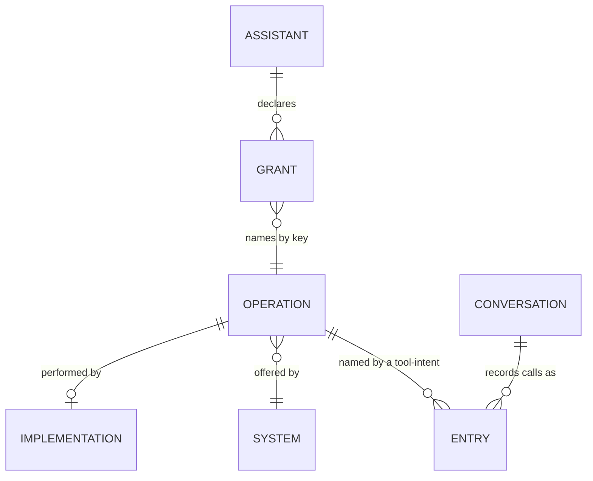
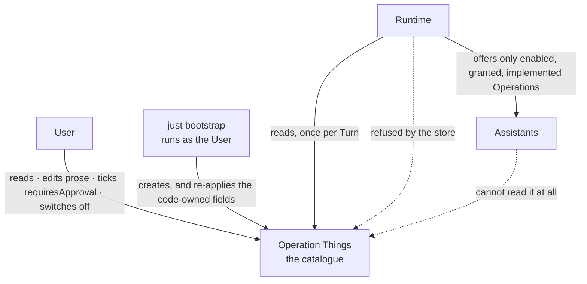
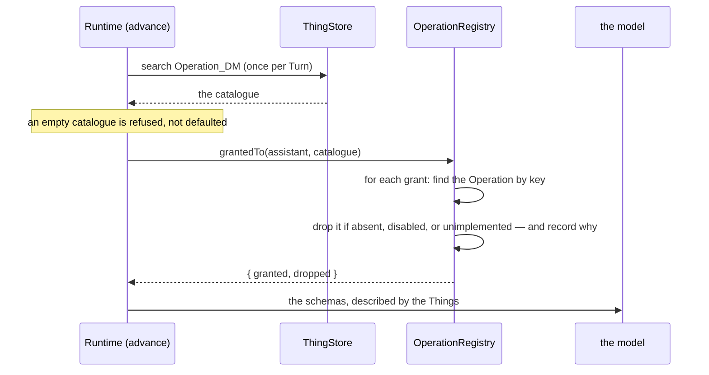

# Domain — what this change adds and changes

New and changed concepts only. The system's standing domain is
[specs/system/domain.md](../../system/domain.md); the glossary is
[CONTEXT.md](../../../CONTEXT.md). Spelling is British English.

## Vocabulary

| Term | Status | Gloss |
|---|---|---|
| **Operation** | **changed** | No longer *"something an External System can do"* — that definition never covered `assistant.call`, whose System is the Runtime, which CONTEXT.md says is deliberately *not* an External System. Now: **a capability one System offers**, external, internal or the Runtime itself — and **a Thing**, with a Model and a ThingID, whose Authority is the ThingStore |
| **Implementation** | **new** | The code that performs one Operation: `execute`, and optionally `reconcile` and `describeCall`. Not a Thing, because it is behaviour and not data. An Operation whose Implementation is absent is not offered |
| **Catalogue** | **new** | The set of Operation Things. Read once per Turn. It is the *only* answer to "which Operations exist" — there is no fallback to the seeds, because a fallback would be a second answer |
| **Granted Operation** | **renames Tool** | An Operation made available to one Assistant: an Operation Thing plus a grant, with the Implementation bound in. Replaces **Tool**, which was a bare noun standing for a derived concept and therefore said nothing about its own direction |
| **grant** | **new, lowercase** | One row in `Assistant.grants[]`, naming an Operation by key — and, for `assistant.call:<key>`, naming its callee. The record that creates a Granted Operation. A field, not a Model of its own — but a glossary term, because the word appears in three other entries and names a row the User can see |
| ~~**Tool**~~ | **retired as a domain term** | Survives only at the provider boundary, where it is the LLM API's own word: `ToolSchema`, `tools: [...]` in a request, `tool_calls` and `role: "tool"` in a response, and the `tool-intent` / `tool-result` Entry kinds that record them. The same treatment `docRef` gets. See [ADR-0020](../../../docs/adr/0020-tool-is-the-providers-word.md) |
| **Seed** | sharpened | An Implementation carries what an Operation is *created* with. After creation the Thing is authoritative, and bootstrap re-applies only the fields the code owns — never the prose, and never a decision |

Two distinctions carry the whole change and are easy to lose:

- An **Operation** is what exists; a **Granted Operation** is what one Assistant may reach. One
  Operation Thing, many grants.
- An **Implementation** is code and an **Operation** is data, and the split is not cosmetic: it is why
  this change adds no way to invent a capability. The catalogue can describe, rename, weaken,
  strengthen and switch off Operations. It cannot make one exist.

## Concepts and entities

`IMPLEMENTATION` is drawn but is not a Thing — it is a row in the Runtime's registry, and it appears
here because an Operation that has lost its Implementation is a state the domain has to have a word
for. `SYSTEM` is not a Thing either: it is a name on the Operation, and the set of names is the
code's.

| Model | Authority | What it is |
|---|---|---|
| `Operation` | ThingStore | One Operation of one System: its key, what it does, what it needs, and whether it is on |

Nine Models now. Seven are the household's subject matter and the machinery; `Operation` joins
`Assistant` as the second Model that describes what the system *is* rather than what the household
*has*.

### The Operation's fields, by owner

The interesting property of this Model is that its fields have two different owners, and which owner
a field has is a domain decision rather than an implementation detail.

| Field | Owner | Why |
|---|---|---|
`key` | code | The Operation's name and its natural key — `bookkeeping.postTransaction`. What a grant names, and what the Implementation is looked up by, so renaming it breaks both |
`system`, `kind` | code | Which System offers it, and whether it is internal, a Connector or a Manual Connector. Facts about the code |
`parameters` | code | The JSON Schema the model is offered. A contract with `execute`; the Thing carries it so the catalogue is complete, read-only so it cannot be broken |
`mutating` | code | Whether `execute` changes state somewhere. **Never read back from the Thing** — a wrong value makes crash recovery re-post rather than reconcile (ADR-0012), and there is nothing here for a User to decide. Shown beside `requiresApproval` because "does this change something out there" is exactly the input to "should it ask me first" |
`name`, `description` | **User**, sticky | The prose the model reads, which is how it chooses. Created from the seed and **never re-applied**: rewording the sentence a model reads in order to change how it behaves is a decision, not a fact about `execute`. Bootstrap reports the divergence rather than resolving it |
`requiresApproval` | **User**, sticky | Whether the Runtime refuses the call without an answered approval. **The Thing wins**, including when it says no and the Implementation says yes |
`enabled` | **User**, sticky | The per-Operation kill switch. Sticky for the same reason `RuntimeState.paused` is: switching something off is an operational act and `just dev` must not undo it |
`notes` | **User**, sticky | The User's own note about why they did what they did |

There is deliberately **no `implementation` field**. An earlier draft carried one, so that an Operation
could be renamed for the model while the Runtime kept track of which function performs it — but `key`
is code-owned and read-only precisely because a renamed Operation is a set of grants pointing at
nothing, so that rename can never happen through any supported path. The Implementation is found by
`key`, and *unimplemented* means "no Implementation registered under this key". The field returns on
the day Operations can be added dynamically, which is the feature that would actually give it two
different values.

## Actors

No new actor. Two changed relationships.

**User** — gains a fourth thing they write: `Party`/`Document`/`Invoice`/`Process`, `Assistant`, the
answer fields of an `OpenQuestion`, and now `Operation`. They are the only actor who may write one,
by the same mechanism and for the same reason as `Assistant` (D-007a).

**Runtime** — reads the catalogue and never writes it. This is the first Model the Runtime reads on
every Turn and is refused write access to, which makes it also the first Model where the Runtime's
read is on the hot path and its write is a `-32059`.

**Assistants** — do not read it. `Operation_DM` is the first Model withheld from them, because it is
the one Model whose entire content is the safety configuration that constrains them.

**`just bootstrap`** — already runs as the User rather than as the Runtime, because *"an Assistant is
the User's to write"*. That sentence now covers Operations too, and the recipe needs no change.

## Processes

### Resolving what an Assistant may call

Four ways a grant can fail to become a Granted Operation, and all four are now sayable — **to the
model as well as to the log**, which is the half that matters, because the log is not what decides
what happens next:

| The grant names | Was | Becomes |
|---|---|---|
| an Operation that does not exist | silently skipped | dropped, with a reason naming the Assistant and the key |
| an Operation that is `enabled: false` | impossible | dropped as *switched off* |
| an Operation whose Implementation is gone | impossible | dropped as *unimplemented* — a code/catalogue drift |
| itself, via a bare `assistant.call` | skipped | unchanged; still skipped, still deliberate |

### Bootstrap reconciles the catalogue

Bootstrap already has two behaviours and this change needs a third, which is the honest resolution of
a Model whose fields have two owners:

| What | Behaviour | Why |
|---|---|---|
| `Assistant` | re-applied entirely | It is a definition, and the seed is the source of truth |
| `RuntimeState` | left alone | It is live state, and re-applying it would disengage a `pause` |
| `Operation` | **the mechanical mirror re-applied; everything a human might have thought about left alone** | Both at once: the mirror of code must track code, and a decision must not be undone by `just dev` |

The rule in one line: **bootstrap re-applies what the code knows and never re-applies a decision.**
The prose is on the decision side of that line, so a developer who improves a description does *not*
reach a running system — and bootstrap says so, naming the Operations whose description differs from
their seed, changing nothing. Silence would make the stickiness feel like a bug the first time
somebody hit it.

### An Operation switched off under a waiting Conversation

Nothing is stranded, and it is worth being precise about *why*, because the obvious answer is wrong.
`reconcile()` is the **crash** path: it runs only for an intent with no result at all. A Conversation
suspended on `bank.sendMoney` already has a `pending` tool-result written, so reconciliation never
sees it.

What actually happens is this. The Open Question is answered, the watcher resumes the Conversation,
the model takes a fresh Turn, and — finding the Operation no longer offered — is told **why**: *"…is
switched off"*. Not *"is not one of your tools"*, which was the pre-change message and is false: the
Assistant was granted it, the grant is still in its definition, and the User can see it there. A model
told it never had a capability re-plans around a premise that is not true.

## Rules and constraints

### One writer per document, extended

`Operation` joins the single-writer table as **User only** — the third row in it, beside `Assistant`
and the answer fields of an `OpenQuestion`, and enforced the same way: by the store, not by the form.

### An Assistant may reach only what it declares — now a conjunction

ADR-0010's rule gains a second condition. An Operation is offered when it is **declared** by the
Assistant *and* **enabled** in the catalogue *and* **implemented** in the Runtime. Two of those three
are new, and both can only ever remove a capability, never add one.

### An Operation's identity is its key

The key is what a grant names and what the Implementation is looked up by, so it is not the User's to
edit — a renamed Operation is a set of grants pointing at nothing *and* an Operation nothing performs.
It is code-owned, and the form shows it read-only.

### "Tool" is the provider's word and stays at its boundary

The domain has one word for a capability — **Operation** — and one for a capability granted to an
Assistant — **Granted Operation**. "Tool" is what the LLM APIs call the schema we send them, and it
survives in exactly the places that are about talking to them: `ToolSchema`, the `tools` array of a
request, `tool_calls` and `role: "tool"` in a response, and the `tool-intent` / `tool-result` Entry
kinds that record a call in the transcript. Those last two are also **stored data** in every existing
Conversation, so they are kept for a second reason: renaming them would make old transcripts
unreadable to `buildMessages`, and there is nothing to gain.

The rule for new prose and new code: if the sentence is about an LLM API, "tool" is correct. If it is
about what this system can do, it is an Operation.

### The catalogue is not optional

An empty catalogue means bootstrap has not run or the store could not answer, and both are
misconfigurations. The Runtime refuses to scan and the Turn is refused, rather than falling back to
the seeds: a fallback would give the system two answers to *"what can this Assistant do"*, which is
the thing ADR-0006 exists to prevent, in the one place where the wrong answer costs money.

### Dangerous facts are code's; dangerous decisions are the User's

`mutating` is a fact and stays in code. `requiresApproval` is a decision and belongs to the User.
The line between them is the line between "what does this code do" and "what do I want to happen",
and putting `mutating` on the User's side of it would not be sovereignty — it would be asking them to
maintain a fact about someone else's function.

### The catalogue constrains Assistants, so Assistants do not read it

`Operation_DM` is withheld from `READABLE_MODELS`. An Assistant learns what it may do from the schemas
it is offered — that is ADR-0010's design — and has no task that requires reading the configuration
that guards it. With `requiresApproval` now a checkbox, a readable catalogue would tell a model which
Operations are guarded and what the User has written about them, which is reconnaissance for the one
attack this change leaves open.

## Known departures

- **`requiresApproval` is a checkbox now, and a checkbox can be lobbied for.** ADR-0018 made
  *"nothing is booked without an answer"* un-talk-past-able by putting it where the Assistant is
  never asked. After this change the Assistant still cannot change it — but it can compose a
  persuasive sentence to the human who can, and a model that has read a hostile document may. The
  Runtime logs the weakening, names the Operation, and does not override it. Deliberate, in favour of
  the User's sovereignty over their own money, and recorded in an amendment on ADR-0018 itself so
  that a reader who lands there alone is not left believing the old sentence.
- **A description improved in code does not reach a running system.** The opposite departure from the
  one `Assistant` has, and it is the price of the prose being sticky. Bootstrap reports it by name.
- **The catalogue answers *what exists*, not *who may*.** An Operation Thing carries no grants, so
  "which Assistants may book a transaction" is still answered by opening each Assistant. Computing the
  reverse index onto the Operation would require the Runtime to write `Operation_DM`, which is the one
  thing the security argument forbids. The honest route is a read-side join in the web application,
  and it is a later change.
- **Read access is now guarded for exactly one Model.** `READABLE_MODELS` was a constant that nothing
  consulted; this change makes it real and excludes `Operation_DM`. The rest of the machinery —
  `Assistant_DM`, `Conversation_DM`, `RuntimeState_DM`, `OpenQuestion_DM` — stays readable, as it has
  been all along. Narrowing it further is a separate change with its own blast radius.
- **People will keep saying "tool", and that is not a failure of the rename.** It is the word the
  whole field uses, and a newcomer will reach for it first. The glossary's job is to make the written
  system unambiguous, not to police speech.
- **Nine Models, and two of them describe the system rather than the household.** `Assistant` and
  `Operation` are configuration living in the data store. That is ADR-0003's bet, taken a second
  time; the alternative was a config file, and the reason it was refused for Assistants is the reason
  it is refused here — the User cannot edit a file inside a container.
