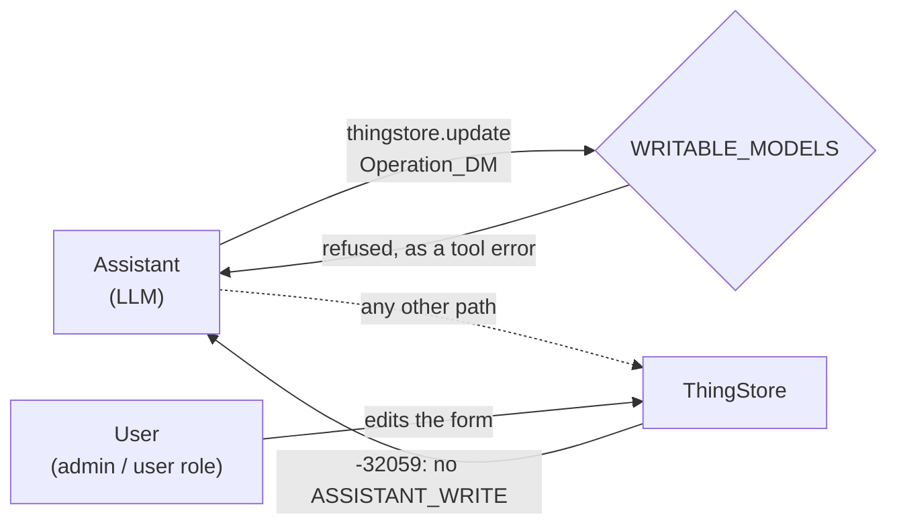
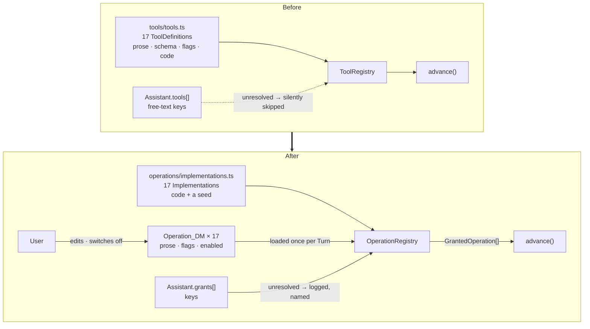

# Proposal — Operations become Things

## What

The catalogue of Operations moves out of TypeScript and into the ThingStore. A ninth Model,
`Operation_DM`, holds one Thing per Operation: its key, the System it belongs to, the prose the model
reads, its parameter schema, whether it mutates, whether it requires an approval, and whether it is
switched on at all. The code keeps what only code can hold — the **Implementation**, the `execute` /
`reconcile` / `describeCall` functions that actually do the work — and the two are joined by the
Operation's key, which is why the catalogue can describe an Operation and cannot invent one.

Everywhere the Runtime asks *"what Operations are there, and what does this one say about itself?"*
it reads the catalogue instead of a hard-coded array.

The grant's *shape* does not change: one row per Operation, named by key, `assistant.call:<key>`
still naming its callee, and ADR-0010 still meaning what it meant. What changes is that the thing
being granted now exists somewhere the User can see it — and that the grant is finally called what it
is.

### Naming

The change carries a rename, because the old pair did not survive being written down.
[CONTEXT.md](../../../CONTEXT.md) defined an **Operation** as *"something an External System can do"*
and a **Tool** as *"an Operation made available to a particular Assistant"*. Those are a capability
and a grant of that capability — but they are **both bare nouns**, so nothing in either word says
which is derived from the other, and a reader has to memorise the direction.

The definition of **Operation** had a second problem, unrelated to the pair: it was already false.
`assistant.call` is offered by the Runtime, which CONTEXT.md says is *deliberately not an External
System*. An Operation is now **a capability one System offers** — external, internal, or the Runtime
itself — which is what the catalogue's `System` column has to mean the moment a User reads one.

So the grant becomes a **Granted Operation**. The modifier goes on the derived concept, and the verb
is the one the codebase already reaches for everywhere: `grantedTo()`, `interface ToolGrant`,
*"granted to no Assistant"*, ADR-0010's own *"granted Tools"*.

**"Tool" is the LLM provider's word, and after this change it appears only at the provider
boundary**: `ToolSchema`, `tools: [...]` in the request, `tool_calls` and `role: "tool"` in the
response, and the `tool-intent` / `tool-result` Entry kinds that record them. Inside the domain the
word does not appear at all, so nobody has to hold two meanings of it. This is the same treatment
`docRef` gets — A12's word, kept only where we are talking to A12.

That the domain word is `Operation` rather than `Tool` is not merely tidiness. An External System
offers Operations whether or not an LLM exists — Firefly has never heard of one — and `Operation_DM`
will outlive this generation of LLM APIs in a way `Tool_DM` would not.

| | Means | Lives in |
|---|---|---|
| **Operation** | one capability one System offers | `Operation_DM`, the catalogue |
| **Implementation** | the code that performs one Operation | `implementations.ts`, found by key |
| **grant** | one row saying an Assistant may use one Operation | `Assistant.grants[]`, field `OperationKey` |
| **Granted Operation** | what an Assistant thereby has: the Operation with its Implementation bound in | the Runtime, per Turn |
| ~~Tool~~ | retired as a domain term | the provider boundary only |

The full argument, with the pairs that were rejected, is
[ADR-0020](../../../docs/adr/0020-tool-is-the-providers-word.md).

## Why

**The catalogue is invisible to the person who is supposed to be supervising it.** An Operation
exists today in exactly two places: `runtime/src/tools/tools.ts`, and a hand-maintained table in
[architecture.md](../../system/architecture.md) that opens with the words *"Seventeen Operations"* —
true today, wrong the next time one is added. A User deciding whether to grant
`bookkeeping.listTransactions` to the Receptionist has to read TypeScript to find out what it does.
ADR-0010's argument was that *"reading an Assistant tells you what it can reach"*; it stopped at the
list of names and never made the names themselves readable.

**A grant naming nothing is silently ignored.** `registry.ts:112` resolves each declared operation
against the registry and `continue`s when it finds nothing. So `bookkeeping.listTransaction`
(singular) is not an error, not a warning, and not a Granted Operation — it is a capability the User believes they
granted and the Assistant has never been offered. With a catalogue there is something to resolve
against and something to say when the resolution fails.

**Three dials the User should own are code changes.** The description the model reads is how the
model decides which Operation to call — it is prompt engineering, and it is compiled in. Whether an
Operation requires an approval is a policy decision about the User's own money. Whether an Operation
is available at all — when Firefly is down, when a Connector starts misbehaving — has no switch:
`RuntimeState.paused` stops everything and `Assistant.enabled` stops one Assistant, and there is
nothing in between.

**Symmetry with a decision already taken.** An Assistant is a Thing (ADR-0003) precisely because it
is a definition the User edits and reviews. An Operation is the same kind of object — a definition,
edited rarely, read constantly, with consequences worth reviewing — and it is treated differently
only because of the order the two were built in.

## The security problem, and the answer

The objection is immediate and correct: if an Operation is a Thing, and Assistants write Things, then
an Assistant can rewrite the Operation that moves money — untick *requires approval*, widen the
description, switch a rival Operation off — and the system that was protecting the User is now
LLM-writable.

The answer is the one this system already uses for exactly this problem, one Model over. D-007a:
the `runtime` role does not hold `ASSISTANT_WRITE`; the *"User Has ASSISTANT_WRITE Right For An
Assistant"* policy in `import/auth/childAuthorizationDefinition.json` withholds `Assistant_DM` from
anyone without it; and the refusal is **the store's**, not a check inside the same LLM-driven process
that would be doing the escalating. That policy already tests set membership against
`{'Assistant_DM'}` in three resource shapes. Widening it to `{'Assistant_DM','Operation_DM'}` costs
one string in three places.

Three cheaper guards sit in front of it, so the store's refusal is the last line rather than the
only one:

| Guard | Where | What it stops |
|---|---|---|
| `Operation_DM` absent from `WRITABLE_MODELS` | `runtime/src/operations/implementations.ts` | `thingstore.create` / `.update` refuse it with a message the model can read |
| `Operation_DM` absent from `READABLE_MODELS` | same file | An Assistant reading the configuration that constrains it — which is where it would learn which Operations are guarded, and what the User already believes about them |
| `Operation_DM` absent from `TRIGGER_ELIGIBLE_MODELS` | `runtime/src/domain/types.ts` | Editing the catalogue cannot give birth to a Conversation |
| No `ASSISTANT_WRITE` on `runtime` | Keycloak → `roles.yaml` → the store | Everything else, including a call path nobody foresaw |

The read guard is not a line removed from a list: `READABLE_MODELS` is declared at `tools.ts:254` and
**referenced nowhere**, so there is no read guard today at all. This change makes it real for one
Model. The rest of the machinery stays readable, as it has been all along, and narrowing it further
is a separate change with its own blast radius.

### What write access does not cover, and what we are accepting

Write access stops an Assistant from editing an Operation. It does not stop one from *asking the
User to*. A model that has read a poisoned invoice can compose a persuasive sentence about how the
approval step is slowing everything down, and the User holds the pen.

You have decided the User is sovereign here: `requiresApproval` on the Thing is authoritative, and
turning it off turns it off. That is a real cost and this proposal states it rather than hides it —
ADR-0018 made *"nothing is booked without an answer"* a property of the build, and after this change
it is a property of a checkbox the User owns. Three things follow, all cheap:

- The Runtime **logs a warning, once per Operation per process**, when an effective
  `requiresApproval` is weaker than the Implementation shipped with. It does not override it. It
  names the Operation, so the weakening is in the log beside the bookings it permitted — and it fires
  once rather than on every Turn, because the snapshot loads per Turn and a warning that repeats
  forever is a warning people filter.
- **The safer rule was considered and refused.** A monotonic `requiresApproval` — the code's `true`
  always wins, so the checkbox can only ever *add* requirements — would have kept ADR-0018 literally
  true. It was rejected in favour of the User's sovereignty over their own money, and the consequence
  is recorded in an amendment on ADR-0018 itself rather than left for a reader to discover.
- `mutating` stays **code-owned and is never read back from the Thing**. This is not a policy dial
  and there is nothing for the User to decide: it is a fact about what `execute` does, and a wrong
  value makes crash recovery re-post a booking rather than reconcile it (ADR-0012). The Thing mirrors
  it for display.
- The decision is auditable. An Operation is a Thing, so `__meta.creator` and `updatedAt` record who
  weakened it and when — which is more than the current arrangement offers, where the same change is
  a commit in a repository the User does not read.

## Scope

**In**

- `Operation_DM` / `_FM` / `_OM`, wired into `AssistantsAppModel_AM.json`.
- `ThingModel`, `SPECS`, `domain/types.ts`, and the machine-field convention.
- Splitting today's `ToolDefinition` into a code-side **Implementation** and a data-side Operation,
  with the resolved **Granted Operation** the loop already consumes as the product of the two.
- A catalogue snapshot loaded once per Turn; `grantedTo` / `schemasFor` resolve against it, and
  `grantedTo` returns what it **dropped and why**, so a model calling a switched-off Operation is told
  that it is switched off rather than that it was never one of its tools.
- A catalogue check at Runtime start as well as per Turn: no catalogue, no scanning, unhealthy, and a
  logged recovery when one appears.
- **The rename.** `Assistant.tools[]` → `Assistant.grants[]` (A12 group `Tools`/`ToolOperation` →
  `Grants`/`OperationKey`), and the domain-side code names with it. This is the one part of the change
  that touches `Assistant_DM`. In principle it is a migration — A12 has no column rename, so stored
  Assistants read as grant-less until re-seeded. In *this* repo it costs nothing: the only grant lists
  that exist are the two `AssistantSeed` arrays, re-applied in full by every bootstrap. A grant added
  by hand in the web application and never seeded would be lost; there are none.
- Bootstrap seeds one Operation Thing per Implementation, re-applies only the mechanical mirror, and
  **reports** — without changing — descriptions that have diverged from their seed.
- The four in-process guards and the auth policy widening.
- Docs: `CONTEXT.md` (**Operation** redefined and made a Thing, **Tool** replaced by **Granted
  Operation**, **grant** and **Implementation** added, **Approval** amended),
  `specs/system/{domain,architecture,functional}.md`, `README.md`, ADR-0019 and ADR-0020, an amendment
  note on ADR-0018 and a one-line note on ADR-0010.
- Tests at every tier: models, runtime units, live-stack integration (including that the `runtime`
  identity is *refused* a write), and one end-to-end.

**Out**

- **Operations authored entirely in the UI.** An Operation with no Implementation is not an
  Operation; it is a description of one. There is no `exec` tool and there is not going to be —
  learning 17 in [ASSISTANTS_VS_OPENCLAW.md](../../research/ASSISTANTS_VS_OPENCLAW.md) rejects it,
  and ADR-0010's granularity is the reason.
- **Per-Assistant overrides** of an Operation's prose or approval requirement. That is the
  per-Assistant safety configuration ADR-0018 rejected, arriving by the side door.
- **Parameter schemas as data the User edits.** The schema is a contract between the model and
  `execute`; an edited one breaks the Operation with nothing to catch it. The Thing carries it,
  read-only, so the catalogue is complete.
- **Replacing the grant with a ThingID reference.** The Operation key is its natural key, exactly as
  `key` is an Assistant's, and a grant that reads `bookkeeping.postTransaction` is the legibility
  ADR-0010 was arguing for. A ThingID would also bind a reference to a Model, which ADR-0002 rejects.
- **Answering *"who may do this?"* from the catalogue.** An Operation Thing carries no grants, and the
  only component positioned to compute the reverse index is the Runtime — which this change
  specifically forbids from writing `Operation_DM`. The catalogue answers *what exists*; an Assistant
  answers *who may*. A read-side join in the web application is the honest route and a later change.
- **An `implementation` field distinct from `key`.** Dropped: the rename it would enable cannot happen
  through any supported path, because `key` is code-owned and read-only. It returns with dynamic
  Operations, which is the feature that would give it a second value.
- **A read guard over the rest of the machinery.** `Operation_DM` is withheld from Assistants;
  `Assistant_DM`, `Conversation_DM`, `RuntimeState_DM` and `OpenQuestion_DM` stay readable, as they
  are today. Narrowing that is a separate change with its own blast radius.
- Deleting Operation Things whose Implementation has gone. They stay, are not offered, and say so.

## Expected outcome

Afterwards:

- The User opens *Operations* in the web application and reads what every Operation does, which
  System it belongs to, whether it needs their approval, and whether it is on.
- Turning one off takes a tick and survives a restart. It does not need a deploy.
- The architecture document's Operations table stops being a hand-maintained copy of a list that
  lives somewhere else, and becomes a pointer at the catalogue.
- A mistyped grant is reported instead of silently dropped — and so is a switched-off one, to the
  model as well as to the log, in the words that are actually true.
- The vocabulary says which concept is derived from which, and "tool" means one thing again — the
  provider's thing, at the provider's boundary.
- The one guarantee that was worth protecting is protected by the store, in the same place and by the
  same mechanism that already protects an Assistant from writing itself a new capability.
