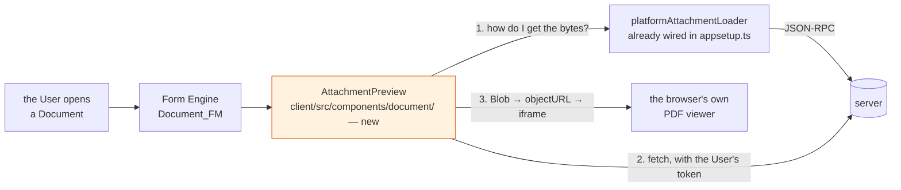
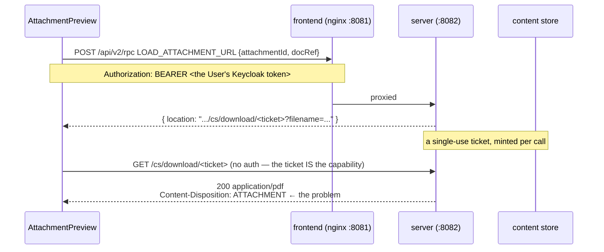

# Architecture — one component, and one unknown to retire first

## Overview

The whole change, if the unknown resolves the easy way:



One orange box. Everything else exists.

**The browser renders the PDF, not us.** Chrome, Safari and Firefox all ship a PDF viewer with paging,
zoom, text selection, search and print. Putting a blob URL in an `<iframe>` gets all of it for nothing.
Rendering with `pdfjs` in the client would be rebuilding a viewer that is already installed — and note
that `pdfjs-dist` *is* a dependency of this project, in the **Runtime**, to extract text without a
canvas. Different problem, different process, and worth saying so before somebody unifies them.

## How it actually works — measured, not inferred

Every row below was observed on the wire in a live browser session.



**`/cs/download/{id}` is deliberately unauthenticated** — it sits on the UAA introspection whitelist —
because the ticket carries the authority. The ticket is spent on first use: replaying answers
`error.content-store.ticket.unavailable`, two consecutive `LOAD_ATTACHMENT_URL` calls return two
different UUIDs, and even a `HEAD` consumes one.

### You do get a durable handle — the ticket is not it

Worth stating plainly, because an earlier draft of this document listed the ticket as an *obstacle* and
that was a misreading. There are **two** levels, and only one of them is ephemeral:

| | what it is | lifetime |
|---|---|---|
| **`attachment_id`** | the durable handle, stored on the Document's attachment group | for ever, and reusable without limit |
| **the ticket** | a one-shot redemption of that handle for bytes | one `GET`, then gone |

Measured, with the same `attachment_id` and `docRef` throughout: two `LOAD_ATTACHMENT_URL` calls mint
**two different** ticket URLs; each fetches the full 175362 bytes with a `200`; and replaying a spent
one answers `404`. So nothing is lost and nothing needs storing — the handle on the Document is
permanent, and you exchange it for a fresh URL whenever you want the file.

**And the reason is sound.** `/cs/download/{id}` is unauthenticated by design. A permanent
unauthenticated URL for a household invoice would leak for ever — into browser history, proxy logs, a
`Referer` header, a shared screenshot. Making it single-use means a leaked URL is worthless within
moments. The authentication happens at the mint step, against the User's own token, and the ticket is a
capability with a deliberately tiny blast radius.

The practical cost to a preview is therefore **one extra JSON-RPC call per preview**, which is not an
obstacle in any meaningful sense. The only real rule is *mint your own* — never reuse a ticket and
never spend the one the Download menu item is about to use.

### What actually blocks the obvious implementation — two things, not four

| Obstacle | Evidence | Consequence |
|---|---|---|
| **`Content-Disposition: attachment`, always** | a live iframe pointed at a fresh ticket stayed blank and Chrome downloaded the file. `?disposition=inline&inline=true` is ignored | **`<iframe src={location}>` cannot work** |
| **CORS** | `fetch(location)` from `http://localhost:8081` → *"No 'Access-Control-Allow-Origin' header is present"*. nginx proxies `/api` and `/actuator` only; `/cs` is another origin | **the blob-URL workaround cannot work either** |
| *(not a blocker)* single-use ticket | verified by replay and by two consecutive mints | mint one per preview; a *failed* fetch also spends one |
| *(not a blocker)* no `Accept-Ranges`, no `Content-Length` | chunked response | constrains *how* it is read — one full read, no ranges — not whether |

There is **no** `X-Frame-Options` and **no** CSP on the response — framing is not what is blocked. The
disposition header is.

### Therefore: a server route, and this change is not client-only

An inline preview needs a **same-origin, authenticated endpoint on the application server** that reads
the attachment and re-serves it with `Content-Disposition: inline`. Two shapes, and the choice matters:

| | re-serve inline | return bytes for a blob URL |
|---|---|---|
| the client does | `<iframe src="/api/…/preview?…">` | `fetch` → `Blob` → `createObjectURL` |
| needs | nothing else | an object URL to revoke, and lifetime discipline |
| the browser's viewer | works | works |
| **preferred** | **yes** — no lifetime to get wrong, no blob to leak | only if the first proves impossible |

Note what this does to the change's cost: the server here is *"a smart store — three hand-written Java
classes, none of them domain-aware"*. Adding a fourth is not free, and
[ADR-0023](../../../docs/adr/0023-the-runtime-is-the-door-outward.md) already argued against making the
server the place that grows integrations. **This is not that** — it reads an attachment the store
already holds, for the User who is already authenticated, and reaches nothing foreign — but the
resemblance is close enough that the distinction should be stated in the change rather than assumed.

**A cheaper alternative to weigh first: proxy `/cs` through nginx.** That makes the download
same-origin and dissolves the CORS obstacle for one line of compose configuration. It does **not**
solve the disposition header, so a blob URL would still be needed — but it removes a server route in
favour of client code. Inferred from the compose configuration, *not* tested, and worth testing before
choosing.

## The component, assuming the bytes are reachable

```tsx
// client/src/components/document/AttachmentPreview.tsx
interface AttachmentPreviewProps {
    readonly docRef: string;
    readonly attachmentId: string;
    readonly mimeType: string;
    readonly filename: string;
}
```

| Concern | Decision |
|---|---|
| **when it renders** | `mimeType === "application/pdf"` and an `attachmentId` is present. Anything else renders nothing at all — not an empty frame, not a placeholder |
| **how it fetches** | from the same-origin server route, or via `platformAttachmentLoader` + a proxied `/cs`. **Not** a hand-rolled token fetch: there is none in `client/src` today and this should not be the first |
| **tickets** | mint a fresh one per preview. Never reuse, and never spend the one the Download menu item is about to use |
| **not through `useExternalCall`** | that seam is `ConnectorLocator → getServerConnector().fetchData()` with a `JsonRpc2Request` payload — JSON-RPC framing, wrong for a binary body, and a second way of attaching a token for no gain |
| **object URL lifetime** | created on load, **revoked on unmount and on `attachmentId` change**. A 175 KB invoice leaked per Document view is a leak nobody notices until a long session |
| **states** | loading, rendered, and refused. Refused shows the filename and a download link — the behaviour we have today — because a preview that fails must degrade to the thing it replaced |
| **read-only** | it never writes a field, never dispatches a form action, and does not participate in validation or dirty state |

**Height is a real design question, not a detail.** An invoice is portrait A4 and a form column is not.
Too short and it previews the letterhead only, which is worse than useless — it is the one part of an
invoice that carries no information. A fixed tall frame with the browser's own scrolling, or a
collapsed strip that expands, are the two honest options; the second is better if the Documents list is
being triaged and worse if a single invoice is being read.

## Where it hangs in the form

`Document_FM` configures the attachment group in `fieldConfiguration`, with a label and
`elementRef: f_attachment`. The preview needs to appear near it, and there are two ways in:

1. **A component placed by the application** around or beneath the form — no form-engine extension,
   nothing registered, and the preview is not part of the form's own layout. Simplest, and preferred.
2. **A custom widget in the Form Engine's `WidgetMap`** keyed to the attachment control — properly
   integrated, appears exactly where the model says, and a larger footprint in the platform's
   extension surface (`appsetup.ts` already customises `sagas.attachmentLoader`, so the pattern is
   there).

Start with (1). Move to (2) only if the placement is genuinely unacceptable, and say so before doing
it, because it is the difference between a component and a platform customisation.

## Security, briefly

- **The bytes are untrusted.** They came from an email from outside. They are handed to the browser's
  PDF viewer, which is sandboxed and is the same code that opens every PDF the User clicks on the web.
  That is a reasonable place to put them; rendering them ourselves would not be.
- **Do not widen the download route to reach them.** If the fix in the "cannot download" world is to
  unauthenticate or whitelist a path so an `<iframe src>` can load it, that is the wrong fix — an
  attachment is household post. Fetch with the User's credential and use a blob.
- **`sandbox` the iframe** and set no `allow-same-origin`, so a malicious PDF cannot reach the
  application's origin.

## Rejected alternatives

| Alternative | Why not |
|---|---|
| **A `Document_FM` exposition change** | there is none that previews a PDF. The platform previews images and offers a download for everything else |
| **Render with `pdfjs` in the client** | rebuilds a viewer the browser already ships, adds a canvas dependency to the client, and the first thing anyone would ask of it is paging and zoom, which are free the other way |
| **Server-side rendering to PNG** | a converter in the server, an image per page to store or cache, and a new failure mode — for something the client can do with no request at all beyond fetching the file |
| **A thumbnail via A12's thumbnail mechanism** | `thumbnail.preview.enabled=true` is set and produces thumbnails for images. A one-page thumbnail of an invoice is not readable, which is the requirement |
| **`<iframe src={location}>` directly** | measured: the frame stays blank and the browser downloads the file, because `Content-Disposition` is `attachment` and the query parameters that would change it are ignored |
| **Making `/cs/download` serve `inline`** | it is the platform's endpoint and its header is the platform's decision. Changing it would alter what every download in the application does, to serve a preview |
| **Open in a new tab** | already effectively what downloading does, and it is the context switch this change exists to remove |
| **Show `extractedText` instead** | already on the form, and it is *not the document* — for a scan it is empty, and for the Widerrufsbelehrung it is four thousand characters of boilerplate. The point is to see the page |

## What this does not change

- **No Thing, no Model, no Operation, no Assistant, no grant.**
- **No Runtime code.** This change is entirely in `client/`, plus possibly one server property if the
  investigation finds the download path broken.
- **The attachment control itself** — upload, replace and delete keep working exactly as they do.
