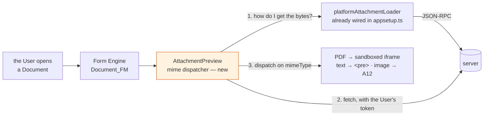
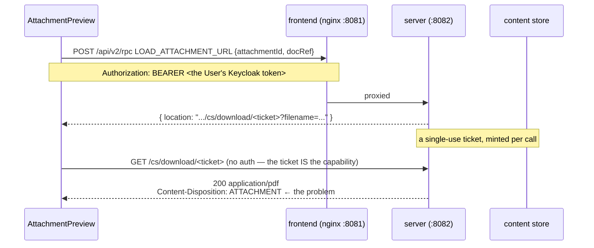

# Architecture — one component, and one unknown to retire first

## Overview

The whole change, if the unknown resolves the easy way:



One orange box. Everything else exists.

**One dispatcher, several file types.** The box is not PDF-specific: it fetches bytes the same way for
every attachment and then dispatches on MIME type to a renderer. PDF and plain text are rendered here;
images stay A12's job; everything else is a registered renderer away. See
[Extending to other file types](#extending-to-other-file-types) — it is the reason this is one component
and not a PDF widget.

**The browser renders the PDF, not us.** Chrome, Safari and Firefox all ship a PDF viewer with paging,
zoom, text selection, search and print. Putting a blob URL in an `<iframe>` gets all of it for nothing.
Rendering with `pdfjs` in the client would be rebuilding a viewer that is already installed — and note
that `pdfjs-dist` *is* a dependency of this project, in the **Runtime**, to extract text without a
canvas. Different problem, different process, and worth saying so before somebody unifies them.

## How it actually works — measured, not inferred

Every row below was observed on the wire in a live browser session.



**`/cs/download/{id}` is deliberately unauthenticated** — it sits on the UAA introspection whitelist —
because the ticket carries the authority. The ticket is spent on first use: replaying answers
`error.content-store.ticket.unavailable`, two consecutive `LOAD_ATTACHMENT_URL` calls return two
different UUIDs, and even a `HEAD` consumes one.

### You do get a durable handle — the ticket is not it

Worth stating plainly, because an earlier draft of this document listed the ticket as an *obstacle* and
that was a misreading. There are **two** levels, and only one of them is ephemeral:

| | what it is | lifetime |
|---|---|---|
| **`attachment_id`** | the durable handle, stored on the Document's attachment group | for ever, and reusable without limit |
| **the ticket** | a one-shot redemption of that handle for bytes | one `GET`, then gone |

Measured, with the same `attachment_id` and `docRef` throughout: two `LOAD_ATTACHMENT_URL` calls mint
**two different** ticket URLs; each fetches the full 175362 bytes with a `200`; and replaying a spent
one answers `404`. So nothing is lost and nothing needs storing — the handle on the Document is
permanent, and you exchange it for a fresh URL whenever you want the file.

**And the reason is sound.** `/cs/download/{id}` is unauthenticated by design. A permanent
unauthenticated URL for a household invoice would leak for ever — into browser history, proxy logs, a
`Referer` header, a shared screenshot. Making it single-use means a leaked URL is worthless within
moments. The authentication happens at the mint step, against the User's own token, and the ticket is a
capability with a deliberately tiny blast radius.

The practical cost to a preview is therefore **one extra JSON-RPC call per preview**, which is not an
obstacle in any meaningful sense. The only real rule is *mint your own* — never reuse a ticket and
never spend the one the Download menu item is about to use.

### What actually blocks the obvious implementation — two things, not four

| Obstacle | Evidence | Consequence |
|---|---|---|
| **`Content-Disposition: attachment`, always** | a live iframe pointed at a fresh ticket stayed blank and Chrome downloaded the file. `?disposition=inline&inline=true` is ignored | **`<iframe src={location}>` cannot work** |
| **CORS** | `fetch(location)` from `http://localhost:8081` → *"No 'Access-Control-Allow-Origin' header is present"*. nginx proxies `/api` and `/actuator` only; `/cs` is another origin | **the blob-URL workaround cannot work either** |
| *(not a blocker)* single-use ticket | verified by replay and by two consecutive mints | mint one per preview; a *failed* fetch also spends one |
| *(not a blocker)* no `Accept-Ranges`, no `Content-Length` | chunked response | constrains *how* it is read — one full read, no ranges — not whether |

There is **no** `X-Frame-Options` and **no** CSP on the response — framing is not what is blocked. The
disposition header is.

### Therefore: a server route, and this change is not client-only

An inline preview needs a **same-origin, authenticated endpoint on the application server** that reads
the attachment and re-serves it with `Content-Disposition: inline` — under the attachment's own
content-type, knowing nothing about whether it is a PDF, an image or text. That indifference is what
lets one route serve every file type the dispatcher supports, now and later. Two shapes, and the choice
matters:

| | re-serve inline | return bytes for a blob URL |
|---|---|---|
| the client does | `<iframe src="/api/…/preview?…">` | `fetch` → `Blob` → `createObjectURL` |
| needs | nothing else | an object URL to revoke, and lifetime discipline |
| the browser's viewer | works | works |
| **preferred** | **yes** — no lifetime to get wrong, no blob to leak | only if the first proves impossible |

Note what this does to the change's cost: the server here is *"a smart store — three hand-written Java
classes, none of them domain-aware"*. Adding a fourth is not free, and
[ADR-0023](../../../docs/adr/0023-the-runtime-is-the-door-outward.md) already argued against making the
server the place that grows integrations. **This is not that** — it reads an attachment the store
already holds, for the User who is already authenticated, and reaches nothing foreign — but the
resemblance is close enough that the distinction should be stated in the change rather than assumed.

**A cheaper alternative to weigh first: proxy `/cs` through nginx.** That makes the download
same-origin and dissolves the CORS obstacle for one line of compose configuration. It does **not**
solve the disposition header, so a blob URL would still be needed — but it removes a server route in
favour of client code. Inferred from the compose configuration, *not* tested, and worth testing before
choosing.

## The component, assuming the bytes are reachable

```tsx
// client/src/components/document/AttachmentPreview.tsx
interface AttachmentPreviewProps {
    readonly docRef: string;
    readonly attachmentId: string;
    readonly mimeType: string;
    readonly filename: string;
}
```

| Concern | Decision |
|---|---|
| **when it renders** | when the registry has a renderer for `mimeType` and an `attachmentId` is present — `application/pdf` and `text/plain` today, images left to A12. A type with no registered renderer renders nothing at all — not an empty frame, not a placeholder |
| **how it fetches** | from the same-origin server route, or via `platformAttachmentLoader` + a proxied `/cs`. **Not** a hand-rolled token fetch: there is none in `client/src` today and this should not be the first |
| **tickets** | mint a fresh one per preview. Never reuse, and never spend the one the Download menu item is about to use |
| **not through `useExternalCall`** | that seam is `ConnectorLocator → getServerConnector().fetchData()` with a `JsonRpc2Request` payload — JSON-RPC framing, wrong for a binary body, and a second way of attaching a token for no gain |
| **object URL lifetime** | created on load, **revoked on unmount and on `attachmentId` change**. A 175 KB invoice leaked per Document view is a leak nobody notices until a long session |
| **states** | loading, rendered, and refused. Refused shows the filename and a download link — the behaviour we have today — because a preview that fails must degrade to the thing it replaced |
| **read-only** | it never writes a field, never dispatches a form action, and does not participate in validation or dirty state |

**Layout — beneath was not enough; it is now side-by-side with a reveal.** The first cut placed the
preview as a full-width pane *beneath* the form, and in a real browser that failed the feature's own
promise: the Documents screen is a master-detail (overview list left, form right ~690px wide), so a
pane beneath a full-height Document form sits below the fold — the User opens a Document and sees the
form, not the document. The shipped layout instead puts the form and the preview in a **`flex-wrap`
row** — side by side when both fit, the preview wrapping beneath on a narrow window — and the pane
**scrolls itself into view** when it has wrapped into the lower half of the viewport, so a Document
always opens with its document visible (measured: 3% → 100% of the invoice page on open). Every
non-Document form is the row's only child and stays full-width. Within the preview each renderer sizes
itself differently:

- **PDF** renders in a **centered A4-shaped frame**, sized by height rather than width. `aspect-ratio:
  210 / 297` (A4 is 210×297 mm, so 1 : 1.414 portrait), a viewport-relative height (~`80vh`) so one
  page fits without scrolling the outer page, width derived from the ratio, `margin-inline: auto` to
  centre it. Multi-page PDFs scroll inside the browser's own viewer. This is height-driven on purpose:
  a *full-width* A4 frame on a wide form would be `width × 1.414` tall — well past the viewport for a
  single page — which is why the frame is a centred column, not the full pane width.
- **Plain text** takes the pane's full width at its **natural height** — a `<pre>` grows to its
  content; text is not A4-shaped.

Two things the A4 frame is *not*. It is an A4-shaped **viewport**, not a per-document measurement:
Letter (1 : 1.294), landscape, or mixed-size PDFs still render — the browser's viewer fits-to-width and
scrolls — the frame shape simply will not match their pages exactly, and measuring each PDF to match is
work this change does not do. And too short a frame would preview only the letterhead, the one part of
an invoice carrying no information — which is why the height is generous, not a thumbnail.

## Extending to other file types

The concept generalises, and the component is built so it can — because the mechanism has two halves
that vary independently:

1. **Byte delivery** — mint a ticket, fetch through the same-origin inline route (or proxied `/cs` + a
   blob). This half is **mime-agnostic**: it re-serves whatever bytes the attachment holds with their
   own content-type and does not branch on file type at all. It is the reusable extension point, and
   the same route serves every preview.
2. **Rendering** — hand those bytes to something that can draw them. This is the half that varies, and
   it is why "preview a PDF" and "preview a Word document" are not the same size of change.

So `AttachmentPreview` is a **dispatcher on `mimeType`** over a small registry of renderers:

```tsx
type AttachmentRenderer = (source: PreviewSource) => ReactElement;

const renderers: Record<string, AttachmentRenderer> = {
    "application/pdf": PdfFrame,   // the browser's own PDF viewer, in an <iframe> (see Security)
    "text/plain":      TextBlock,  // HTML-escaped into a <pre> — never rendered as markup
    // image/*  — deliberately absent: A12's File Picker already previews images
    // text/markdown, application/vnd.* — a later change registers a renderer here
};
```

A `mimeType` with no registered renderer renders **nothing** — today's icon-and-download stands.
Adding a format later is *registering a renderer*, not touching the fetch.

What the browser renders natively drops in almost for free; what it cannot needs a library or a
converter — and, for bytes that arrived from an untrusted email, a sanitiser:

| Attachment | Renderer | Cost |
|---|---|---|
| **Image** (png/jpg/webp…) | browser-native — **already done by A12's File Picker**, so the dispatcher defers | none |
| **PDF** | the browser's PDF viewer in an `<iframe>` (no `sandbox` — see Security) | the byte-delivery route — this change |
| **Plain text** (`text/plain`) | HTML-escaped into a `<pre>` | tiny — no viewer, no library |
| **Markdown** (`text/markdown`) | a markdown→HTML renderer **plus a sanitiser** | a library and an XSS surface the sandboxed-PDF path avoids — a later change |
| **Office** (docx/xlsx) | a converter (server→PDF, or a heavy client lib) | a new process and failure mode — a later change |

**In scope now: the three the browser renders natively** — PDF and plain text implemented here, images
left to A12 — plus the registry itself as the seam for the rest. Markdown-rendered and Office are
deliberately deferred *behind* that seam: each brings its own renderer and, for markdown, its own
security section, which is the honest reason they are a separate change rather than a missing branch.

## Where it hangs in the form

`Document_FM` configures the attachment group in `fieldConfiguration`, with a label and
`elementRef: f_attachment`. The preview needs to appear near it, and there are two ways in:

1. **A component placed by the application** around or beneath the form — no form-engine extension,
   nothing registered, and the preview is not part of the form's own layout. Simplest, and preferred.
2. **A custom widget in the Form Engine's `WidgetMap`** keyed to the attachment control — properly
   integrated, appears exactly where the model says, and a larger footprint in the platform's
   extension surface (`appsetup.ts` already customises `sagas.attachmentLoader`, so the pattern is
   there).

Start with (1). Move to (2) only if the placement is genuinely unacceptable, and say so before doing
it, because it is the difference between a component and a platform customisation.

## Security, briefly

- **The bytes are untrusted.** They came from an email from outside. They are handed to the browser's
  PDF viewer, which is sandboxed and is the same code that opens every PDF the User clicks on the web.
  That is a reasonable place to put them; rendering them ourselves would not be.
- **Do not widen the download route to reach them.** If the fix in the "cannot download" world is to
  unauthenticate or whitelist a path so an `<iframe src>` can load it, that is the wrong fix — an
  attachment is household post. Fetch with the User's credential and use a blob.
- **The PDF frame carries no `sandbox` attribute — measured, not an oversight.** The original intent
  here was to `sandbox` the iframe with no `allow-same-origin`. It cannot be done: Chrome refuses to run
  its internal PDF viewer (a MimeHandler extension) inside *any* sandboxed frame — `sandbox=""`,
  `allow-same-origin`, and `allow-scripts allow-same-origin` were each tried in a real browser and each
  rendered a broken-document icon; only an un-sandboxed frame shows the PDF. The isolation is therefore
  the **browser's PDF viewer itself**: it renders the bytes without ever exposing a scriptable document
  to the page, which is the same reason this change uses the browser's viewer rather than rendering the
  PDF in-page. Two things make the un-sandboxed frame safe: the frame's source is a **blob URL**, never
  a remote origin; and the blob is **re-typed to the attachment's declared MIME type** before it is
  handed over, so a store response mislabelled `text/html` cannot be sniffed into scriptable markup — a
  mismatch renders as a broken PDF, never as HTML.
- **Text is untrusted too, and is never markup.** The `text/plain` renderer HTML-escapes the bytes
  into a `<pre>` — it must not become an "interpret it as HTML/markdown" path by accident. Every future
  renderer added to the registry owns its own sanitisation; that per-renderer security surface is
  exactly what keeps markdown a separate change.

## Rejected alternatives

| Alternative | Why not |
|---|---|
| **A `Document_FM` exposition change** | there is none that previews a PDF. The platform previews images and offers a download for everything else |
| **Render with `pdfjs` in the client** | rebuilds a viewer the browser already ships, adds a canvas dependency to the client, and the first thing anyone would ask of it is paging and zoom, which are free the other way |
| **Server-side rendering to PNG** | a converter in the server, an image per page to store or cache, and a new failure mode — for something the client can do with no request at all beyond fetching the file |
| **A thumbnail via A12's thumbnail mechanism** | `thumbnail.preview.enabled=true` is set and produces thumbnails for images. A one-page thumbnail of an invoice is not readable, which is the requirement |
| **`<iframe src={location}>` directly** | measured: the frame stays blank and the browser downloads the file, because `Content-Disposition` is `attachment` and the query parameters that would change it are ignored |
| **Making `/cs/download` serve `inline`** | it is the platform's endpoint and its header is the platform's decision. Changing it would alter what every download in the application does, to serve a preview |
| **Open in a new tab** | already effectively what downloading does, and it is the context switch this change exists to remove |
| **Show `extractedText` instead** | already on the form, and it is *not the document* — for a scan it is empty, and for the Widerrufsbelehrung it is four thousand characters of boilerplate. The point is to see the page |

## What this does not change

- **No Thing, no Model, no Operation, no Assistant, no grant.**
- **No Runtime code.** This change is entirely in `client/`, plus possibly one server property if the
  investigation finds the download path broken.
- **The attachment control itself** — upload, replace and delete keep working exactly as they do.
