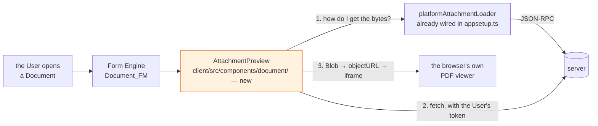

# Architecture — one component, and one unknown to retire first

## Overview

The whole change, if the unknown resolves the easy way:



One orange box. Everything else exists.

**The browser renders the PDF, not us.** Chrome, Safari and Firefox all ship a PDF viewer with paging,
zoom, text selection, search and print. Putting a blob URL in an `<iframe>` gets all of it for nothing.
Rendering with `pdfjs` in the client would be rebuilding a viewer that is already installed — and note
that `pdfjs-dist` *is* a dependency of this project, in the **Runtime**, to extract text without a
canvas. Different problem, different process, and worth saying so before somebody unifies them.

## The unknown, and why it comes first

**We cannot yet fetch the bytes.** Three routes, none of them working:

| Route | What happened |
|---|---|
| `/api/v2/attachment` | upload only — verified against the live server |
| `/cs/download/<UUID>` | documented as the download path, but the UUID is a **content-store** id and we hold an `attachment_id`. A `404` for ours |
| `LOAD_ATTACHMENT_URL` | what the platform's own loader calls. Answers **`"No URL from attachmentId … could be found"`** for our attachments — correct `docRef` shape, valid token, verified twice |

`platformAttachmentLoader.retrieveDownloadLink()` is a two-line function and its whole body is that
third row:

```js
const downloadRequest = RequestBuilder.loadAttachmentURL(attachment.attachment_id, documentId);
const [{ result }] = await Dispatcher.rpc(language, [downloadRequest]);
return result.location;
```

The likely cause is one line of server configuration:

```
mgmtp.a12.dataservices.contentstore.storage.content-storage=db
```

Content is persisted in the Data Services database, so there may be no *location* for a URL to point
at. If that is right, then **`retrieveDownloadLink` cannot work in this deployment for any attachment**
— which means the form's existing download action is also broken, and has been since before this
change was thought of.

### Two possible worlds, and they need different changes

| | If the browser CAN download today | If it cannot |
|---|---|---|
| what we learned | we were asking wrongly; the browser knows a route we have not found | the platform's download path does not fit `content-storage=db`, or our upload is incomplete |
| this change becomes | a preview component, as proposed | a **bug fix** — restore downloading — with the preview on top |
| the risk | low | the fix may be one property (`content-storage=cs`), which changes where every existing attachment lives |
| who is affected | nobody else | every attachment the mail ingest has stored, and the User's real invoice |

**This is being settled in a real browser before anything is built**, by driving the running
application, opening the Abschlagsrechnung Document and recording every request it makes. That is the
same method that settled the upload route, where the documentation was also wrong and the web
application's own request was the only reliable witness.

## The component, assuming the bytes are reachable

```tsx
// client/src/components/document/AttachmentPreview.tsx
interface AttachmentPreviewProps {
    readonly docRef: string;
    readonly attachmentId: string;
    readonly mimeType: string;
    readonly filename: string;
}
```

| Concern | Decision |
|---|---|
| **when it renders** | `mimeType === "application/pdf"` and an `attachmentId` is present. Anything else renders nothing at all — not an empty frame, not a placeholder |
| **how it fetches** | through `platformAttachmentLoader`, or whatever the browser investigation shows is right. **Not** a hand-rolled token fetch: there is none in `client/src` today and this should not be the first |
| **not through `useExternalCall`** | that seam is `ConnectorLocator → getServerConnector().fetchData()` with a `JsonRpc2Request` payload — JSON-RPC framing, wrong for a binary body, and a second way of attaching a token for no gain |
| **object URL lifetime** | created on load, **revoked on unmount and on `attachmentId` change**. A 175 KB invoice leaked per Document view is a leak nobody notices until a long session |
| **states** | loading, rendered, and refused. Refused shows the filename and a download link — the behaviour we have today — because a preview that fails must degrade to the thing it replaced |
| **read-only** | it never writes a field, never dispatches a form action, and does not participate in validation or dirty state |

**Height is a real design question, not a detail.** An invoice is portrait A4 and a form column is not.
Too short and it previews the letterhead only, which is worse than useless — it is the one part of an
invoice that carries no information. A fixed tall frame with the browser's own scrolling, or a
collapsed strip that expands, are the two honest options; the second is better if the Documents list is
being triaged and worse if a single invoice is being read.

## Where it hangs in the form

`Document_FM` configures the attachment group in `fieldConfiguration`, with a label and
`elementRef: f_attachment`. The preview needs to appear near it, and there are two ways in:

1. **A component placed by the application** around or beneath the form — no form-engine extension,
   nothing registered, and the preview is not part of the form's own layout. Simplest, and preferred.
2. **A custom widget in the Form Engine's `WidgetMap`** keyed to the attachment control — properly
   integrated, appears exactly where the model says, and a larger footprint in the platform's
   extension surface (`appsetup.ts` already customises `sagas.attachmentLoader`, so the pattern is
   there).

Start with (1). Move to (2) only if the placement is genuinely unacceptable, and say so before doing
it, because it is the difference between a component and a platform customisation.

## Security, briefly

- **The bytes are untrusted.** They came from an email from outside. They are handed to the browser's
  PDF viewer, which is sandboxed and is the same code that opens every PDF the User clicks on the web.
  That is a reasonable place to put them; rendering them ourselves would not be.
- **Do not widen the download route to reach them.** If the fix in the "cannot download" world is to
  unauthenticate or whitelist a path so an `<iframe src>` can load it, that is the wrong fix — an
  attachment is household post. Fetch with the User's credential and use a blob.
- **`sandbox` the iframe** and set no `allow-same-origin`, so a malicious PDF cannot reach the
  application's origin.

## Rejected alternatives

| Alternative | Why not |
|---|---|
| **A `Document_FM` exposition change** | there is none that previews a PDF. The platform previews images and offers a download for everything else |
| **Render with `pdfjs` in the client** | rebuilds a viewer the browser already ships, adds a canvas dependency to the client, and the first thing anyone would ask of it is paging and zoom, which are free the other way |
| **Server-side rendering to PNG** | a converter in the server, an image per page to store or cache, and a new failure mode — for something the client can do with no request at all beyond fetching the file |
| **A thumbnail via A12's thumbnail mechanism** | `thumbnail.preview.enabled=true` is set and produces thumbnails for images. A one-page thumbnail of an invoice is not readable, which is the requirement |
| **Open in a new tab** | already effectively what downloading does, and it is the context switch this change exists to remove |
| **Show `extractedText` instead** | already on the form, and it is *not the document* — for a scan it is empty, and for the Widerrufsbelehrung it is four thousand characters of boilerplate. The point is to see the page |

## What this does not change

- **No Thing, no Model, no Operation, no Assistant, no grant.**
- **No Runtime code.** This change is entirely in `client/`, plus possibly one server property if the
  investigation finds the download path broken.
- **The attachment control itself** — upload, replace and delete keep working exactly as they do.
