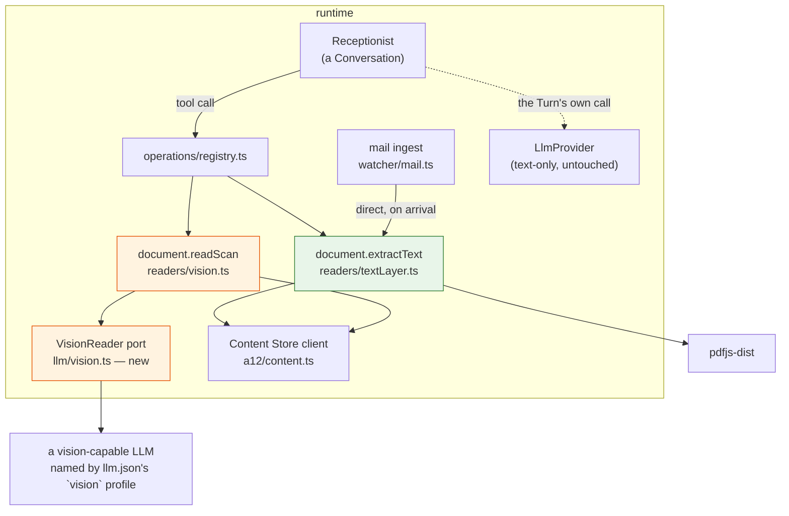

# Architecture — two readers, one ladder

## Overview

Two Operation Implementations, one new narrow port, one new pure-JS dependency. No new service, no
model change, no native binary, no change to the compose file.



Green is free and deterministic. Orange spends money. `LlmProvider` is drawn only to show that it is
not on either path.

## `document.extractText`

```ts
{
    name: "document.extractText",
    mutating: true,            // it writes extractedText onto the Document
    seed: { system: "ThingStore", kind: "connector", requiresApproval: false },
}
```

| | |
|---|---|
| **arguments** | `thingId`, optional `replace: boolean` (default `false`) |
| **reads** | the Document, then its attachment from the Content Store |
| **does** | `pdfjs-dist` → per-page text → joined with page breaks preserved |
| **writes** | `extractedText`, and nothing else on the Document |
| **returns** | `{ pages, characters }`; `{ pages, characters, sparse: true, note }` when the text is very short; `{ reason: "no-text-layer", pages }` when there is none at all; or `{ reason: "not-a-pdf" }` |

**`no-text-layer` is a value, not an error.** It is the single most likely outcome on a scanned
invoice and it is what tells the Receptionist to try the next rung. Returning it as
`{kind: "error"}` would put a red entry in the transcript for a document behaving exactly as
expected, and would teach the LLM that something went wrong when nothing did.

**Sparse text is reported, not suppressed.** A scanned PDF often yields a handful of stray characters
rather than zero — a scanner watermark, a page number stamped by a fax gateway — and handing the
Receptionist twelve characters of that *as if they were the invoice* is genuinely harmful.

This originally shipped as a hard gate: under `MIN_TEXT_CHARS` (100) the reader returned
`no-text-layer` **and threw the text away**. That was wrong, and it was wrong in a way worth
recording. The number had been calibrated against exactly two fixtures — a 21-character watermark and
a 576-character utility invoice — which do straddle 100 but are not a population. Against ordinary
born-digital post the gate misfires constantly: a short dentist's invoice extracts to **84**
characters, a one-line payment reminder to **44**, a parking receipt to **49**. All three are perfect,
free and exact; all three were reported as scans; and the seed description then sent each of them to
`document.readScan`, so the household paid a vision model *which can invent an amount* to recover a
number the file had already stated exactly. On the arrival path the same documents became Documents
with an empty `extractedText` whenever the forward carried no covering note.

Both directions are harmful and one boolean can only express one of them, so the reader now returns
both facts:

```ts
{ kind: "text"; text: string; pages: number; sparse: boolean; pagesRead: number; truncated: boolean }
{ kind: "no-text-layer"; pages: number }   // genuinely nothing, once trimmed
{ kind: "not-a-pdf"; pages?: number; detail?: string }
```

`SPARSE_TEXT_CHARS` (still 100) is now a **label, not a gate**: below it, `sparse` is true and every
character still comes back. Nothing is withheld on the strength of that number, so being slightly
wrong about it costs a hint rather than a document — which is the property the old threshold lacked,
and the reason lowering the number would have been no fix at all. It would only have moved the
misclassification onto shorter post.

**And the judgement moves to where this system keeps judgement.** *"Are these 84 characters an
invoice or a scanner's leavings?"* cannot be answered by length — 44 characters of payment reminder
and 21 characters of watermark are the same kind of short. It can be answered by reading them next to
the covering note and the subject line, which is the Receptionist's job and not a library's. The
reader reports faithfully; the Assistant decides.

**A page cap, separately.** `readTextLayer` takes an optional `maxPages` (unlimited by default) which
bounds *decode time on the calling thread* — the mail ingest reads inside the Runtime's single scan
loop, whose heartbeat is stale after ninety seconds, so a forwarded five-hundred-page prospectus must
not be able to take the loop with it. A capped read still reports the document's real `pages`
alongside `pagesRead` and `truncated`, on the same principle as `readScan`'s `too-many-pages`: a
partial read must never look complete. This is a different cap from the ingest's character limit on
what it stores and prompts with — one bounds the work, the other bounds the payload — and a document
can be small in pages and vast in characters or the reverse.

**It is `mutating`, so it is not `clientReadable`** and never reachable through the inbox. It also
needs a `reconcile`, which it can answer trivially: re-running is safe, because it is deterministic
over unchanged bytes and refuses a non-empty field.

## `document.readScan`

```ts
{
    name: "document.readScan",
    mutating: true,
    seed: { system: "ThingStore", kind: "connector", requiresApproval: false },
}
```

| | |
|---|---|
| **arguments** | `thingId`, optional `replace` |
| **does** | sends the PDF bytes to the model named by `llm.json`'s `vision` profile, with a fixed prompt asking for the page contents as markdown and nothing else |
| **writes** | `extractedText` |
| **returns** | `{ pages, characters, usage }`, or `{ reason: "unavailable" }`, or `{ reason: "too-many-pages", pages }` |

**Caps, all three of them:**

| Cap | Default | Why |
|---|---|---|
| `VISION_MAX_PAGES` | 10 | a household invoice is one to four pages. Ten is generous; a 600-page prospectus is a mistake, not a document |
| `VISION_MAX_BYTES` | 16 MB | comfortably under the API's 32 MB request limit, with room for the encoding overhead |
| the `Enabled` switch | on | ordinary catalogue behaviour — the User can stop all spending from the web application, without a restart |

Over a cap it returns a *reason*, never a truncated read. A partial invoice is worse than no invoice,
because it looks complete.

**No required approval, deliberately.** Argued in [proposal.md](proposal.md#two-things-to-settle-before-implementing):
an approval per scanned invoice is two questions per piece of post, and ADR-0018 already lets the
User add one to the Operation Thing if they want it. Shipping with one pre-empts a decision the ADR
says is theirs.

**The prompt is fixed in code and takes no input from the Document.** The only variable part of the
request is the PDF itself. This matters: the attachment is untrusted content from outside, and a
prompt assembled from anything it contains would be an injection surface pointed straight at a model
that is about to write into a field the Receptionist trusts. The output is treated as *text to be
classified*, never as instructions — which is already true of `extractedText` from every other
writer.

## Why `LlmProvider` is not widened

`LlmMessage.content` is a `string`, and `LlmProvider` has exactly one method. That interface exists
for one stated reason — *the loop's interesting behaviour is its own* — and it is implemented four
times over (`anthropic`, `openai`, `scripted`, and the profile machinery).

Widening `content` to a parts array to carry one PDF would mean:

- touching all four implementations, including `scripted`, whose whole value is that it is trivial;
- making every provider answer a question the **loop** never asks, since no Turn ever sends an image;
- and leaving the loop's type surface permanently more complicated for the sake of one Operation.

So instead there is a second, deliberately tiny port:

```ts
// runtime/src/llm/vision.ts
export interface VisionReader {
    readonly available: boolean;
    read(pdf: Buffer, pageCount: number): Promise<{ text: string; usage?: LlmUsage }>;
}
```

One implementation against the Anthropic Messages API, plus a `null` implementation whose
`available` is `false`. `document.readScan` asks `available` before doing anything and returns
`unavailable` when it is false — which is what happens under the shipped default, because `active`
is a local model.

The Anthropic implementation sends the PDF as a `document` content block with a base64 source. No
beta header; limits are 32 MB and 600 pages per request (100 pages on 200 K-context models), both
far above our own caps. Nothing rasterises anything, which is what keeps `poppler`, a canvas and
Tesseract out of the image.

**Configuration reuses `llm.json` exactly as it already works.** A second key beside `active`:

```json
{
    "active": "local_qwen",
    "vision": "anthropic_vision",
    "profiles": {
        "anthropic_vision": {
            "provider": "anthropic",
            "baseUrl": "https://api.anthropic.com",
            "model": "claude-opus-5"
        }
    }
}
```

The key comes from `.env` as `ANTHROPIC_VISION_KEY`, per the file's own convention — *"adding a
profile means adding an entry here and one line to `.env`; nothing else in the stack has to know its
name"*. `vision` absent means no vision reader, which is the default and is not an error. The model
id is the User's choice, like every other model in that file.

An `openai` vision implementation is a later addition behind the same port and is not in this change.

## The ingest calls `extractText` on arrival

In [receive-emails](../receive-emails/architecture.md)' `watcher/mail.ts`, between uploading the
attachment and creating the Document:

```
upload the binary → extract the text layer → ADD_DOCUMENT (with extractedText already set)
```

The extraction happens **before** the Document materialises, so the Receptionist is triggered by a
Document that is already classifiable and no Turn is spent discovering that it was not. A failure
here is logged and skipped, never fatal — a Document with no text is exactly the state the ladder
already handles.

The ingest calls the reader function directly rather than going through the registry: there is no
Conversation on the arrival path, no `OperationContext` to construct, and inventing one would put a
fabricated conversation id into an idempotency key — the same reasoning
`inbound/server.ts` already applies. The **Operation** wraps the same function for the Receptionist's
use.

**The ingest never calls `readScan`.** *Arrival may translate; arrival may not spend.*

## The Receptionist's prompt

Step 2 of the numbered list, and that is the entire edit to `bootstrap/assistants.ts` besides two
grants:

> 2. If its `extractedText` is empty and it has an attachment, try to read it:
>    a. `document.extractText` — free and exact. Usually this is enough.
>    b. If that reports `no-text-layer` — or reports `sparse` text which, on reading it, turns out to
>       be a scanner's watermark rather than the document — the attachment is a scan. Call
>       `document.readScan` **only if the Document looks like something worth reading** — it costs
>       money per page. A bill, a letter or a quote is worth it; an advertising leaflet is not.
>       Sparse text that *is* the document — a one-line reminder, a receipt — needs no second read.
>    c. If reading is unavailable or the result is unusable, ask a human with
>       `document.requestText`, as before.

Grants gain `document.extractText` and `document.readScan`.

**No new Skill**, and the two existing Skills are untouched. If implementation finds itself wanting a
Skill to explain when to call these, that is a signal the Operations' own descriptions — which live
on the Operation Things, where the User can edit them — are doing too little.

## Cost accounting

`readScan` returns `usage` in its outcome. The Loop Driver adds it to the usage it records on the
Turn, so a Turn's recorded cost stays the cost of everything that Turn spent.

Without this, `readScan` would be a second silent category of unrecorded spend — different in kind
from the documented errored-Turn gap, because it would grow with ordinary successful use. The change
is small and it keeps [CONTEXT.md](../../../CONTEXT.md)'s sentence about Turns true.

## Failure modes

| What happens | What the User sees |
|---|---|
| the PDF is encrypted or corrupt | `not-a-pdf`, the ladder falls to `requestText` |
| the text layer is a scanner's noise | it comes back flagged `sparse`, stored and legible; the Receptionist reads it, sees it is noise, and takes the next rung with `replace: true` |
| the text layer is a short but complete document | it comes back flagged `sparse` too, and is kept. Nothing is spent |
| the attachment has hundreds of pages | with a `maxPages` cap the read stops and says `truncated`, reporting the document's real `pages`; without one it reads the lot |
| no `vision` profile configured | `unavailable`; the ladder falls to `requestText`. **This is the shipped default** |
| the vision API is down or rate-limited | an `error` outcome; the loop's existing retry and escalation apply |
| the model returns something unusable | the Receptionist classifies badly, or asks. Its rule *never invent a fact* is what protects the books, and the Accountant's approval is what protects the money |
| `extractedText` is already populated | both refuse without `replace`. A human's transcription is never silently overwritten |

## Alternatives rejected

| Alternative | Why not |
|---|---|
| **A Skill on the Receptionist** | a Skill is judgement, procedure or knowledge. This is four lines of ordering in a list the Receptionist already has. See [domain.md](domain.md#what-the-receptionist-gains-in-domain-terms) |
| **One `document.read` Operation that escalates internally** | hides which act produced the text, so the transcript cannot answer whether a number was extracted or inferred; and it cannot be switched off or approved by half |
| **Extract on arrival only, no Operation** | Documents uploaded on the create form never pass through the Runtime, so the Receptionist could never ask. That path would keep only the human rung |
| **Widen `LlmProvider` to carry images** | four implementations changed, and a permanently wider type, so that one Operation can do something the loop never does |
| **Local OCR (Tesseract)** | a native dependency, a much larger image, and worse results on German invoice layouts than a vision model. More engineering for less quality |
| **Rasterise pages ourselves and send images** | `pdftoppm` (a poppler binary in the image) or `@napi-rs/canvas` (native). The API takes the PDF directly, so both are avoidable entirely |
| **`readScan` on arrival, for everything** | pays to discover that a twelve-page pension brochure is not an invoice. Arrival has no context with which to decide, and no judgement is where spending must not happen |
| **A required approval on `readScan`** | two questions per piece of post. ADR-0018 makes it the User's to add |
| **Store `hasTextLayer` on the Document** | a cached fact about bytes we hold, which can go stale against a replaced attachment. Asking is cheap |

## What this does not change

- **The Receptionist's Skills**, its Triggers, its `maxTurns`, its description.
- **`Document_DM`** — `extractedText` already exists and already has writers.
- **`LlmProvider`** and its four implementations.
- **The server, the client, the compose file, the models.**
- **The default deployment**: with no `vision` profile, `readScan` is unavailable and the system
  behaves as it does today, one rung better.
