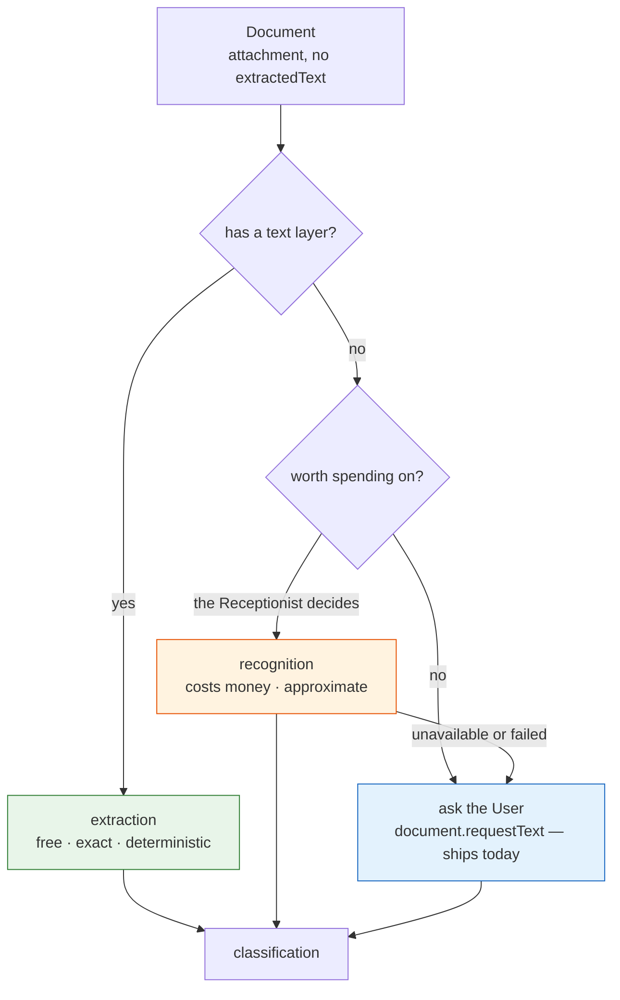

# Domain — what reading costs

No new Things, no new Assistant, no new state. What this change adds to the domain is a
**distinction with money in it**, and one word for the thing that was previously called nothing.

## The new term

**Text Layer**
: The text a PDF carries inside itself, put there by whatever produced the file. A PDF exported from
a billing system has one; a PDF produced by a scanner is a picture of a page and has none. Whether a
Document's attachment has a text layer is the single fact that decides whether reading it is free or
costs money — so it is worth a word, even though nothing stores it.
_Avoid_: OCR layer, embedded text, searchable text

It is a property of the bytes, not of the Thing. Nothing records it, because asking the bytes is
cheaper and always current.

## The distinction: reading is two different acts

The system has one word — *reading* — for two acts with opposite economics. Naming them apart is the
point of this change.

| | **extraction** | **recognition** |
|---|---|---|
| what happens | the text is *taken out* | the text is *inferred* |
| the truth | already in the file | produced by a model |
| cost | none | per page, in money |
| repeatable | identically, for ever | approximately |
| can be wrong | only by our bug | yes, on its own |
| the Operation | `document.extractText` | `document.readScan` |

**Extraction cannot invent an amount. Recognition can.** That is not a quality remark, it is a
domain fact, and it is why the two are separate Operations rather than one Operation with a fallback
inside it. A single `document.read` that quietly escalated would make "where did this number come
from?" unanswerable from the Conversation — and the Receptionist's first rule is *never invent a
fact*.

Keeping them apart means the transcript says which happened, the catalogue can switch off one and
keep the other, and the User can put an approval on the one that spends.

## Where each act belongs, and why the seam moves

[receive-emails](../receive-emails/domain.md) drew the line: **arrival is translation, classification
is judgement.** This change tests that line by putting something on each side of it.

| Act | Side | Because |
|---|---|---|
| **extraction** | **arrival** | deterministic, free, no decision. Bytes to text is the same category of work as MIME to Document |
| **recognition** | **classification** | it spends the household's money, and *"is this worth reading?"* has no correct answer that does not look at the Document |

So the seam holds, and it now carries a sharper rule:

> **Arrival may translate. Arrival may not spend.**

That is the sentence to keep. It is what stops a future contributor putting OCR in the ingest
because it would be convenient — the ingest has no context with which to decide whether a
twelve-page attachment is an invoice or a pension provider's annual brochure, and it would pay to
find out either way.

## What the Receptionist gains, in domain terms

Two **Granted Operations**. Not a **Skill**, and the difference is definitional:

| | is | this change adds |
|---|---|---|
| **Skill** | *instructions for the LLM — judgement, procedure or knowledge, written as markdown* | **none** |
| **Granted Operation** | *an Operation made available to one Assistant: granted, enabled and implemented* | **two** |

The Receptionist's existing Skills clear that bar — GOÄ fee schedules are knowledge; distinguishing a
*Mahnung* from an invoice is a procedure with a search in it. *"Try the free reader, then the paid
one, then a human"* is neither. It is the order in which to reach for three tools, which is what a
prompt's numbered list is for, and the Receptionist already has one.

**A capability is not a lesson.** If every new Operation arrived with a Skill explaining when to use
it, Skills would become tool documentation — and tool documentation already exists, on the Operation
Thing, where the User can read and edit it.

## `extractedText` gains writers, and therefore a rule

| Writer | Since | Writes |
|---|---|---|
| the User, on the create form | the first slice | what they typed or pasted |
| the demo loader | the first slice | fixture text |
| the User, answering `document.requestText` | the first slice | what they transcribed by hand |
| **the mail ingest** | [receive-emails](../receive-emails/) | the message body |
| **`document.extractText`** | this change | the PDF's text layer |
| **`document.readScan`** | this change | what a vision model read |

Six writers on one field is enough to need a rule, and it is a short one:

> **Nothing overwrites a non-empty `extractedText` without being told to.**

Both new Operations refuse when the field is already populated, unless called with an explicit
replace. The reason is the third row: a human sat and typed that. Silently replacing it with a
model's guess would be the worst thing this change could do, and it would be invisible — the
Document would look fine and the number would be wrong.

Which writer produced the text is not stored on the Document. It is in the Conversation's transcript,
which is where *"why does it say this?"* is already answered
([ADR-0012](../../../docs/adr/0012-a-conversation-is-an-intent-log.md)). One fact, one Authority.

## Cost becomes something an Operation can incur

Until now, the money a Conversation costs was spent in exactly one place: the LLM call at the head of
each Turn. `Turn` is *the unit in which cost is counted — literally*, and the sum over a
Conversation is an honest **lower bound**, understated only by Turns that errored.

`readScan` breaks that shape. It spends on a model from *inside* a Turn, without being that Turn's
own call. Left alone it would add a second, unnamed category of unrecorded spend — and unlike the
errored-Turn gap, which is documented, this one would be silent and would grow with use.

So the domain sentence is preserved by making the Operation report: `readScan` returns its usage, and
the Turn that called it records it. **A Turn's cost stays the cost of everything that Turn spent.**
The lower bound stays a lower bound of the same thing it was before.

## Terms considered and rejected

| Rejected | Why |
|---|---|
| **OCR** as a domain term | it names one implementation of recognition, and the implementation here is a vision model rather than a character-recognition engine. *Recognition* survives changing the technique |
| **`document.read`**, one Operation with a fallback | hides which act happened, and therefore whether the number was extracted or inferred. Un-switchable, un-approvable, and it makes the transcript lie by omission |
| **Transcription** for the automatic path | taken. `document.requestText` asks a *human* to transcribe, and the word should keep meaning that — it is the rung the others fall through to |
| **`Document.hasTextLayer`** as a stored field | a fact about bytes we hold. Asking is cheaper than storing, and a stored copy can go stale against a replaced attachment |
| **`Readable`** / **`Unreadable`** as Document states | there is no state here. Either the text is in the field or it is not, and the field already says so |
