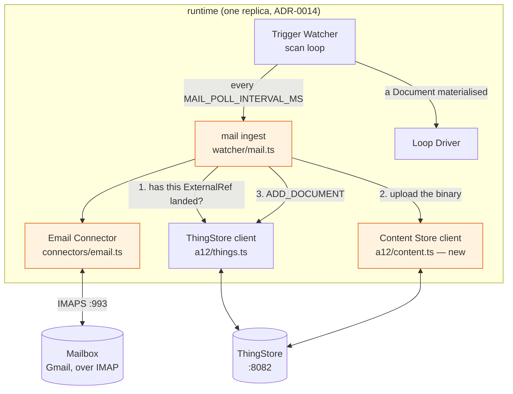
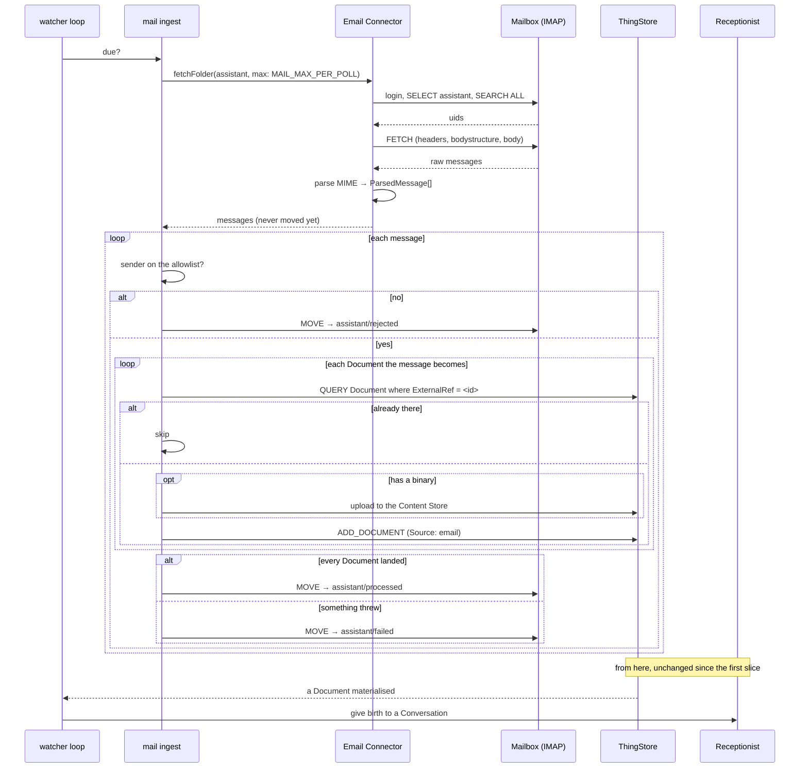

# Architecture — how the post gets in

## Overview

One new outbound connection, one new scan, one new writer to the Content Store. No new service, no
published port, no inbound traffic, no change to the compose topology.



The three orange boxes are the change. `mail.ts` is the only one that touches the store, and
`email.ts` is the only one that knows what IMAP is — the same split the Firefly connector already
uses, for the same reason: the part that talks to a foreign system is testable against a fixture,
and the part that decides what to store is testable without a network.

## Where it hangs off the watcher

The Trigger Watcher scans the ThingStore for four kinds of pending work. Mail is a fifth scan, and
it is the first that does not look in the store at all.

| Scan | Looks at | Interval |
|---|---|---|
| 1–4 (existing) | the ThingStore — new Things, answered questions, due `wakeAt`, expired leases | `SCAN_INTERVAL_MS` |
| **5 (new)** | **the Mailbox** | **`MAIL_POLL_INTERVAL_MS`, default 60 000** |

It rides in the same loop rather than in a timer of its own, and that is the decision worth
recording: the loop is single-threaded and already carries
[ADR-0014](../../../docs/adr/0014-exactly-one-runtime-replica.md)'s guarantee that exactly one
replica is doing anything. A second timer would be a second thing that can be running while the
watcher is mid-scan, and would need its own answer to *"what happens when the process is asked to
stop?"* The loop already has one.

It runs on its own interval because `SCAN_INTERVAL_MS` is seconds and an IMAP login per second is
abusive to a mail provider — several will rate-limit or lock the account for it. The scan therefore
checks the clock and returns immediately when it is not due. Household post is not latency-sensitive;
a minute is invisible against a forward the User sent from a phone.

**Failure is contained.** A mailbox that is unreachable, refusing the password, or serving garbage
must not take scans 1–4 with it — those are the ones that keep already-running Conversations moving.
The scan therefore catches everything, logs it, and returns. There is no backoff state and no
circuit breaker: the next poll is a minute away, which *is* the backoff.

## The sequence



**The ordering in that loop is the whole of the correctness argument.** Create every Document, *then*
move the message. A crash between the two re-reads the message next poll and finds each
`ExternalRef` already present, so it creates nothing and moves. A crash the other way round — move
first — loses the mail silently, and it is the User's invoice.

This ordering is not novel here. The same rule, arrived at independently, is written into
[wikai](../../../../wikai/.claude/skills/ingest/SKILL.md)'s ingest skill against the same Gmail
account: *"Do NOT move the email label yet. The email stays in `{source_label}` until ingestion
succeeds."* Two designs converging on move-last is worth more than either one's reasoning.

The duplicate check is a **query against the ThingStore**, not a local record of what has been read.
The ThingStore is the Authority for `Document`s
([ADR-0006](../../../docs/adr/0006-one-authority-per-fact.md)); a second store of "mail I have
seen" would be a second thing that can disagree with it, and would be wrong every time someone
deleted a Document by hand.

### Three folders, not a flag

An earlier draft of this document used `\Seen` and had **two** states: read or unread. That was
wrong, and `wikai` is what showed it. A message that is fetched, allowed, and then *fails* — the
Content Store rejects the upload, the store is down mid-batch, the MIME turns out to be something
the parser cannot hold — must not stay unread, because unread means *try again next minute, for
ever*. Nor may it be marked done, because nothing was created. It needs a third place.

| Folder | Means | Who looks |
|---|---|---|
| `assistant` | not yet handled. **The only folder the ingest reads** | the ingest, every poll |
| `assistant/processed` | every Document landed | nobody, until something is being debugged |
| `assistant/failed` | tried, threw, gave up | **the User** — this is a real inbox for a human |
| `assistant/rejected` | sender not on the allowlist. Nothing was read, nothing created | the User, occasionally; otherwise it is a spam box |

**Everything leaves `incoming`, including spam.** The obvious design leaves disallowed mail sitting
unread where it landed — but the poll takes at most `MAIL_MAX_PER_POLL` messages, so accumulated
junk would eventually fill every poll and starve the invoice behind it. A public address will
accumulate junk. So a rejected message is moved out too, to a folder whose name says the ingest
declined rather than failed: *"not for us"* and *"we broke"* are different facts and must not share
a box.

`wikai` runs exactly this triple (`MailMem/incoming` / `processed` / `failed`) and moves to `failed`
on any handler error, logging why and continuing with the next source. The same applies here, with
one addition it does not need: the Documents a partly-failed message *did* create stay created. They
are real Things with real `ExternalRef`s, and a retry after the User moves the message back will skip
them and create only what is missing.

**Folders rather than Gmail labels, even though the account is Gmail.** Gmail exposes every label as
an IMAP folder, so `assistant` is one string that means a label to Gmail and a folder to
everyone else. The state machine is therefore Gmail's own, reached through a protocol that is not
Gmail's — which is what keeps the Connector swappable if the household ever leaves.

Nothing here ever deletes mail, and nothing is ever marked read. Every message ends in a folder that
says what happened to it, and all three outcomes are visible to a human in Gmail without opening this
repository. That is deliberate: a silent drop and a silent success look identical from the outside,
and the User's invoice is what would be lost between them.

## The Connector: parse, and nothing else

```ts
// runtime/src/connectors/email.ts — no store, no config beyond the connection, no side effects
export interface IncomingDocument {
    title: string;          // Subject, or the filename when the subject is empty
    receivedAt: string;     // the Date header, normalised; the server's INTERNALDATE if it is unusable
    externalRef: string;    // `<message-id>#<part>`
    extractedText: string;  // the message body as text
    attachment?: { filename: string; mimeType: string; size: number; bytes: Buffer };
}

export interface IncomingMessage {
    uid: number;
    from: string;           // the envelope address, lowercased, no display name
    documents: IncomingDocument[];
}
```

| Decision | What it is | Why |
|---|---|---|
| **body → text** | `text/plain` if present; otherwise `text/html` stripped to text | `ExtractedText` is prose for an LLM to read. Markup is noise it pays tokens for |
| **which parts become attachments** | anything with a filename or `Content-Disposition: attachment` | inline images in a signature are not invoices, and are skipped by having no disposition |
| **the body is repeated** | every Document from one message carries the same `extractedText` | the forward note is context for all of them ([proposal](proposal.md)) |
| **no Message-ID** | synthesise `<uid>@<mailbox-host>` | rare, non-conformant, and the alternative is dropping the mail. The UID is stable within a mailbox and that is enough for idempotency |
| **size cap** | `MAIL_MAX_ATTACHMENT_BYTES`, default 25 MB; oversized parts are skipped and named in the body text | a Document whose attachment silently vanished is worse than one that says why |

## Dependencies, and the fact that there are any

The Runtime has been proud of running on the standard library — the inbox route in
`runtime/src/inbound/server.ts` is `node:http` on purpose. IMAP and MIME do not get that treatment.

| Package | For | Why not by hand |
|---|---|---|
| `imapflow` | IMAP client | IMAP is a stateful, tagged protocol with per-server quirks, literals, and four ways to spell a date. It is a fortnight of work to get wrong |
| `mailparser` | MIME | RFC 2045–2049 plus encoded words plus every non-conformant sender in the world |

Both are mature, widely used, and maintained by the same author as `nodemailer`. Both are used
**only** inside `connectors/email.ts` and never leak into the rest of the Runtime — so replacing
either is one file. That containment is the mitigation; the supply-chain surface is real and worth
naming rather than pretending away.

## Writing to the Content Store

This is the genuinely new capability, and the one place the estimate could be wrong. The Runtime
today speaks JSON-RPC to `/api/v2/rpc` and nothing else — no code in this repository has ever
written a binary, not even the demo loader, which creates Documents with no attachments.

The A12 attachment mechanism stores bytes in `assistants-cs` and puts the identifiers on the
Document's attachment group. So `a12/content.ts` needs to upload, with the Runtime's own Keycloak
token, and return what `ADD_DOCUMENT` must carry.

**This is spiked first** ([plan](plan.md) step 1), because if it turns out to need a route the
server does not expose to a non-browser client, the shape of the change moves. The fallback is
staged rather than abandoned:

| | Documents created | Attachment | Usable? |
|---|---|---|---|
| **Stage A** — text only | yes | not stored; filename and size named in `ExtractedText` | yes, fully, for every mail whose content is in the body |
| **Stage B** — the goal | yes | in the Content Store, openable in the web application | yes, for forwarded PDFs too |

Stage A is a shippable system on its own. That is what makes the spike safe to do first rather than
a risk carried to the end.

## Configuration

```
MAIL_HOST='imap.gmail.com'         # empty ⇒ the scan never runs; logged once at startup
MAIL_PORT='993'
MAIL_USER='receptionist@…'         # the Receptionist's own Gmail account, not the User's
MAIL_PASSWORD='CHANGE_ME'          # a Google App Password. Requires 2FA on that account
MAIL_FOLDER_INCOMING='assistant'
MAIL_FOLDER_PROCESSED='assistant/processed'
MAIL_FOLDER_FAILED='assistant/failed'
MAIL_FOLDER_REJECTED='assistant/rejected'
MAIL_ALLOWED_SENDERS=''            # comma-separated. EMPTY MEANS NOBODY.
MAIL_POLL_INTERVAL_MS='60000'
MAIL_MAX_PER_POLL='20'
MAIL_MAX_ATTACHMENT_BYTES='26214400'
```

**Gmail specifics, since Gmail is what the household uses.** A Google **App Password** is the
credential — IMAP with a normal account password is no longer accepted, and an App Password requires
2FA on the account. The four folder names are Gmail *labels*; nested labels appear over IMAP with `/`
as the separator, exactly as written above. The ingest **creates any folder that does not exist** on
first poll rather than failing, because a missing `failed` label at the moment something fails is the
worst possible time to discover it.

Gmail's `[Gmail]/All Mail` is not touched, and no folder but `MAIL_FOLDER_INCOMING` is ever read.
That is a property of the code, not of the credential — an App Password grants the whole account, and
there is no way to scope it. It is one more reason the account is the Receptionist's own and not the
User's.

`config.ts` already has a `list()` helper for comma-separated values and the `MAIL_ALLOWED_SENDERS`
parse uses it, lowercasing each entry.

**`MAIL_ALLOWED_SENDERS` empty means nobody**, not everybody. A default that fails open on a public
address is a default that turns spam into Conversations and LLM spend on the first day it is
misconfigured. The startup log says how many senders are allowed, so "0" is visible rather than
inferred.

TLS is implicit (port 993) and certificate verification is never disabled — there is no
`MAIL_INSECURE` flag, because the moment one exists someone sets it.

## The Operation Thing

`email.receive` registers as a Connector Implementation on the `Email` System, so it appears in the
catalogue and the User can read it, describe it and switch it off
([ADR-0019](../../../docs/adr/0019-an-operation-is-a-thing.md)).

```ts
{
    name: "email.receive",
    mutating: true,          // it creates Documents. Therefore never clientReadable.
    seed: { system: "Email", kind: "connector", requiresApproval: false, ... },
    reconcile: /* has a Document with this ExternalRef landed? */,
}
```

**No Assistant is granted it.** It is in the catalogue for the `Enabled` switch and for visibility,
not because anything calls it through a Turn — the ingest calls the Implementation directly, the way
the scan loop calls what it needs. An Assistant granted `email.receive` could pull the household's
post into a Conversation on a whim, and nothing in the design wants that.

The ingest reads `Enabled` off the Thing each poll before doing anything, so switching the Operation
off in the web application stops the letterbox without a restart. That is the same read the catalogue
does everywhere else.

`reconcile` is answerable because `ExternalRef` is a real key. It is what
[ADR-0012](../../../docs/adr/0012-a-conversation-is-an-intent-log.md)'s recovery path would need if
this Operation were ever called from a Turn, and it costs one query to provide.

## Alternatives rejected

| Alternative | Why not |
|---|---|
| **Teach the Receptionist to fetch mail** — automate `email.fetch`, let the Assistant parse | An LLM Turn per poll, costing money to do base64 decoding; the Receptionist would hold MIME in its context; and it puts *judgement* on a step that has none. It also breaks the invariant that no Assistant runs before a Document exists |
| **A new "Postman" Assistant** | An Assistant is LLM-driven by definition. This one would have nothing to think about — it would be a cron job wearing the word |
| **Run our own SMTP server** and receive delivery directly | A public MX record, TLS certificates, SPF/DKIM/DMARC, spam filtering, an open port on the household's network, and a backscatter surface. IMAP against a provider that already solves all of it is a config line. Revisitable if a provider ever proves impossible, which is unlikely |
| **A webhook from a mail provider** (Mailgun, SendGrid inbound) | Inbound HTTP into the Runtime from the public internet, plus a provider account, plus a signature scheme — against [D-005](../../../DECISIONS.md), *the Runtime polls and receives no webhooks*. The inbox added by [bookkeeping-on-the-dashboard](../bookkeeping-on-the-dashboard/) is a compose-internal read route and is not a precedent for this |
| **A watched folder on disk** (drop `.eml` or PDFs into a volume) | Solves a different problem — it needs the User at the machine, and the whole point is forwarding from a phone. Worth having *later* as a scanner drop, and it would reuse this change's ingest wholesale |
| **Keep local state of read UIDs** | A second Authority for "have I seen this", which can disagree with the ThingStore. `ExternalRef` makes the store answer it |
| **The `gog` CLI**, as [wikai](../../../../wikai/) uses | Right tool, wrong process. `wikai` is a Claude Code session on a laptop shelling out to a Go binary that owns an OAuth keyring; this is a long-running Node service in a container. Adopting it means a Go binary in the image, its credential files, and a keyring password — `wikai`'s own CI needs `GOG_KEYRING_PASSWORD` precisely because a runner has no system keychain, and a container has the same problem. IMAP is a library call and no binary |
| **The Gmail API directly** (`googleapis` in Node) | Gets the labels natively and OAuth instead of an App Password — genuinely better on credentials. Costs a Google Cloud OAuth app, a consent flow, refresh-token storage in the container, and it binds the Connector to Gmail. Gmail's labels are reachable over IMAP anyway, so the state machine is available without any of that. **This is the first thing to reach for if the App Password proves inadequate**, and the Connector boundary is what makes it a one-file swap |
| **Gmail search over threads** (`threads get`, as `wikai` does) | Only needed on the Gmail API, where search returns *threads* and the label may sit on a message that is not the first — a trap `wikai` documents explicitly. IMAP lists messages, so the trap does not exist on this path. Worth remembering if the row above is ever taken |
| **One Document per message, attachments as children** | The attachment group is `repeatability: 1`, and two invoices in one mail are two invoices. Raising repeatability would change the form, the overview and the round-trip in `things.ts` for no domain gain |

## What this does not change

- **The Receptionist** — prompts, Skills, grants and Triggers, all untouched. If any of them needs
  editing, the seam is in the wrong place and the design should be revisited before continuing.
- **The compose file** — no service, no port, no volume.
- **The server** — no Java, no model change, no new JSON-RPC method.
- **The client** — a Document with `Source: email` renders on the existing form.
- **`Document_DM`** — every field this writes already exists.
