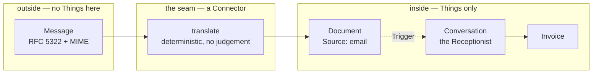

# Domain — what a letterbox adds to the language

Little. That is the finding, and it is the interesting one: an intake channel that needed a new
Assistant, a new Thing or a new state would be a sign the design was wrong. What follows is two new
words, one sharpened distinction, and three fields that finally have a writer.

## New terms

**Mailbox**
: The email account the Receptionist receives at, and the only one the system reads. It belongs to
the system rather than to the User — the User has their own, and forwards to this one. It is
**not a Thing**: it has no Model and no ThingID, its Authority is the mail provider, and the
system holds nothing about it but the credentials to log in. What arrives in it becomes a Thing;
the Mailbox does not.
_Avoid_: inbox (which is the web application's list of Open Questions, and the collision is exactly
why), account, address

**Message**
: One email as it exists at the provider — headers, body parts, attachments. Also **not a Thing**.
It is a foreign representation, and it lives on the far side of the Connector for precisely as long
as it takes to translate it. The system never stores a Message; it stores the `Document`s a Message
became.
_Avoid_: mail, email (the word for the *System*), item

Both are deliberately outside the Thing vocabulary. The system's rule is that *Things are the only
currency inside the system* — a Message is what is outside, and naming it does not admit it.

## The distinction this change sharpens

**Arrival is not classification.**

The system already separated *understanding* from *identity*: everything incoming becomes a
`Document` first, and classifying it creates the Invoice rather than mutating the Document
([ADR-0002](../../../docs/adr/0002-thingid-identifies-only.md)). This change makes the same cut one
step earlier, between **arriving** and **being understood at all**:

| Step | Who does it | What it takes | Where it lives |
|---|---|---|---|
| **arrival** | the **Email Connector** | a parser | the Runtime, no LLM, no Conversation |
| **classification** | the **Receptionist** | judgement | a Conversation, an LLM, Turns that cost money |

Both were already stated — *"Classification needs judgement; translation does not and belongs to
Connectors"* — but until now nothing arrived except by a human typing, so the sentence had never
been under load. It holds. The load-bearing consequence: **no Assistant runs before a `Document`
exists.** An Assistant is what happens *because* a Thing materialised, never what makes it
materialise.

## Fields that finally have a writer

Three fields on `Document_DM` were modelled for this and have been written by nothing since.

| Field | Was | Becomes |
|---|---|---|
| `Source` | a hint list containing `email`, always set to `manual` in practice | **`email`**, set by the Connector. The first non-manual value the system produces |
| `ExternalRef` | unwritten | **`<message-id>#<part>`** — the Message-ID as the provider issued it, plus which MIME part this Document is. The foreign key back to a thing the system does not own |
| `IdempotencyKey` | written by Assistants creating Things inside a Turn | now also written **outside** any Conversation, by the ingest. Same field, same meaning, a new kind of writer |

`ExternalRef` doing real work is what makes the ingest idempotent without the system keeping a
ledger of what it has read. The question *"have I already made a Document out of this?"* is a query
against the ThingStore, which is the Authority for Documents — not a second store of mail state
that could disagree with it.

## Parties are unchanged, and that is on purpose

A Message has a `From:`, and a `Party` is *anyone the household deals with*, so there is an obvious
temptation: the dentist's address is on the mail, create the Party. **No.** The address on a
forwarded mail is the User's own, because the User is the one who forwarded it. The sender the
system sees is almost never the Party the Document is about. Deriving a Party from `From:` would
create a Party for the household in its own address book, on every single ingest.

The Receptionist reads the body — including the quoted original — and decides. That is judgement,
and it stays where judgement lives.

## The Email System, both its directions

`Email` is already an External System in the catalogue, with two Manual Connector Operations. This
change gives it a third, and it is the first automatic one:

| Operation | Kind | Direction | Who acts |
|---|---|---|---|
| `email.send` | Manual Connector | out | the **User** sends it by hand and confirms |
| `email.fetch` | Manual Connector | in | the **User** checks *their own* post for something an Assistant asked about, and pastes what they find |
| **`email.receive`** | **Connector** | **in** | **the Runtime**, from the **Receptionist's own Mailbox**, with nobody asked |

`email.fetch` is not superseded. An Assistant chasing an unpaid claim wants to know whether the
insurer replied — to the *User's* address, in the User's own mailbox, which this system has no
access to and should not. That question still has to be asked of a human. The Mailbox answers a
different one: *what has been handed to me?*

The asymmetry is worth stating plainly, because it will look like an oversight later: **the system
now receives mail automatically and still sends it by hand.** That is a deliberate reading of the
risk. Mail the system receives can be ignored; mail the system sends cannot be recalled.

## Processes and Conversations: nothing new

No new Process kind, no new Conversation state, no new Trigger type. A `Document` materialising is
already one of the three Triggers, and the Runtime already cannot tell — and has no reason to care —
whether the Document was typed by the User or posted by a Connector.

The one new fact in the world is that Things can now come into being while nobody is looking. Every
mechanism that bounds what follows from that already exists: `maxBirthsPerHour` caps Conversations
born per hour, the catalogue's `Enabled` switches the Operation off, and `just pause` stops the
Runtime outright.

## Terms considered and rejected

| Rejected | Why |
|---|---|
| **Mail Assistant** / **Postman Assistant** | an Assistant is *LLM-driven*, by definition. Nothing here needs an LLM, so calling it one would be the first Assistant that is not one |
| **Ingestion** as a domain term | it names the machinery, not the domain. What happens in the domain is that *a Document arrives*, and the domain already has words for that |
| **Attachment** as a Thing | it is a field group on `Document`, and has been since the model was written. A Message with two attachments becomes two Documents, not one Document with two children |
| **Inbox** for the Mailbox | taken. The inbox is where the User answers Open Questions, and a reader hitting "the Receptionist's inbox" would be sent to the wrong screen |
