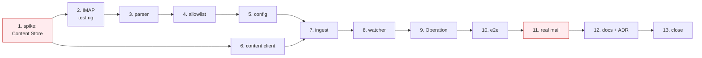

# Plan — the letterbox, in order

Ordered so that the risk is retired first and the system is shippable from step 7 onward. Each step
names its verification; a step is not done until that verification mechanically passes.

## 0. Ground rules for this change

- **Test first.** Every step below writes its test before its code, per the project's own working
  rules. The parser steps are pure and get real `.eml` fixtures, not hand-built objects.
- **No mocking of the ThingStore.** The existing harness (`runtime/test/support/harness.ts`) is what
  ingest tests run against. IMAP is the one exception and it is not a mock — it is a real IMAP
  server in a container, or a recorded fixture stream, decided in step 2.
- **The Receptionist stays untouched.** If a step wants to edit `bootstrap/assistants.ts`, stop and
  re-read [architecture.md](architecture.md#what-this-does-not-change).

## 1. Spike: can the Runtime write a binary to the Content Store?

The one unknown that can change the shape of the change.

- [ ] Read how the web application uploads an attachment — the request the browser makes to `/cs`,
      and what lands on `Document_DM`'s attachment group afterwards
- [ ] Write a throwaway script under `tmp/` that, as the Runtime user with a Keycloak token, uploads
      a small PDF and creates a `Document` referencing it
- [ ] **Verify:** open that Document in the web application and download the attachment
- [ ] Record the answer in `DECISIONS.md`. If the answer is *no*, or *only through a route the
      server does not expose to a non-browser client*, this change becomes **Stage A** (text-only
      Documents) and steps 6 and 11 drop out. Say so explicitly rather than discovering it in step 6

## 2. Decide how IMAP is tested, and prove it

- [ ] Choose between a throwaway IMAP container (e.g. `greenmail`) in the test compose profile and a
      recorded protocol fixture. Prefer the container: it exercises `imapflow` for real
- [ ] Add `imapflow` and `mailparser` to `runtime/package.json`; check the licences against
      `licenses/` and `THIRD_PARTY_NOTICES`
- [ ] **Verify:** a single test connects, appends one message, fetches it back, and passes in CI

## 3. The parser — `runtime/src/connectors/email.ts`

Pure. No store, no config, no network in the tests.

- [ ] Collect `.eml` fixtures under `runtime/test/fixtures/mail/`: a plain-text mail; a forwarded
      mail with one PDF; a forwarded mail with two PDFs; an HTML-only mail; one with an inline
      signature image; one with a UTF-8 encoded-word subject; one with no `Message-ID`; one with an
      oversized attachment
- [ ] Write the tests for `parseMessage(raw) → IncomingMessage` against all of them first
- [ ] Implement: body to text (`text/plain`, else `text/html` stripped), attachment selection by
      disposition/filename, `externalRef` as `<message-id>#<part>`, synthesised id when absent,
      `receivedAt` from `Date` falling back to `INTERNALDATE`, oversized parts skipped and named in
      the body text
- [ ] **Verify:** the two-PDF fixture yields two `IncomingDocument`s with distinct `externalRef`s
      and identical `extractedText`; the signature-image fixture yields one, with no attachment

## 4. The allowlist — pure, and tested alone

Same treatment as `inbound/gate.ts`: the safety decision gets its own file and its own tests before
any transport exists.

- [ ] Tests first: allowed exactly; case-insensitive; display name ignored (`"Dr X" <a@b>` matches
      `a@b`); **empty allowlist allows nobody**; an address that merely contains an allowed one does
      not match
- [ ] Implement `isAllowedSender(from, allowlist)` in `runtime/src/watcher/mail.ts` (or its own file
      if it grows past a screen)
- [ ] **Verify:** the empty-allowlist test is the one that must never be quietly relaxed — mark it

## 5. Config

- [ ] Add the `MAIL_*` block to `.env.example` with the comments from
      [architecture.md](architecture.md#configuration), including *empty means nobody*
- [ ] Extend `runtime/src/config.ts`; reuse `list()` for `MAIL_ALLOWED_SENDERS`, lowercasing entries
- [ ] Log once at startup: host, user, **how many senders are allowed**, poll interval. Never the
      password
- [ ] **Verify:** a config test asserts that an absent `MAIL_HOST` yields a disabled ingest rather
      than a crash, and that the log line names a sender count

## 6. The Content Store client — `runtime/src/a12/content.ts`

Skip if step 1 said Stage A.

- [ ] Test first, against the real store via the harness: upload bytes, get back what
      `ADD_DOCUMENT`'s attachment group needs
- [ ] Implement, reusing the existing Keycloak token handling in `a12/client.ts`
- [ ] **Verify:** a Document created by the test opens in the web application with a downloadable
      attachment

## 7. The ingest — `runtime/src/watcher/mail.ts`

The step that makes the system work end to end.

- [ ] Tests first, against the harness and the IMAP server from step 2:
  - a message from an allowed sender becomes a Document with `Source: email` and the right
    `ExternalRef`, and the message ends up in `assistant/processed`
  - a message from a **disallowed** sender creates nothing and lands in `assistant/rejected`
  - a message whose ingest **throws** lands in `assistant/failed` — and the next poll does not see
    it again, because it is no longer in `assistant`
  - **polling twice creates one Document** — the idempotency test
  - a message whose Documents were created but which was not moved (simulate by moving it back)
    creates nothing on the next poll and is moved to `processed`
  - a two-attachment message becomes two Documents
  - `MAIL_MAX_PER_POLL` is respected
  - a missing folder is **created** rather than throwing
  - the ingest reads the `email.receive` Operation Thing and does nothing when `Enabled` is false
- [ ] Implement in the order the sequence diagram fixes: allowlist → per-Document `ExternalRef`
      query → upload → `ADD_DOCUMENT` → **move last**
- [ ] **Verify:** the idempotency test and the crash-between test both pass. These are the two that
      protect the User's invoice

## 8. Wire it into the watcher loop

- [ ] Tests first: the mail scan runs only when `MAIL_POLL_INTERVAL_MS` has elapsed; a **throwing**
      mail scan does not prevent scans 1–4 from running in the same tick; an absent `MAIL_HOST`
      means the scan never runs at all
- [ ] Add scan 5 to `runtime/src/watcher/watcher.ts`, wrapped so nothing escapes it
- [ ] **Verify:** point the ingest at an unreachable host and confirm a Conversation waiting on an
      answered Open Question still advances

## 9. The Operation Thing

- [ ] Register `email.receive` in `runtime/src/operations/implementations.ts` and
      `registry.ts`: `mutating: true`, `kind: "connector"`, `system: "Email"`, no
      `clientReadable`, with a `reconcile` that queries by `ExternalRef`
- [ ] **Verify:** a test asserts `email.receive` is **not** client-callable through
      `inbound/gate.ts`, and that **no Assistant seed grants it**
- [ ] **Verify:** `just bootstrap` creates the Operation Thing and it appears in the catalogue screen

## 10. End to end

- [ ] An e2e that appends an `.eml` with a PDF to the test mailbox and waits for the Open Question to
      appear in the web application's inbox — the journey from
      [functional.md](../../system/functional.md) with its first step deleted
- [ ] **Verify:** run it against a full `docker compose` stack, not the harness

## 11. Manual verification, with real mail

Not optional. Every step above can pass against a container that behaves better than any real
provider does.

- [ ] Create a real mailbox at a real provider; put an app password in `.env`
- [ ] Forward a real invoice from a phone
- [ ] **Verify:** the Document exists with the attachment, the Receptionist classified it, the
      Accountant asked its question, and answering it books the transaction in Firefly
- [ ] Forward from an address **not** on the allowlist. **Verify:** nothing is created, the mail is
      still unread in the mailbox, and the log says why

## 12. Documentation

- [ ] `CONTEXT.md`: add **Mailbox** and **Message** with their `_Avoid_` lines, from
      [domain.md](domain.md#new-terms)
- [ ] `README.md`: the letterbox in the "In" table, and the sentence *"Nothing is emailed"* in
      functional.md's Out section re-checked — it is still true (nothing is *sent*), and worth
      saying more precisely now that mail is *received*
- [ ] `specs/system/functional.md`: the "In" table, and a journey for the forwarded invoice
- [ ] `specs/system/architecture.md`: scan 5, the two new dependencies, the `MAIL_*` config
- [ ] `specs/system/domain.md`: `Source: email` now has a writer
- [ ] **New ADR — `0024-ingestion-is-translation-not-judgement.md`**: no Assistant runs before a
      Thing exists; arrival belongs to a Connector. This is the decision the whole change rests on
      and the one a future reader will otherwise re-litigate
- [ ] `DECISIONS.md`: the step-1 answer, the two dependencies, and *empty allowlist means nobody*

## 13. Close out

- [ ] `just check` — lint, types, the full test suite
- [ ] Re-read the diff against the promise: **`bootstrap/assistants.ts` is not in it**
- [ ] Note anything the change surfaced but did not fix — PDF text extraction being the obvious one —
      in `BUGS.md` or as a follow-up proposal, not as scope creep here

## Sequencing at a glance

The two red steps are the ones that can tell you something you did not know: step 1 about the
platform, step 11 about the world. Everything between them is bounded work.
