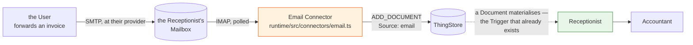

# Proposal — the Receptionist gets a letterbox

## The question first

> *Would you suggest to teach that to our Receptionist, or is it a new Assistant?*

**Neither.** It is a **Connector**, and the reason is already written down:

> **Receptionist**: The Assistant that classifies incoming Things … *Classification needs judgement;
> translation does not and belongs to Connectors.*
> — [CONTEXT.md](../../../CONTEXT.md)

Turning `From:`, `Subject:` and a MIME part into a `Document` is translation. There is no judgement
in it, no decision the User would ever want to review, and nothing an LLM would do better than a
parser. Paying for a Turn to do it would be paying for a Turn to do `Content-Transfer-Encoding:
base64`.

And the Receptionist is *already* on the other side of it. It is triggered by a `Document`
materialising ([domain.md](../../system/domain.md)); `Document_DM` already declares `Source` with
`email` in its hint list and `ExternalRef` for a foreign identifier; the `Email` External System
already exists in the catalogue with `email.send` and `email.fetch` on it. Every piece is in place
except the one that actually goes and gets the post.

**So this change adds a postman, and changes the Receptionist in no way at all.** That is the test
of the design, and the plan holds itself to it: if the Receptionist's prompts, Skills, grants or
Triggers need a single edit, the seam was drawn in the wrong place.

Everything left of the dotted line is new. Everything right of it is shipping today.

## What

The Runtime gains an **Email Connector** and a mailbox to poll.

| | |
|---|---|
| **The Mailbox** | one **Gmail** account, the Receptionist's own — `receptionist@…` — reached over IMAP with an App Password. Configured in `.env` like every other credential |
| **The poll** | a fifth scan in the Trigger Watcher, on its own interval (default 60s). It logs in, reads `assistant`, and logs out. Nothing is held open between polls |
| **The state** | **four folders** — `incoming`, `processed`, `failed`, `rejected` — which are Gmail labels seen through IMAP. Every message ends in one of them, so what happened to a mail is visible in Gmail without reading a log |
| **The translation** | one message → one or more `Document` Things. Body text into `ExtractedText`, the binary into the attachment group, `Source: email`, `ExternalRef` the Message-ID, `Title` the subject |
| **The gate** | a **sender allowlist**. Mail from an address not on it is moved to `assistant/rejected` and never becomes a Thing |
| **The Operation** | `email.receive` joins the catalogue as a Connector Operation, so the User can read it, describe it and switch it off like any other ([ADR-0019](../../../docs/adr/0019-an-operation-is-a-thing.md)) |

The Receptionist then does exactly what it does today, because from where it stands nothing has
happened except that a Document appeared.

### One message, how many Documents?

`Document_DM`'s attachment group is `repeatability: 1` — one Document holds one attachment. A
forwarded mail with two invoices attached is two invoices, and they will be classified separately,
booked separately and paid separately. So:

| The message | What is created |
|---|---|
| body only, no attachments | **one** Document. `ExtractedText` is the body |
| body + *n* attachments | ***n*** Documents, one per attachment. Each carries the same body text in `ExtractedText` |

The body is repeated deliberately rather than split off into a Document of its own. "FYI, this is
the dentist bill for Anna, I already paid it" is context for *every* attachment in that mail, and
`ExtractedText` is precisely where the Receptionist looks for it. A separate body Document would be
an unclassifiable Thing that nothing wants.

Each Document's `ExternalRef` is `<message-id>#<part-number>`, which is what keeps the *n* apart
under a re-poll.

### What the Receptionist actually receives

A forwarded PDF invoice arrives with **no extracted text**, because nothing in this system extracts
text from a PDF and this change does not add it. That is not a gap this change leaves open — it is a
path the system already has: the Receptionist calls `document.requestText`, the User is asked to
paste it, and the run continues. What the User gets that they did not have before is the attachment
sitting in the ThingStore, openable, next to the question.

Where the invoice is in the mail *body* — which is most electricity, telco and subscription mail —
the text is there and the run needs no human at all.

## Why

**Because the current front door is a form.** Today a Document exists because someone opened the web
application, clicked create, typed a title and pasted the text. The system's whole promise is that
it does administrative work so the User does not have to; asking them to hand-transcribe the intake
step undercuts it at the first move. Forwarding a mail is one gesture in a client they already have
open.

**Because forwarding is what people already do with an invoice.** It arrives by mail, and the
existing reflex is to forward it to whoever deals with it. This makes the Receptionist that
recipient. No new habit, no upload flow, no app to open.

**Because the model was built for it.** `Source ∈ {email, post, scan, manual, other}` was written
before any of them existed. `ExternalRef` has had no writer at all. This change is the one that was
anticipated.

**And because it is the cheap half of a hard problem.** Automatic *intake* is a parser. Automatic
*understanding* is text extraction and OCR, which is a separate, larger change with its own
dependencies and its own failure modes. Splitting them means the letterbox ships now and pays for
itself against every mail whose text is in the body, and the OCR change later has a real corpus of
Documents to be tested against.

## Scope

**In scope**

| Area | What changes |
|---|---|
| **Runtime — the Connector** | `runtime/src/connectors/email.ts`: connect over IMAP TLS, list the incoming folder, fetch, parse MIME, project to Document shape. Pure translation, no store access |
| **Runtime — the ingest** | `runtime/src/watcher/mail.ts`: the poll, the allowlist, the idempotency check, the creates, the folder moves. One scan in the existing loop |
| **Runtime — attachments** | first writer to the A12 Content Store from this process. `runtime/src/a12/content.ts` |
| **Runtime — the Operation** | `email.receive` registered as a Connector Implementation, `mutating: false`… **see the note below** — it is mutating, and that is why it is not client-callable |
| **Config** | `MAIL_*` in `.env.example` and `config.ts`, including the four folder names. Absent host ⇒ the scan does not run, and says so once at startup |
| **Compose** | nothing. The Runtime makes an outbound TLS connection; no port, no new service |
| **Docs** | `CONTEXT.md` gains **Mailbox** and **Message**; `README.md` gains the letterbox in the "In" table; a new ADR for *ingestion is translation* |
| **Tests** | the parser against real `.eml` fixtures, the allowlist, the idempotency, the scan against a fake IMAP server; one e2e that drops an `.eml` in and waits for the Open Question |

**Out of scope**

| Not doing | Why |
|---|---|
| **PDF text extraction / OCR** | its own change. `document.requestText` already covers the gap and is already how the system behaves |
| **Sending mail automatically** | `email.send` stays a Manual Connector. Outbound is a different risk class and nobody has asked for it |
| **Replying, threading, IDLE** | poll and move is enough for a household's post. IDLE holds a socket open for a latency nobody is waiting on |
| **Running our own SMTP server** | see [architecture.md](architecture.md). A public MX is infrastructure; an IMAP client is a config line |
| **Retiring `email.fetch`** | it asks the User to check *their own* post for something specific. The Mailbox is the Receptionist's. They are different questions and both stay |
| **Any change to the Receptionist** | the point of the whole design |

## Two things worth arguing about now rather than later

**`email.receive` is mutating.** It creates Things. It is therefore not `clientReadable`, will never
be reachable through the inbox added by [bookkeeping-on-the-dashboard](../bookkeeping-on-the-dashboard/),
and needs a `reconcile` — which it can answer honestly, because "did a Document with this
`ExternalRef` land?" is a query. That is the whole reason `ExternalRef` earns its place over an
opaque hash.

**A mailbox is an untrusted input, and it is the first one this system has.** Every other way a Thing
comes into being today involves the User typing. A public address does not, and the consequences are
real: an LLM Turn costs money, and a Conversation born per spam mail costs it repeatedly. Hence the
allowlist — **default-deny, addresses named in config** — plus a size cap, a per-poll cap, and
`maxBirthsPerHour`, which already exists and already bounds the damage downstream. Anything not
allowed is moved to `assistant/rejected`, where the User can see it; it is not deleted and not
silently dropped.

## Expected outcome

The User forwards the dentist's invoice from their phone. Within a minute a Document exists with the
PDF attached; the Receptionist classifies it and creates the Invoice; the Accountant proposes
`Expenses:Health` and raises the Open Question. When the User next opens the web application it is
waiting — and the only thing they did was press *forward*.

That is the same journey as
[*An invoice arrives and gets booked*](../../system/functional.md) with its first step deleted.
