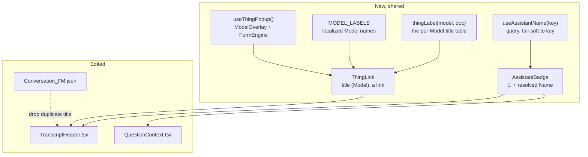
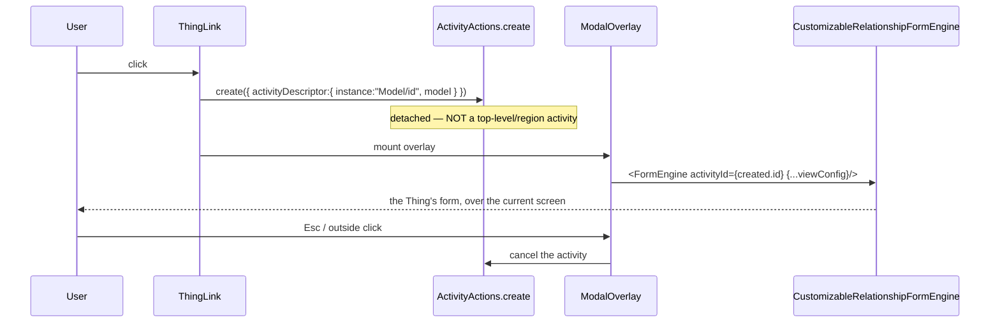

# Architecture — one component per naming rule

Read [proposal.md](./proposal.md) and [domain.md](./domain.md) first. The proposal names three changes;
this note groups them into **two shared components and one model edit**, because the whole point of the
*"everywhere"* in the request is that a naming rule lives in exactly one place.



## Change 1 — the Title on top, and "Conversation" said once

Two edits, in two layers, that together make the form lead with *which* conversation rather than the word
*Conversation* twice.

**The model (`Conversation_FM.json`).** The word appears in two independent places:

| Site | Today | After |
|---|---|---|
| `header.labels` (form title) | "Conversation" / "Konversation" | unchanged — it is the tab/breadcrumb chrome, and the platform requires a form title |
| `screenElements[0]` Section `ConversationHeader` `title` | "Conversation" / "Konversation" | retitled **"Details" / "Details"** |

The `ConversationHeader` section is the collapsed grid of raw fields (`f_assistantKey`, `f_title`,
`f_status`, … — `Conversation_FM.json` lines 100-226). It stays a collapsed drawer; it just stops calling
itself *Conversation*, because that identity now lives visibly on top. Nothing binds the form title to
data — it *cannot* show the Conversation's Title — so the two "Conversation"s are not the redundancy that
matters; the redundant one is the section heading, and it is the one that moves out of the way.

**The band (`TranscriptHeader.tsx`).** The pinned band is where a data value *can* lead, because it reads
the document. Today it renders 🤖 + `assistantKey` **bold**, with the Conversation's `Title` greyed beside
it (`Who` at font-weight 600, `Title` at 400/secondary). The order inverts:

```
┌──────────────────────────────────────────────┐
│ Invoice from Acme GmbH               ← Title, bold, on top
│ 🤖 Receptionist   about … · turn 3/8 · ≥ …    ← AssistantBadge + slots
└──────────────────────────────────────────────┘
```

- A new bold `Title` element leads (`head.title`). When `head.title` is empty — a freshly-born
  Conversation — the line is omitted and the Assistant badge leads, so the band never shows an empty bold
  gap.
- The `Who` styling moves onto the badge; `head.title` is no longer a greyed trailer.

## Change 2 — `AssistantBadge`: 🤖 + Name, resolved and fail-soft

A new `client/src/components/AssistantBadge.tsx` — sibling to `icons.ts`, because like the icons it is no
longer conversation-scoped.

```tsx
// 🤖 + the Assistant's Name, resolved from its key. Falls back to the key, never blanks.
export function AssistantBadge({ assistantKey }: { assistantKey: string }) {
    const name = useAssistantName(assistantKey);   // name ?? key
    return <><span aria-hidden>{ICONS.assistant}</span> <span>{name}</span></>;
}
```

**Resolution — `useAssistantName(key)`.** A Conversation stores only the key; the Name lives on the
`Assistant_DM` Thing. There is no read-by-key primitive, so this is a small A12 `QUERY` constrained on
`/Assistant/Key`, projection `document`, lifting `Name` — the exact shape `useAssistants.ts` already uses,
minus the paging and sort. It **fails soft to the key** (`domain.md`: a renamed/deleted/forbidden
Assistant is a fact, not a defect), mirroring `useThingById`'s second invariant.

**Cost.** One query per distinct key per screen. The React sites name **one** Assistant each (the
Transcript header, the Answer Surface fallback), so this is one query, on mount, no polling — the same
budget every other hook here keeps. A tiny module-level `Map<key, name>` cache is included so a screen that
mounts two badges for the same key does not query twice; it is not a store and holds nothing across a
reload.

**Sites (React).** `TranscriptHeader.tsx` (replaces the raw `assistantKey` span) and `QuestionContext.tsx`
(the fallback `Who` band, currently `question.assistantKey`).

## Change 3 — `ThingLink`: title (Model), always a link, popup form

A new `client/src/components/ThingLink.tsx`, plus two supports.

```tsx
// "Acme GmbH · #2024-0417 (Invoice)" — a link that opens the Thing's form in a popup.
export function ThingLink({ model, thingId }: { model: string; thingId: string }) {
    const read = useThingById(model, thingId);            // already exists, fails soft
    const openPopup = useThingPopup();
    const label = read.state === "ready" ? thingLabel(model, read.document) : shortId(thingId);
    const modelName = MODEL_LABELS[model];                // localized, or undefined
    return (
        <Link type="button" onClick={() => openPopup(model, thingId)}>
            {modelName ? `${label} (${modelName})` : label}
        </Link>
    );
}
```

### `thingLabel(model, document)` — the per-Model title table

`domain.md`'s table as code. Reads the document `useThingById` already returns, by field name (the motion
`entries.ts` and `question.ts` make):

| Model | Reads | Fallback |
|---|---|---|
| `Document_DM`, `Process_DM` | `Title` | short id |
| `Party_DM` | `Name`, then `LegalName` | short id |
| `Invoice_DM` | `IssuerName` + `#InvoiceNumber`, then `Subject` | short id |
| `Conversation_DM` | `Title` | short id |

Every branch falls back to `shortId(thingId)` when its fields are empty, so the link degrades to roughly
today's label rather than to blank.

### `MODEL_LABELS` — localized Model names

The bracketed name is display text. The set is small and closed (the four `SUBJECT_MODULES` plus
`Conversation`), so it is a localized map in the client, same spirit as `subject.ts`'s whitelist and read
through `transcriptStrings()`'s locale. A Model absent from the map yields no bracket rather than a wrong
one. (The labels exist in the DM headers and AM menu, but reading those from the client for this is new
plumbing the closed set does not justify — noted as the one duplication, the same call `entries.ts` makes.)

### `useThingPopup()` — the popup, without the navigation

This is the load-bearing decision. Opening a Thing has meant full-region navigation (`openForeignForm`:
tear down top-level activities → push a master → push the detail). A popup skips all three: the A12
FormEngine view is a plain React component driven by an `activityId`, decoupled from region rendering.



- **`ModalOverlay`** from `@com.mgmtp.a12.widgets/widgets-core` — already the app's dialog primitive
  (`ColorPickerDialog.tsx`, `EditorDialog.tsx`). Visibility is conditional mounting, not an `open` prop:
  `closeOnEsc`, `closeOnOutsideClick`, `onClose`, `maxWidth`. Its portal propagates styled-components
  context, so no `ThemeProvider` re-wrap.
- **`CustomizableRelationshipFormEngine`** (`client/src/components/CustomizableRelationshipFormEngine.tsx`)
  — the same component `EnginesViewMap.tsx` registers as the `FormEngine` view. It takes an `activityId`
  and renders the form. It must be handed the same `formModelMap` / `widgetMap` `appsetup.ts` injects
  (reuse the same objects) so the markdown and transcript custom widgets survive inside the popup.
- **The activity** is created with `instance: "<Model>/<ThingID>"` (a docRef, not a bare ThingID —
  ADR-0002) and `model`, exactly as `openForeignForm` composes it, but **without** the teardown/master/
  detail dance. On close, the activity is cancelled.

A small `ThingPopupHost` mounted once near the app root holds the *(model, thingId)* being shown;
`useThingPopup()` is the setter. One host, at most one popup — a popup opened from inside a popup is not a
case this needs.

### Read-only — the one open risk

`domain.md` says the popup is read-only (*reads may cross documents, writes may not*). The FormEngine has
**no `readOnly` render prop** — read-only is model/state-driven. Two ways, and a recommendation:

| Option | Cost | Verdict |
|---|---|---|
| **A — force read-only via the engine's read-only state** after mounting the activity | one spike to confirm the exact event/state against the Form Engine bundle | **recommended**, if the event exists — no new models, applies to every subject form |
| B — a read-only presentation/variant per subject Form Model | five model edits, ongoing upkeep | fallback if A has no clean event |
| C — accept the existing (editable) form in the popup | none | rejected — a popup with a live Save whose Cancel lands nowhere reintroduces the master/detail problem the popup exists to avoid |

**Plan of record: Option A, with a spike as the first step of the ThingLink work.** If the spike finds no
runtime read-only event, fall back to B for the subject Models that need it. This is the single technical
unknown in the change and is called out again in [plan.md](./plan.md).

> **Spike outcome (resolved) — Option A confirmed.** `formengine-core` exposes a runtime read-only engine
> action: `Commands.setReadonly(boolean)` (`back-end/store`), whose reducer sets the engine's `ui.readonly`
> flag — documented as *"Sets the entire view of the Form-Engine read only."* Engine actions are scoped to
> one activity by wrapping them in `FormEngineActions.command({ activityId, engineEvent })`. So the popup
> mounts the activity, then dispatches `setReadonly(true)` for that `activityId` — no Form Model variants,
> applies to every subject form. No fallback to Option B is needed.
>
> **Two integration facts the running app surfaced (both now handled in `ThingPopup.tsx`):**
>
> 1. **The descriptor needs the `module`.** The Form Engine loads an activity's form and document models
>    from the *scene* its module resolves to (the models-in-scene middleware). A module-less
>    `{ instance, model }` descriptor gives the mounted engine *no models*, so it asserts. `ThingPopup`
>    carries a `MODULE_FOR_MODEL` map (the same closed set as the Thing Label) and passes `module` — exactly
>    what `openForeignForm` composes — but **without** that saga's teardown/master/detail, so the region is
>    never disturbed and the Conversation stays behind the overlay.
> 2. **`setReadonly` must wait for the form's models, and the readiness signal is not the activity's default
>    data holder.** Dispatched on mount it asserts (models not yet loaded). The natural gate —
>    `ActivitySelectors.loadingStateById` — is *wrong* for these forms: a CDD/relationship form keeps its
>    data in the relationship slice and the default data holder reports `"error"` even though the form
>    renders fine. The correct gate is `FormEngineSelectors.models(activityId)`, which is `undefined` until
>    the form model is in the store. Gating `setReadonly` on that makes the whole form render read-only
>    (verified live: every input disabled, both Markdown editors non-editable).

## Sites, and how far "everywhere" reaches

The shared components make *"everywhere"* cheap, but *everywhere* splits by rendering layer:

| Surface | Layer | This change |
|---|---|---|
| Transcript header *who* / *about* / *called by* | React | ✅ `AssistantBadge`, `ThingLink` |
| Answer Surface fallback band | React | ✅ `AssistantBadge` |
| `Conversation_FM` "Details" grid (`ctrl_assistantKey`, `ctrl_subjectThingId`) | modelled Control | raw key/id stay — it is a details drawer, and injecting React needs a new custom widget |
| `Conversation_OM` columns | modelled Overview | out — follow-on; needs a custom column widget |

The modelled surfaces would each need a `widget`-annotated `CustomScreenElement` host (the seam
`CustomScreenElements.tsx` already provides for the transcript and markdown editor). That is a real but
separate effort; this change delivers the React sites and the reusable components, and [plan.md](./plan.md)
lists the modelled sites as explicit follow-on so *"everywhere"* is tracked, not silently dropped.

## Integration points & risks

- **`useAssistantName` query shape** must match the server's strictness `useAssistants` documents (all
  sort fields present, `direction` not `order`). Reuse that request literal, swap paging for a `Key`
  constraint.
- **`viewConfig` into a hand-mounted FormEngine** — `formModelMap`/`widgetMap` arrive as spread props in
  the region path; the popup must pass them explicitly or the custom widgets render nothing.
- **Read-only** — the one unknown; spike first (above).
- **Fail-soft everywhere** — a missing Name shows the key; a missing title shows a short id; a Model
  outside the map shows no bracket; a Thing that will not load still renders a link whose popup reports it
  could not be read. No path blanks and no path throws, matching every read on these screens today.
- **Tests** — `TranscriptHeader.test.tsx`, `QuestionContext.test.tsx` and `subject.test.ts` already assert
  the current labels and will need updating; new specs cover `thingLabel`, `useAssistantName`'s fallback,
  and the popup open/close.
