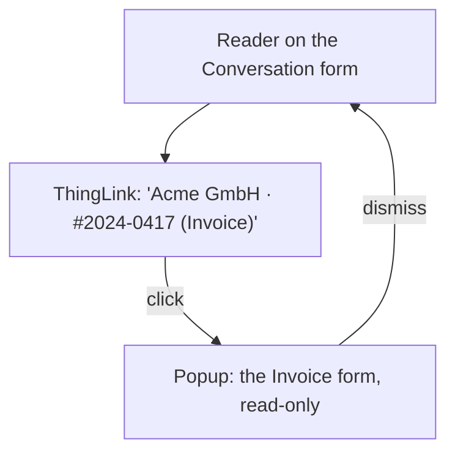

# Domain — naming a Thing, and naming an Assistant

This change adds no Model, no field and no process. What it adds is **vocabulary about display** — two
small facts the system already had but never named, and now must, because they become shared components.

## Two ways of naming, and why they stay separate

An Assistant is itself a Thing (`domain.md`: *"An LLM-driven actor. Itself a Thing"*). So one might expect
one naming rule for everything. There are deliberately two.

| | Assistant | every other Thing |
|---|---|---|
| shown as | 🤖 **Name** | **title** *(Model)* |
| icon | always 🤖 (the icon vocabulary) | none |
| Model in brackets | no — there is only one kind of Assistant on screen at a time, and 🤖 already says what it is | yes — a bare "Acme GmbH" does not say whether it is a Party or an Invoice's issuer |
| link / popup | no (not asked for) | yes, always |

The 🤖 is load-bearing here and is why the Assistant does **not** get the *(Model)* suffix: `domain.md`
fixes that *"every Assistant is the 🤖 `ICONS` already has, not a fifth robot"* — the glyph is the type,
so *"🤖 Receptionist (Assistant)"* would say *Assistant* twice.

## Display Name (of an Assistant)

An Assistant has two identity fields, and the distinction is now visible to the User:

- **Key** (`f_key` / `AssistantKey`) — the stable identifier. A Conversation stores only this
  (`Conversation_DM.AssistantKey`). It is what the Runtime matches; it is not for reading.
- **Name** (`f_name` / `Name`) — the human display name. Seeded as `Receptionist` / `Accountant`, then
  edited by the User in the Assistant form.

**Resolving a key to a Name is a read that can fail, and failing is a domain fact, not a defect.** An
Assistant can be renamed, disabled or deleted while its Conversations remain. So the rule mirrors
`useThingById`'s second invariant — *fails soft*: a key that resolves to no Assistant is shown **as the
key**. The screen degrades to what it does today; it never blanks and never breaks.

## Thing Label

A **Thing Label** is how a Thing is named on screen: its own title, plus its Model in brackets. It has two
parts, and neither is stored on the Thing — consistent with ADR-0002, *a ThingID identifies and nothing
more*, so both are **composed by the reader**.

### The title is not uniform across Models

There is no single "title" field. Each subject Model carries its human identity differently, and the Thing
Label has to know the table:

| Model | Title field(s) | Label |
|---|---|---|
| `Document_DM` | `Title` | the Title |
| `Process_DM` | `Title` | the Title |
| `Party_DM` | `Name` (also `LegalName`) | the Name |
| `Invoice_DM` | **no `Title`** — `IssuerName`, `InvoiceNumber`, `Subject` | composed, e.g. *IssuerName · #InvoiceNumber* |

Invoice is the awkward one and the reason this is a named concept rather than a field read: an invoice's
identity to a human is *who sent it and its number*, which is two fields and a fallback to `Subject` when
either is missing. When no field yields anything, the Label falls back to the Model plus a short id — i.e.
to roughly what the header shows today.

### The Model name is localized and known-set

The bracketed Model name (*Invoice*, *Rechnung*) is display text, and the display text lives in the DM
headers and the AppModel menu labels — neither currently readable from the client for this purpose. The
set is small and closed (the four `TRIGGER_ELIGIBLE_MODELS` plus `Conversation` for *called by*), so it is
carried as a localized map in the client, the same shape and spirit as `subject.ts`'s existing
`SUBJECT_MODULES` whitelist. A Model outside the set gets no bracket rather than a wrong one.

## The popup is a reading, not a navigation

Opening a Thing from a link has meant, until now, *navigation*: `openForeignForm` tears down the region
and rebuilds another module around the Thing. This change introduces a second verb.

- **Navigate to a Thing** (today's *about*) — leave here, go there. The reader loses their place.
- **Open a Thing in place** (this change) — a popup over the current screen showing the Thing's form,
  read-only, dismissed to return exactly where they were.

The popup is **read-only** by the same reasoning `useThingById` is read-only: *reads may cross documents,
writes may not.* A supervisor checking what a Conversation is about is reading; editing the Invoice is a
separate, deliberate act on the Invoice's own form.

## What does not change

- **No new Model, field or write.** Name and title are read off documents that already carry them.
- **ADR-0002 holds.** No Thing gains a docRef or a title-of-record; both are composed client-side.
- **The icon vocabulary is unchanged.** 🤖 keeps meaning *Assistant* everywhere; this change only makes a
  second site honour it.
- **`subjectDescriptor`'s whitelist stays.** A Thing whose Model maps to no navigable module still gets no
  working popup — a link that cannot open a form is not offered as one.
