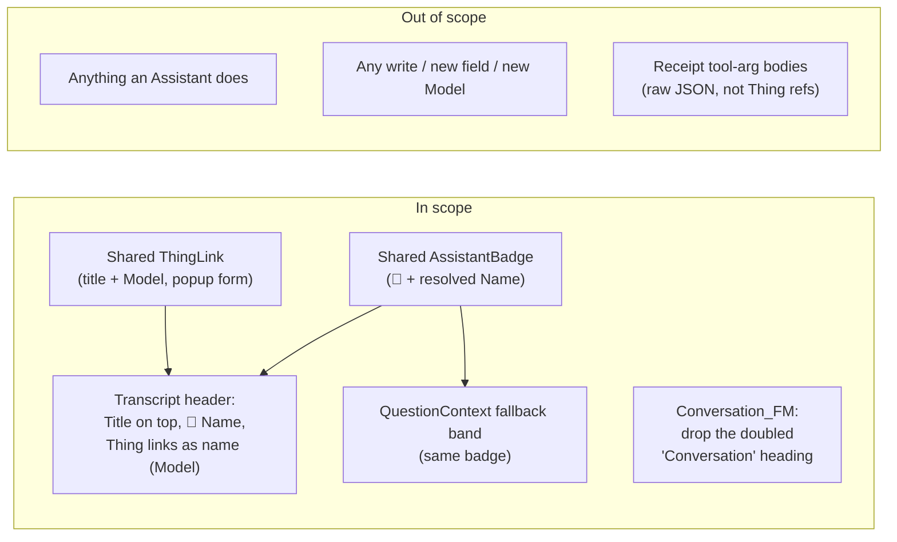

# Proposal — say who and what, by name

## What

Three related changes to how the Conversation form and its Transcript header name the people and Things
they talk about. All three are the same complaint in three places: **the screen shows identifiers where
a human wants names.**

| | Today | After |
|---|---|---|
| the form's top | "Conversation" as the form title **and** "Conversation" again as the first section heading | the Conversation's own **Title**, once, bold, on top |
| an Assistant | the label *Assistant key* and the raw key `receptionist` | 🤖 **Receptionist** — the icon and the Assistant's Name, one unit |
| a subject Thing | *about Invoice `3f9a2c1b`* — module word plus eight characters of a ThingID | **Acme GmbH · #2024-0417** *(Invoice)* — the Thing's own title, its Model in brackets, always a link |
| clicking a Thing | full-page navigation into another module, replacing the list you were on | a popup with the Thing's form, leaving the Transcript where it was |

The third point is the substantial one and it is not confined to the Transcript header: **wherever the
system names a Thing it should name it the same way** — title, Model in brackets, a link that opens the
Thing in place. The Transcript header's *about* and *called by* links are the first two sites; the
pattern is meant to outlive them.

None of this writes a Thing or changes what an Assistant does. It is entirely a reading change — the
same class as [preview-the-attachment](../preview-the-attachment/proposal.md): supervision that the
User can only do if the screen tells them what they are looking at.

## Why

**Because an identifier is not an answer to "what is this?".** The Conversation form opens on a run of an
Assistant *about* something, and the two facts a supervisor needs first — which Assistant, about which
Thing — are shown as a 60-character key and a truncated UUID. The key `receptionist` is readable by
luck; a real deployment's keys will not be. The ThingID never was.

**Because "Conversation / Conversation" is chrome apologising for itself.** The form title says
*Conversation*; the first collapsible section, directly beneath it, is also titled *Conversation* and
holds the raw metadata grid. A reader unfolds *Conversation* to find out which conversation — and the
one fact that would tell them, the Title, is buried inside as one greyed field among twelve. The
identity belongs on top.

**Because the icon vocabulary already made this promise.** `domain.md` is explicit: the 🤖 beside an
Assistant on the Dashboard is the same 🤖 beside its words in a Transcript, and *"whenever the system
has to say who … it says it with one of these."* The Dashboard's Assistants Tile already shows 🤖 + the
Assistant's **Name** (`useAssistants` reads `Name`, sorted by it). The Transcript header shows 🤖 + the
raw **key**. One of the two is not keeping the promise, and it is not the Dashboard.

**Because a popup keeps supervision cheap.** Checking the Invoice a Conversation is about should cost a
glance, not a journey. Today *about* tears down the Conversations region and rebuilds the Invoice module
around the Thing (`openForeignForm`) — the reader loses their place in the list and has to navigate
back. A popup answers *"what is this Invoice?"* and returns them to exactly where they were.

## Scope

**In scope**

- The Transcript header band (`TranscriptHeader.tsx`): Title bold on top; Assistant as 🤖 + Name;
  *about* and *called by* rendered as the new Thing link.
- The Answer Surface's fallback band (`QuestionContext.tsx`): the same Assistant badge.
- `Conversation_FM.json`: remove the redundant *Conversation* section title so the word appears once.
- A shared `AssistantBadge` (icon + resolved Name, fail-soft to the key) used at every site that names
  an Assistant.
- A shared `ThingLink` (title + Model-in-brackets, always a link, opens the Thing's form in a popup)
  used at every site that names a Thing.

**Out of scope**

- Any write, any new field, any new Model. Names and Models are resolved by reading what already exists.
- Anything an Assistant reads, decides or does. This is the UserInterface only.
- Raw tool-argument JSON inside a Receipt: those are an Operation's own words, not curated Thing
  references, and rewriting UUIDs inside them would be guesswork.

## Expected outcome

A supervisor opening a Conversation reads, top to bottom: **its Title**, then **🤖 the Assistant by
name**, then **what it is about — by name, with the Model in brackets, one click from the Thing itself in
a popup**. The word "Conversation" appears once. Every place the system names an Assistant or a Thing
names it the same way, because each goes through one component that knows how.
