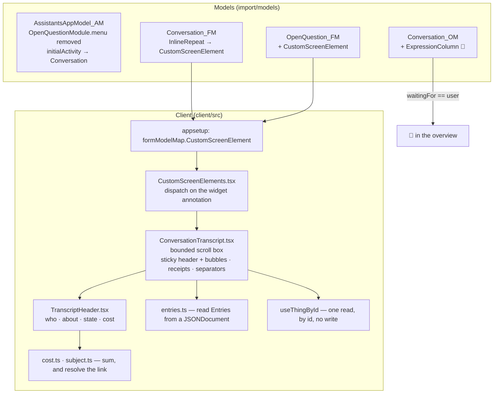
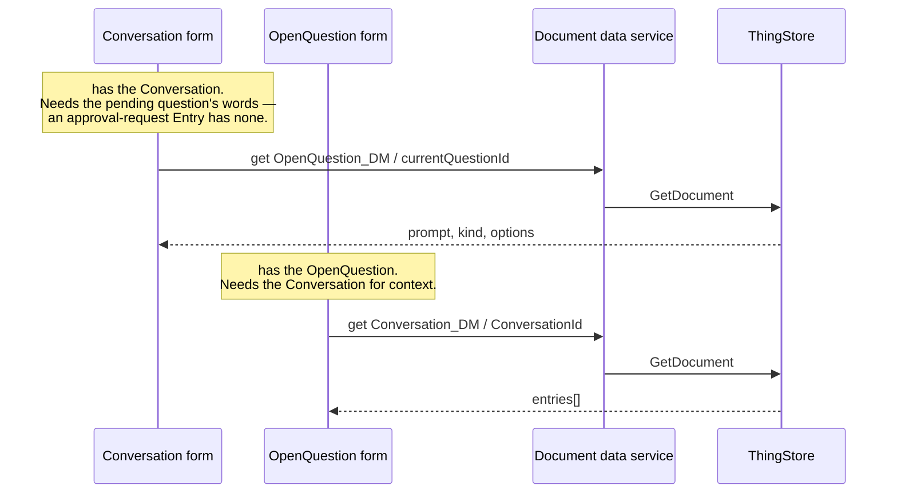

# Architecture — how the Transcript is built

Read [proposal.md](proposal.md) for what and why, and [domain.md](domain.md) for the vocabulary —
**Speaker**, **Bubble**, **Receipt**, **Blocked**, **Answer Surface** are used below as defined there.
This document is the technical approach: the seams used, the decisions taken, what was rejected and
what each choice costs.

## Overview

Four seams carry the change, and all four already exist in the platform. Nothing is forked, nothing is
patched, no engine is replaced.



### Seam 1 — `formModelMap.CustomScreenElement`

`FormModelMap` has an entry per form-model element type, and one of them is
`CustomScreenElement: FormModelMapEntry<FormModel.CustomScreenElement>` — the platform's documented
answer to *"the modeller reached the limit of modelling; a developer puts something here"*. The
component receives:

```ts
interface FormModelComponentProps<T> {
    readonly modelElement: T;                     // id, name, title, annotations, height
    readonly config: FormModelMap.RenderConfiguration;
}
// config.renderOptions.state is the whole EngineState:
//   state.data.document       — the Conversation (or the OpenQuestion) as a JSONDocument
//   state.models.documentModel
//   state.locale
```

That is the entire reason this design is cheap: **the Transcript needs no new data flow for the
document it is already on.** The form engine has the document; the custom element is handed it.

The app already replaces `formModelMap.Control` (see `appsetup.ts` and `ModelElementBridge`), so
adding one more entry is the established motion in this codebase, not a new one.

`FormModel.CustomScreenElement` has **no `elementRef`** — it is `IdNamed`, `Annotated`, `Stylable`,
plus an optional `reference` (a *model* reference, not a field) and an optional `height`. So which
custom element a placeholder is gets decided by an annotation, matching the idiom already in use for
the markdown editor:

```json
{
  "type": "CustomScreenElement",
  "id": "custom_transcript",
  "name": "ConversationTranscript",
  "height": 640,
  "annotations": [
    { "name": "widget", "value": "conversation-transcript" },
    { "name": "exposes", "value": "f_entries" }
  ]
}
```

`widget` selects the component — `WidgetAnnotationValue` in `client/src/components/widgetAnnotation.ts`
gains `"conversation-transcript"`. `exposes` names the Document Model group the element renders, and
has two readers: the validator (below) and nothing else. The component does not need it — it knows
what it renders — but the model file should not be the only place where that is implicit.

`height` is not cosmetic here. The element renders a **bounded box that scrolls internally**, and that
is what makes the pinned header possible: `position: sticky` needs a scroll ancestor, and if the only
one is the form engine's own scroll container the header sticks to the form and drifts away with the
page. Owning the scroll container means owning the sticky context. It also keeps a hundred-Entry
thread from stretching the form to ten screens, which is the other reason a modelled height exists.

### Seam 2 — a Module without a menu

`ApplicationModel.Module.menu` is optional (`readonly menu?: Menu`). Deleting the `menu` object from
`OpenQuestionModule` removes the entry and keeps both scenes: `OpenQuestionOverview` still matches
`module=OpenQuestion, instance` unset, and `OpenQuestionForm` still matches with `instance` set. So the
Answer Surface stays a first-class scene, addressable by descriptor, and the module is simply not
advertised.

`content.initialActivity.descriptor.module` moves from `OpenQuestion` to `Conversation`, because the
landing page was the retired entry.

**The `OpenQuestionOverview` scene is kept deliberately dormant.** After the menu goes, nothing
navigates to it: not the User, not `2-navigation.spec.ts`, not `7-forms-open.spec.ts`. It stays, with
`OpenQuestion_OM` and `OpenQuestionPending_QeM`, because an Assistant that can say *"here is the list
of open questions"* — a `ui.showList`-shaped Operation putting the User in front of an overview — needs
an overview scene to put them in front of. No such Operation exists today and this change does not add
one; what it does is decline to delete the thing that one would need. The consequence is stated rather
than hidden: for now those three models are read by nobody and covered by no test, and the first thing
that navigates to them will be their first test.

### Seam 2b — navigating across modules

**Verdict: it works.** Region content is a pure derivation over the activity map, not an imperative
router — `allRegionsInternal` walks the activities newest-first and collects each one's scene
directives (`client-core/lib/core/view/internal/selectors.js:135-226`), and
`sceneReferenceByActivities` tests only the **last** activity's descriptor, because this App Model
declares no `priorScene` anywhere (`selectors.js:342-352`). Nothing in the layout machinery knows what
a module is. The two-screen design stands.

The obvious recipe was wrong on three counts, though, and each one is a runtime failure rather than a
compile error. `crud-core`'s `selectRow` (`lib/internal/sagas.js:69-98`) is not the precedent it looks
like: it *spreads* the current descriptor, so it never changes module.

```ts
/** Open `<documentModel>/<thingId>` in another module. */
function* openForeignForm(module: string, documentModel: string, thingId: string) {
    // 1. tear down what we are leaving — this is the withDirtyHandling veto point
    const ids = Object.keys(yield* select(ActivitySelectors.topLevelActivities()));
    if (ids.length > 0) {
        yield* put(ActivityActions.cancelRequested({ activityIds: ids }));
        if (!(yield* call(ActivitySagas.waitForResponseCancelRequested))) return;
    }
    // 2. a master activity, so the detail has somewhere to go back to
    const master = ActivityActions.create({ activityDescriptor: { module: "Conversation" } });
    yield* put(master);
    // 3. the detail
    yield* put(ActivityActions.create({
        activityDescriptor: { module, instance: `${documentModel}/${thingId}`, model: documentModel },
        initiatingActivityId: master.payload.activity.id
    }));
}
```

**`model` is mandatory, and it is the Document Model id.** Model resolution filters the scene's model
descriptors by it — `allModelDescriptors.filter(({ documentModel }) => documentModel === undefined ||
documentModel === activity.descriptor.model)` (`client-core/lib/core/model/internal/selectors.js:335`,
verified). Omit it and no data provider claims the load, so `createCallDescriptors` throws *"There is
still data to load for 1 data holder."* — an error panel, not a blank form.

**`instance` is a docRef, not a ThingID.** The form's load constrains `/__meta/docRef` to
`descriptor.instance` with `exact_match`
(`formengine-core/…/providers/DefaultRequestSelectorMap.js:47,54-55`, verified). A docRef is
`Model/ThingID` (`e2e/utils/thingstore.ts:58` — `docRefOf`), and `CurrentQuestionId` /
`SubjectThingId` hold **bare ThingIDs** — ADR-0002, and `e2e/utils/agents.ts:166` concatenates by hand
for exactly this reason. **So the button composes the docRef; the Thing does not carry one.** This is
the likeliest bug in a naive implementation: a bare id returns zero rows and trips
`assertExists(entry, "No document entry found for docRef …")`.

**The teardown is not optional.** `ActivityActions.create` alone leaves the source module's activities
in the map, and there is no garbage collection — an activity leaves only on cancel, commit or
`resetState`. Three consequences, all real: the `MasterDetail` layout renders only the last two views
(`MasterDetailRegionLayout.js:29`), so three activities show *Conversation form | Question form* with
no master; the leaked activity then vetoes `ModuleRegistry` REMOVE at logout
(`moduleRegistryInstance.js:59-83`, which throws); and the activity count grows for the session.
Cancelling all top-level activities is what the framework's own module switch does
(`client-core/…/sagas/main-menu.js:47-60`).

Being read-only makes the teardown *cheaper*, not unnecessary: `withDirtyHandling` only raises its
confirmation when the dirty sub-tree is non-empty, and a read-only form has nothing that sets `dirty` —
so the cancel completes synchronously with no dialog. The leak and the broken layout are unaffected by
readonlyness.

**What loads the document:** the `create` itself. It defaults the data holder to
`loadingState: "missing"`, `pushActivitySaga` turns that into `loadData`, and
`PlatformSingleDocumentDataProvider` claims it and ends in `setData`. Nothing else has to ask. The CDD
slice is *not* on this path — `createCddDataProvider` only claims a load when a CDM is in scope, and
this application has no CDM models — so `cddActivityStateAdapter` in
`CustomizableRelationshipFormEngine` stays a read-side adapter and needs no new trigger.

**The master activity is the Conversations overview, not the Open Questions overview.** Step 2 exists
because a lone top-level form activity has nowhere to go: `event_cancel` removes the activity, and with
no parent the region renders `empty-div` — a blank content area with nothing to re-push it. Given that
a parent is required, which one it is becomes a choice, and `{ module: "Conversation" }` is the better
answer: the User came from Conversations, answering is one step inside that act, and `cancel` returns
them to the list where the answered Conversation no longer carries its 🛑. Landing them on a *questions*
list instead would reintroduce the second inbox this change exists to remove.

Two consequences of that choice, both accepted: the Open Questions overview scene stays dormant (as
above), and no menu entry highlights while the answer form is open — the menu highlights by
deep-equalling a module's `initialActivity.descriptor` (`MainMenu.js:169`), and `OpenQuestion` no longer
has a menu entry to match. The alternative — master = `{ module: "OpenQuestion" }` — would make
`OpenQuestion_OM` and `OpenQuestionPending_QeM` live again, and is the one-line change to make if the
dormant models ever need a reader.

Not viable, and worth recording so nobody tries it: **`CRUDActions.selectRow`** throws unless the
instance is already in the loaded overview list (`crud-core/lib/internal/sagas.js:80-83`), and
`OpenQuestion_OM` is backed by `OpenQuestionPending_QeM` — filtered to unanswered, page size 10. The
approval question the User is answering is often neither.

One assumption still rests on the server rather than on source: that `/__meta/docRef` really is
`Model/ThingID` in the response the overview loads. Every code path and both e2e helpers say so, and
phase A's first browser check settles it in thirty seconds by reading a working row-click descriptor
out of the Redux devtools. If it turns out to be a bare id there, the composition above is wrong and
the button drops the prefix — which is why that check comes before any code.

### Seam 3 — `ExpressionColumn` for the 🛑

`OverviewModel.Column` is a union, and one arm is `ExpressionColumn { name, expression }` — *"a way to
merge multiple field values into a single cell or to add formatting instructions"*. The expression
language (`@com.mgmtp.a12.expression/expression-core`) interprets four node types that matter here:
`string`, `field`, `group` and **`case`** — and `formatCase` matches a single field with `equal` /
`not_equal` and renders its children when it matches.

One case is all there is: `formatCase` matches **one** field, so an expression column cannot AND two
conditions. `WaitingFor == "user"` renders 🛑, anything else renders nothing — and that is why
[domain.md](domain.md) defines **Blocked** on that one field. `Status` need not be tested and
`currentQuestionId` cannot be: every path that sets `waitingFor = "user"` also sets `status = "waiting"`
and a question id (`advance.ts` — `suspend`, the two approval paths, `escalate`), and the writes that
clear one clear all three (`watcher.ts`, the answered scan). `WaitingFor` carries the `indexed`
annotation, which the overview engine requires of anything an expression touches.

Cost: expression columns are not sortable. Acceptable — the marker is for scanning, and `Waiting for`
remains as a sortable reference column beside it.

**This is the one place an emoji enters a model file**, and the one thing in this change that could be
rejected by the model checker rather than by a compiler. The plan verifies it before anything depends
on it, and the fallback is a plain-text marker with the glyph supplied by the client.

### Seam 4 — reading one Thing by id

The only genuinely new motion. It is needed in both directions, and symmetrically:



One hook — `useThingById(model, thingId)` — serves both: a document read by id, no write, no activity,
no dirty state. `@com.mgmtp.a12.dataservices/dataservices-access` is already a dependency and already
carries `DocumentJsonRpc2Request.GetDocumentJsonRpc2Request`; the app already configures
`withDataServicesConfiguration`. Which of the two candidate calls to use — the document service
directly, or a query through `dataservices-access/query` — is settled by a spike in phase A rather
than guessed here, because the answer decides whether the hook needs a saga or not.

Three invariants on that hook, and they are what keep this seam small:

1. **Read only.** It has no update path. Writing is `CRUD::SAVE` on the Answer Surface, or nothing.
2. **Fails soft.** No id, a deleted Thing, a failed request → the Transcript renders a single message
   line where it would have been. A form must never fail to open because a second document is missing
   — the watcher already treats a vanished question as a thing to recover from, and the UI takes the
   same view.
3. **No polling.** It reads on mount and when the id changes. A Conversation the Runtime is driving
   will be stale on screen; that is what it is today, and a reload is the User's existing answer.

## Components

```
client/src/components/conversation/
  ConversationTranscript.tsx   the bounded scroll box: sticky header, then the thread
  TranscriptHeader.tsx         who · about · state · cost — pinned
  Bubble.tsx                   one bubble — side, colour, icon, footnote
  Receipt.tsx                  a tool-intent/tool-result pair, collapsible
  PendingQuestion.tsx          the 🛑 bubble: prompt, options, the Answer button
  speaker.ts                   kind → Speaker · side · shape. The table in domain.md, as code
  entries.ts                   JSONDocument → Entry[]; grouping into clusters
  cost.ts                      sum promptTokens + completionTokens over Entries
  subject.ts                   subjectModel + subjectThingId → an activity descriptor, or nothing
  icons.ts                     the four glyphs, and nothing else that knows them
client/src/components/CustomScreenElements.tsx
                               formModelMap.CustomScreenElement: dispatch on `widget`, else nothing
client/src/sagas/openForeignForm.ts
                               cross-module navigation: tear down, master, detail (seam 2b)
```

`openForeignForm` is a saga rather than a click handler because step 1 is an **asynchronous handshake** —
`cancelRequested` then `waitForResponseCancelRequested`, whose answer may be *no*. It is registered
alongside `LoadModelGraphSaga` in `appsetup.ts`'s `addCustomSagas`. Both callers — the Answer button and
the subject link — dispatch one action and let the saga do the three steps; neither knows the recipe.

`speaker.ts`, `entries.ts`, `cost.ts` and `subject.ts` are pure functions over plain data, which is the
point: the whole of the transcript's semantics is unit-testable without React, a store, or a running
server, and the phases in [plan.md](plan.md) are ordered so that they are tested first.

Styling follows the markdown editor's precedent — `styled-components` with the A12 widget theme
(`theme.colors.*`) through the `ThemeProvider` already installed in `app/page/index.tsx`. No new
palette, no hard-coded colours, both themes for free.

**Text is English literals in the components.** This change registers no key in
`client/src/localization`, because the application's localisation is being removed in a separate change
(see [proposal.md](proposal.md)'s scope note) and adding German strings here would be work done to be
undone. What the Transcript needs is small — *Answer*, *about*, *waiting*, *approval requested*, the
Receipt's labels, the cost label — and it will move with everything else if that removal is ever
reversed. Dates and numbers are formatted by `date-fns` and `Intl` from the browser locale, which is
not localisation of the app's own strings and is unaffected either way.

### Reading Entries

The document is `{ Conversation: { …, Entries: [ { Seq, At, Role, Kind, Text, ToolName, ToolArgs,
ToolResult, QuestionId, PromptTokens, CompletionTokens }, … ] } }` — field **names**, capitalised, as
`runtime/src/a12/things.ts` maps them.

`entries.ts` is therefore a second, smaller copy of a mapping the Runtime already owns, and that is a
real cost, named here rather than discovered later. It is accepted because the alternative — sharing
the Runtime's `SPECS` table with the client — would couple a browser bundle to a Node service for
thirteen string literals. The mitigations are that the copy covers only what the Transcript renders,
lives in one file, and is tested against a fixture captured from a real Conversation document rather
than hand-written.

Where `@com.mgmtp.a12.kernel/kernel-md-facade` offers a documented value accessor for a group
instance, prefer it to indexing the JSON by hand; the spike in phase A settles that too.

### The Header

Everything the Header shows is on the document the element already has. Two derivations are worth
pinning down, because both have a wrong answer that looks right.

**The subject link.** `subjectModel` is a Document Model id — `Invoice_DM`, `Document_DM`,
`Process_DM`, `Party_DM`, the four in `TRIGGER_ELIGIBLE_MODELS` — and `subjectThingId` is a **bare
ThingID** (ADR-0002: a ThingID identifies and nothing more). Per seam 2b, that is not what the activity
descriptor wants, so `subject.ts` composes all three fields:

```ts
{ module: "Invoice", instance: "Invoice_DM/a3f9c1…", model: "Invoice_DM" }
//         ^ whitelist            ^ composed docRef          ^ subjectModel verbatim
```

The module comes from a **whitelist of the four**, not from stripping `_DM`. `subjectModel` is a plain
60-character String with no enumeration and no writer-side constraint, and a descriptor matching no
scene produces an activity that is *silently invisible* — it renders nothing and reports nothing. A
whitelist turns that into a rendered-as-text fallback.

`subject.ts` returns a descriptor **or nothing**, and the *or nothing* is the part that matters: only
those four models have navigable modules, exactly one of `subjectThingId` and `scheduledFor` is ever
set, and a Conversation born of a Schedule has no subject at all. A header that offers a link into a
module that does not exist is worse than a header that offers none.

**The cost.** `cost.ts` sums `promptTokens` and `completionTokens` across all Entries. Summing every
Entry is correct rather than sloppy: `recordUsage` stamps a Turn's usage onto the first Entry that Turn
wrote and leaves the rest unset, so there is no double counting to avoid. What there *is* is a
systematic undercount — a Turn that threw before writing an Entry records nothing — which is why the
figure is rendered with a `≥` and never as a total. `advance.ts` says so in `recordUsage`'s own doc
comment, and the UI is the first place that claim becomes visible to the User.

`turnCount / maxTurns` sits beside it, unsummed, straight off the document — and that **overturns a
standing decision**, so it is said out loud rather than slipped in. `f_maxTurns` is listed in
`import/validate-models.mjs`'s `INTENTIONALLY_UNEXPOSED` under the comment *"Runtime bookkeeping the
User has no use for"*. It turns out to have one use: `turn 4/20` is how a reader sees that a
Conversation is approaching the cap that will end it, which is exactly the moment they might want to
intervene. Because the Header reads it from a custom element rather than through a Control, the
validator would stay silent and that comment would quietly become false — so the plan corrects the
comment in the same step, and `f_maxTurns` stays on the list for `Control` purposes.

## Decisions

### The answer is written on the question's own form, not in the Transcript

The tempting design is one screen: render the answer controls inside the Pending Question Bubble and
write the Open Question from there. It was rejected.

| | Answer in the Transcript | Answer on the question's form *(chosen)* |
|---|---|---|
| Screens per answer | one | two, joined by a button |
| Who validates | hand-written | the form engine, from `OpenQuestion_FM` |
| Dirty handling, cancel confirmation | hand-written | `withDirtyHandling`, already configured |
| Kind-specific controls | duplicated in React | modelled once, in the FM |
| ADR-0008 | a Model whose form is bypassed | intact |
| Existing e2e coverage of answering | invalidated | preserved |
| New write path to the ThingStore | yes | no |

The rule that falls out of it is the one worth remembering: **reads may cross documents, writes may
not.** A second writer for an answer is exactly the kind of thing ADR-0006 exists to prevent, and a
hand-rolled `modify` next to a form engine that already does it correctly is how a UI acquires two
behaviours for one act.

The cost is honest: the User clicks once more, and the Answer Surface shows a transcript they were
just looking at. That is why the Answer Surface shows the *same* component — the second screen reads
as the same thread continuing, not as a different view of the same data.

### The Header lives in the custom element, not in the form model

`Conversation_FM` already has a `ConversationHeader` `MultiColumnSection` — thirteen read-only Controls
over the same document. The Header could have been that section, restyled. It cannot be, for one
mechanical reason: **the form engine gives no way to pin a modelled section.** A sticky element needs a
scroll ancestor it can stick inside, the form's scroll container belongs to the engine, and a header
that sticks to *that* leaves the screen as soon as the page moves. Owning the box means owning the
sticky context, and the custom element is the only thing here that owns a box.

That leaves two headers over one document, which is one too many. So the modelled section becomes
`collapsible: true, initiallyCollapsed: true`:

| | Pinned Header | `ConversationHeader` section |
|---|---|---|
| Shows | the four facts a reader needs mid-thread | all thirteen Controls, including `wakeAt`, `currentQuestionId`, `subjectModel` |
| Default | always visible | collapsed, one click away |
| Purpose | reading a Conversation | debugging one |
| ADR-0008 | — | satisfied, as it is today: every field is still on the form |

Collapsing rather than deleting is deliberate. Those thirteen Controls are how ADR-0008 is met for
`Conversation_DM`, and they are genuinely useful when something is wrong — which is the case the
`lastError` and `wakeAt` fields exist for. What they are not is what a reader wants above a
conversation.

**`OpenQuestion_FM` needs the same treatment and cannot get it the same way.** Its `SectionQuestion`
holds two grids — `grid_question` (`assistantKey`, `kind`, `conversationId`, `subjectThingId`, three of
which the Header now says better) and `grid_prompt` (the question's words, which are what the User came
to read). Collapsing the section would collapse the words with the machinery, and a `ControlGrid` is not
collapsible — only `Section` and `MultiColumnSection` are. So the section is split rather than
collapsed:

| Section | Holds | Default |
|---|---|---|
| the `CustomScreenElement` | Header + Transcript | — |
| **Question** | `grid_prompt` | open |
| **Details** *(new)* | `grid_question` | collapsed |
| Options | unchanged | open |
| Answer | unchanged | open |

Same outcome as the Conversation form — nothing duplicated on screen, every field still on the form —
reached by moving a grid rather than by hiding one.

### The transcript replaces the Entries repeat rather than sitting beside it

`Conversation_FM` could keep its `InlineRepeat` and gain a transcript above it. It does not: two
renderings of one list is two things to keep in step, and the grid's remaining value — the machinery
columns — is preserved inside the Receipts and footnotes. The Entry fields stay on the form model in
the sense ADR-0008 means: they are exposed, by a custom element instead of by a table.

That is exactly what `import/validate-models.mjs` has to be taught. Its ADR-0008 check walks the FM
for `elementRef` / `groupRef` and warns about every non-group DM field it does not find; a
`CustomScreenElement` has neither, so removing the repeat would produce **twelve** warnings for fields
that are more visible than before — twelve and not thirteen, because `f_entry_idempotencyKey` is
already in that file's `INTENTIONALLY_UNEXPOSED` set. The rule has two halves:

1. **Coverage.** A `CustomScreenElement` annotated `exposes: <groupId>` marks that group and every
   field under it as referenced, so ADR-0008 is satisfied by the custom element the way it was
   satisfied by the repeat.
2. **Existence.** The annotation's value must name a group that exists in the bound Document Model, and
   it is an **error** if it does not. Without this half the rule is worse than no rule: a typo would
   silence twelve warnings and cover nothing, which is the failure mode the check exists to catch.

The two halves compose with `INTENTIONALLY_UNEXPOSED` rather than replacing it — an excluded field
stays excluded whether a custom element covers it or not. Ten lines or so, and ADR-0008 keeps meaning
something for the next custom element instead of being silenced with a growing exclusion list.

### Markdown in bubbles: only where markdown was authored

Entry text is plain prose from a model; question prompts are markdown, and both writers open theirs
with a bold heading (*"**Approval needed.**"*). Rendering every bubble through the lifted Lexical
editor would mount up to a hundred editors to read a thread. So:

- Bubbles render text as pre-wrapped plain text.
- The **Pending Question Bubble** renders markdown through the existing read-only
  `MarkdownRichTextEditor` — one instance, on the one string that was written as markdown.

If assistant prose later turns out to be markdown often enough to matter, the upgrade is per-Speaker
and local to `Bubble.tsx`. It is not designed for now.

### The 🛑 is derived, never stored

A `Blocked` boolean on `Conversation_DM` would be cheaper to render and is wrong: it is a second copy
of what `waitingFor` already says, written by the same writer in the same write, and ADR-0006's whole
subject is what happens when a fact has two homes. Derivation costs one expression in one model file.

## Integration points and what could break

| Touch point | Risk | Guard |
|---|---|---|
| `initialActivity` | landing on a module with no menu entry, or on nothing | phase C's first check is that the application opens on Conversations |
| `OpenQuestionModule` without a `menu` | scene unreachable → answering impossible | e2e navigates to it the new way, through a Conversation, in the same phase |
| `OpenQuestionPage.openQuestion` (e2e) | its route through the *Open Questions* menu disappears | rewritten in the same phase as the AM change, so the invoice slice never goes red for a reason other than a real one |
| `2-navigation.spec.ts` | asserts eight modules including *Open Questions* | its row goes; the spec's purpose — every menu entry opens and renders — is unchanged |
| `7-forms-open.spec.ts` | its `MODULES` list includes *Open Questions* and it navigates by `clickMenuItem`, so it cannot reach that form at all any more | the row goes; the question form's opening moves to the new transcript spec and the invoice slice, which reach it the way the User now does |
| `5-localization.spec.ts` | both locale tests assert the **welcome page's** title is *Open questions* / *Offene Fragen* | the landing page changed, so the expectation changes with it — a behavioural assertion, not a rename |
| `2-restart.spec.ts` | `loginFreshly` waits for the *Open Questions* menu **link** as its the-app-is-up signal | it waits for *Conversations* instead |
| `f_entries` sub-fields | ADR-0008 warnings from the validator | the `exposes` rule, landed before the FM change |
| `formModelMap` | the app's `Control` override must survive | the new entry is added by spreading, exactly as `Control` is today |
| A bounded, internally scrolling box inside a form | a nested scroll region is a classic way to make a form unusable on a narrow screen, and `position: sticky` fails silently when its ancestor is wrong | phase A proves the sticky header with a scrolled thread before it is built; the box's height is modelled, so it is changeable without a rebuild |
| The subject link | `subjectModel` naming a model with no module, or a Conversation with no subject at all | `subject.ts` returns a descriptor or nothing, and both cases are unit-tested before the header renders one |

## What this does not change

The Runtime, the ThingStore, the write model, the roles, the Models' data, the Query Model, the
watcher's three scans, `just bootstrap`, and every ADR from 0001 to 0018. The single-writer invariant
and ADR-0008 are both *more* true afterwards: one more Model's fields are visible, and no new writer
exists.
