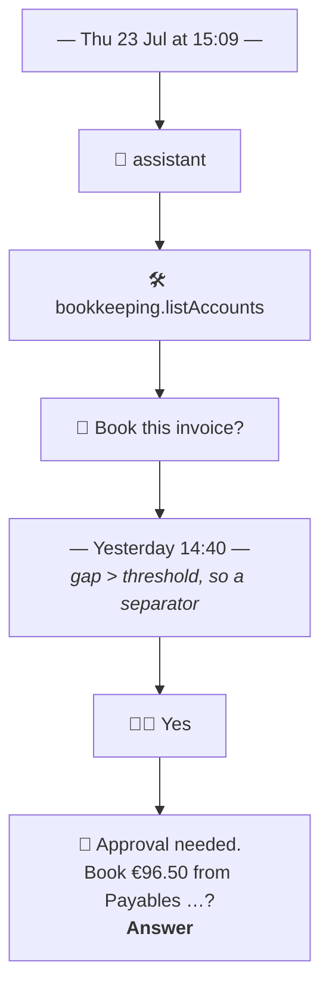

# Domain — what this change adds and changes

New and changed concepts only. The system's standing domain is
[specs/system/domain.md](../../system/domain.md); the glossary is
[CONTEXT.md](../../../CONTEXT.md). Spelling is British English.

This change adds no Thing, no Model and no field. Everything below is vocabulary for how what already
exists is *shown* — which is a domain concern here, because the whole system's purpose is a human
supervising machines, and the surface the human reads is not a detail of that.

## Vocabulary

| Term | Status | Gloss |
|---|---|---|
| **Transcript** | **new** | A Conversation's `entries[]` read as a dialogue: one **Bubble** per Entry, in `seq` order, grouped by time, with the pending question at the end. A view over an existing Thing — it holds nothing and is the Authority for nothing |
| **Conversation Header** | **new** | The pinned band above a Transcript: who is talking, what it is about, where it stands, what it has cost. Stays visible while the Entries scroll, because forty Entries down those four facts are precisely what a reader can no longer see. Every field of it is read or derived from the Conversation; it stores nothing |
| **Recorded cost** | **new** | The sum of `promptTokens` and `completionTokens` over a Conversation's Entries, shown in the Header as a **lower bound** and never as a total. `recordUsage` stamps a Turn's usage onto the first Entry that Turn wrote, and a Turn that died before writing one records nothing — so the sum is what the Conversation cost *at least*. Saying `≥` is not modesty; a bare number would be a false claim |
| **Bubble** | **new** | One Entry, rendered as itself. Its **Speaker** decides its side, its colour and its icon; its **Kind** decides its shape |
| **Speaker** | **new** | Who an Entry is *from*, as the User reads it: **Human** 👦🏼, **Assistant** 🤖, **Tool** 🛠️, or **Machinery** (no icon). Derived from the Entry's `kind`, not stored. Not the same as the Entry's `role`, which is the LLM API's word for whose turn it was |
| **Machinery** | **new** | The Speaker for Entries that are neither speech nor action: the system prompt, the trigger's briefing, notes, timeouts, errors, approval records. Rendered centred and grey, collapsed, the way Messages renders *"iMessage · Encrypted"* — present, dateable, not competing with the words |
| **Receipt** | **new** | A `tool-intent` and its `tool-result`, paired into one collapsible Bubble: the Operation's name, its arguments, what came back. One act, one Bubble, closed by default |
| **Pending Question Bubble** | **new** | The last Bubble of a **Blocked** Conversation. Its words come from the Open Question, not from an Entry, because the Entry that records an approval carries no text by design. Carries the question's options and the way to answer it |
| **Blocked** | **new** | A Conversation that is waiting on the User: **`waitingFor = user`**, and nothing else. Marked **🛑**. Derived from one indexed field already written by the Runtime — not a new state, and not a new field. `currentQuestionId` is the Runtime's invariant companion to that value, not part of the test: every path that sets `waitingFor = "user"` also sets a question id and `status = "waiting"` (`advance.ts` `suspend`, the approval paths, `escalate`), and the same write clears all three. The definition is one field because the overview's expression language can only match one — and because a second condition would be a second thing to keep true |
| **Answer Surface** | **new** | The one screen on which an answer is written: the Open Question's own form, which now shows its Conversation's Transcript above the answer controls. Named because the change's central rule is that there is exactly one |
| ~~**Open Questions module**~~ | **retired** | The navigation module, and the application's landing page. Its scenes survive without a menu entry; the *inbox* it used to be becomes the Conversations overview read for 🛑 |
| **Conversations module** | **changed** | Now the only navigation module for the pair, and the landing page. Still an A12 master-detail, but the detail is a Transcript rather than a grid |
| **Icon vocabulary** | **new** | 👦🏼 human · 🤖 AI · 🛠️ tool or command · 🛑 blocked. Four glyphs, one meaning each. Three live only in the client; the 🛑 lives in two places, because the overview renders it from an expression in `Conversation_OM` while the Transcript renders it from the client. Whenever the system has to say *who* or *stuck*, it says it with one of these |

## Speaker, from Kind

The mapping is the whole of the transcript's semantics, so it is written once, here, and the code
follows it. Entry kinds are `EntryKind` in `runtime/src/domain/types.ts`; nothing about them changes.

| Entry kind | Speaker | Side | Shape |
|---|---|---|---|
| `assistant` | 🤖 Assistant | left | prose bubble; token cost as a footnote beneath it |
| `answer` | 👦🏼 Human | right | prose bubble, accent colour — the User's own words, the only Entry they authored |
| `tool-intent` + `tool-result` | 🛠️ Tool | left | one **Receipt**, collapsed |
| `tool-intent` for `ui.askUser` | 🤖 Assistant | left | question bubble, not a Receipt — the Assistant asking is speech, and the prompt is in its arguments |
| `system` | Machinery | centred | collapsed meta line — the system prompt is long and read once |
| `prompt` | Machinery | centred | collapsed meta line: the briefing the Runtime handed the Assistant at birth. It occupies the `user` role in the API and is *not* the human speaking |
| `note` | Machinery | centred | meta line |
| `timeout`, `error` | Machinery | centred | meta line, warning-coloured |
| `approval-request` | Machinery | centred | meta line, *"🛑 approval requested"*. Carries no text by design — the words are on the Open Question, which is their Authority (ADR-0006) |
| *(unknown kind)* | Machinery | centred | meta line showing the kind verbatim. A new kind must degrade, never disappear |

Two distinctions are easy to lose and both matter:

- **`role` is not Speaker.** `role` is what the LLM provider is told; `prompt` and `answer` are both
  `role: user` and only one of them is the human. Reading `role` to decide the side would put the
  Runtime's briefing in the User's colour, which is a lie about who said it.
- **A Receipt is one act, not two Entries.** `tool-intent` without its `tool-result` is a call still
  in flight or one that died; that is worth showing as an open Receipt, and it is the only case where
  a Receipt renders alone.

## What the Header says, and where each fact lives

| Fact | Read from | Note |
|---|---|---|
| Which Assistant | `assistantKey`, `title` | the 🤖 of the pair — the Conversation's other participant is the reader |
| What it is about | `subjectModel` + `subjectThingId` → the subject Thing's own form | `subjectModel` is one of `Document_DM`, `Invoice_DM`, `Process_DM`, `Party_DM`, and all four are navigable modules |
| …when there is no subject | `scheduledFor` | exactly one of the two is set, and which one says what gave birth to the Conversation |
| Who called it | `parentConversationId` | a link to the calling Conversation, when an Assistant called another (ADR-0007) |
| Where it stands | `status`, `waitingFor`, `finishReason` | **Blocked** shows 🛑 |
| What it has cost | summed over `entries[]`, plus `turnCount` / `maxTurns` | a **Recorded cost**, shown as `≥` |

Nothing here is a new fact about the domain. The Header is the first place the system *adds up* what
it has spent, and the honesty of that figure is the only genuinely new statement it makes.

## Time, the way a thread shows it

A **separator** is written between two Bubbles when the day changes, or when the gap between them
reaches **one hour**. Both conditions, and the hour is the value — not "a threshold", because a test
cannot be written against an adjective.

It is not decoration: this system's Conversations wait for days, and a thread that does not say so
reads as if the Assistant answered instantly and then asked again — the pause *is* the Conversation's
most characteristic feature, and ADR-0004 is the reason it exists. An hour is chosen because it is
short enough to separate a Turn from the answer that arrived after lunch, and long enough that the
seconds-apart Entries of a single Turn stay in one cluster.

## Actors, unchanged

The **User** and the **Runtime** stay exactly as [domain.md](../../system/domain.md) has them, and so
does the single-writer discipline that separates them:

| Fact | Authority | This change |
|---|---|---|
| A Conversation, its Entries | Runtime | still read-only in the UI; the Transcript reads, never writes |
| An answer on an Open Question | User | still written by saving `OpenQuestion_FM`, and nowhere else |
| Whether a Conversation is Blocked | Runtime, in `status` / `waitingFor` / `currentQuestionId` | derived for display; not stored a second time (ADR-0006) |
| What a Conversation cost | the Entries the Runtime wrote | summed for the Header; no total is stored, and the sum is labelled a lower bound |

The Transcript reading a *second* document is the one genuinely new motion, and it is worth naming
plainly: **the UI may read across documents; it may not write across them.** The Conversation form
reads the Open Question it is blocked on, to have its words; the Open Question form reads the
Conversation that raised it, to have its context. Both are reads by ThingID, both fail soft, and
neither creates a second writer for anything.
