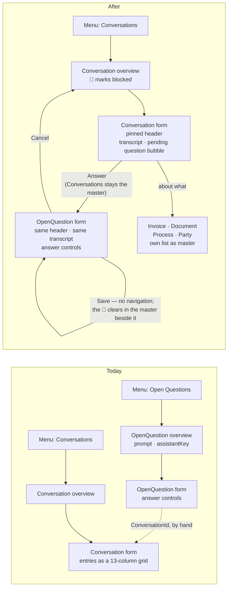
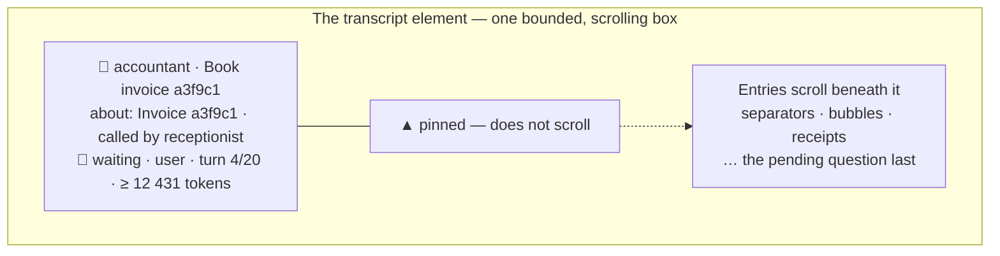

# Proposal — a Conversation looks like a conversation

## What

Three things, and they are one thing.

1. **The transcript stops being a data grid.** `Conversation.entries[]` is rendered as a message
   thread — the Assistant on the left, the User on the right, tool calls as receipts between them,
   day and gap separators, and a small icon saying who is speaking: 👦🏼 the human, 🤖 the Assistant,
   🛠️ a tool. The reference is Apple's Messages, and the reference is deliberate: a Conversation *is*
   a conversation, and the User already knows how to read one.

   **The thread carries a header, and the header does not scroll away.** Messages keeps the name of
   whoever you are talking to pinned above the thread, and a Conversation needs the same for the same
   reason: forty Entries down, *who* and *about what* are exactly what a reader has stopped being able
   to see. Four things, pinned:

   | | Where it comes from |
   |---|---|
   | 🤖 **who** — the Assistant, and the Conversation's title | `assistantKey`, `title` |
   | **about what** — a link to the subject Thing, or the instant a Schedule was serving; and a link to the calling Conversation when there is one | `subjectModel` + `subjectThingId`, or `scheduledFor`; `parentConversationId` |
   | **where it stands** — `status` and what it waits on, 🛑 when it waits on the User, its finish reason when it is over | `status`, `waitingFor`, `finishReason` |
   | **what it has cost** — tokens spent, and turns taken against the cap | summed over `entries[]`; `turnCount` / `maxTurns` |

   The cost is shown as a **lower bound**, because that is what it is: `recordUsage` stamps a Turn's
   usage onto the first Entry that Turn wrote, and a Turn that died before writing one records nothing.
   functional.md currently says *"Nothing adds them up"*; from now on something does, and it says
   `≥`.

2. **A question is shown inside its Conversation.** Today an Open Question is a row in its own
   overview carrying a prompt and an `assistantKey`, which for the Runtime's own approval question
   reads *"Approval needed."* over an amount and an account — with the reasoning that produced it one
   module away and joined only by a ThingID the User has to copy. From now on the question's own form
   carries the transcript that leads up to it, and the Conversation's form carries the question that
   is holding it up. Neither screen can be reached without the other's context.

3. **The menu loses an entry, the overview gains a marker.** *Open Questions* goes away as a
   navigation module; **Conversations** is the one entry, and it is the landing page. A Conversation
   waiting on the User is marked **🛑** in that overview, which is what the User is scanning for. An
   open question is always the end of a Conversation, so a list of Conversations is already a list of
   questions — sorted by the thing they are about rather than by the fact that they are questions.

Nothing about the Runtime, the Models' data, or who may write what changes. This is a change to four
model files and the client, plus the model validator, five end-to-end specs and the prose that
describes all of it.

The pinned header, and what stays put while the Entries scroll:

## Why

**The spec already says it.** [functional.md](../../system/functional.md) on the Conversations
module: *"its `entries[]`: the full transcript, as a read-only inline repeat. It is readable, but it
is a data grid, not a transcript view."* That sentence has been an admission of a known gap since it
was written. This change closes it and deletes the sentence.

**A question without its Conversation is not answerable, only guessable.** The approval question the
Runtime raises (ADR-0018) is the sharpest case: it is one sentence about money, and everything that
justifies it — the invoice the Receptionist classified, the accounts the Accountant listed, the
budget report it read, the question it asked first and the answer it got — lives in Entries on
another document. The User is asked to authorise a booking while being shown the least possible
context for it. Two answers are needed per booking; both are given blind.

**Two menu entries for one act.** *Open Questions* and *Conversations* are not two things the User
does. There is one thing: look at what the household's assistants are doing, and unblock the ones
that are stuck. An open question is a Conversation in a particular state, and the state belongs in
the list of Conversations, as a marker, not as a second list.

**A grid is the wrong shape for a dialogue.** Thirteen columns of `Seq`, `At`, `Role`, `Kind`,
`ToolArgs`, `ToolResult`, `ArgsHash`, `PromptTokens` … present every Entry as equally important. In a
transcript the words are important, the machinery is a footnote, and a chat layout says so with
nothing but position and colour: what the Assistant said reads as prose, what a tool did collapses
into a chip you open when you care, and the system prompt stops competing with either.

## Scope

**In scope**

| Area | What changes |
|---|---|
| `AssistantsAppModel_AM` | `OpenQuestionModule` loses its `menu`; `initialActivity` becomes `Conversation`; both flows otherwise untouched |
| `Conversation_FM` | the Entries `InlineRepeat` becomes a `CustomScreenElement` for the transcript; the `ConversationHeader` section becomes collapsible and starts collapsed, since the pinned header now says what a reader needs |
| `OpenQuestion_FM` | gains a `CustomScreenElement` above the answer section, for the same header and transcript |
| `Conversation_OM` | gains an expression column that renders 🛑 when the Conversation waits on the User |
| `OpenQuestion_FM` | its `SectionQuestion` splits: the prompt stays open, the four machinery Controls move to a collapsed *Details* section |
| Client | a transcript component with a pinned header, an entry reader, a cost summer, a subject-link resolver, a read-a-Thing-by-id hook, a cross-module navigation saga, the `CustomScreenElement` form-model-map entry |
| `import/validate-models.mjs` | teaches ADR-0008's coverage check about custom screen elements, and errors on an `exposes` that names no group |
| e2e | five files: the navigation spec, `OpenQuestionPage`'s route to a question, `7-forms-open`, `5-localization`, `2-restart`, plus `RaisedQuestion` gaining `subjectThingId` and new specs for the transcript and the marker |
| Prose | `specs/system/functional.md`, `specs/system/architecture.md`, `README.md`, `import/models/CONVENTIONS.md`, a new ADR |

**Out of scope, deliberately**

- **No Document Model change.** No new field, no reindex, no migration. `Status` and `WaitingFor` are
  already indexed and already say everything the 🛑 needs.
- **No Runtime change.** The Runtime does not know the UI exists, and this change does not teach it.
- **No answering from the Conversation screen.** The write stays on `OpenQuestion_FM`, where the form
  engine validates it, the dirty handling guards it and the existing end-to-end coverage watches it.
  Reads may cross documents; writes may not. See [architecture.md](architecture.md) for why the
  tempting alternative was rejected.
- **No Open Question deletion.** The Model, its form, its overview and `OpenQuestionPending_QeM` all
  stay. Only the *menu entry* goes; the form is still a scene, still reachable by descriptor, still the
  Authority for an answer. Deep links are off in this application
  (`deepLinking.onlyWelcomePage: true`), so reachability was never a URL and is not one now.
  - The **overview** scene keeps no reader at all after this change, and stays anyway: an Assistant
    that can say *"here is the list of open questions"* — a `ui.showList`-shaped Operation that puts
    the User in front of an overview — would need an overview scene to put them in front of. No such
    Operation exists today and this change does not add one. What it does is decline to delete what one
    would need, and say plainly that until then those three models are read by nobody.
  - It came close to having a reader by accident. The Answer jump needs a master activity beside the
    question form, and `{ module: "OpenQuestion" }` would have supplied one — rendering this very
    overview as the master pane and making all three models live. It was rejected for
    `{ module: "Conversation" }`, because landing the User on a list of *questions* after answering
    would rebuild the second inbox this change exists to remove. One line in
    `openForeignForm` is all it would take to change that, should the dormant models ever want a reader.
- **No localisation.** New strings are English literals in the components. The application's
  localisation is being removed wholesale in a separate change (below), so registering German keys here
  would be work done in order to be undone. Dates and numbers still come from `date-fns` and `Intl`,
  which read the browser's locale and are not the app's own strings.
- **No virtualised list, no new markdown engine, no new dependency.** `entries[]` is capped at 100 by
  the Model, `date-fns` and the lifted Lexical editor are already here.

### A separate change: removing localisation

Localisation is being removed from the whole application. That does **not** belong in this change, and
folding it in would be exactly the scope creep the *Out of scope* list exists to prevent: it touches
every one of the nine Document, Form and Overview Models (each carries `locales: [en, de]` and a
`label` array per element), `client/src/localization` entire, `supportedLocales`,
`getDateTimeResource`, the language switcher in the application header, and
`e2e/tests/base/5-localization.spec.ts`, which exists for nothing else. It has its own blast radius,
its own risk — the A12 model checker has opinions about `locales` and about label arrays — and its own
verification.

The only coupling is this: **`5-localization.spec.ts` asserts the welcome page's title**, and this
change moves the welcome page. Whichever change lands first, that assertion has to move with it — so
this change updates it, and the localisation removal deletes the file. The order does not matter as
long as neither pretends the other is not coming.

## Expected outcome

The User opens the application and lands on Conversations. Three rows carry 🛑. Opening one shows, in a
header that stays put, which Assistant is talking, what it is about, that it is blocked and what it has
cost so far — and beneath it who asked what, in order, ending in a red-flagged bubble with the question
and an **Answer** button. Answering opens a screen showing the same header and the same thread with the
answer controls under it, and the Conversations list still beside it. Saving leaves them on that screen —
`CRUD::SAVE` does not navigate, here or anywhere else in this application — and within about two seconds
the Runtime has moved the Conversation on and the 🛑 has cleared from the list they can already see. They
leave by the form's own *Cancel*.

Acceptance, as the e2e tier will put it:

- The menu has seven entries, and *Open Questions* is not one of them.
- A Conversation with `waitingFor = user` shows 🛑 in the overview; one that is `done` does not.
- The Conversation form shows no `table-body-row` for Entries, and shows one bubble per Entry with
  the icon its kind maps to.
- The header names the Assistant, and is **still visible after the transcript is scrolled to its
  last Entry**.
- The header's *about* link opens the subject Thing's own form; a Conversation born of a Schedule
  shows its `scheduledFor` instant there instead, and no dead link.
- The header's token figure equals the sum over `entries[]` and is marked as a lower bound.
- A pending question's words appear on the Conversation form even when it is an approval — whose
  `approval-request` Entry carries no text at all.
- The question's own form shows the header and transcript of its Conversation above the answer
  controls, with the Conversations list as its master pane; *Cancel* returns there.
- With its Conversation unreadable, that form still opens, still shows the prompt, and still saves an
  answer — the header degrades to what the question's own document carries.
- The invoice slice still books an invoice end to end, with both answers given through the new route —
  each question found by its Conversation's *(subject, assistant)* pair, and no prompt-matching needed,
  because a blocked Conversation has exactly one pending question.

## Risks

| Risk | Why it might bite | What we do about it |
|---|---|---|
| The emoji are outside the BMP | A12 validates supported characters in document *data*; whether the model checker minds them in an OM expression is unverified | The icons live in the client, in TypeScript, where nothing validates them. Only the 🛑 sits in a model, and it gets its own verify step before anything is built on it; the fallback is a client-side marker |
| Reading a second document from a form component | There is no established seam for it in this codebase, and the wrong one drags the whole activity machinery in | It is one read, by id, no write, and it fails soft: no conversation loaded means no transcript and a message, never a broken form. A spike settles the call before the component is written |
| A second hand-written model mapping | The Runtime already has one (`runtime/src/a12/things.ts`); the client would get a smaller second copy, free to drift | Keep the client's to the fields the transcript renders, in one module, with a unit test over a fixture taken from a real document |
| `CustomScreenElement` behaves differently than read | It is a documented placeholder, but nothing in this project uses one yet | Phase A of the plan is a walking skeleton — a custom element that renders one line — landed and seen in the browser before the transcript is written |
| The header does not actually stay pinned | `position: sticky` needs the right scroll ancestor, and the form engine owns the form's scroll container — a header that sticks to the *form* would drift with the page | The transcript element owns a bounded, internally scrolling box, so the sticky ancestor is ours and not the form's. The same phase-A spike checks it with a scrolled thread and a screenshot, before the header is built |
| Cross-module navigation | The Answer button and the subject link both leave their module, and `crud-core`'s row click is not the precedent it looks like — it *spreads* the current descriptor, so every navigation the platform performs stays inside one module's flow | **Settled from source: it works** (architecture.md seam 2b). Region content is derived from the activity map, not routed. Three traps were found and are now specified: `model` is mandatory, `instance` is a composed docRef and not the ThingID the Thing carries, and the teardown handshake is obligatory or the layout breaks and activities leak. One claim depends on the server rather than the client and is phase A's first browser check |

## The decision worth recording

An ADR, because it settles something a later reader will otherwise re-litigate:

> **ADR-0019 — a question is answered in the context of its Conversation.** The User's screen for an
> Open Question shows the Conversation that raised it; the Conversation's screen shows the question
> holding it up. The transcript is read across documents, the answer is written only through the
> question's own form. There is one menu entry, because there is one act.
