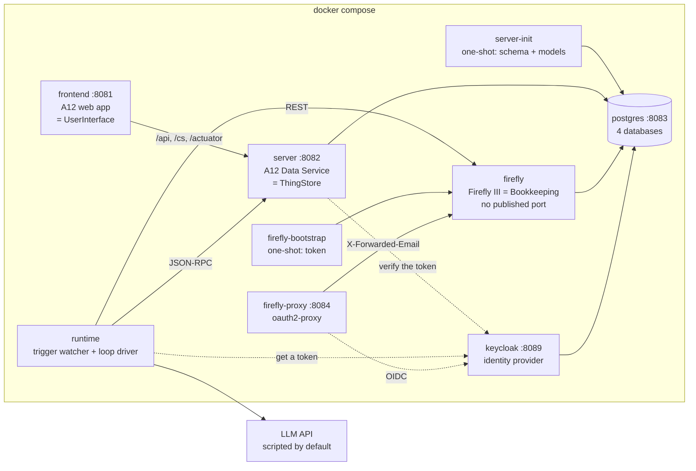
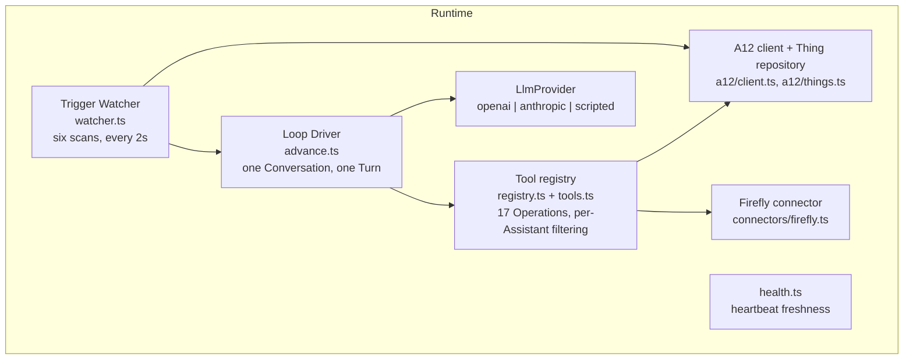
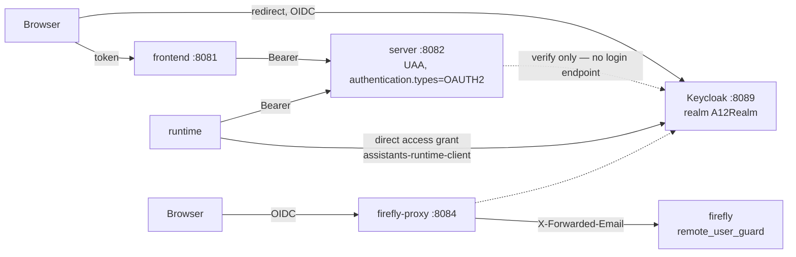

# Architecture — how the system is built

The domain this realises is in [domain.md](domain.md); the vocabulary is in
[CONTEXT.md](../../CONTEXT.md). [README.md](../../README.md) is the operator's view — how to run
it, and what every `just` recipe does — and is not repeated here. The seventeen decisions with
their alternatives and reversal costs are in [docs/adr/](../../docs/adr/), and the running record
of decisions taken while building is [DECISIONS.md](../../DECISIONS.md).

## Overview

One `docker compose` file: seven long-running services and two one-shot init containers. No second
database engine, no message broker, no workflow engine, no queue.



The architectural style is not microservices and not a monolith. It is **one shared store with two
independent clients**. The ThingStore is the only integration surface in the system: the
UserInterface writes to it, the Runtime polls it, and neither knows the other exists. There is no
service-to-service call anywhere in the product code.

Every host port is published on `127.0.0.1` only.

### Why the Runtime is a separate service

The A12 Data Service is a platform component we *configure*, not an application we own — its jar
comes from the registry and the project adds only a handful of Java classes. Putting a
long-running agentic loop, an LLM client and an HTTP connector inside it would fuse the
application's lifecycle to the platform's and make every Runtime change a Spring Boot rebuild.

Keeping it outside also keeps the ADR-0006 boundary honest: the Runtime is a *client* of the
ThingStore with no privileged access, exactly like the UserInterface.

### Why the Runtime polls (ADR-0011)

The Runtime offers no API and receives no webhooks. It asks the store every two seconds what has
materialised, what has been answered and what is due to wake.

The ThingStore is the Authority for Conversations and Open Questions, so "is there anything to
do?" is a question about the store and nothing else is entitled to answer it. An API on the
Runtime would be a second place to ask, and it would hold in memory — a pending request, a
subscription, a callback — exactly the live state ADR-0004 exists to remove. The cost is a handful
of indexed queries every two seconds and a latency of one scan interval. At one household's volume
that is free; at another scale the interval is the first thing that would have to give.

## Technology stack

| Layer | Choice | Role |
|---|---|---|
| Platform | **A12** 2026.06, local-auth project template | Models, Data Service, form/overview engines, the web application |
| ThingStore | A12 Data Service (Spring Boot, Java 21) | Stores every Thing; JSON-RPC at `/api/v2/rpc` |
| UserInterface | A12 web application (React, TypeScript) | Generated from the models, plus the lifted markdown editor |
| Runtime | **TypeScript on Node 24** | Trigger watcher and loop driver |
| Database | **PostgreSQL**, one container, four databases | `assistants-ds`, `assistants-cs`, `assistants-firefly`, `assistants-keycloak` |
| Identity | **Keycloak 26**, realm `A12Realm` | The only thing in the system that checks a password |
| Bookkeeping | **Firefly III 6.6.6** | The books; the Authority for accounts, transactions, balances, budgets |
| Firefly access | **oauth2-proxy** | Firefly has no OIDC client; the proxy runs the flow and forwards a header |
| Editor | **Lexical** | The markdown editor, lifted from `w12-on-a12` |
| Build | **Gradle 9.5** / **npm** / **just** | `just` is the single command surface |
| Tests | **vitest**, **Playwright** | Four tiers plus an opt-in live-LLM tier |

The Runtime is TypeScript because the LLM SDKs are first-class there, the repository already
carries a Node toolchain for the A12 client, and the loop is I/O-bound orchestration rather than
computation.

A12 artefacts resolve from the **public** community registries pinned in `.npmrc` and
`settings.gradle`, so the build needs no VPN and no credentials (D-006).

## Repository layout

The A12 project template's shape is kept at the repository root — deviating from it would fight
every Gradle task the template provides.

```
/
├── justfile                  the command surface; every recipe documented in README.md
├── client/                   the A12 web application = UserInterface
│   └── src/components/markdown-editor/   lifted from w12-on-a12
├── server/                   the A12 Data Service = ThingStore (app/ and init/)
├── runtime/                  the Runtime (TypeScript)
│   ├── src/a12/              JSON-RPC client + typed Thing repository
│   ├── src/llm/              provider interface + openai / anthropic / scripted
│   ├── src/loop/             advance() — one Conversation, one Turn
│   ├── src/watcher/          the six scans
│   ├── src/tools/            the registry and the seventeen Operations
│   ├── src/connectors/       firefly
│   ├── src/bootstrap/        seeds the two Assistants and the RuntimeState singleton
│   ├── src/demo/             the demo household loader
│   └── fixtures/             the scripted LLM transcript
├── import/
│   ├── models/               the eight Things (DM/FM/OM) + the application model + CONVENTIONS.md
│   ├── auth/                 roles.yaml — realm role → A12 access rights
│   └── validate-models.mjs   the model validator
├── compose/                  docker-compose.yml, firefly/, postgres/, keycloak/
├── e2e/                      Playwright
├── scripts/                  setup-env.mjs, check-docs.mjs
└── specs/, docs/adr/, CONTEXT.md, DECISIONS.md, README.md
```

## Components

### ThingStore (`server/`, `import/models/`)

An A12 Data Service holding every Thing and exposing A12's JSON-RPC interface. Eight Models, each
with a document model (`_DM`), a form model (`_FM`) and an overview model (`_OM`), plus one
application model (`_AM`) for navigation and one query model (`OpenQuestionPending_QeM`).

Form models bind **directly** to their document model (`purpose: "data binding"`) — there is no
composed-document layer, because references between Things are plain ThingID strings.

#### Four modelling rules the query API forces

The A12 query API is narrower than it looks, and the watcher's scans are the system's hot path.
These are applied at model-design time rather than discovered later; the full cookbook is
[`import/models/CONVENTIONS.md`](../../import/models/CONVENTIONS.md).

1. **Every machine-filtered field is a `String` carrying a code, never an `Enum`** — A12 indexes
   enumerations by localised display text.
2. **Never filter on a path inside a repeating group.** Anything the watcher needs is a top-level
   scalar; the Assistants are loaded whole and their `triggers[]` matched in the Runtime.
3. **Every watcher-filtered field carries the `indexed` annotation.** Only indexed fields are
   queryable at all.
4. **Every Model carries its own `createdAt` / `updatedAt` / `idempotencyKey` /
   `createdByConversationId`.** `__meta.createdAt` has second granularity with inclusive range
   bounds, which double-counts the watermark boundary.

The one pattern worth naming, because it is used twice: "set but not yet processed" is
`and(not(undefined_match(x)), undefined_match(y))`.

A consequence worth knowing: `updatedAt` records the last **Runtime** write. A save from the web
application moves only `__meta.modifiedAt`, because the four machine fields are on no form and
A12's form engine offers no save hook that could reach one.

### UserInterface (`client/`)

The A12 web application, generated from the models, with one addition: the **markdown editor
lifted from `w12-on-a12`** (`client/src/components/markdown-editor/`, Lexical-based), with the
collaborative-editing subsystem and the CDD-coupled inline-attachment path dropped.

A field becomes a markdown field by three coordinated facts:

1. `lineBreaksPermitted: true` on the `StringType` in the `_DM`;
2. `"exposition": "AREA"` in the `_FM`'s `fieldConfiguration`;
3. `{"name": "widget", "value": "markdown-editor"}` on the `_FM` Control.

Wiring is a `formModelMap.Control` bridge plus a `widgetMap.TextAreaStateless` entry in
`client/src/appsetup.ts`. This uses native A12 features only, which is what makes an Assistant's
prompts editable in the ordinary UI as ADR-0003 requires. See
[MARKDOWN_FIELDS.md](../../MARKDOWN_FIELDS.md).

**Constraint**: `lexical` must resolve to a single instance shared with `widgets-core`, or
Lexical's `$`-functions break. Verified in the build with `npm ls lexical`.

There is no custom client code beyond this. The User answers an Open Question by opening it in the
ordinary A12 instance form and saving it (D-005).

### Runtime (`runtime/`)

Two halves, roughly 6,900 lines of TypeScript.



#### The loop driver

One function with no state of its own. Everything it needs it reads from the Conversation;
everything it learns it writes back before returning.

```
advance(conversationId):
    conv = thingStore.get(conversationId)
    if conv.status not in (running, waiting) or not claimLease(conv): return
    if conv.turnCount >= assistant.maxTurns: raiseTerminal(conv, 'limit'); return
    context = buildContext(conv)              # system prompt + skills + entries
    response = llm.complete(context, toolsOf(conv.assistant))
    append(conv, response); conv.turnCount++
    if response.finishReason != 'wants-tools':
        finish(conv)                          # done, or deliver the result to the parent
        write(conv); return
    for call in response.toolCalls:
        key = conv.id + ':' + nextSeq(conv)
        append(conv, intent(call, key))
        write(conv)                           # ← INTENT IS WRITTEN BEFORE EXECUTION
        result = tools.execute(call, conv, key)
        if result.pending:
            conv.status = 'waiting'; conv.waitingFor = result.waitingFor
            conv.wakeAt = result.wakeAt
            write(conv); return               # the process now holds nothing
        append(conv, toolResult(call, result))
    write(conv)
```

Three properties are load-bearing:

1. **One call, one Turn.** `advance` never loops internally. Continuing is re-entry through the
   same door birth uses.
2. **The pending path is the normal path.** Every Tool may answer `pending`. That single
   generalisation is what turns a coding-agent loop into this one. Coding agents assume tools
   return in seconds and block inside the Turn; here the Operations are human-paced by design.
3. **The Conversation is an intent log, not a result log** (ADR-0012). The intent, including its
   idempotency key, is written *before* the Operation runs.

#### The trigger watcher

A scan every two seconds. It does nothing at all while `RuntimeState.paused` is true.

| # | Scan | Action |
|---|---|---|
| 1 | Trigger-eligible Things created after the watermark with no Conversation on `(assistantKey, subjectThingId)` | birth |
| 2 | Conversations `waiting` on `user` whose `currentQuestionId` resolves to an answered `OpenQuestion` | append the answer, continue |
| 3 | Conversations `waiting` with `wakeAt` in the past | append a timeout entry, continue |
| 4 | Conversations `running` with `leaseUntil` in the past | recover per the intent log, continue |
| 5 | Conversations `done` with a `parentConversationId` and no `resultDeliveredAt` | deliver to the parent, stamp, continue |
| 6 | Conversations `running` that simply owe their next Turn | continue |

Scan 1's exactly-once guarantee is two indexed `exact_match`es on `(assistantKey,
subjectThingId)`. It subsumes — but does not replace — the rule that nothing is birthed from a
Thing whose creating Conversation is still running.

Scan 2 is where the single-writer invariant could have been lost. The obvious mechanism —
stamping `consumedAt` on the `OpenQuestion` — would give that document a second Runtime write
while the User may still be editing it. So consumption happens on the **Conversation**, which the
Runtime owns exclusively: continuing clears `waitingFor`, and the Conversation therefore stops
matching the scan. This also disposes of the User re-editing an answered question, of a late child
result, and of an answer whose `seq` is behind the Conversation's position — three cases, one
shape: append it as an entry and change nothing.

**A `schedule` Trigger has no scan.** `TriggerKind` admits `schedule` and `Assistant_DM` carries
`cron`, but nothing fires one. This is a known gap, not a hidden one.

#### Idempotency and recovery

> **Every Operation is either read-only or idempotent under a caller-supplied key. No Operation
> may be both mutating and unkeyed.** Where the Authority offers no unique constraint, keyed
> idempotency is achieved by **search-then-act**.

The key is `<conversationId>:<entrySeq>` — deterministic across a re-run of the same Turn.
Recovery finds an intent entry with no matching result and *asks the Connector whether that key
landed*; it never re-executes blind.

- **Firefly**: the key goes in `external_id`; recovery is an `external_id_is:` search, with
  `error_if_duplicate_hash` as a belt. Separately, the Invoice's ThingID travels as the tag
  `thing:<thingId>`, which is what lets the Connector recognise a posting already made from a
  *different* Turn or Conversation — the key cannot answer that, and the tag can.
- **ThingStore**: `ADD_DOCUMENT` assigns the docRef, so the client cannot choose an identifier.
  Hence the `idempotencyKey` field on every Model, and `thingstore.create` is defined as
  *search-then-create*. One extra query per create, and the same primitive makes the demo loader
  re-runnable.
- **Manual Connectors**: the key is carried on the `OpenQuestion`, so a re-run finds the question
  already asked rather than asking twice.

#### The failure policy

| Tier | Examples | Response |
|---|---|---|
| **Transient** | LLM timeout, 429, 5xx | Bounded retry with backoff inside the Turn; each attempt recorded as an entry |
| **Recoverable by the model** | Malformed tool-call JSON, undeclared Tool requested, 422 from a Connector, a ThingStore validation error | Append the error **as a tool result** and let the next Turn see it. This is how the model self-corrects, and it costs nothing |
| **Terminal** | Retries exhausted, `maxTurns` reached, an Authority refusing repeatedly | **Never silent**: `status = waiting`, `waitingFor = user`, and an `OpenQuestion` of kind `perform` carrying the error. Capped at three escalations per Conversation |

Because the terminal tier shares fate with the failures it reports, `heartbeatAt` is stamped at
the end of every *successful* scan, a scan that throws deliberately leaves it untouched, and the
compose healthcheck fails once it is stale (ADR-0015).

#### Tools

Seventeen Operations. The registry filters the schemas offered to the LLM by the Assistant's
declared `tools[]`, so an undeclared Operation is invisible rather than merely refused.

| Operation | System | Kind |
|---|---|---|
| `thingstore.create` / `.get` / `.update` / `.search` | ThingStore | internal; create is search-then-create |
| `ui.askUser` | UserInterface | internal, **pending** — writes an `OpenQuestion` |
| `assistant.call:<key>` | — | **pending** (ADR-0007), `awaitMode: wait \| chase \| detach` |
| `bookkeeping.listAccounts` / `.getBalance` / `.listOpenItems` / `.getBudgetReport` / `.listTransactions` | Firefly III | Connector, read-only |
| `bookkeeping.postTransaction` | Firefly III | Connector, keyed |
| `bookkeeping.createAccount` | Firefly III | Connector; **granted to no Assistant** |
| `document.requestText` | — | **Manual Connector** |
| `email.send` / `email.fetch` / `bank.sendMoney` | Email, Bank | **Manual Connector** |

What each seeded Assistant is granted:

| | Receptionist | Accountant |
|---|---|---|
| Trigger | `thing-materialised` on `Document_DM` | `assistant-call` only |
| ThingStore | `get`, `search`, `create`, `update` | `get`, `search`, `update` |
| `ui.askUser` | ✓ | ✓ |
| Bookkeeping | — | all six reads and `postTransaction`; **not** `createAccount` |
| Manual | `document.requestText` | — |
| Calls | `assistant.call:accountant` | — |

`bookkeeping.createAccount` exists and is granted to nobody, which is exactly the granularity
ADR-0010 argued for: the chart of accounts is a structural decision the User should be making.

#### The LLM provider

```ts
interface LlmProvider {
  complete(req: { system: string; entries: Entry[]; tools: ToolSchema[] }): Promise<LlmResponse>;
}
```

`OpenAiProvider`, `AnthropicProvider`, and `ScriptedProvider`, which replays
`runtime/fixtures/llm-script.json`. The choice is made by the **`LLM_PROVIDER` environment
variable on the compose service**, not only by a constructor argument — that is what lets the
end-to-end tier drive the *real* Runtime, ThingStore, Firefly and UI deterministically and for
free. `scripted` is the default (D-002).

### Bookkeeping connector (`runtime/src/connectors/firefly.ts`, `compose/firefly/`)

Firefly III on the stack's Postgres, in its own database under its own role, created by
`compose/postgres/db-init.sh`. A one-shot `firefly-bootstrap` container mints a personal access
token over Firefly's own web endpoints — no artisan command can do it — writing it to a shared
volume the Runtime reads.

The Connector **never passes `source_name` / `destination_name`.** Firefly auto-creates an expense
or revenue account when given a name it does not know, and the Accountant's job is precisely to
decide which accounts an invoice hits, *by emitting a name*. So `Expenses:Helth` would not fail —
it would succeed, silently creating a second account and corrupting a balance no test would catch.
ADR-0006 makes that worse rather than better: Bookkeeping is the Authority and nothing holds a
second copy, so there is no disagreement to detect. The Connector therefore resolves names to IDs
against `GET /accounts` (cached per scan); an unresolvable name comes back as a tool error, which
under the middle failure tier is appended as a tool result so the next Turn self-corrects against
the real chart.

## Data

### Databases

One Postgres container, four databases:

| Database | Owner | Holds |
|---|---|---|
| `assistants-ds` | A12 Data Service | The Things. Its own Liquibase changelog |
| `assistants-cs` | A12 Content Store | Binary content (attachments). Its own Liquibase changelog |
| `assistants-firefly` | Firefly III | The books |
| `assistants-keycloak` | Keycloak | The users |

The first two are A12's own split; Firefly and Keycloak own one outright each (D-004). There is no
second database *engine* — that was the point.

### Models

See [domain.md](domain.md) for what each Model means and who its Authority is. Structurally: eight
`_DM` / `_FM` pairs, seven `_OM`s, one `_AM`, one `_QeM`.

Every Model ends its root group with the same four machine fields, in order: `idempotencyKey`,
`createdByConversationId`, `createdAt`, `updatedAt`.

### Attachments

A `Document` may carry a binary attachment, held in the A12 Content Store (`assistants-cs`). Text
extraction is **not implemented**: `extractedText` is supplied by whoever creates the Document —
the demo loader, or the User pasting into the create form — and `document.requestText` is a
Manual Connector.

## Identity and authorisation

**Nobody in this system checks a password except Keycloak** (D-022).



- The **web application has no login form.** Opening it redirects to Keycloak and comes back with
  a token. The ThingStore runs A12's UAA with `authentication.types=OAUTH2`, so it only verifies
  tokens and has no login endpoint of its own.
- The **Runtime has no browser to redirect**, so it uses Keycloak's direct access grant against
  `assistants-runtime-client` — the only client in the realm permitting it.
- **Firefly III has no OIDC support at all.** `remote_user_guard`, which trusts an HTTP header, is
  the whole of its support for an external identity provider. So `firefly-proxy` (oauth2-proxy)
  owns port 8084, runs the OIDC flow, and forwards the request with `X-Forwarded-Email` set.
  Firefly publishes **no port of its own**, because anything that could reach it directly could
  set that header itself. `FIREFLY_EMAIL` must stay equal to the `email` of the Keycloak user who
  browses the books, or the bootstrap container mints its token for one Firefly account and the
  human reads another.
- `KC_HOSTNAME` pins the issuer to `http://localhost:8089` so a token minted over the internal
  `keycloak:8080` address still validates. Without it, the proxy — which redeems its authorization
  code internally — would get tokens the ThingStore rejects.
- Realm import is **create-only**: editing `compose/keycloak/*` changes nothing until `just clean`
  drops the volume.

### Roles

Realm roles map to A12 access rights through `import/auth/roles.yaml` — the one part of
authorization that is ours rather than the platform's.

| Role | Access rights |
|---|---|
| `admin` | `ASSISTANT_WRITE`, `DOCUMENT_CREATE`, `DOCUMENT_UPDATE`, `DOCUMENT_PARTIAL_UPDATE`, `DOCUMENT_DELETE`, `ATTACHMENT_UPLOAD`, `MODEL_MANAGE`, `QUERY` |
| `user` | `ASSISTANT_WRITE`, `DOCUMENT_CREATE`, `DOCUMENT_UPDATE`, `DOCUMENT_PARTIAL_UPDATE`, `DOCUMENT_DELETE`, `MODEL_READ`, `ATTACHMENT_UPLOAD`, `QUERY` |
| `systemAdmin` | `ACCESS_ACTUATOR`, `MANAGE_CACHES`, `RELOAD_AUTH_RULES` |
| `runtime` | `DOCUMENT_CREATE`, `DOCUMENT_UPDATE`, `DOCUMENT_PARTIAL_UPDATE`, `MODEL_READ`, `QUERY` |

The **absent** rights on `runtime` are the point:

- no `DOCUMENT_DELETE` (D-007), so an Assistant that hallucinates a delete gets a `-32059` from
  the store instead of losing an invoice;
- no `MODEL_MANAGE`;
- no `ASSISTANT_WRITE` (D-007a), so an Assistant cannot grant itself a Tool. `ASSISTANT_WRITE` is
  **not an A12 built-in** — it is ours, named in `roles.yaml` and enforced by the "Assistant Write
  Permission" in `import/auth/childAuthorizationDefinition.json`. It is held by every human role
  and by no machine one.

Both refusals are enforced **by the store**, not inside the same LLM-driven process that would be
doing the escalating.

The Runtime logs in as a dedicated `runtime` user, never as `admin`, for a second reason too:
`__meta.creator` is the only provenance the ThingStore records, so an admin Runtime's writes would
be indistinguishable from the human's edits in the UI.

`just bootstrap` runs as the **User** (`BOOTSTRAP_USER`, default `human`), not as the Runtime,
because an Assistant is the User's to write.

### Secrets

Every credential lives in one gitignored file, `.env` at the root (D-023). `just setup` writes it
from the committed `.env.example`, generating the machine credentials — the four database
passwords, Firefly's app key and cron token, oauth2-proxy's client and cookie secrets — so no two
clones share one. It refuses to overwrite an existing `.env`, because the database passwords are
baked into the Postgres volume the first time it starts.

The four *login* passwords are deliberately not generated: they are the development defaults the
README quotes, and they are safe only because of the `127.0.0.1` binding.

The Keycloak realm files would hold credentials, so they are generated too: `compose/keycloak/*.template`
is committed and `just render-secrets` renders the real ones from `.env` on every `just up`.
`.gitguardian.yaml` scopes the two files holding published login passwords — `.env.example` and
`e2e/fixtures/users.json` — out of secret scanning, and nothing else.

## System boundaries

**Exposed**: nothing. The system offers no public API. The A12 JSON-RPC interface on `:8082` is
consumed by the UserInterface and the Runtime, both inside the compose network, and published on
localhost for debugging.

**Consumed**:

| External system | Protocol | Reached by |
|---|---|---|
| Firefly III | REST + personal access token | Runtime, via the Firefly Connector |
| An LLM API | HTTPS (OpenAI-compatible or Anthropic Messages) | Runtime, via `LlmProvider` |
| Keycloak | OIDC / direct access grant | Frontend, ThingStore, Runtime, oauth2-proxy |

**Manual**: Email and Bank have no integration at all. They are Manual Connectors — they raise an
Open Question and the User does the work by hand. This is deliberate: ADR-0004 requires the system
to run end to end with every External System manual, and this is where that is proved.

## Infrastructure and operation

Everything is `docker compose`, driven by `just`. See [README.md](../../README.md) for the full
recipe table.

- `just setup` → `just dev` → `just demo-data` gets from a fresh clone to a populated system.
- `just dev` is `build` → `up` → `wait` → `bootstrap`, and is idempotent.
- **Exactly one Runtime replica** (ADR-0014). This is a constraint of the design, not a packaging
  detail: A12 has no compare-and-swap, so `leaseUntil` is crash *recovery*, not mutual exclusion,
  and two replicas would both claim an expired lease. Scaling out needs A12 to grow a
  compare-and-swap, or the Runtime to take a lock somewhere that has one.
- The Runtime's healthcheck reads **heartbeat freshness**, not process liveness — because silence
  is the one failure the User cannot otherwise detect.
- `just pause` / `just resume` toggle `RuntimeState.paused`, the global kill switch.
- `just logs runtime` is the debugging surface for the agentic loop. A Conversation's transcript
  is also stored on the Conversation Thing, though it renders as a data grid rather than a
  transcript view.

### Bootstrap versus demo data

Two loaders, deliberately distinct:

- **`just bootstrap`** loads what the system *is*: the Receptionist, the Accountant and the
  `RuntimeState` singleton. It **reconciles** — the Assistant seeds are re-applied on every run,
  so a prompt edited in the web application is overwritten. `RuntimeState` is left alone, because
  it is live state.
- **`just demo-data`** loads what the household *has*: parties, processes, documents, invoices and
  the matching Firefly accounts, budgets and transactions. It pauses the Runtime while loading, so
  the demo set lands as history rather than as a work queue, and advances the watermark past
  everything it created.
- **`just demo-reset`** is a full teardown and rebuild, because Firefly has no bulk delete and its
  books live in a named volume — a full teardown is the only reset symmetric across two
  Authorities.

## Testing

| Tier | Runner | Proves |
|---|---|---|
| **Model validation** | `import/validate-models.mjs` + Gradle `convertModels` | Every `_DM`/`_FM`/`_OM` is well-formed; **both directions** — an `elementRef` with no field fails, and a field no form model references warns, with an allow-list for the deliberately machine-owned ones. Also that every `indexed` field the watcher uses exists |
| **Runtime unit** | vitest | The loop driver against `ScriptedProvider`: birth, one Turn, tool dispatch, tool gating, suspension on `askUser`, continuation on answer, `wakeAt` timeout, lease recovery **without re-execution**, one Invoice → exactly one Accountant Conversation, `maxTurns` → Open Question, late child result, self-call rejection |
| **Integration** | vitest against the live stack | The A12 client's CRUD and query, search-then-create idempotency, the Thing repository, every watcher query, the Firefly connector. Skipped rather than failed when the stack is down |
| **Client** | vitest | The markdown editor's suite and the client's own |
| **End-to-end** | Playwright, `LLM_PROVIDER=scripted` | Login as four users, every module opened, Party CRUD, a prompt round-tripped through the markdown editor, localisation, the favicon, the whole invoice slice, and surviving a restart |
| **Live LLM** (opt-in) | Playwright | The same specs against a real model. Skipped without `LLM_API_KEY` |

The scripted provider is not a mock of a collaborator we own — it is a *recorded* substitute for a
paid, non-deterministic third party, and it is the only way the loop's branching (pending tool
call → suspend → resume) can be asserted at all.

`just check` is the fast loop with no Docker: typecheck the Runtime; typecheck, lint and
format-check the client and `e2e`; validate the models; and verify the documentation claims
`scripts/check-docs.mjs` can check.

## Rejected alternatives

| Alternative | Why not |
|---|---|
| Temporal, or any workflow engine | Durable, restartable, days-long conversations come from an append-only transcript plus a re-entrant loop. Temporal adds a cluster and a second event history, which ADR-0006 forbids |
| The Runtime exposing a REST API the UI calls | A second authority for pending work, custom client code, and a live process holding state (D-005, ADR-0011) |
| A12 relationship models for Thing references | Binds a reference to a target Model at the model layer — the typed-identifier design ADR-0002 rejects |
| Skills as their own Things | Invites the sharing ADR-0009 forbids |
| A `consumedAt` stamp on the answered Open Question | A second Runtime write to a document the User may be editing. Consumption moved to the Conversation instead |
| A separate `Answer` Model | A12 navigation is scene-based with no way to open a create-form pre-filled from the row you came from; it would force the User to copy a ThingID by hand |
| The Runtime as A12 server code | Fuses the application's lifecycle to the platform's, and gives the LLM-driven half privileged access |
