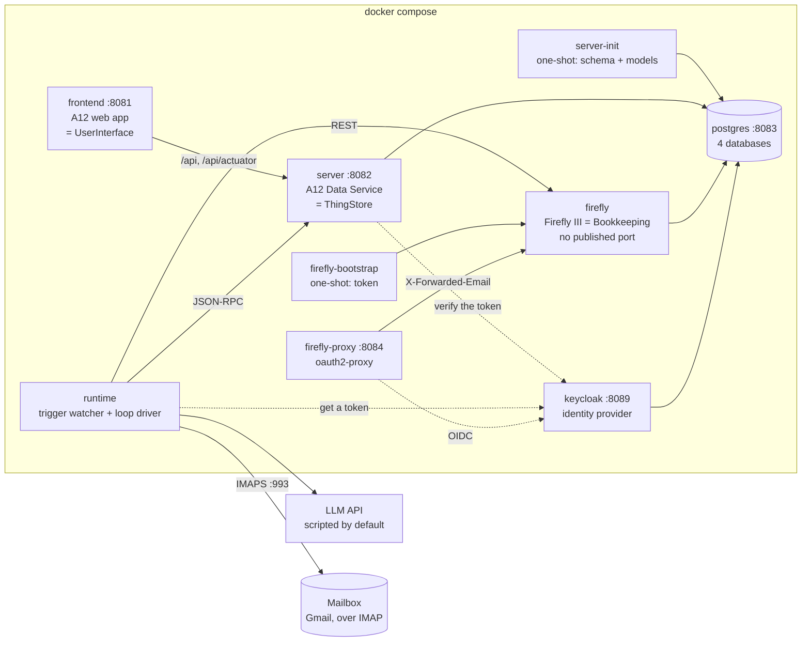
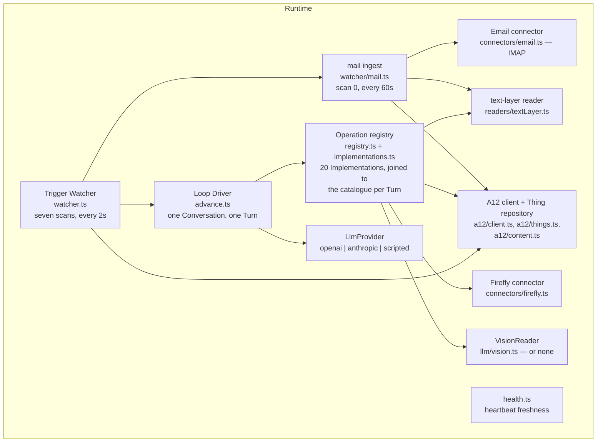
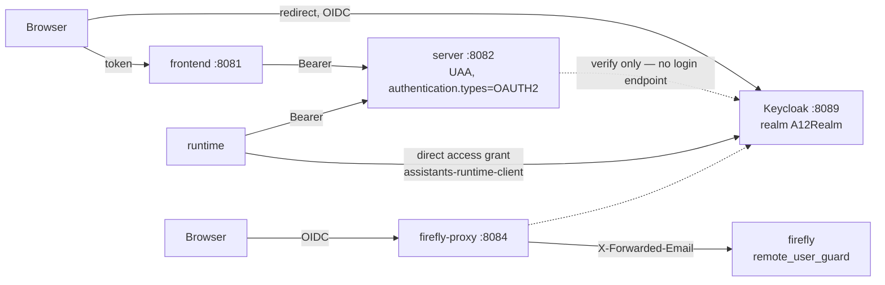

# Architecture — how the system is built

The domain this realises is in [domain.md](domain.md); the vocabulary is in
[CONTEXT.md](../../CONTEXT.md). [README.md](../../README.md) is the operator's view — how to run
it, and what every `just` recipe does — and is not repeated here. The architecture decisions with
their alternatives and reversal costs are in [docs/adr/](../../docs/adr/), and the running record
of decisions taken while building is [DECISIONS.md](../../DECISIONS.md).

## Overview

One `docker compose` file: seven long-running services and two one-shot init containers. No second
database engine, no message broker, no workflow engine, no queue.



The architectural style is not microservices and not a monolith. It is **one shared store with two
independent clients**. The ThingStore is the only Authority for pending work: the UserInterface
writes to it, the Runtime polls it, and neither knows the other exists. There is one
service-to-service call in the product code, and it goes the other way — the server forwarding a
client's read to the Runtime, which is the only component that can reach an External System
(ADR-0023). Nothing about pending work travels on it.

Every host port is published on `127.0.0.1` only.

### Why the Runtime is a separate service

The A12 Data Service is a platform component we *configure*, not an application we own — its jar
comes from the registry and the project adds only a handful of Java classes. Putting a
long-running agentic loop, an LLM client and an HTTP connector inside it would fuse the
application's lifecycle to the platform's and make every Runtime change a Spring Boot rebuild.

Keeping it outside also keeps the ADR-0006 boundary honest: the Runtime is a *client* of the
ThingStore with no privileged access, exactly like the UserInterface.

### Why the Runtime polls (ADR-0011)

The Runtime receives no webhooks and is told nothing about pending work. It asks the store every
two seconds what has materialised, what has been answered and what is due to wake.

The ThingStore is the Authority for Conversations and Open Questions, so "is there anything to
do?" is a question about the store and nothing else is entitled to answer it. An API on the
Runtime would be a second place to ask, and it would hold in memory — a pending request, a
subscription, a callback — exactly the live state ADR-0004 exists to remove. The cost is a handful
of indexed queries every two seconds and a latency of one scan interval. At one household's volume
that is free; at another scale the interval is the first thing that would have to give.

### The one inbound surface (ADR-0023)

The Runtime does have an inbox, and it carries no pending work. `runtime/src/inbound/` is a
`node:http` listener on the compose network, published to no host port, which accepts one thing:
*execute this named Operation and return its result*. It exists because the Runtime is the **door
outward** — every Connector and every foreign credential lives there — and the Dashboard's
bookkeeping Tiles need a fact whose Authority is Firefly rather than the store.

**Five checks, `and`ed**: the Operation is on a deployment allowlist, its Implementation declares
`clientReadable`, its Implementation is `mutating: false`, its Implementation's seed does not require
an approval, and its Operation Thing is not switched off. The first four are `inbound/gate.ts`, which
is pure — no I/O, no HTTP, no store — so it is tested alone before any transport exists; the fifth is
`inbound/server.ts`, because it is the one field the Thing is genuinely the Authority for and reading
it needs the store. The approval check is belt-and-braces with `mutating` and the only place the door
can see that an Operation *shipped* wanting one, since `requiresApproval` is not on
`OperationImplementation` and the door does not resolve against the catalogue.

The server checks **its own allowlist and nothing else** before it forwards. That is the whole of the
outer gate, and the arrangement is deliberate: `Enabled` was moved out of the server and into the
Runtime, so the server narrows *which names* reach this door and the process that would do the
executing decides everything else. `Mutating` is deliberately *not* read from the Thing — an editable
flag may not carry a safety decision, which is the same refusal `registry.ts` already makes for crash
recovery.

Two directions in the `Enabled` read are uncomfortable and both are the right way round. **A store
failure counts as not enabled**: this is a check that grants access, so *"I could not find out"* must
not mean *"go ahead"*, and the cost — an unreachable store greys two Tiles — is honest anyway. And
**two Things carrying one key is a catalogue the door refuses**: the search asks for two precisely so
it can notice the second one, where reading `[0]` would have opened or shut the door according to
whichever row the store happened to list first, which is nobody's decision.

Nothing on that path stores an answer: no Thing, no cache, no copy in the server. Foreign data is
routed, not copied.

The configuration surface is split across the two processes on purpose, and **the door is shut unless
a port is asked for**: `INBOUND_PORT` defaults to `0`, which is no listener at all, and compose sets
`8090` through `RUNTIME_INBOUND_PORT`. `INBOUND_SECRET` becomes *required* the moment a port is set —
the Runtime refuses to start with the door open and no secret — and the Runtime's own allowlist sits
beside them. On the server the matching three are `assistants.runtime.url`,
`assistants.runtime.shared-secret` and `assistants.runtime.allowed-operations`, which ships with
exactly `bookkeeping.listAccounts,bookkeeping.listTransactions` (overridable from `.env` as
`CLIENT_CALLABLE_OPERATIONS`), plus `EXTERNAL_OPERATIONS` in
`mgmtp.a12.dataservices.jsonRpc.allowedOperations` — without which A12's own JSON-RPC layer never
dispatches `EXTERNAL_CALL` in the first place. The server's timeout is 10 s, clamped to 1–30 s,
because a ten-minute timeout is not a timeout. **No host port is published**: `runtime` has no
`ports:` and gains none, and container-to-container traffic on the compose network needs neither
`ports` nor `expose`.

The refusals are deliberately opaque. Every Runtime refusal answers one indistinguishable
`not-allowed` — unknown, disallowed, mutating, approval-guarded and switched off are one outward
answer — and the server collapses any non-2xx into `not-available`. A browser probing the route
therefore learns nothing about which Operations exist, which is what keeps the catalogue from being
enumerable by a caller who was never entitled to read it.

## Technology stack

| Layer | Choice | Role |
|---|---|---|
| Platform | **A12** 2026.06, local-auth project template | Models, Data Service, form/overview engines, the web application |
| ThingStore | A12 Data Service (Spring Boot, Java 21) | Stores every Thing; JSON-RPC at `/api/v2/rpc` |
| UserInterface | A12 web application (React, TypeScript) | Generated from the models, plus the lifted markdown editor |
| Runtime | **TypeScript on Node 24** | Trigger watcher and loop driver |
| Database | **PostgreSQL**, one container, four databases | `assistants-ds`, `assistants-cs`, `assistants-firefly`, `assistants-keycloak` |
| Identity | **Keycloak 26**, realm `A12Realm` | The only thing in the system that checks a password |
| Bookkeeping | **Firefly III 6.6.6** | The books; the Authority for accounts, transactions, balances, budgets |
| Firefly access | **oauth2-proxy** | Firefly has no OIDC client; the proxy runs the flow and forwards a header |
| Editor | **Lexical** | The markdown editor, lifted from `w12-on-a12` |
| Build | **Gradle 9.5** / **npm** / **just** | `just` is the single command surface |
| Tests | **vitest**, **Playwright** | Four tiers plus an opt-in live-LLM tier |

The Runtime is TypeScript because the LLM SDKs are first-class there, the repository already
carries a Node toolchain for the A12 client, and the loop is I/O-bound orchestration rather than
computation.

A12 artefacts resolve from the **public** community registries pinned in `.npmrc` and
`settings.gradle`, so the build needs no VPN and no credentials (D-006).

#### The Runtime's dependencies, and the fact that there are any

The Runtime has been proud of the standard library — its inbound route is `node:http` on purpose —
and the letterbox is where that stopped being reasonable.

| Package | For | Why not by hand |
|---|---|---|
| `imapflow` | the IMAP client | a stateful, tagged protocol with per-server quirks, literals, and four ways to spell a date |
| `mailparser` | MIME | RFC 2045–2049, encoded words, and every non-conformant sender in the world |
| `pdfjs-dist` | the PDF text layer | pure JavaScript, so no `poppler` binary, no canvas and no native build in the image |

The first two are used **only** inside `connectors/email.ts` and the third only inside
`readers/textLayer.ts`, so replacing any of them is one file. That containment is the mitigation; the
supply-chain surface is real and is named rather than pretended away. One transitive consequence is
pinned rather than inherited: `package.json` carries an `overrides` entry forcing `deepmerge-ts` to a
version without a published security advisory, which is the honest cost of a dependency tree that is
no longer empty.

## Repository layout

The A12 project template's shape is kept at the repository root — deviating from it would fight
every Gradle task the template provides.

```
/
├── justfile                  the command surface; every recipe documented in README.md
├── client/                   the A12 web application = UserInterface
│   └── src/components/markdown-editor/   lifted from w12-on-a12
├── server/                   the A12 Data Service = ThingStore (app/ and init/)
├── runtime/                  the Runtime (TypeScript)
│   ├── src/a12/              JSON-RPC client + typed Thing repository
│   ├── src/llm/              provider interface + openai / anthropic / scripted
│   ├── src/loop/             advance() — one Conversation, one Turn
│   ├── src/watcher/          the seven scans, and the letterbox (scan 0)
│   ├── src/readers/          the PDF text layer
│   ├── src/inbound/          the one read route the Runtime answers
│   ├── src/operations/       the registry and the twenty Implementations
│   ├── src/connectors/       firefly, email
│   ├── src/bootstrap/        seeds the two Assistants, the catalogue and the RuntimeState singleton
│   ├── src/demo/             the demo household loader
│   └── fixtures/             the scripted LLM transcript
├── import/
│   ├── models/               the nine Things (DM/FM/OM) + the application model + CONVENTIONS.md
│   ├── auth/                 roles.yaml — realm role → A12 access rights
│   └── validate-models.mjs   the model validator
├── compose/                  docker-compose.yml, firefly/, postgres/, keycloak/
├── e2e/                      Playwright
├── scripts/                  setup-env.mjs, check-docs.mjs
└── specs/, docs/adr/, CONTEXT.md, DECISIONS.md, README.md
```

## Components

### ThingStore (`server/`, `import/models/`)

An A12 Data Service holding every Thing and exposing A12's JSON-RPC interface. Nine Models, each
with a document model (`_DM`), a form model (`_FM`) and an overview model (`_OM`), plus one
application model (`_AM`) for navigation and one query model (`OpenQuestionPending_QeM`).

Form models bind **directly** to their document model (`purpose: "data binding"`) — there is no
composed-document layer, because references between Things are plain ThingID strings.

#### Four modelling rules the query API forces

The A12 query API is narrower than it looks, and the watcher's scans are the system's hot path.
These are applied at model-design time rather than discovered later; the full cookbook is
[`import/models/CONVENTIONS.md`](../../import/models/CONVENTIONS.md).

1. **Every machine-filtered field is a `String` carrying a code, never an `Enum`** — A12 indexes
   enumerations by localised display text.
2. **Never filter on a path inside a repeating group.** Anything the watcher needs is a top-level
   scalar; the Assistants are loaded whole and their `triggers[]` matched in the Runtime.
3. **Every watcher-filtered field carries the `indexed` annotation.** Only indexed fields are
   queryable at all.
4. **Every Model carries its own `createdAt` / `updatedAt` / `idempotencyKey` /
   `createdByConversationId`.** `__meta.createdAt` has second granularity with inclusive range
   bounds, which double-counts the watermark boundary.

The one pattern worth naming, because it is used twice: "set but not yet processed" is
`and(not(undefined_match(x)), undefined_match(y))`.

A consequence worth knowing: `updatedAt` records the last **Runtime** write. A save from the web
application moves only `__meta.modifiedAt`, because the four machine fields are on no form and
A12's form engine offers no save hook that could reach one.

### UserInterface (`client/`)

The A12 web application, generated from the models, with one addition: the **markdown editor
lifted from `w12-on-a12`** (`client/src/components/markdown-editor/`, Lexical-based), with the
collaborative-editing subsystem and the CDD-coupled inline-attachment path dropped.

A field becomes a markdown field by three coordinated facts:

1. `lineBreaksPermitted: true` on the `StringType` in the `_DM`;
2. `"exposition": "AREA"` in the `_FM`'s `fieldConfiguration`;
3. `{"name": "widget", "value": "markdown-editor"}` on the `_FM` Control.

Wiring is a `formModelMap.Control` bridge plus a `widgetMap.TextAreaStateless` entry in
`client/src/appsetup.ts`. This uses native A12 features only, which is what makes an Assistant's
prompts editable in the ordinary UI as ADR-0003 requires. See
[MARKDOWN_FIELDS.md](../research/MARKDOWN_FIELDS.md).

**Constraint**: `lexical` must resolve to a single instance shared with `widgets-core`, or
Lexical's `$`-functions break. Verified in the build with `npm ls lexical`. The same holds for
`recharts`, which the Dashboard's createdOn curve draws with directly — widgets-core's own `LineChart`
is deprecated as of 38.1.1 with the note *"Use Recharts directly instead"* — so `client/package.json`
declares it at the `^2.15.4` widgets-core asks for and `npm ls recharts` must report one copy.

The transcript is the second piece, and the Dashboard the third. `Conversation.entries[]` renders as a
message thread rather than as an inline repeat, and the Dashboard places four model-less views in a
platform layout; between them they need six client seams the markdown editor did not — all six of
them platform seams, nothing forked and no engine replaced:

| Seam | What it is | Where |
|---|---|---|
| **A custom screen element** | `formModelMap.CustomScreenElement`, dispatched on a `widget` annotation exactly as the markdown Control is. The form engine hands the component `config.renderOptions.state.data.document`, so the Transcript needs no data flow of its own for the document its form is already on. An optional `exposes: <groupId>` annotation is the ADR-0008 coverage claim that replaces the repeat, and `import/validate-models.mjs` both honours it and errors when it names a group the bound Document Model does not have | `client/src/components/CustomScreenElements.tsx` |
| **A read by id** | `useThingById(model, thingId)` — one document, read through `dataservices-access`, no write, no activity, no dirty state, no polling. It fails soft: no id, a deleted Thing or a failed request renders a message line, never a broken form | `client/src/components/conversation/useThingById.ts` |
| **Cross-module navigation** | `openForeignForm` — cancel every top-level activity and honour the veto, push a master activity for `masterModule`, then push the detail with `initiatingActivityId`. A saga rather than a click handler, because the teardown is an asynchronous handshake whose answer may be *no*. The teardown is not optional: an activity leaves the map only on cancel, commit or `resetState`, and a leaked one breaks the master-detail layout and vetoes module removal at logout. `openModule` is the same recipe without the detail push, and it **owns** the shared teardown that both sagas use | `client/src/sagas/openModule.ts`, `client/src/sagas/openForeignForm.ts` |
| **A region layout, chosen by name** | The Dashboard's scene clears `CONTENT` to `layout: { name: "Dashboard", settings: { rows: […] } }`. `DefaultLayoutProvider` resolves that name with **no registration** — it is a built-in beside `MasterDetail`, `Stack` and `Null` — and fills each leaf column with `views[i++]`, each inside its own error boundary. **Slot pairing is positional**: the order of the `VIEW_ADD` directives *is* the layout, so `dashboardViewMap.tsx` lists the six Tiles in exactly the order the directives declare them — positional **across rows as well as within one**, which is what the second row made worth stating. The Tiles are views with **no model at all** (`Directive.Add.models` is optional), so each is a plain React component that fetches its own numbers | `import/models/AssistantsAppModel_AM.json`, `client/src/components/dashboard/dashboardViewMap.tsx` |
| **A count by query** | `useThingCounts(queries)` — N `QUERY` requests in **one** `Dispatcher.rpc` call, of which the only field read is `fullSize`; `entries` is discarded, so no count can become a second copy of a Thing (ADR-0022). Read-only, fails soft, never polls. `paging.pageSize: 0` is rejected by the store, so it asks for 1 and throws the document away. `useAssistants` is its sibling and the one hook that touches a document body — three fields lifted per Assistant, the rest discarded | `client/src/components/dashboard/useThingCounts.ts`, `useAssistants.ts` |
| **A call outside the store** | `useExternalCall(operation, args)` — one read of a fact whose Authority is Firefly, run through the Runtime's door and forgotten. It carries `useThingCounts`' four invariants and a fifth: **not the Authority** — no arithmetic on what comes back except `money.ts`' per-currency total, computed for display and discarded with the component. The platform constraint is recorded nowhere else: `Dispatcher.rpc` is typed to A12's built-in requests and its own `.d.ts` warns that anything else *"will lead to compile and runtime errors"* — the dispatcher looks the method up in a table of response type guards and `EXTERNAL_CALL` is not in it — so this uses the untyped escape hatch, `JsonRpc2Request.build()` over the configured `ServerConnector`, exactly as mgm's own Workflows client does. Authentication, the base URL and the headers still come from the connector; only the typing of this one method is ours. It has a deadline of its own (15 s), because *fails soft* is only true if every failure arrives — a `fetch` that never settles throws nothing and rejects nothing | `client/src/components/dashboard/useExternalCall.ts`, `money.ts` |

The first three need the same composition, and it is worth stating once because no Thing carries it: an
activity descriptor's `instance`, and a document read, both want a **docRef** — `<Model>/<ThingID>` —
while `Conversation.currentQuestionId`, `Conversation.subjectThingId` and `OpenQuestion.conversationId`
all hold **bare ThingIDs**. [ADR-0002](../../docs/adr/0002-thingid-identifies-only.md) is why: a
ThingID identifies and nothing more. So the composition is always the caller's, never the field's, and
a bare id passed where a docRef belongs returns zero rows rather than an error. A descriptor also needs
`model` — the Document Model id — or no data provider claims the load.

**Reads may cross documents; writes may not.** The Conversation form reads the pending question, the
question's form reads its Conversation, and neither writes the other. An answer is written by the form
engine through `OpenQuestion_FM` and by nothing else — a second writer for one act is exactly what
[ADR-0006](../../docs/adr/0006-one-authority-per-fact.md) exists to prevent, and it is why answering
stayed on the question's own form rather than moving into the Transcript
([ADR-0021](../../docs/adr/0021-a-question-is-answered-in-its-conversation.md)).

There is no custom client code beyond these three pieces. The User answers an Open Question by opening it in
the ordinary A12 instance form and saving it (D-005) — reached now through its Conversation rather
than from a menu, or through the Dashboard's conversations Tile, which counts the ones waiting.

**Secondary text is `mutedText`, never `theme.colors.text.secondaryColor`.** That token is
`rgb(226, 230, 233)` in this theme — a divider colour wearing a text colour's name — and against a
Tile's white surface it measures about **1.25:1**, where WCAG AA asks 4.5:1 for body text. It is a
trap rather than a mistake: five Tiles reached for it independently, on the strength of its name, and
all five were wrong; the Transactions Tile's dates and account routes and every Tile's `as of 14:32`
footer were very nearly invisible. The house rule is `mutedText` in
`client/src/components/dashboard/DashboardTile.tsx` — the full-strength text colour at
`opacity: 0.72`, which over white lands near `#6c6c6c` and about **5.3:1**. Opacity rather than a
second hard-coded grey, deliberately: it blends toward whatever is actually behind the text, so the
rule survives a dark theme without a second definition that has to be kept in step. The Dashboard
was converted; **the transcript components were not**, and they still use `secondaryColor` as a text
colour in nine places across five files — `TranscriptHeader.tsx:92` and `:99`,
`PendingQuestion.tsx:72`, `Receipt.tsx:50` and `:61`, `Bubble.tsx:61` and `:92`,
`QuestionContext.tsx:33` and `ConversationTranscript.tsx:49`. That is an open defect, recorded here
rather than left to be rediscovered by the next person who wonders why a Receipt's label is hard to
read.

**Newer client components carry English literals rather than localisation keys, and that is
deliberate.** The application's localisation is slated for removal wholesale — the `locales` and the
per-element `label` arrays across the nine `_DM`/`_FM`/`_OM` models, `client/src/localization`
entire, `supportedLocales`, `getDateTimeResource`, the language switcher in the application header,
and `e2e/tests/base/5-localization.spec.ts`, which exists for nothing else — so registering German
keys for the Transcript and the Dashboard now would be work done in order to be undone. Dates and
numbers are formatted by `date-fns` and `Intl` from the browser locale, which is not localisation of
the application's own strings and is unaffected either way. Without this stated, a reader finds
untranslated English sitting beside fully bilingual models and no reason given.

**If a Thing is ever reached outside the web application — a messenger, a push notification, mail —
it hooks `raiseQuestion` and nothing else.** Every Open Question in the system passes through that
one function: `ui.askUser`, every Manual Connector, every escalation, and every approval refusal.
`ui.askUser` looks like the natural hook and is the wrong one — it misses all of those but the first,
which is to say it misses precisely the questions worth pushing to a phone. Such a notification must
also be **non-fatal**, because [ADR-0015](../../docs/adr/0015-nothing-ends-silently.md)'s rule that
the escalation path must not share fate with the failures it reports cuts both ways: a dead channel
must never fail a Conversation. Nothing does this today, and the decision is recorded here rather
than in the change that declined to build it.

### Runtime (`runtime/`)

Two halves, roughly 12,000 lines of TypeScript across 31 files.



#### The loop driver

One function with no state of its own. Everything it needs it reads from the Conversation;
everything it learns it writes back before returning.

```
advance(conversationId):
    conv = thingStore.get(conversationId)
    if conv.status not in (running, waiting) or not claimLease(conv): return
    if conv.turnCount >= assistant.maxTurns: raiseTerminal(conv, 'limit'); return
    catalogue = thingStore.search(Operation_DM)   # ← ONE SNAPSHOT, ONCE PER TURN
    if catalogue is empty: throw                  # bootstrap has not run; the Turn is not spent
    context = buildContext(conv)              # system prompt + skills + entries
    response = llm.complete(context, registry.schemasFor(assistant, catalogue))
    append(conv, response); conv.turnCount++
    if response.finishReason != 'wants-tools':
        finish(conv)                          # done, or deliver the result to the parent
        write(conv); return
    for call in response.toolCalls:
        key = conv.id + ':' + nextSeq(conv)
        append(conv, intent(call, key))
        write(conv)                           # ← INTENT IS WRITTEN BEFORE EXECUTION
        hash    = canonicalArgsHash(call.args) if call.operation.requiresApproval else none
        refusal = gateOnApproval(conv, call, hash) if hash else none
        result  = refusal or operations.execute(call, conv, key)   # ← APPROVED BEFORE IT RUNS
        if result.pending:
            conv.status = 'waiting'; conv.waitingFor = result.waitingFor
            conv.wakeAt = result.wakeAt
            write(conv); return               # the process now holds nothing
        entry = append(conv, toolResult(call, result))
        if hash and not refusal and result.kind == 'value':
            entry.argsHash = hash             # the approval is spent by a call that RAN
    write(conv)
```

Five properties are load-bearing:

1. **One call, one Turn.** `advance` never loops internally. Continuing is re-entry through the
   same door birth uses.
2. **The pending path is the normal path.** Every Operation may answer `pending`. That single
   generalisation is what turns a coding-agent loop into this one. Coding agents assume tools
   return in seconds and block inside the Turn; here the Operations are human-paced by design.
3. **The Conversation is an intent log, not a result log** (ADR-0012). The intent, including its
   idempotency key, is written *before* the Operation runs.
4. **The approval gate sits between the two.** Its position is not incidental: after the intent, so
   a refusal is visible in the transcript rather than inferred from an absence; before execution, so
   there is nothing to undo. See below.
5. **One catalogue per Turn.** The Operations the model is offered and the Operations it is then
   allowed to run are resolved from the *same* snapshot, read once at the top of `advance()`, so a
   User editing the catalogue mid-Turn cannot produce a Turn whose schemas and executions disagree.
   An empty catalogue is refused rather than defaulted to the Implementations' seeds — a fallback
   would be a second answer to *"what can this Assistant do"*, in the one place where the wrong
   answer costs money — and refusing before the provider is called means the Turn is not spent, the
   lease lapses, and the next scan retries.

Where a Turn's cost is recorded is a consequence of this shape. A Turn that ends `wants-tools`
appends no `assistant` Entry at all — only one `tool-intent` per call — so "the Turn's assistant
Entry" names a row that does not exist for most Turns. The rule is therefore **the first Entry the
Turn wrote**: the `assistant` entry for a text reply, the first `tool-intent` otherwise.

#### Approvals (ADR-0018)

An Operation may declare `requiresApproval`, and the Runtime refuses to run it without an answered
confirmation that **the Runtime itself** raised, for that Operation, with those exact arguments, in
that Conversation. `bookkeeping.postTransaction` is the only Operation seeded with it today, and
since the catalogue moved into the store the flag is read from the Operation **Thing** — the
Implementation's value is what the Thing was created with and nothing more, so the User may add a
requirement where the code demands none and remove one it does demand. A weakening is logged once
per Operation per process, named, and not overridden (ADR-0019, and the amendment on ADR-0018). The
domain rules are in [domain.md](domain.md); what belongs here is the mechanism, which is three small
additions and one walk-back.

The arguments arrive as the model produced them, so neither key order nor number formatting is
stable. `canonicalArgsHash` hashes a canonical form — keys sorted, numbers normalised — and that
hash is what the approval is bound to. Nothing forces the model to re-issue *identical* arguments
after the yes, so a drifted call misses its approval and the User is asked again: visible and safe,
never a wrong booking.

Recognising an approval in the transcript needs something machine-readable, because **the prose is
never parsed** — substring-matching a model-facing string is a failure mode
[the comparison document](../research/ASSISTANTS_VS_OPENCLAW.md) names as one never to start. So
`Entry` gains `questionId`, set by scan 2 on every `answer` entry it appends and read only by
approvals, and a `kind: "approval-request"` Entry carries `toolName`, `argsHash` and `questionId`.
That entry deliberately carries **no `text`**: `buildMessages` maps an unknown kind with a `text` to
a *user* message, which between a tool call and its result is a shape Anthropic rejects outright.
It is machine-readable only, and the model learns of the refusal from the pending tool-result.

`findApproval` then walks back over those two kinds and reads one Open Question by id:

```
find the last approval-request for (toolName, argsHash)
  → no such request                                          → refuse, and raise one
  → its answer entry is absent                               → refuse, still waiting
  → its question is not confirmed: true                      → decline, terminal
  → a tool-result carrying this argsHash follows the answer   → refuse, consumed — raise a fresh one
  → otherwise                                                → execute
```

Three details in that predicate are each a bug that was either avoided or found and fixed:

- **Spent means executed, not attempted.** The `argsHash` is stamped onto the *tool-result* too, and
  only where the Operation ran and returned a value — including on the reconciliation path, so a
  booking that turns out to have landed still spends its approval and two identical bookings still
  need two approvals (ADR-0012). Keying consumption on "a tool-result for this Operation" instead
  would let a Firefly 422, after which nothing was booked, consume the approval — and the retry that
  `postTransaction`'s own description invites would ask the User a second time for a booking that
  never happened.
- **Anything short of an explicit `true` is a no.** `isAnswered` is deliberately generous, so a User
  who types a sentence and leaves the tri-state Boolean unset has *answered* and the Conversation
  resumes. Treating that as "still waiting" would loop until `maxTurns`; treating it as a fresh
  refusal would re-ask, which the domain rules forbid. The model is told which it was, so a User who
  meant yes and forgot the tick can see why nothing happened.
- **The refusal uses `raiseQuestion`, never `escalate()`.** A missing approval is the ordinary path,
  not a stuck Conversation; going through `escalate()` would increment `escalationCount` and three
  unapproved bookings would mark the Conversation `failed`. It returns `pending` waiting on the User
  with **no `wakeAt`** — an unanswered approval waits, it does not lapse into a booking — and the
  note tells the model *refused pending approval, not queued*, because the generic suspension
  wording would tell it the booking is on its way.

The question's idempotency key is `approval:<conversationId>:<argsHash[0:16]>:<attempt>` rather than
the entry's sequence number: the question is created *before* the `approval-request` Entry recording
it, so a crash in between leaves an orphan, and a sequence-derived key would mint a second question
on the retry while the first sat unanswered forever. Derived from the arguments, the retry computes
the same key and `create` adopts the orphan.

How the question reads is `describeCall` on the Operation, because this question is the entire
user-facing surface of *"nothing is booked without an answer"*. The Runtime adds the **Approval
needed.** framing; an Operation without a renderer falls back to a fenced JSON block, which exists so
the check never blocks on a missing renderer and is not the intended experience — a JSON blob in the
inbox is how a safety feature becomes a thing the User clicks yes on without reading.

#### The trigger watcher

A scan every two seconds. It does nothing at all while `RuntimeState.paused` is true, and nothing at
all while the catalogue is empty: before its first scan the watcher reads `Operation_DM`, and an
empty or unreadable catalogue is logged at error with its remedy (`just bootstrap`), reported as
unhealthy, and re-checked on every scan — so a stack brought up before it is bootstrapped says what
is missing, heals when it arrives, and logs the transition rather than quietly starting to work.

| # | Scan | Action |
|---|---|---|
| **0** | **The Mailbox**, over IMAP — the one scan that does not look in the store, and the one with a clock of its own (`MAIL_POLL_INTERVAL_MS`, default 60 s) | create Documents from what has arrived |
| 1 | Trigger-eligible Things created after the watermark with no Conversation on `(assistantKey, subjectThingId)` | birth |
| 2 | Conversations `waiting` on `user` whose `currentQuestionId` resolves to an answered `OpenQuestion` | append the answer, continue |
| 3 | Conversations `waiting` with `wakeAt` in the past | append a timeout entry, continue |
| 4 | Conversations `running` with `leaseUntil` in the past | recover per the intent log, continue |
| 5 | Conversations `done` with a `parentConversationId` and no `resultDeliveredAt` | deliver to the parent, stamp, continue |
| 6 | Conversations `running` that simply owe their next Turn | continue |
| 7 | Enabled Assistants whose `schedule` Trigger's latest due instant has no Conversation on `(assistantKey, scheduledFor)` | birth |

Scan 1's exactly-once guarantee is two indexed `exact_match`es on `(assistantKey,
subjectThingId)`. It subsumes — but does not replace — the rule that nothing is birthed from a
Thing whose creating Conversation is still running.

Scan 2 is where the single-writer invariant could have been lost. The obvious mechanism —
stamping `consumedAt` on the `OpenQuestion` — would give that document a second Runtime write
while the User may still be editing it. So consumption happens on the **Conversation**, which the
Runtime owns exclusively: continuing clears `waitingFor`, and the Conversation therefore stops
matching the scan. This also disposes of the User re-editing an answered question, of a late child
result, and of an answer whose `seq` is behind the Conversation's position — three cases, one
shape: append it as an entry and change nothing.

**Scan 7 is the only scan whose input is configuration rather than the store** ([ADR-0016](../../docs/adr/0016-a-schedule-fires-on-its-due-instant.md)).
It reads `cron` off each enabled Assistant's `schedule` Triggers, resolves the **latest** due instant
in `SCHEDULE_TIMEZONE`, and births a Conversation carrying it as `scheduledFor` unless one already
exists. Only ever evaluating the latest instant is what makes three properties fall out of the
mechanism rather than out of code here: exactly-once across a re-scan, a restart and a replayed
watermark; catch-up **once** rather than once per missed slot; and no watermark at all — a mark
written *after* the work is what ADR-0012 exists to avoid, and a schedule that chased an insurer
would chase them twice.

A slot is **skipped entirely while an earlier one for the same Assistant is unfinished**, so a
Schedule stalls rather than accumulates. That is also why nothing here disables an Assistant: there
is no runaway to bound, and a stall already has the unanswered Open Question that caused it sitting
in the User's inbox. Repeated skipping is a log warning, the way a pinned watermark is.

Daylight saving is the only genuinely hard part, and it is `latestDueInstantBefore` in
`runtime/src/watcher/schedule.ts` that owns it: `cron-parser` does the arithmetic, and the wrapper
decides that the autumn wall-clock slot which happens twice is **one** slot (collapsed onto its first
occurrence, so the second recomputes to a `scheduledFor` already served) while the spring slot that
does not exist simply never appears. An unparseable `cron` is a configuration error on a Thing the
User owns: it is logged once per Assistant per process and the Trigger is skipped.

**Stable-first, volatile-last.** `scheduledFor` is the first time-varying value in this system to
reach a prompt, and the rule that was true by accident is now written down: the standing half of a
prompt comes first, anything that changes per Conversation comes last. Free, and only free before
something breaks it.

#### The letterbox (scan 0, ADR-0024)

`watcher/mail.ts` polls the Receptionist's own Gmail account over IMAP through
`connectors/email.ts`, which is the only file that knows what IMAP is — the same split the Firefly
connector uses, and for the same reason: the half that talks to a foreign system is testable against
a fixture, and the half that decides what to store is testable without a network. It rides in the
watcher's own loop rather than in a timer of its own, because the loop is single-threaded and
already carries ADR-0014's guarantee that exactly one replica is doing anything, and it already has
an answer to *"what happens when the process is asked to stop?"* It checks the clock and returns
immediately when it is not due: `SCAN_INTERVAL_MS` is seconds, and an IMAP login per second is
abusive to a mail provider. Everything it does is wrapped in a catch, because a mailbox that is
unreachable or refusing the password must not take scans 1–7 with it — those are the ones that keep
running Conversations moving. There is no backoff state and no circuit breaker; the next poll is a
minute away, which *is* the backoff.

Four Gmail labels, which IMAP sees as folders, hold the whole state machine: `assistants` — the only
folder ever read — and `assistants/processed`, `assistants/failed` and `assistants/rejected`. Nothing is
deleted and nothing is marked read. A read flag would have only two states, and a message that was
fetched, allowed and then failed needs a third: it must not stay unread, because unread means *retry
every minute for ever*, and it must not be marked done, because nothing was created. Rejected mail
leaves the incoming folder too — a poll takes at most `MAIL_MAX_PER_POLL` messages, so junk on a
public address would otherwise fill every poll and starve a real invoice behind it — and it goes to
its own folder, because *"not for us"* and *"we broke"* are different facts.

Two invariants carry the correctness:

- **Create every Document, then move the message.** A crash between the two re-reads the message on
  the next poll, finds each `ExternalRef` already present, creates nothing and moves. A crash the
  other way round loses the User's invoice silently.
- **The duplicate check is a query against the ThingStore** on `Document.ExternalRef`
  (`<message-id>#<part>`), never a local record of what has been read. The store is the Authority for
  Documents (ADR-0006), and a second store of "mail I have seen" is a second thing that can disagree
  with it.

A sender allowlist gates the ingest and **empty means nobody** — a list that grants access must never
fail open — and the startup log prints the count rather than the senders, so a misconfigured `0` is
visible rather than inferred. One Document is created per attachment, because the attachment group is
`repeatability: 1` and two invoices in one mail are two invoices; each carries the same message body
as `extractedText`, and a mail with no attachments becomes one body-only Document. `Source` is set to
`email`, which is the first non-`manual` value the system produces.

What a message *becomes* is the Connector's own set of rules, and they are small enough to state
whole. They live in `parseMessage`, which takes bytes and returns an `IncomingMessage` with no
network, no store and no side effects — which is what makes every one of them testable against an
`.eml` fixture.

- **The body is `text/plain` where the sender provided it, otherwise the `text/html` stripped to
  text.** `extractedText` is prose an LLM pays tokens to read, and markup is noise it pays for while
  nothing downstream renders it. The stripper is deliberately not a renderer: what matters is that the
  words survive, that block boundaries become line breaks rather than running two sentences together,
  and that no `script` or `style` content reaches the model.
- **A part becomes an attachment only if it has a filename or an explicit
  `Content-Disposition: attachment`**, so an inline signature image is not mistaken for an invoice.
- **`Title` is the subject** — or the filename when the subject is empty, or `(no subject)` when
  neither exists. As soon as one message becomes several Documents the filename joins the subject,
  because three Documents sharing one title are indistinguishable in an overview however different
  their contents are. Only the *title* ever collided; the `ExternalRef`s never did.
- **`receivedAt` is the `Date` header, falling back to the server's INTERNALDATE**, because a missing
  or unparseable `Date` happens and dropping the mail over it would be absurd.
- **A message with no `Message-ID` gets one synthesised**, since the alternative is dropping the mail.
  It is not merely `<uid>@<host>`: an IMAP UID is unique within one `(mailbox, UIDVALIDITY)`
  generation and nowhere else, so the ref carries the folder and the `UIDVALIDITY` too —
  `<uid.N.vV.folder@host>`. Delete and recreate the `assistants` label and the server starts handing
  out UID 1 again; without the generation in the ref, the next `Message-ID`-less message computes an
  `ExternalRef` an older message already holds, and the ingest, doing exactly what it is meant to do,
  files a brand-new invoice away as a duplicate. Everything the value derives from is constant for a
  given message across polls — never a clock, never a counter — because a ref that *changes* between
  polls defeats idempotency just as thoroughly as one that collides.
- **A part over `MAIL_MAX_ATTACHMENT_BYTES` (25 MB) is skipped loudly**: it is named, with its size, in
  the body text of the Document that is created anyway. A silently missing attachment is the one
  failure the User cannot see.

That `email.receive`'s `reconcile` is answerable at all, and cheap, is a consequence of `ExternalRef`
being a **real key** rather than an opaque hash: reconciliation is one query — *has a Document with
this `ExternalRef` landed?* — against the store that is already the Authority. That is the whole of
why the field earns its place.

`email.receive` is registered as a Connector Implementation on the `Email` System so the User can
read it, describe it and switch it off like any other Operation (ADR-0019) — the ingest reads
`Enabled` off the Thing each poll, so switching it off stops the letterbox without a restart. It is
`mutating`, therefore never `clientReadable` and never reachable through the inbound route, and it is
granted to **no Assistant**: the ingest calls the Implementation directly, the way the scan loop calls
everything else it needs, and an Assistant granted it could pull the household's post into a
Conversation on a whim.

#### Reading an attachment

Two Implementations and one narrow port. `document.extractText` (`readers/textLayer.ts`, over
`pdfjs-dist`) pulls a PDF's existing text layer; the mail ingest calls that function **directly** on
arrival, between uploading the binary and creating the Document, so the Document materialises already
classifiable and no Turn is spent discovering that it was not. Calling it through the registry instead
would mean constructing an `OperationContext` with a fabricated conversation id inside an idempotency
key — the same refusal `inbound/server.ts` already makes. The reader never discards what it extracts:
below `SPARSE_TEXT_CHARS` (100) it returns the text *and* flags it `sparse`, because a scanner
watermark and a one-line payment reminder are the same length and no threshold can tell them apart —
the Receptionist reads the characters and decides, which is where this system keeps judgement.

It shipped as a hard gate first — under the threshold the reader returned `no-text-layer` and **threw
the text away** — and that was wrong in a way worth recording, because the number looked defensible.
It had been calibrated against exactly two fixtures: a 21-character scanner watermark and a
576-character born-digital utility invoice, with a multi-page statement measuring 535. Those straddle
100 and they are not a population. Against ordinary born-digital post the gate misfires constantly: a
short dentist's invoice extracts to **84** characters, a one-line payment reminder to **44**, a
parking receipt to **49**. All three are free, exact and complete; all three were reported as scans;
and the seed description then sent each of them to `document.readScan`, so the household paid a model
that can invent an amount to recover a number the file had already stated exactly. On the arrival path
the same documents became Documents with an empty `extractedText` whenever the forward carried no
covering note. Both directions are harmful and one boolean can only express one of them, which is why
the reader now returns the text *and* the flag. **`SPARSE_TEXT_CHARS` is a label, not a gate**:
nothing is withheld on the strength of it, so being slightly wrong about it costs a hint rather than a
document — and that is precisely why lowering the number would have been no fix at all. It would only
have moved the misclassification onto shorter post.

`no-text-layer` is reserved for a document with no characters at all, and comes back as a *value*,
not an error: it is the expected outcome on a scan and it is what tells the Receptionist to try the
next rung. An optional `maxPages` bounds decode time for the ingest, which reads inside the scan
loop, and a capped read reports `truncated` so a partial extraction cannot pass for a whole one.

`document.readScan` sends the PDF to the model named by `llm.json`'s `vision` key, through a second,
deliberately tiny port — `llm/vision.ts`, `available` plus `read()` — rather than by widening
`LlmProvider`, whose `content` is a string and whose four implementations would all have to answer a
question the loop never asks. With no `vision` profile the null implementation reports `unavailable`
and the ladder falls through, which is the shipped default. `VISION_MAX_PAGES` and `VISION_MAX_BYTES`
bound what is sent, and going over a cap returns a reason rather than a truncated read: a partial
invoice is worse than none, because it looks complete. The prompt is fixed in code and takes nothing
from the Document — the attachment is untrusted content from outside, and a prompt assembled from it
would be an injection surface pointed at a model about to write a field the Receptionist trusts.
`readScan` returns its `usage` and the Loop Driver folds it into the Turn's, so a Turn's recorded cost
stays the cost of everything that Turn spent.

Three things about that rung are worth having here, because none of them is inferable from the code's
shape:

- **How the PDF travels, and where the caps come from.** It goes as a base64 `document` content block
  on the Anthropic Messages API, with **no beta header**. The API's own limits are 32 MB and 600 pages
  per request — 100 pages on the 200K-context models — so `VISION_MAX_BYTES` is 16 MB to sit under 32
  MB with base64's overhead, and `VISION_MAX_PAGES` is 10 because a household invoice is one to four
  pages and ten is already generous. The page count is taken from the *free* reader, which returns it
  even when it finds no text, so nothing is ever sent uncapped, and a file `pdfjs` cannot open has no
  page count — which is exactly what the cap exists to refuse. Nothing rasterises anything, and that
  is what keeps poppler, a canvas and Tesseract out of the image.
- **It ships with no required approval, deliberately.** An approval per scanned invoice is two
  questions for every piece of post the household forwards. ADR-0018 already lets the User add one on
  the Operation Thing, so shipping with one would pre-empt a decision the ADR says is theirs. The two
  caps and the `Enabled` switch are the bounds instead.
- **Its failure modes, and which rung each falls to.** An encrypted or corrupt PDF returns
  `not-a-pdf`, and the ladder falls through to `document.requestText` — a human. A vision API that is
  down or rate-limited is an `error` outcome, which the loop's existing retry and escalation already
  handle and which needs nothing of its own. And a sparse read that genuinely *was* noise is re-read
  with `replace: true`, since that noise is now the Document's text and there is otherwise nothing to
  overwrite it.

Neither Operation overwrites a non-empty `extractedText` without an explicit `replace`, because one of
that field's writers is a human who transcribed it by hand. And the ingest never calls `readScan`:
**arrival may translate; arrival may not spend.**

#### What both are configured with

`.env`, as everything else in this stack is (D-023):

```
MAIL_HOST='imap.gmail.com'         # empty ⇒ scan 0 never runs; said once at startup
MAIL_PORT='993'                    # implicit TLS; nothing here disables certificate verification
MAIL_SECURE='true'                 # exactly `false` buys plaintext — never TLS-without-verification
MAIL_USER='…@gmail.com'            # the Receptionist's own account, never the User's
MAIL_PASSWORD='…'                  # a Google App Password, which requires 2FA on that account
MAIL_FOLDER_INCOMING='assistants'
MAIL_FOLDER_PROCESSED='assistants/processed'
MAIL_FOLDER_FAILED='assistants/failed'
MAIL_FOLDER_REJECTED='assistants/rejected'
MAIL_ALLOWED_SENDERS=''            # comma-separated. EMPTY MEANS NOBODY
MAIL_POLL_INTERVAL_MS='60000'
MAIL_MAX_PER_POLL='20'
MAIL_MAX_ATTACHMENT_BYTES='26214400'
VISION_MAX_PAGES='10'
VISION_MAX_BYTES='16777216'
```

The four folder names are Gmail *labels*, which appear over IMAP with `/` as the separator exactly as
written; the ingest creates any that do not exist on first poll, because a missing `failed` label at
the moment something fails is the worst possible time to find out. The account is the Receptionist's
own and not the User's precisely because an App Password grants the whole account and cannot be
scoped — that no folder but the incoming one is ever read is a property of the code, not of the
credential.

That TLS comment is true of production and needs one qualification, because there *is* a way to turn
the transport off. `MailboxOptions.secure` defaults to `true`, and `MAIL_SECURE` sets it — where
exactly the word `false` switches it off, so a typo (`no`, `0`, `False`) leaves TLS on, because the
failure mode of guessing wrong here is a password crossing a network in the clear. The only places that
pass `false` are the integration tier and the end-to-end tier, both against a throwaway GreenMail:
GreenMail's IMAPS certificate is
self-signed with no SAN and a CN of *"GreenMail selfsigned Test Certificate"*, so no amount of CA
trust makes hostname verification pass, and nothing was ever going to make it pass. `secure: false`
was chosen over threading a `tls: { rejectUnauthorized: false }` passthrough through the Connector
precisely because the second one is the option that ends up in a production config with verification
quietly off while the config still *reads* as encrypted. Plaintext against a throwaway container is
visibly plaintext; a disabled check is invisible.

The vision model is named in `llm.json` rather than in `.env`, beside `active`, because it is a
profile like any other and the file is already the one place a model is chosen (D-057):

```json
{ "active": "local_qwen", "vision": "anthropic_vision", "profiles": { "anthropic_vision": { … } } }
```

Its key follows the same convention as every other profile — `ANTHROPIC_VISION_KEY` in `.env` — so
nothing in compose, the justfile or the code has to learn the name. **`vision` absent means no vision
reader**, which is the shipped default and is not an error.

#### Idempotency and recovery

> **Every Operation is either read-only or idempotent under a caller-supplied key. No Operation
> may be both mutating and unkeyed.** Where the Authority offers no unique constraint, keyed
> idempotency is achieved by **search-then-act**.

The key is `<conversationId>:<entrySeq>` — deterministic across a re-run of the same Turn.
Recovery finds an intent entry with no matching result and *asks the Connector whether that key
landed*; it never re-executes blind.

- **Firefly**: the key goes in `external_id`; recovery is an `external_id_is:` search, with
  `error_if_duplicate_hash` as a belt. Separately, the Invoice's ThingID travels as the tag
  `thing:<thingId>`, which is what lets the Connector recognise a posting already made from a
  *different* Turn or Conversation — the key cannot answer that, and the tag can.
- **ThingStore**: `ADD_DOCUMENT` assigns the docRef, so the client cannot choose an identifier.
  Hence the `idempotencyKey` field on every Model, and `thingstore.create` is defined as
  *search-then-create*. One extra query per create, and the same primitive makes the demo loader
  re-runnable.
- **Manual Connectors**: the key is carried on the `OpenQuestion`, so a re-run finds the question
  already asked rather than asking twice.

#### The failure policy

| Tier | Examples | Response |
|---|---|---|
| **Transient** | LLM timeout, 429, 5xx | Bounded retry with backoff inside the Turn; each attempt recorded as an entry |
| **Recoverable by the model** | Malformed tool-call JSON, an Operation called that is not granted, is switched off or is no longer implemented, 422 from a Connector, a ThingStore validation error | Append the error **as a tool result** and let the next Turn see it. This is how the model self-corrects, and it costs nothing |
| **Terminal** | Retries exhausted, `maxTurns` reached, an Authority refusing repeatedly | **Never silent**: `status = waiting`, `waitingFor = user`, and an `OpenQuestion` of kind `perform` carrying the error. Capped at three escalations per Conversation |

Because the terminal tier shares fate with the failures it reports, `heartbeatAt` is stamped at
the end of every *successful* scan, a scan that throws deliberately leaves it untouched, and the
compose healthcheck fails once it is stale (ADR-0015).

#### Operations

An Operation is split in two (ADR-0019). The **Implementation** is code — `execute`, and optionally
`reconcile` and `describeCall(args)`, plus `mutating`, which is a claim about what `execute` does
and is never read back from data. The **Operation** is a Thing: its key, its System, its kind, the
prose the model reads, its parameter schema, whether it requires an approval and whether it is
switched on. The two are joined by the Operation's key, which is why the catalogue can describe an
Operation and cannot invent one. The product of the join — an Operation resolved for one Assistant,
with its Implementation bound in — is a **Granted Operation**, and that is the shape `advance()`
consumes.

**There is no table of Operations here any more, on purpose.** The one that used to open with
*"Seventeen Operations"* was a hand-maintained copy of a list that lives somewhere else, and it was
true on the day it was written. The catalogue is the answer now: open **Operations** in the web
application, or read `runtime/src/operations/implementations.ts` for the twenty Implementations
that seed it. What a User wants from it — what does this Operation do, which System does it touch,
does it need my approval, is it on — is now an overview and a form rather than four questions for
whoever last read the source.

The registry resolves the Assistant's `grants[]` against a **catalogue snapshot taken once per
Turn**, and returns both halves of its answer: the Granted Operations, and the grants it dropped
with the reason for each — `absent`, `disabled`, `unimplemented`, `unparseable`, `self-call`,
`bare-call`. The schemas offered to the LLM are derived from the same call, so the advertised set
and the executable set cannot drift, and an Operation that is not offered is invisible rather than
merely refused. The dropped half is what lets the belt check at execution tell a model *why* — that
the Operation is switched off, or no longer implemented, rather than that it was never one of its
tools, which is false whenever the grant is still sitting in the Assistant's definition where the
User can see it.

**The Manual Connectors do not require approvals, and must not.** `bank.sendMoney`, `email.send` and
`document.requestText` already suspend with an Open Question, because the User *performs* them by
hand. An approval there would ask the User to approve doing something they are about to be asked to
do themselves.

What each seeded Assistant is granted is a property of the two Assistant seeds rather than of the
catalogue, so it is worth having here:

| | Receptionist | Accountant |
|---|---|---|
| Trigger | `thing-materialised` on `Document_DM` | `assistant-call`, and a `schedule` — `0 7 * * *` |
| ThingStore | `get`, `search`, `create`, `update` | `get`, `search`, `update` |
| `ui.askUser` | ✓ | ✓ |
| Bookkeeping | — | all five reads and `postTransaction`; **not** `createAccount` |
| Readers | `document.extractText`, `document.readScan` | — |
| Manual | `document.requestText` | — |
| Calls | `assistant.call:accountant` | — |

`bookkeeping.createAccount` exists and is granted to nobody, which is exactly the granularity
ADR-0010 argued for: the chart of accounts is a structural decision the User should be making.

#### The LLM provider

```ts
interface LlmProvider {
  complete(req: { system: string; entries: Entry[]; tools: ToolSchema[] }): Promise<LlmResponse>;
}
```

`OpenAiProvider`, `AnthropicProvider`, and `ScriptedProvider`, which replays
`runtime/fixtures/llm-script.json`. The choice is **data, not a constructor argument**: `llm.json`
names every configuration the stack knows — provider, endpoint, model, temperature — and its
`active` field selects one, which `buildRuntime` resolves at startup (D-057). That is what lets the
end-to-end tier drive the *real* Runtime, ThingStore, Firefly and UI deterministically and for free.
`scripted` is the profile shipped active (D-002). `llm.json` is gitignored and written by
`just setup` from the committed `llm.json.example`, so which model a machine uses is that machine's
own business.

Each profile's key is read from `.env` under a variable named after the profile — `azure_gpt` takes
`AZURE_GPT_KEY` — so a secret never enters either file and a new profile needs no change
anywhere else. A profile that names no key is refused at startup, with a message naming the profile,
the file it was selected in, the endpoint and model it would have used, and the variable to add.

`LlmResponse` carries an optional `usage: { promptTokens, completionTokens }`. Both real providers
already received it from their APIs and dropped it; they now return it, and `ScriptedProvider`
returns zeroes rather than nothing, so an absent field and a free Turn stay distinguishable. The
Runtime writes it onto the first Entry the Turn wrote, before the write that Entry needed anyway — no
extra store write, no running total on the Conversation, and nothing aggregates it. The transcript is
where you read it, which is the same argument as not building a second store for anything else.

### Bookkeeping connector (`runtime/src/connectors/firefly.ts`, `compose/firefly/`)

Firefly III on the stack's Postgres, in its own database under its own role, created by
`compose/postgres/db-init.sh`. A one-shot `firefly-bootstrap` container mints a personal access
token over Firefly's own web endpoints — no artisan command can do it — writing it to a shared
volume the Runtime reads.

The Connector **never passes `source_name` / `destination_name`.** Firefly auto-creates an expense
or revenue account when given a name it does not know, and the Accountant's job is precisely to
decide which accounts an invoice hits, *by emitting a name*. So `Expenses:Helth` would not fail —
it would succeed, silently creating a second account and corrupting a balance no test would catch.
ADR-0006 makes that worse rather than better: Bookkeeping is the Authority and nothing holds a
second copy, so there is no disagreement to detect. The Connector therefore resolves names to IDs
against `GET /accounts` (cached per scan); an unresolvable name comes back as a tool error, which
under the middle failure tier is appended as a tool result so the next Turn self-corrects against
the real chart.

## Data

### Databases

One Postgres container, four databases:

| Database | Owner | Holds |
|---|---|---|
| `assistants-ds` | A12 Data Service | The Things. Its own Liquibase changelog |
| `assistants-cs` | A12 Content Store | Binary content (attachments). Its own Liquibase changelog |
| `assistants-firefly` | Firefly III | The books |
| `assistants-keycloak` | Keycloak | The users |

The first two are A12's own split; Firefly and Keycloak own one outright each (D-004). There is no
second database *engine* — that was the point.

### Models

See [domain.md](domain.md) for what each Model means and who its Authority is. Structurally: nine
`_DM` / `_FM` pairs, nine `_OM`s, one `_AM`, one `_QeM` — twenty-nine models, which is the number
`import/validate-models.mjs` reports. This sentence used to say *seven* `_OM`s, and it was already
wrong before `Operation` was added: there were eight, one per Model, and there have been for as long
as every Model has had a navigation module. A count nobody can check by looking is a count that
rots, which is why the validator's total is quoted beside it.

Every Model ends its root group with the same four machine fields, in order: `idempotencyKey`,
`createdByConversationId`, `createdAt`, `updatedAt`.

### Attachments

A `Document` may carry a binary attachment, held in the A12 Content Store (`assistants-cs`). The
Runtime writes one now, which it never did before the letterbox: `a12/content.ts` uploads with the
same Keycloak bearer token the JSON-RPC client already holds, and hands `ADD_DOCUMENT` the identifier
to put on the Document's attachment group. `Document_DM`'s `NotExactlyOneFieldFilled(attachment_id,
content)` rule means setting both is a validation error rather than belt and braces, so the ingest
sets `attachment_id` and leaves `content` absent.

**The upload route is `/api/v2/attachment`, not `/cs`.** `/cs` is download-only
(`/cs/download/<uuid>`) and the frontend does not even proxy it for upload. Three details of the POST
came from reading the web application's own uploader rather than from documentation, and are worth
recording because none could be guessed: the metadata (`filename`, `documentModelName`,
`pathToField`) travels in the query string and is encoded exactly once; the body is the raw bytes;
and the `Content-Type` is `application/json;charset=utf8` even though the body is binary, because
A12's `HeadersFilter` replaces the header set wholesale for every REST call. We mirror the browser's
request because the browser's request is the one demonstrably accepted.

Two configuration facts had to change for any of it to work, and both were found by trying it: the
`runtime` role in `import/auth/roles.yaml` had no `ATTACHMENT_UPLOAD` right, which is a 403 on every
forwarded invoice, and the server's `attachment.allowedMimeTypes` listed only `image/png` and
`image/jpeg`, which is a rejection of every PDF — the whole point of the exercise.

Two facts about the **download** side are recorded here because they were measured against the running
stack and they constrain any future attempt to *preview* an attachment in the web application.

**The download route cannot be framed, and it is not the same origin.** `/cs/download/{id}` serves
`Content-Disposition: attachment` unconditionally — `?disposition=inline&inline=true` is ignored, an
iframe pointed at a fresh URL stayed blank and Chrome downloaded the file instead. It is worth being
precise about *what* blocks it: there is **no `X-Frame-Options` and no CSP** on the response, so
framing is not the obstacle; the disposition header is. And the fetch-plus-blob workaround fails for a
second, independent reason — `/cs` is a **different origin** from the frontend, because nginx proxies
`/api` and `/api/actuator` and nothing else, so `fetch(location)` from `http://localhost:8081` answers
*"No 'Access-Control-Allow-Origin' header is present"*. Both routes are therefore closed, and an
inline preview needs either a same-origin authenticated route of our own or a proxied `/cs`.

**The download URL is a single-use ticket, not a handle.** The durable handle is `attachment_id` on the
Document's attachment group, which is reusable without limit; the URL is a one-shot redemption of it,
and it is spent even by a `HEAD`. Measured against one unchanging `attachment_id` and docRef: two
`LOAD_ATTACHMENT_URL` calls mint two different URLs, each fetches the full 175,362 bytes with a `200`,
and replaying a spent one answers 404. So nothing needs storing and the cost of a preview is one extra
JSON-RPC call. The ticket is **unauthenticated by design** — the authentication happened at the mint
step, against the User's own token — and being single-use is the whole reason that is safe: a permanent
unauthenticated URL for a household invoice would leak for ever, through browser history, a `Referer`
header or a shared screenshot. The only rules that follow are *mint your own*, never reuse a ticket,
and never spend the one the Download menu item is about to use.

Extraction is described under [the Runtime](#reading-an-attachment): `document.extractText` on
arrival and on demand, `document.readScan` where a `vision` profile is configured, and
`document.requestText` — still a Manual Connector — as the floor.

## Identity and authorisation

**Nobody in this system checks a password except Keycloak** (D-022).



- The **web application has no login form.** Opening it redirects to Keycloak and comes back with
  a token. The ThingStore runs A12's UAA with `authentication.types=OAUTH2`, so it only verifies
  tokens and has no login endpoint of its own.
- The **Runtime has no browser to redirect**, so it uses Keycloak's direct access grant against
  `assistants-runtime-client` — the only client in the realm permitting it.
- **Firefly III has no OIDC support at all.** `remote_user_guard`, which trusts an HTTP header, is
  the whole of its support for an external identity provider. So `firefly-proxy` (oauth2-proxy)
  owns port 8084, runs the OIDC flow, and forwards the request with `X-Forwarded-Email` set.
  Firefly publishes **no port of its own**, because anything that could reach it directly could
  set that header itself. `FIREFLY_EMAIL` must stay equal to the `email` of the Keycloak user who
  browses the books, or the bootstrap container mints its token for one Firefly account and the
  human reads another.
- `KC_HOSTNAME` pins the issuer to `http://localhost:8089` so a token minted over the internal
  `keycloak:8080` address still validates. Without it, the proxy — which redeems its authorization
  code internally — would get tokens the ThingStore rejects.
- Realm import is **create-only**: editing `compose/keycloak/*` changes nothing until `just clean`
  drops the volume.

### Roles

Realm roles map to A12 access rights through `import/auth/roles.yaml` — the one part of
authorization that is ours rather than the platform's.

| Role | Access rights |
|---|---|
| `admin` | `ASSISTANT_WRITE`, `DOCUMENT_CREATE`, `DOCUMENT_UPDATE`, `DOCUMENT_PARTIAL_UPDATE`, `DOCUMENT_DELETE`, `ATTACHMENT_UPLOAD`, `MODEL_MANAGE`, `QUERY` |
| `user` | `ASSISTANT_WRITE`, `DOCUMENT_CREATE`, `DOCUMENT_UPDATE`, `DOCUMENT_PARTIAL_UPDATE`, `DOCUMENT_DELETE`, `MODEL_READ`, `ATTACHMENT_UPLOAD`, `QUERY` |
| `systemAdmin` | `ACCESS_ACTUATOR`, `MANAGE_CACHES`, `RELOAD_AUTH_RULES` |
| `runtime` | `DOCUMENT_CREATE`, `DOCUMENT_UPDATE`, `DOCUMENT_PARTIAL_UPDATE`, `MODEL_READ`, `QUERY`, `ATTACHMENT_UPLOAD` |

`ASSISTANT_WRITE` covers **`Assistant_DM` and `Operation_DM`** — the system's own definition, as
opposed to what the household owns. The right's name is narrower than its job, which is the accepted
cost of reusing it rather than minting an `OPERATION_WRITE`: a "may edit Assistants but not
Operations" role is one a single-household system has no use for (ADR-0019).

The **absent** rights on `runtime` are the point:

- no `DOCUMENT_DELETE` (D-007), so an Assistant that hallucinates a delete gets a `-32059` from
  the store instead of losing an invoice;
- no `MODEL_MANAGE`;
- no `ASSISTANT_WRITE` (D-007a), so an Assistant can neither grant itself an Operation nor edit the
  Operation it was granted — no unticking *requires approval* on the one that moves money, and no
  widening the sentence the model reads to decide when to call it. `ASSISTANT_WRITE` is **not an A12
  built-in** — it is ours, named in `roles.yaml` and enforced by the "System Definition Write
  Permission" in `import/auth/childAuthorizationDefinition.json`, which tests both Models in all
  three resource shapes the Data Service checks writes with. It is held by every human role and by
  no machine one.

Both refusals are enforced **by the store**, not inside the same LLM-driven process that would be
doing the escalating.

The Runtime logs in as a dedicated `runtime` user, never as `admin`, for a second reason too:
`__meta.creator` is the only provenance the ThingStore records, so an admin Runtime's writes would
be indistinguishable from the human's edits in the UI.

`just bootstrap` runs as the **User** (`BOOTSTRAP_USER`, default `human`), not as the Runtime,
because an Assistant is the User's to write — and so, now, is an Operation.

### Secrets

Every credential lives in one gitignored file, `.env` at the root (D-023). `just setup` writes it
from the committed `.env.example`, replacing every `CHANGE_ME_GENERATED` with fresh randomness — **ten
machine credentials**: the four database passwords and the Postgres superuser's, Firefly's app key and
cron token, oauth2-proxy's client and cookie secrets, and `RUNTIME_INBOUND_SECRET` — so no two clones
share one. Three of them are not free-form: Laravel wants `base64:` followed by exactly 32 bytes for
Firefly's app key, Firefly rejects a cron token that is not exactly 32 characters, and oauth2-proxy
accepts a cookie secret of 16, 24 or 32 bytes and nothing else. `setup-env.mjs` prints the count and
the names, so the number above is checkable rather than quoted. It refuses to overwrite an existing
`.env`, because the database passwords are baked into the Postgres volume the first time it starts.

`RUNTIME_INBOUND_SECRET` is the newest of the ten and the one that is easiest to misread. It is
compared with `timingSafeEqual`, guarded by a length check because `timingSafeEqual` throws on a
length mismatch. It is **not the User's authentication** — that already happened at the server, against
Keycloak — it is what stops any *other* container on the compose network calling the door outward. The
server reads it as `assistants.runtime.shared-secret` and the Runtime as `INBOUND_SECRET`, from the one
variable, so the two ends cannot drift apart.

The four *login* passwords are deliberately not generated: they are the development defaults the
README quotes, and they are safe only because of the `127.0.0.1` binding.

The Keycloak realm files would hold credentials, so they are generated too: `compose/keycloak/*.template`
is committed and `just render-secrets` renders the real ones from `.env` on every `just up`.
`.gitguardian.yaml` scopes the two files holding published login passwords — `.env.example` and
`e2e/fixtures/users.json` — out of secret scanning, and nothing else.

## System boundaries

**Exposed**: nothing. The system offers no public API. The A12 JSON-RPC interface on `:8082` is
consumed by the UserInterface and the Runtime, both inside the compose network, and published on
localhost for debugging.

**Consumed**:

| External system | Protocol | Reached by |
|---|---|---|
| Firefly III | REST + personal access token | Runtime, via the Firefly Connector |
| An LLM API | HTTPS (OpenAI-compatible or Anthropic Messages) | Runtime, via `LlmProvider` |
| A vision-capable LLM API | HTTPS (Anthropic Messages, the PDF as a `document` block) | Runtime, via `VisionReader` — only where `llm.json` names a `vision` profile |
| A Gmail mailbox | IMAPS on 993, with a Google App Password | Runtime, via the Email Connector, outbound only |
| Keycloak | OIDC / direct access grant | Frontend, ThingStore, Runtime, oauth2-proxy |

**Manual**: outbound email and the Bank have no integration at all. `email.send`, `email.fetch` and
`bank.sendMoney` are Manual Connectors — they raise an Open Question and the User does the work by
hand. This is deliberate: ADR-0004 requires the system to run end to end with every External System
manual, and this is where that is proved. The mailbox is the one exception and it is an asymmetric
one: the system receives automatically and still sends by hand, because mail it receives can be
ignored and mail it sends cannot be recalled (ADR-0024).

## Infrastructure and operation

Everything is `docker compose`, driven by `just`. See [README.md](../../README.md) for the full
recipe table.

- `just setup` → `just dev` → `just demo-data` gets from a fresh clone to a populated system.
- `just dev` is `build` → `up` → `wait` → `bootstrap`, and is idempotent.
- **Exactly one Runtime replica** (ADR-0014). This is a constraint of the design, not a packaging
  detail: A12 has no compare-and-swap, so `leaseUntil` is crash *recovery*, not mutual exclusion,
  and two replicas would both claim an expired lease. Scaling out needs A12 to grow a
  compare-and-swap, or the Runtime to take a lock somewhere that has one.
- The Runtime's healthcheck reads **heartbeat freshness**, not process liveness — because silence
  is the one failure the User cannot otherwise detect.
- `just pause` / `just resume` toggle `RuntimeState.paused`, the global kill switch.
- `just logs runtime` is the debugging surface for the agentic loop. A Conversation's transcript
  is also stored on the Conversation Thing, and renders as a thread on its form — with the pending
  question, if there is one, as its last bubble.

### Bootstrap versus demo data

Two loaders, deliberately distinct:

- **`just bootstrap`** loads what the system *is*: the Receptionist, the Accountant, the catalogue
  of Operations and the `RuntimeState` singleton. It **reconciles**, in three different ways,
  because the three have different owners. The Assistant seeds are re-applied on every run, so a
  prompt edited in the web application is overwritten. `RuntimeState` is left alone, because it is
  live state. An Operation gets both: the mechanical mirror of the code — `system`, `kind`,
  `parameters`, `mutating` — is re-applied, while the prose, `requiresApproval`, `enabled` and
  `notes` are created once and never touched again. The rule in one line is *re-apply what the code
  knows and never re-apply a decision*; a description improved in code therefore reaches only fresh
  installs, and bootstrap reports the divergence by name rather than leaving it to be discovered.
- **`just demo-data`** loads what the household *has*: parties, processes, documents, invoices and
  the matching Firefly accounts, budgets and transactions. It pauses the Runtime while loading, so
  the demo set lands as history rather than as a work queue, and advances the watermark past
  everything it created.
- **`just demo-reset`** is a full teardown and rebuild, because Firefly has no bulk delete and its
  books live in a named volume — a full teardown is the only reset symmetric across two
  Authorities.

## Testing

| Tier | Runner | Proves |
|---|---|---|
| **Model validation** | `import/validate-models.mjs` + Gradle `convertModels` | Every `_DM`/`_FM`/`_OM` is well-formed; **both directions** — an `elementRef` with no field fails, and a field no form model references warns, with an allow-list for the deliberately machine-owned ones. Also that every `indexed` field the watcher uses exists |
| **Runtime unit** | vitest | The loop driver against `ScriptedProvider`: birth, one Turn, dispatching a call, grant resolution and the four ways it can drop one, suspension on `askUser`, continuation on answer, `wakeAt` timeout, lease recovery **without re-execution**, one Invoice → exactly one Accountant Conversation, `maxTurns` → Open Question, late child result, self-call rejection |
| **Integration** | vitest against the live stack | The A12 client's CRUD and query, search-then-create idempotency, the Thing repository, every watcher query, the Firefly connector. Also the two refusals the ADR-0019 security argument rests on, asserted as **two identities running the same call**: the `runtime` identity answers `-32059` on `ADD_DOCUMENT` and `MODIFY_DOCUMENT` against `Operation_DM` where `human` succeeds, and the Runtime can still *read* the catalogue it may not write — which is the difference between the mitigation being designed and the mitigation being true. And **GreenMail** in a throwaway container as the IMAP rig, a real server rather than a mock, precisely so `imapflow` is exercised against a stateful protocol. Skipped rather than failed when the stack is down |
| **Client** | vitest | The markdown editor's suite and the client's own |
| **End-to-end** | Playwright, the `scripted` profile | Login as four users, every module opened, Party CRUD, a prompt round-tripped through the markdown editor, localisation, the favicon, the whole invoice slice, and surviving a restart |
| **Soak** | Playwright, its own project | A dozen Things made and unmade through the application, with the Dashboard asked to keep up: the counting Tiles read the store being written to and the money Tiles read Firefly through the Runtime, so both seams are exercised against a store genuinely moving underneath them. Its own project because running it beside seven other workers starves the application rather than testing it, and chained after **`base`** rather than after the flow tier — behind `flow-restart` it never ran at all here, since the flow specs drive the live Assistants and an Assistant cannot act when the configured model emits its tool calls as prose. A soak test that silently does not run is worse than one that fails. Nothing is asserted exactly: the Runtime is scanning throughout, so only monotonic and structural claims are made |
| **Live LLM** (opt-in) | Playwright | The same specs against a real model. Refuses to run while `llm.json` is on `scripted` |

The scripted provider is not a mock of a collaborator we own — it is a *recorded* substitute for a
paid, non-deterministic third party, and it is the only way the loop's branching (pending tool
call → suspend → resume) can be asserted at all.

One hazard the suite leaves behind is worth knowing before you debug the wrong thing.
`e2e/tests/base/8-operations-catalogue.spec.ts` proves the kill switch works by switching
`bookkeeping.listAccounts` **off and back on again** through the UI. A run that dies between the two
leaves it off — in the store, where a rerun of the tests will not restore it — and the consequence is
some distance from the cause: the Accountant can then no longer finish the invoice slice, and the
Runtime logs a wall of *"a granted Operation was dropped"* warnings, one per Turn, saying nothing about
a test. **If the flow tier starts failing for no visible reason, open the Operations catalogue before
opening the code.**

`just check` is the fast loop with no Docker: typecheck the Runtime; typecheck, lint and
format-check the client and `e2e`; validate the models; and verify the documentation claims
`scripts/check-docs.mjs` can check.

## Rejected alternatives

| Alternative | Why not |
|---|---|
| Temporal, or any workflow engine | Durable, restartable, days-long conversations come from an append-only transcript plus a re-entrant loop. Temporal adds a cluster and a second event history, which ADR-0006 forbids |
| The Runtime exposing a REST API the UI calls | A second authority for pending work, custom client code, and a live process holding state (D-005, ADR-0011) |
| A12 relationship models for Thing references | Binds a reference to a target Model at the model layer — the typed-identifier design ADR-0002 rejects |
| Skills as their own Things | Invites the sharing ADR-0009 forbids |
| A `consumedAt` stamp on the answered Open Question | A second Runtime write to a document the User may be editing. Consumption moved to the Conversation instead |
| A separate `Answer` Model | A12 navigation is scene-based with no way to open a create-form pre-filled from the row you came from; it would force the User to copy a ThingID by hand |
| The Runtime as A12 server code | Fuses the application's lifecycle to the platform's, and gives the LLM-driven half privileged access |
| The catalogue as the Authority for an Operation's `parameters` — a User-editable schema | Tempting, because it would make the Model complete. The schema is a contract with `execute`, which reads *named* arguments: an edited one makes the model call `execute` with arguments it does not read, which surfaces as an Operation that mysteriously does nothing. The field is carried read-only so the catalogue is complete for reading, and nobody asked for editable schemas |
| An async `OperationRegistry`, or a second `droppedFor()` beside `grantedTo()` | Both spread the catalogue read across a Turn, so the schemas offered and the Operations executed can come from different reads — the exact failure the per-Turn snapshot exists to prevent, one level down. The async version also makes four call sites `await` and buys nothing a snapshot parameter does not |
| Bootstrap deleting Operation Things whose Implementation has gone | `just dev` runs bootstrap, so a bootstrap that deletes is a delete on every ordinary start-up — and it would take the User's `notes` with it. They stay instead: unoffered, and reported as *unimplemented* by name. Only the User deletes (D-007) |
| Our own SMTP server, receiving delivery directly | A public MX record, TLS certificates, SPF/DKIM/DMARC, spam filtering, an open port on the household's network, and a backscatter surface. IMAP against a provider that already solves all of it is a configuration line |
| An inbound webhook from a mail provider | Inbound HTTP into the Runtime from the **public internet**, plus a provider account and a signature scheme, against D-005 and ADR-0011: the Runtime polls and receives no webhooks. ADR-0023's door is a compose-internal read route published to no host port, and is explicitly not a precedent for this |
| A watched folder on disk, with `.eml` or PDFs dropped into a volume | Solves a different problem: it needs the User at the machine, and the whole point is forwarding from a phone. Worth having *later* as a scanner drop, and it would reuse the ingest wholesale |
