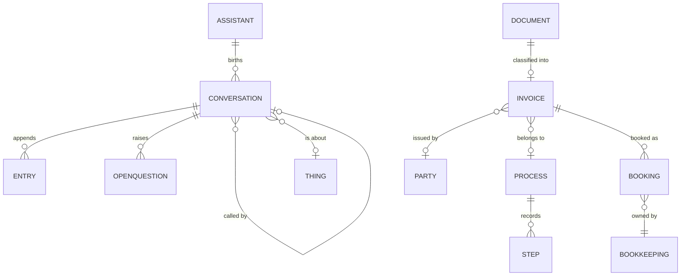
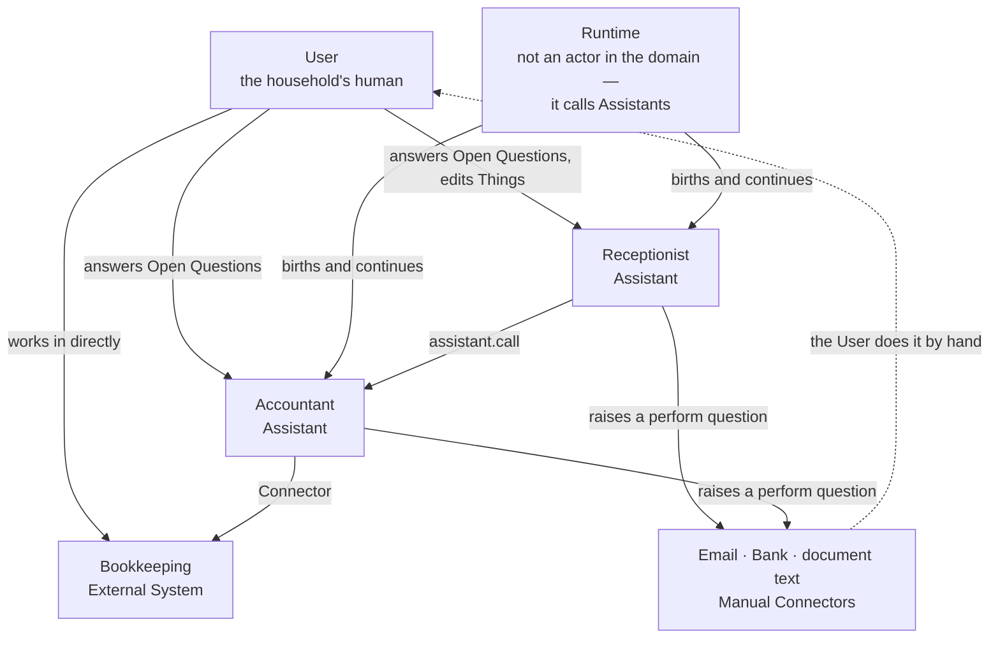
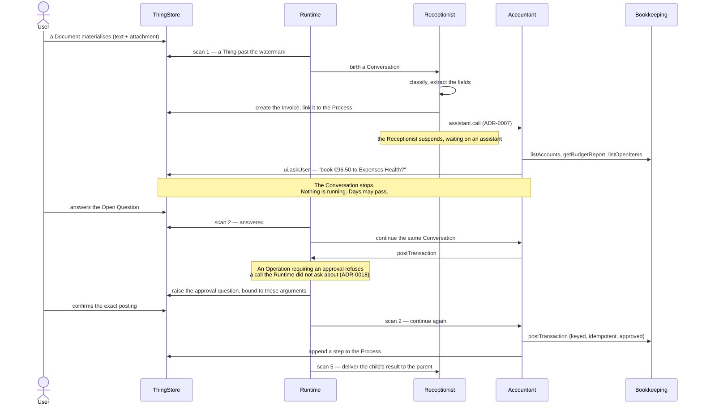

# Domain — what the system models

The authoritative glossary is [CONTEXT.md](../../CONTEXT.md). This document says how those terms
hang together: what the concepts are, who acts on them, which processes run, and which rules the
domain enforces. Where the two disagree, CONTEXT.md wins and this file is the one that is stale.

Spelling throughout is British English.

## Purpose

Assistants does real administrative work for **one household** — invoices, insurance claims, a
house renovation — under the supervision of a single human, the **User**.

The problem it addresses is not "answer questions about my paperwork". It is that household
admin is a set of long-running, interruptible errands: something arrives, someone has to work out
what it is, a decision has to be made by the human, and only then does anything irreversible
happen. The distinguishing commitment is that **waiting is free**. An Assistant that has asked a
question holds nothing in memory; the question it asked is the whole of its state. A decision can
sit unanswered for three weeks, across any number of restarts, and cost nothing.

What runs today is one vertical slice: a doctor's invoice arrives and gets booked.

## Vocabulary

The terms below are the ones the models, the code and the documents all share. Definitions are in
[CONTEXT.md](../../CONTEXT.md); the glosses here are navigation, not the definition.

| Term | Gloss |
|---|---|
| **Thing** | Anything with a Model and a ThingID. The only currency inside the system |
| **Model** | The A12 data model a Thing conforms to. Always the *data* model |
| **ThingID** | Identifies and nothing more — it carries no Model, so identity survives reclassification |
| **ThingRef** | A ThingID plus the Model, as convenience when passing a Thing about |
| **Authority** | The one system that owns the truth for a given fact. No fact has two |
| **Assistant** | An LLM-driven actor. Itself a Thing; a template, whose runs are Conversations |
| **Conversation** | One run of one Assistant. Append-only list of Entries. A Thing |
| **Turn** | One LLM response plus the tool calls it asked for. The unit of progress and of cost — and it now carries what the model charged for it |
| **Approval** | A property of an Operation: it either requires one or does not, and the Runtime refuses the call when it is missing |
| **Entry** | One appended item in a Conversation's history |
| **Finish Reason** | Why the LLM stopped: `answered`, `wants-tools`, `length`, `limit`, `error` |
| **Trigger** | An event that gives *birth* to a Conversation. A response that continues one is not a Trigger |
| **Pending Tool Call** | A tool call that cannot complete inside its Turn, because the Operation is human-paced |
| **wakeAt** | An instant after which a waiting Conversation is continued anyway |
| **Open Question** | A question put to the User, and its answer. A Thing |
| **Skill** | Markdown instructions belonging to exactly one Assistant, never shared |
| **Operation** | Something an External System can do |
| **Tool** | An Operation granted to a particular Assistant |
| **Connector** | The translator between one External System's representation and Things |
| **Manual Connector** | A Connector that fulfils its Operation by asking the User to do it by hand |
| **Runtime** | Watches Triggers, births Conversations, drives the loop. Not an External System |
| **Trigger Watcher** / **Loop Driver** | The Runtime's two halves: find work; take one Conversation one Turn forward |
| **ThingStore** / **UserInterface** | The two Internal Systems — they speak Things natively, so they need no Connector |
| **Bookkeeping** | The External System holding the books, and the Authority for all of them |

Two distinctions are load-bearing and easy to lose:

- A **Schedule** is a Trigger configured on an Assistant and births a Conversation where none
  exists. A **wakeAt** is state on a Conversation that already exists. Configuration on a
  template versus state on an instance. A Schedule is a standing instruction about the current state
  of the world, not an event log: missed slots are caught up **once**, never once per slot, and a
  slot is skipped entirely while the previous one is unfinished — so a Schedule **stalls rather than
  accumulates** (ADR-0016).
- A **Trigger** gives birth; a **response** continues. The User answering, a Manual Connector
  reporting back and one Assistant returning to another are all the second kind.

## Concepts and entities

Eight Models. Six are the household's subject matter, two are the machinery.

`RuntimeState` is deliberately absent: it is a singleton holding the Runtime's own state and
stands in no relation to the household's subject matter.

`BOOKING` sits deliberately outside the Things: it is a Firefly III transaction, and Bookkeeping
is its Authority. The Invoice holds no reference to it at all — see the rules below.

| Model | Authority | What it is |
|---|---|---|
| `Party` | ThingStore *(provisional)* | Anyone the household deals with, person or organisation, with a `kind` and a `role` |
| `Document` | ThingStore | An item that has arrived but has not yet been understood, plus whatever text was extracted from it |
| `Invoice` | ThingStore *(document facts only)* | The extracted invoice: issuer, number, dates, amounts, subject |
| `Process` | ThingStore | The routing slip — a title, a status, an append-only list of steps. Passive |
| `Assistant` | ThingStore | An Assistant's definition: key, prompts, Skills, Triggers, granted Tools |
| `Conversation` | ThingStore | One run of one Assistant: status, what it waits on, turn count, entries — and either the subject Thing or the `scheduledFor` instant that gave birth to it |
| `OpenQuestion` | ThingStore | A question put to the User and the User's answer |
| `RuntimeState` | ThingStore | A singleton: watermark, pause flag, births-per-hour counter, heartbeat |

**References between Things are plain strings.** A reference is an indexed `StringType` named
`<what>ThingId` — `issuedByPartyThingId`, `processThingId`, `documentThingId`. The A12
relationship engine is deliberately unused, because it would bind a reference to a target Model at
the model layer, which is the typed-identifier design ADR-0002 rejects.

**Skills are fields, not Things.** A Skill belongs to exactly one Assistant and is never shared
(ADR-0009), so it has no independent identity. Skills are a repeating group inside `Assistant_DM`:
a name and a markdown body. Making them Things would invite precisely the sharing the rule forbids.

## Actors

**User** — the human the system works for, and the supervisor of every Assistant. They answer Open
Questions, create and edit Things in the web application, edit Assistant prompts, and work in
Bookkeeping directly. They are the only actor who may write an `Assistant`.

**Receptionist** — the Assistant that classifies what arrives. Triggered by a `Document`
materialising. It decides what the Document really is, extracts the invoice fields, creates the
`Invoice` and links it, and calls the Accountant. Classification needs judgement; translation does
not, and belongs to Connectors.

**Accountant** — the Assistant that checks an invoice, reads the real chart of accounts, proposes
a posting, asks the User to approve it, and books it once they do. It has **no**
`thing-materialised` Trigger: `assistant.call` from the Receptionist is the only route in, because
two routes to one birth would mean two Conversations, two LLM bills and two Open Questions for one
invoice.

**Runtime** — deliberately *not* an External System. External Systems are what Assistants call;
the Runtime calls Assistants. It has no domain opinions.

**Bookkeeping (Firefly III)** — the Authority for accounts, transactions, balances and budgets.
The User works in it directly, and Assistants reach it only through its Connector.

**Manual Connectors** — `document.requestText`, `email.send`, `email.fetch`, `bank.sendMoney`.
Each fulfils its Operation by raising an Open Question of kind `perform` and waiting for the User
to do the work and report back. The Assistant cannot tell the difference, which is what makes
automating one later a Connector-only change.

## Processes

### The doctor's-invoice slice

The one process that runs end to end today.

Each pause is the point of the whole design. Nothing holds one — no process, no
timer, no in-memory promise. The Conversation is `waiting`, `waitingFor = user`, and its
`currentQuestionId` names the Open Question. A restart at that instant changes nothing.

### Birth versus continuation

One mechanism covers what look like three (ADR-0005):

| What happened | Which it is |
|---|---|
| A Thing materialised matching an Assistant's `thing-materialised` Trigger | **birth** |
| An Assistant called another with `assistant.call` | **birth** of the callee, **suspension** of the caller |
| A `schedule` Trigger's latest due instant has no Conversation yet | **birth**, carrying that instant as `scheduledFor` |
| The User answered an Open Question — including an approval | **continuation** |
| A Manual Connector's `perform` question was answered | **continuation** |
| A `wakeAt` passed with no answer | **continuation** |
| A child Conversation finished and its result is owed to its parent | **continuation** of the parent |
| A lease expired mid-Turn because the Runtime died | **continuation**, after recovery |

### Classification never changes identity

Everything incoming becomes a `Document` first — the raw item plus whatever text was extracted
from it. Classifying it **creates the `Invoice` and links the two**; it never rewrites the
Document into an Invoice, because that would require a Thing to change its Model, which ADR-0002
exists to prevent. The Document keeps its ThingID for ever.

## Rules and constraints

### One Authority per fact (ADR-0006)

Each Model names the one system that owns its facts, and no fact has two. The sharp consequence
is what `Invoice` does **not** have:

- **No `paid` field.** Whether an invoice is owed, paid, claimed or reimbursed is Bookkeeping's to
  answer. "Is this paid?" is a search against Firefly.
- **No `bookkeepingRef` either** — the less obvious half. A stored reference would be a *cached
  foreign fact*, and the User may re-split or delete a transaction in Firefly at any moment, at
  which point our copy is a lie. The link lives only in the Authority: Firefly carries the
  Invoice's ThingID as the tag `thing:<thingId>` and a deep link in `external_url`. "How was this
  booked?" is a search, exactly like "is it paid?".

Assistants must not cache foreign facts as Thing fields.

### One writer per document, at any instant

A12 has no version, no ETag and no compare-and-swap anywhere, so two writers of one document
silently lose one writer's work. Every Model is therefore arranged around a single writer
(ADR-0014):

| Model | Written by |
|---|---|
| `Conversation`, `RuntimeState` | **Runtime only** — the Conversation form is read-only |
| `Assistant` | **User only** — the store refuses the Runtime write access (D-007a) |
| `OpenQuestion` | Runtime writes it **once** at creation, then **User only** |
| `Party`, `Document`, `Invoice`, `Process` | User and Runtime, never at the same instant |

This is why an answer is consumed by **advancing the Conversation**, not by stamping the Open
Question — stamping would give that document a second Runtime write at the worst possible moment,
while the User may still be editing it.

### An Assistant may reach only what it declares (ADR-0010)

Tools are declared one row per Operation, and a call to another Assistant is declared per callee
as `assistant.call:<key>`. A bare `assistant.call` would let an Assistant reach every Assistant
including itself. Self-calls are rejected at registry level. The registry filters the schemas
offered to the model, so an undeclared Operation is not merely refused — it is invisible.

### Every Operation is read-only or idempotent under a caller-supplied key

No Operation may be both mutating and unkeyed. Where the Authority offers no unique constraint,
keyed idempotency is achieved by **search-then-act**. This is what separates a bug from a lost
€184.30 when the Runtime dies between a 200 and a write.

### An Operation that requires an approval cannot execute without one (ADR-0018)

The check is on the **Operation**, evaluated by the Runtime, in the same place the intent is written.
Three consequences follow from putting it there rather than in a prompt:

- An Assistant cannot talk its way past it, because it is not asked.
- It composes with the pending path: a missing approval is not an error, it is an Operation that
  cannot complete *yet* — so the Conversation suspends and the question is raised, which is the path
  the loop already has. It goes through `raiseQuestion` and never through `escalate()`: a missing
  approval is the ordinary path, not a stuck Conversation.
- Reading an Operation tells you whether it needs an answer, the same way reading an Assistant tells
  you what it may reach (ADR-0010).

**Only the Runtime can raise an approval, and it approves exact arguments.** An Assistant asking
*"shall I book this?"* of its own accord is good manners and nothing more — a question the Assistant
composed is a question the Assistant could have composed differently, so a yes to *"file this under
Renovation?"* must not authorise a booking of any amount. The approval is bound to the Operation
**and** to the canonical hash of the arguments the call was made with.

**An approval belongs to a Conversation and is consumed by the call it approves.** Not an approval of
the Invoice, and not a standing approval of the Assistant — so no `approved` field appears on any
Thing and ADR-0006 stays intact. A second Conversation about the same Invoice asks again, which is
correct: it is a different piece of work. Two identical bookings need two approvals, or one yes would
place the same transaction twice under two idempotency keys (ADR-0012).

**A no is an answer, not a missing yes.** A declined approval is terminal for that Operation with
those arguments in that Conversation: the Assistant is told plainly, as an ordinary tool error it can
act on, and is not asked again. Anything short of an explicit yes counts as a no, because `isAnswered`
is deliberately generous and a User who typed a sentence without ticking the box has answered.
Re-asking a User who has said no is how a safety feature becomes a thing people click through.

### Nothing needs to be said when there was nothing to do

A scheduled Conversation that finds no work finishes with a short result and no Open Question.
ADR-0015 requires noise when something *failed*, and nothing failed. The Conversation itself is the
record that the slot was served — which is also the answer to "how do I know it ran": `scheduledFor`
is indexed, so it is one query rather than a second store.

### Nothing ends silently (ADR-0015)

`failed` must never be somewhere a Conversation *falls*. Terminal failure sets `waiting` and
raises an Open Question carrying the error, capped at three escalations per Conversation. So
`failed` comes to mean only "the User abandoned it" — a state a human chose. Because the
escalation path shares fate with the failures it reports, the Runtime also stamps a heartbeat at
the end of every successful scan and reports itself unhealthy once that heartbeat is stale.
Silence must be *recorded* silence.

### Machine-filtered fields carry codes, not enumerations

A12 indexes enumeration fields by their **localised display text**, so `exact_match` on
`"waiting"` returns nothing while `"Waiting"` / `"Wartend"` would — a locale-dependent core query.
`status`, `waitingFor`, `finishReason`, `kind` are therefore `StringType` carrying ASCII codes.
The form still renders a dropdown; the index sees ASCII. See
[`import/models/CONVENTIONS.md`](../../import/models/CONVENTIONS.md) for the rest of the rules
this forces.

### Bounds on an LLM loop with a credit card

- A **trigger-eligible allow-list** — `Document`, `Invoice`, `Process`, `Party`. It structurally
  excludes `Conversation`, `Assistant`, `OpenQuestion` and `RuntimeState`, because an Assistant is
  a Thing and a Conversation is a Thing, so without it the Runtime would trigger on its own output.
- **`maxTurns`** (default 20) → `finishReason = limit` and an Open Question, never a silent stop.
- **`createdByConversationId`** on everything an Assistant creates, and no birth from a Thing
  whose creating Conversation is still running.
- **`RuntimeState.paused`** as a global kill switch, and a births-per-hour cap.
- **`Assistant.enabled = false`** stops continuations as well as births.

## Known departures

Recorded rather than hidden:

- **Parties have no proper Authority.** CONTEXT.md assigns people to an address book. There is no
  address book External System, so the ThingStore holds them provisionally — a small violation of
  ADR-0006's spirit, to be reversed the day a Connector exists (ADR-0013).
- **The recorded cost of a Conversation is a lower bound, not its cost.** A Turn carries what the
  model charged for it, and a Turn that *errored* carries nothing: usage exists only where a provider
  returned a response, and both the thrown-transient path and `finishReason: "error"` return none. So
  the Turns of a Conversation sum to at least what it cost. Chasing usage onto the error paths would
  buy precision nobody will spend; saying so costs nothing.
- **A booking costs a round trip, always.** An Operation that requires an approval refuses its first
  call even when the Assistant asked the User politely of its own accord, because a question the
  Assistant composed cannot be the thing that constrains the Assistant (ADR-0018). The Assistant is
  then asked on its own behalf and must re-issue the identical call. One extra Turn per first booking,
  accepted deliberately.
- **An approval can be missed by argument drift.** Nothing forces the model to re-issue *identical*
  arguments after the yes. A drifted call misses its approval and the User is asked a second,
  near-identical question. Visible and safe — a second question, never a wrong booking — but it will
  be seen.
- **Batching is a correctness property of a Skill's prose**, which is not where anyone looks for one.
  A scheduled Skill that asks about three findings one at a time stalls its own schedule on the
  first, because of the skip rule. The failure mode is quiet in exactly the wrong way: with nothing
  to report the schedule looks perfect, and it misbehaves the first time it finds two things.
