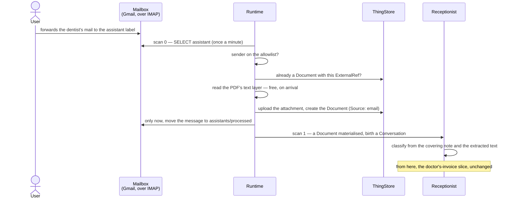
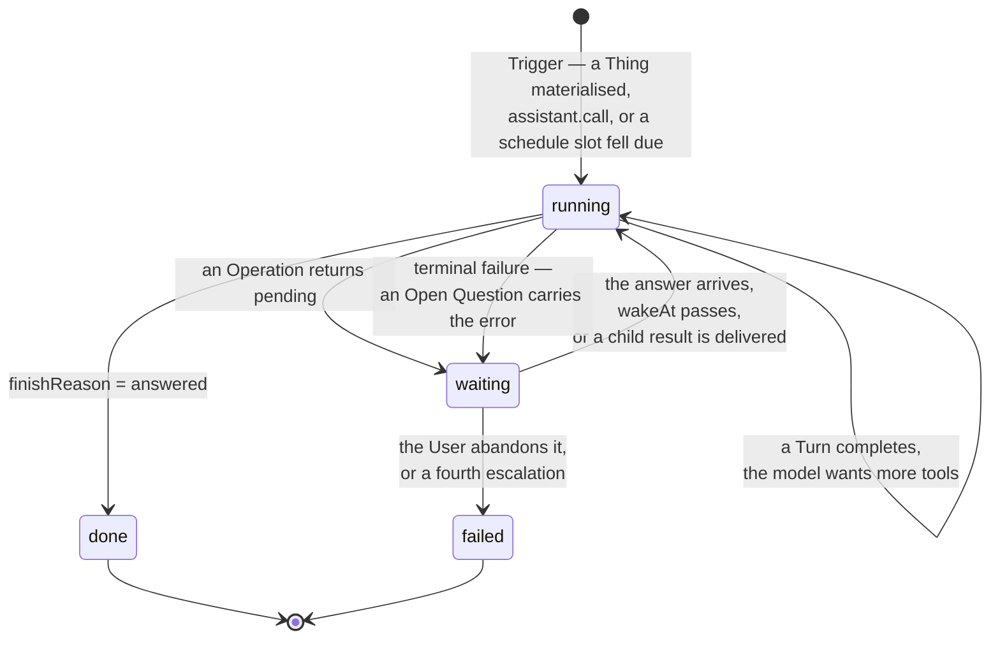
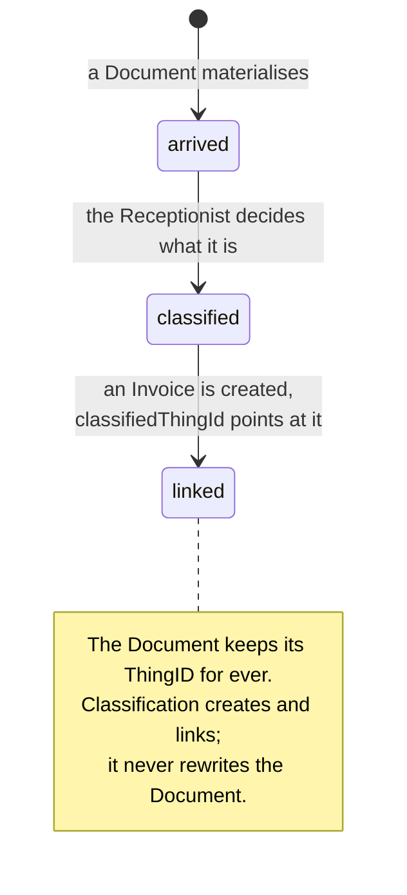
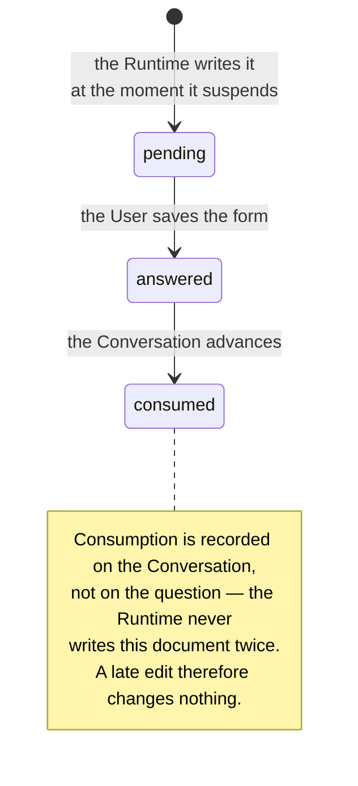

# Functional — what the system does

The User's view: what can be done, what goes in, what comes out, and where the edges are. The
concepts behind these features are in [domain.md](domain.md); how they are built is in
[architecture.md](architecture.md); how to run any of it is in [README.md](../../README.md).

There is exactly one human role in practice — the **User**, the household's supervisor — plus a
machine identity, the **Runtime**, and the test identities the end-to-end tier uses.

## Features

### Answering Open Questions

The User's actual inbox, and the feature the rest exists to serve.

**A question is answered inside its Conversation** (ADR-0021). There is no separate inbox of
questions: the **Dashboard** counts what is waiting on the User and opens the **Conversations**
module, which is where the questions are; a Conversation waiting on the User is
marked **🛑** in its overview, and opening one shows the thread that leads up to the question with the
question itself as the last bubble, carrying an **Answer** button. An open question is always the end
of a Conversation, so a list of Conversations is already a list of questions — sorted by the thing they
are about rather than by the fact that they are questions.

*Answer* opens the question's own form, with the Conversations list still beside it. That form carries
the same header and the same transcript above its answer controls, so the two screens read as one
thread continuing. Saving does not navigate — `CRUD::SAVE` never does, here or anywhere in this
application — and within about two seconds the Runtime has moved the Conversation on and the 🛑 has
cleared from the list already on screen. The User leaves by the form's own *Cancel*.

The question form shows the question and an answer control decided by its **kind**:

| Kind | The User does | Filled in |
|---|---|---|
| `free-text` | Types an answer | `text` |
| `confirm` | Says yes or no | `confirmed` |
| `choice` | Picks one of a declared list | `choice` |
| `perform` | Does something by hand and reports back | `text` |

`perform` is what a **Manual Connector** raises when it needs the User to *do* something — send an
email, move money, paste in a document's text — and what a terminal failure raises to report an
error. It is not a special mechanism; it is the same Open Question with a different prompt.

An **approval** is not a kind either. When an Assistant calls an Operation that requires one —
`bookkeeping.postTransaction`, and nothing else today — the Runtime refuses the call and raises an
ordinary `confirm` question, opening *"**Approval needed.**"* and rendering the exact posting as a
sentence: *"Book €96.50 from Payables to Expenses:Health, dated 2026-08-01, for …?"* Saying yes is
the whole of the interaction; nothing is booked until you do (ADR-0018). Two things about it are
worth knowing:

- **The Assistant's own polite question does not count.** It will often ask first, because its prompt
  tells it to. That question authorises nothing, so a booking usually costs two answers — the
  Assistant's, and the Runtime's.
- **Answer it with the tick, not only with words.** Anything short of an explicit yes is read as a no,
  and a no is final for that exact posting.

Saving the form is the whole of the interaction. There is no button that calls the Runtime and
nothing in the web application that knows the Runtime exists — the Runtime notices the answer on
its next scan, within about two seconds.

**Three models are kept unreachable on purpose.** The `OpenQuestionOverview` scene, `OpenQuestion_OM`
and `OpenQuestionPending_QeM` — the plain overview over unanswered questions, filtered
`undefined_match(answeredAt)`, which is ADR-0004's *"awaiting the User must be a queryable state"*
satisfied literally — all still exist and nothing navigates to them. They stay because an Assistant
that can say *"here is the list of open questions"* — a `ui.showList`-shaped Operation putting the User
in front of an overview — would need an overview scene to put them in front of. No such Operation
exists, and until one does those three models are read by nobody and covered by no test.

### The Dashboard

**The way in.** The first menu entry, and the page the User lands on. Six **Tiles** in two rows, each
answering a question the User has on arriving and each a door to the module that answers it properly:

| Tile | What it says | Where it goes |
|---|---|---|
| 🗣 **Conversations** | how much work is **in flight** — `running` + `waiting` — split into *running*, *waiting on you*, *waiting on something else* | Conversations |
| 📄 **Documents** | how many Documents there are, over the **createdOn curve**: how that number grew across the last twelve months | Documents |
| 🤖 **Assistants** | how many there are, each by name, dimmed when disabled | Assistants |
| 💰 **Bookkeeping** | nothing — it is a grey **button**, not a summary: a control with a label and a destination, no headline, no body, no footer | Firefly III, in a new tab |
| 💳 **Transactions** | the last ten **Bookings** in the last ninety days, newest first — date, description, the two accounts, the amount | Firefly III, in a new tab |
| 🏦 **Accounts** | every **Bank Account** by name with its balance, and one total per currency — never a total across them | Firefly III, in a new tab |

**The Dashboard counts; it does not keep** (ADR-0022). Every number on it is a `fullSize` the ThingStore
returned for a query issued moments earlier — no count is stored on a Thing, cached, polled or
aggregated. Each Tile that queries therefore states the instant it read (*as of 14:32*), and returning to the
Dashboard re-reads it. One Tile that cannot read shows a single line saying so and the others
stand.

**The books are reachable from the application** (ADR-0023), and they are still not held by it. The
last two Tiles read Firefly through the one component that can — the Runtime, the door outward — over
a route that executes a named, allowlisted, non-mutating Operation and returns its result. Nothing
about the household's money is stored on the way: no Thing, no cache, nothing kept between visits.
The browser still holds no Firefly credential and never will, which is why the 💰 Tile is a plain
button rather than a summary: opening the books is a different act from reading a number out of them.
Stop the Runtime and those two Tiles grey out while the other four render — the honest answer to
*"what do the books say?"* when the only component that can ask is down.

The **createdOn curve** can run behind the Documents headline, because `Document.createdAt` is the
Runtime's field and a Document created in the web application carries none until the next scan stamps
it. That gap is named — the **createdOn lag** — and stated on the Tile rather than hidden.

Which Tiles exist, and where they sit, is **App Model configuration** rather than code: a seventh Tile is
a component, its `addView` registration, and one more `VIEW_ADD` directive beside one more column in
`AssistantsAppModel_AM.json`. The second row was added exactly that way, and slot pairing is positional
across rows as well as within one — the order of the directives *is* the layout.

### Browsing and editing Things

Nine navigation modules: **Dashboard**, **Documents**, **Invoices**, **Processes**, **Parties**,
**Assistants**, **Operations**, **Conversations**, **Runtime**, and the **Dashboard** is the landing
page. All but the Dashboard are an ordinary A12 master-detail: an overview of scalars, and a form for
one row. `OpenQuestion` is the Model with a module and no menu entry — its form is reached through a
Conversation, as above.

Four are freely editable by the User — `Party`, `Document`, `Invoice`, `Process`. Creating an
`Invoice` or a `Document` by hand is a supported way in; so is pasting extracted text into a
Document's `extractedText`.

### Editing an Assistant

**Assistants are Things you edit in the UI, not code you deploy** (ADR-0003). Changing the
Receptionist's behaviour is editing a document: its `systemPrompt`, its `skills[]` (each a name
and a markdown body), its `llmModel`, its `maxTurns`, its `enabled` flag, its `triggers[]` and its
`grants[]` — one row per Operation it may use, under **Granted operations**, and one row per callee
for `assistant.call:<key>`.

Prompts and Skill bodies are **markdown fields**, rendered by the lifted Lexical editor — headings,
lists, tables, code blocks, admonitions, a table of contents. Round-tripping markdown through that
editor is covered by the end-to-end tier.

Only the User may write an `Assistant`. The Runtime holds no `ASSISTANT_WRITE` right, so an
Assistant cannot grant itself an Operation; the store refuses it (D-007a).

Note that `just bootstrap` **reconciles**: it re-applies the two seeded Assistant definitions on
every run, so a prompt edited in the web application is overwritten the next time it runs. To keep
an edit, change the seed in `runtime/src/bootstrap/assistants.ts`.

### Reading and editing the catalogue of Operations

The **Operations** module is the answer to *"what can my Assistants actually do?"* — a question that
used to require reading TypeScript. It lists every Operation the system has, one row each: its key,
the System it belongs to, its kind, whether it is switched on, whether it needs your approval, and
whether it changes anything out there.

Opening one shows the whole of it, and which half of it is yours is the interesting part of the
form. The fields that are facts about the code are rendered read-only; the fields that are decisions
are not:

| Field | Whose | What it is for |
|---|---|---|
| `Key`, `System`, `Kind`, `Parameters` | the code's, read-only | What the Operation is and what arguments it takes. `Key` is what a grant names and what the Implementation is found by, so renaming it would point every grant at nothing |
| `Mutating` | the code's, read-only | Whether performing it changes something outside this system. It sits beside the approval checkbox because it is the input to the question that checkbox answers |
| `Name`, `Description` | **yours** | The label, and the prose the model reads, in markdown. The description is how a model decides which Operation to call, so it is prompt engineering, and it is now something you can edit without a deploy |
| `Enabled` | **yours** | Whether the Operation is offered at all |
| `Requires approval` | **yours** | Whether the Runtime refuses the call until it has asked you about those exact arguments and been told yes |
| `Notes` | **yours** | Why you did what you did |

Two of those deserve their own sentence.

**Switching an Operation off is the kill switch that was missing.** `just pause` stops everything
and an Assistant's `enabled` flag stops one Assistant; between them there was nothing. Unticking
`Enabled` on `bank.sendMoney` withdraws it from every Assistant that was granted it, takes effect on
the next Turn of every Conversation, survives a restart, and needs no deploy. An Assistant that then
tries to call it is told it is *switched off* — not that it never had it, which its own definition
would visibly contradict.

**`Requires approval` is yours in both directions.** You may add one where the code asks for none,
and remove one it does ask for — including on `bookkeeping.postTransaction`. The Runtime writes a
line in the log naming any Operation whose requirement you have weakened, once per restart, and
obeys you. That is deliberate: it is your money. It is also the one route an Assistant has to this
setting, since it cannot edit the catalogue but can compose a persuasive sentence asking you to.

What you cannot do is invent an Operation. The catalogue describes Operations; the code performs
them, and the two are joined by the key. An Operation with no Implementation registered under its
key is not offered to anybody and says so (ADR-0019). The overview accordingly has no **Add**
button: a row created by hand would carry no idempotency key, so the next `just bootstrap` would
create a second Thing under the same key rather than recognising the one you made.

Editing the catalogue never gives birth to a Conversation, and `just bootstrap` will not undo what
you decided: it re-applies only the fields the code owns — `System`, `Kind`, `Parameters`,
`Mutating` — and leaves the description, the approval requirement, the kill switch and your notes
exactly as you left them. The cost of that is the mirror image of the Assistant seeds: a description
improved in the source does *not* reach a system that already has the Operation, and bootstrap
reports it by name rather than letting you wonder.

### Giving an Assistant a schedule

An Assistant's `triggers[]` may carry a `schedule` row with a `cron` expression, read in
`SCHEDULE_TIMEZONE` (default `Europe/Berlin`). The seeded **Accountant** has one — `0 7 * * *` — so
it looks at what is outstanding each morning without anybody asking it to.

What to expect from one, because none of it is obvious:

- **It fires immediately.** A cron has no start date, so a schedule added this afternoon finds this
  morning's slot already past and runs on the next scan.
- **A missed run is caught up once.** Three days of downtime produce one Conversation, about today.
  A Schedule is a standing instruction about the current state of the world, not a backlog.
- **A run that finds nothing is silent**, and that silent Conversation is the record that the slot
  was served. `scheduledFor` is a column on the Conversations overview, so *"did Monday's run
  happen?"* is one search.
- **An unanswered question stops the schedule** until it is answered. That is why a scheduled Skill
  must gather everything and ask **once**.

### Watching an Assistant work

- The **Conversations** module shows every run: which Assistant, what it is about — or which
  `scheduledFor` instant it was born to serve — its status, what it is waiting for, its turn count,
  and its `entries[]` as a **thread**: the Assistant on one side, the User on the other, tool calls as
  receipts between them, day and gap separators, and a pending question as the last bubble. A row
  waiting on the User carries **🛑**.
- **The thread carries a header, and the header does not scroll away**, because forty Entries down
  *who* and *about what* are exactly what a reader has stopped being able to see. Four facts, pinned:
  the Assistant and the Conversation's title; a link to the subject Thing, or the instant a Schedule
  was serving, and a link to the calling Conversation when there is one; the status and what it waits
  on, 🛑 when that is the User and the finish reason when it is over; and what it has cost, in tokens
  and in turns taken against the cap.
- Each Entry carries what the Turn that wrote it cost, as prompt and completion tokens, on the first
  Entry that Turn wrote. The header adds them up — and renders the figure with a **≥**, because a Turn
  that errored records nothing, so the total is a lower bound.
- `just logs runtime` is the better debugging surface.
- The **Runtime** module shows the singleton: the watermark, the pause flag, the births-per-hour
  counter, the heartbeat and the last error.

### Stopping it

- `just pause` sets `RuntimeState.paused` and the watcher does nothing at all until `just resume`.
- Setting an Assistant's `enabled` to `false` stops its births **and** its continuations.
- Unticking an Operation's `Enabled` withdraws that one capability from every Assistant at once —
  the switch between "stop everything" and "stop this Assistant" that used to require a deploy.
- A births-per-hour cap bounds a runaway even if nobody is watching.

### The books

Firefly III at `http://localhost:8084`, behind oauth2-proxy, through the same Keycloak login. The
User works in it directly — it is the Authority, and nothing in this system holds a second copy of
what it says. The **Dashboard**'s bookkeeping Tile is the door: one click, the same session, a new tab.

An Invoice's booking is found by searching Firefly for the tag `thing:<thingId>` or the
`external_id`; there is no field on the Invoice to read.

## User journeys

### An invoice arrives and gets booked

The vertical slice that runs today.

```mermaid
sequenceDiagram
    actor U as User
    participant UI as UserInterface
    participant TS as ThingStore
    participant RT as Runtime
    participant R as Receptionist
    participant A as Accountant
    participant BK as Bookkeeping

    U->>UI: creates a Document (or the demo loader does)
    UI->>TS: Document saved with extractedText
    RT->>TS: scan 1 — a Thing past the watermark
    RT->>R: birth a Conversation
    R->>R: classify: this is an invoice
    R->>TS: create the Invoice, link Document and Process
    R->>A: assistant.call:accountant
    Note over R: the Receptionist suspends, waitingFor = assistant
    A->>BK: listAccounts, getBudgetReport
    A->>TS: ui.askUser (confirm) — "book €96.50 to Expenses:Health?"
    Note over A,TS: waiting. Nothing runs. Days may pass.<br/>Restarts change nothing.
    U->>UI: opens the Conversation marked 🛑, confirms
    UI->>TS: answeredAt + confirmed saved
    RT->>TS: scan 2 — answered
    RT->>A: continue the same Conversation
    A->>RT: postTransaction
    Note over RT: the Assistant's own question authorises nothing.<br/>Refused before Firefly is reached (ADR-0018).
    RT->>TS: raise the approval question — "Book €96.50 from …?"
    U->>UI: opens it again — still 🛑 — and confirms the exact posting
    RT->>A: scan 2 — continue again
    A->>BK: postTransaction, keyed and tagged thing:<id>
    A->>TS: append a step to the Process; finish
    RT->>R: scan 5 — deliver the result to the parent
    U->>BK: sees the transaction in the books
```

What the User actually does in this journey is three things: put a Document in, and answer two
questions — the Assistant's, and the Runtime's. Everything between is unattended. The second answer
is the one that books: the first is the Assistant being polite, and being polite authorises nothing.

### An invoice is forwarded from a phone

The same slice, entered through the letterbox instead of the create form.



What the User did was forward a mail. No Assistant ran before the Document existed, and the
Receptionist cannot tell that this one was not typed — which is the property the whole design was
tested against (ADR-0024).

Three things can happen instead, and each is visible in Gmail rather than in a log. A sender who is
not on the allowlist lands in `assistants/rejected` with nothing read and nothing created. A message
whose Documents could not all be created lands in `assistants/failed`, having created the ones that
did land, so moving it back re-runs only what is missing. And a scanned attachment with no text layer
arrives with an empty `extractedText`, at which point the Receptionist decides whether it is worth
`document.readScan` — a bill, yes; an advertising leaflet, no — and falls through to asking the User
with `document.requestText` when reading is unavailable, which it is by default.

### Surviving a restart mid-question

The claim ADR-0004 makes, and a test in the end-to-end tier:

1. Let the slice run until an Open Question is pending.
2. `just restart` — the Runtime and the store both go down and come back.
3. The Open Question is exactly where it was. Answering it continues the same Conversation.

Nothing was running to lose. The question *is* the state.

### A Manual Connector asks for help

An Assistant calls `email.send`, `bank.sendMoney` or `document.requestText`. None of them talks to
anything. Each raises an Open Question of kind `perform` — *"send this email and tell me when you
have"* — and the Conversation suspends exactly as it would on any other question. The User does
the work by hand, reports back in the answer, and the Conversation continues.

The Assistant cannot tell that a human rather than a machine answered, which is what makes
automating one later a Connector-only change.

### Something goes wrong

The User never has to check a second place. A terminal failure — retries exhausted, `maxTurns`
reached, an Authority refusing again and again — does not set `failed`. It raises an Open Question
carrying the error and waits, so a stuck Conversation appears in the same list as everything else.
Escalation is capped at three per Conversation, so a persistent outage answered with "try again"
cannot produce one question per attempt; the fourth time, the Conversation does end.

The failure this does *not* cover is the Runtime being unable to write the question at all. That
is what the heartbeat is for: the service reports itself unhealthy once its last successful scan
is stale, and `just ps` shows it.

## Inputs and outputs

### In

| Input | How | Notes |
|---|---|---|
| A **Document** | Created in the web application, or by the demo loader | `extractedText` may be typed or pasted; a PDF's text layer is read by `document.extractText` |
| **Post**, forwarded | Emailed to the Receptionist's own Gmail account, from an allowlisted sender | The Runtime polls it over IMAP once a minute and creates one Document per attachment, `Source: email`, the covering note as `extractedText` (ADR-0024) |
| An attachment | Uploaded on the Document form, or arriving on a forwarded mail | Stored in the A12 Content Store |
| An **answer** | Saving an Open Question form | The only interaction the whole slice requires |
| An **Assistant definition** | Editing the Assistant form, or the seed file | Markdown prompts and Skills |
| An **Operation's** prose, approval requirement or kill switch | Editing the Operation form | The rest of the Operation is the code's, and shown read-only. `just bootstrap` does not undo these |
| **Demo data** | `just demo-data` | Parties, processes, documents, invoices, and matching Firefly books |
| **LLM configuration** | `active` in `llm.json`, one name; the key in `.env` as `<PROFILE>_KEY` | `scripted` is shipped active; costs nothing and needs no key |
| A **schedule** | A `cron` on an Assistant's `schedule` Trigger | Read in `SCHEDULE_TIMEZONE`, default `Europe/Berlin`. One timezone for the whole system |

### Out

| Output | Where |
|---|---|
| **Open Questions** | The web application's inbox — a 🛑 in the Conversations list, answered on the question's own form |
| **Things** — Invoices, Parties, Process steps | The ThingStore, visible in the UI |
| **Transactions** | Firefly III, tagged `thing:<thingId>` with a deep link in `external_url` |
| **Transcripts** | `Conversation.entries[]`, and `just logs runtime` |
| **Health** | The Runtime's compose healthcheck, driven by `heartbeatAt` |

Nothing is emailed, nothing is paid, and nothing leaves the machine except calls to the configured
LLM API and the poll of the Receptionist's Mailbox. *Emailed* is worth being precise about now that
mail arrives on its own: the letterbox is inward only, `email.send` is still a Manual Connector, and
the one thing the system ever says to a mail server is *what is in the `assistant` folder?* Mail the
system receives can be ignored; mail the system sends cannot be recalled.

## States and transitions

### Conversation



`waitingFor` says which: `user`, `tool` or `assistant`. There is deliberately no `llm` value —
waiting on the LLM happens *inside* a live Turn and is over in seconds; if the process dies there,
the Conversation is simply un-advanced and the next scan picks it up. **Only waits that outlive a
Turn are written down.**

`failed` means only "the User abandoned it" — a state a human chose, never one the system fell
into.

A Conversation being advanced carries `leaseUntil`. That is crash **recovery**, not a lock: a
lease found expired means the Runtime died mid-Turn, and scan 4 recovers per the intent log —
asking the Connector whether the key landed, never re-executing blind.

### Document → Invoice



### Open Question



### Process

A Process is the routing slip: a title, a `kind`, a `status` and an append-only list of `steps[]`,
each with its own state. It is **passive** — nothing executes it. Assistants append steps to
record what happened; the Process never drives anything.

## Permissions and visibility

There is one human role in practice, and the interesting boundaries are not between humans but
between the human and the machine.

| | User (`admin` / `user` roles) | Runtime (`runtime` role) |
|---|---|---|
| Read every Thing | ✓ | ✓ |
| Create / update `Party`, `Document`, `Invoice`, `Process` | ✓ | ✓ |
| Write `Assistant` | ✓ | ✗ — no `ASSISTANT_WRITE` (D-007a) |
| Write `Operation` | ✓ | ✗ — the same right and the same refusal (ADR-0019) |
| Write `Conversation`, `RuntimeState` | form is read-only | ✓ |
| Write `OpenQuestion` | the answer fields | once, at creation |
| Delete anything | ✓ | ✗ — no `DOCUMENT_DELETE` (D-007) |
| Manage models | `admin` only | ✗ |

Read-only forms are an **affordance, not an authorisation boundary**. What protects the
single-writer invariant is that nothing in the UI navigates to those documents in edit mode, not
that the server would refuse.

The Runtime's row and an **Assistant's** row are not the same row, and `Operation` is where they
part. The Runtime reads the catalogue on every Turn — it has to, it is how it knows what to offer.
An Assistant may not read it at all: `Operation_DM` is the one Model `thingstore.get` and
`.search` refuse, because its entire content is the configuration that constrains the reader, and a
model that could read it would know exactly which Operations are guarded and what the User has
written about them. Everything else in the machinery stays readable, as it always has been.

Between Assistants, capability is declared rather than assumed: an Assistant may call only the
Operations its `grants[]` lists, one row per Operation, and one row per callee for
`assistant.call:<key>`. The registry filters the schemas offered to the model, so an ungranted
Operation is **invisible**, not merely refused. Self-calls are rejected. Reading an Assistant tells
you exactly what it can reach — provided the Operation is also switched on in the catalogue and
implemented in the Runtime, which is the conjunction ADR-0010's rule became (ADR-0019).

Everything is on `127.0.0.1`. There is no multi-tenancy, no sharing and no per-Thing visibility.

## Edge cases and known limitations

This is one running vertical slice, not a finished system.

**Deliberate omissions**

- **Outbound email and the Bank are Manual Connectors.** `email.send`, `email.fetch` and
  `bank.sendMoney` talk to nothing. This is the point — ADR-0004 requires the system to run end to
  end with every External System manual — so no money moves and nothing is sent. The letterbox
  (`email.receive`) is the one automatic Connector and it only receives; `email.fetch` still asks the
  User to look in *their own* mailbox, which is a different question and stays a human's to answer.
- **Text extraction is implemented for text layers, and for scans only where a vision profile is
  configured.** `document.extractText` pulls a PDF's existing text layer — free, deterministic, and
  called on arrival by the mail ingest, so most forwarded post is classifiable before an Assistant
  wakes. `document.readScan` has a vision model read a scan, costs money per page and is
  **unavailable in the shipped configuration**, because `llm.json.example` names no `vision` profile.
  Neither overwrites a non-empty `extractedText` without an explicit `replace`. `document.requestText`
  remains the floor: where reading is unavailable, refused or unusable, a human is asked to transcribe
  as they always were. Local OCR is not implemented.
- **`bookkeeping.createAccount` is granted to no Assistant.** The chart of accounts is a
  structural decision the User makes.
- **No compaction, forking or steering** of Conversations. `maxTurns` (default 20) is the only
  bound on a long one, and reaching it raises an Open Question.
- **No live update while a Conversation runs.** The transcript reads the document the form loaded;
  a Conversation the Runtime is driving will be stale on screen until the User reloads.
- **No cross-document links inside markdown.** The lifted editor has none, and inventing a link
  syntax is its own change.

**Gaps**

- **Parties have no proper Authority.** The ThingStore holds them provisionally, pending an
  address book Connector (ADR-0013).
- **A schedule stalls on an unanswered question.** A slot is skipped entirely while the previous one
  is unfinished (ADR-0016), so one question nobody answers holds every later firing. That is
  deliberate — two live Conversations for one recurring errand would be two questions the User cannot
  tell apart — and it is a log warning rather than a second question about the first. The fix is to
  answer it.
- **Nothing aggregates what a Conversation cost.** A Turn carries what the model charged for it and
  the transcript is where you read it. No dashboard, no billing, no second store — and the sum is a
  lower bound, because a Turn that errored records nothing.
- **An answered question does not leave the pending view.** `OpenQuestionPending_QeM` filters on
  `answeredAt` being unset, and nothing stamps that field — while the Runtime's `isAnswered` counts
  *any* filled answer field, so the Conversation does continue. The row simply stays in the inbox
  looking unanswered. Pre-existing, and approvals make it twice as visible, because a booking now
  raises two questions rather than one. The fix is to widen the query model's constraint to all four
  answer fields, which wants `undefined_match` on a Boolean verified against the live store first.
- **`updatedAt` records the last Runtime write only.** A save from the web application moves only
  `__meta.modifiedAt`, because the machine fields are on no form and A12's form engine offers no
  save hook that could reach one.
- **Switching an Operation off is not retroactive.** A Conversation already suspended on
  `bank.sendMoney` is waiting on an Open Question, not on the Operation: answering that question
  resumes it, and the Assistant is told on its *next* Turn that the Operation is switched off. So
  the kill switch stops the next call rather than unwinding the one in flight — and a Conversation
  that had already been asked to do something by hand will still be asked, because the User has the
  question in their inbox and the switch does not reach into it. Nothing is stranded either way: a
  Conversation that crashed mid-call has its intent settled as *no longer available* by the ordinary
  recovery path.
- **The catalogue answers what exists, not who may.** *"Which Assistants can book a transaction?"* is
  still answered by opening each Assistant and reading its grants; an Operation carries no list of
  the Assistants granted it, because computing one would mean letting the Runtime write the very
  Model it is forbidden to write.
- **An empty catalogue stops everything.** If `just bootstrap` has never run, the Runtime refuses to
  scan and reports itself unhealthy rather than falling back to what the code knows. That is the
  intended behaviour — a second answer to *"what can this Assistant do"* is exactly what the
  catalogue exists to remove — and the remedy is in the log.

**Operational limits**

- **Exactly one Runtime replica.** Not a deployment convenience — A12 has no compare-and-swap, so
  two replicas would both claim an expired lease and silently lose one writer's work.
- **Latency is one scan interval**, about two seconds.
- **`just bootstrap` overwrites Assistant edits.** It reconciles by design.
- **`just clean` and `just demo-reset` take the books with them.** Firefly has no bulk delete and
  its data lives in a named volume, so a full teardown is the only reset symmetric across two
  Authorities.
- **The end-to-end suite writes to whatever stack it is pointed at**, creating and deleting Things.
  Point it at a development stack only. `cd e2e && npx playwright test --list` is the authority on
  what it runs.

**Security posture**

- **Authentication is real; its configuration is development-grade.** The mechanism is the one A12
  intends — Keycloak, OIDC, no password checked anywhere else — and no credential is committed
  (D-023). But Keycloak runs `start-dev` over plain HTTP, its console is `admin` / `admin`, and the
  realm's password policy is relaxed far enough to allow `human` / `human`. Every one of those is
  deliberate for a stack bound to `127.0.0.1`. Do not expose it further without replacing all of
  them.
- **Firefly III trusts a header.** `remote_user_guard` performs no validation of
  `X-Forwarded-Email` whatsoever. Inside the compose network Firefly is wide open, which is what
  lets the Runtime and `firefly-bootstrap` use it; the entire security argument is that it
  publishes no host port. Give it one and authentication is gone.
